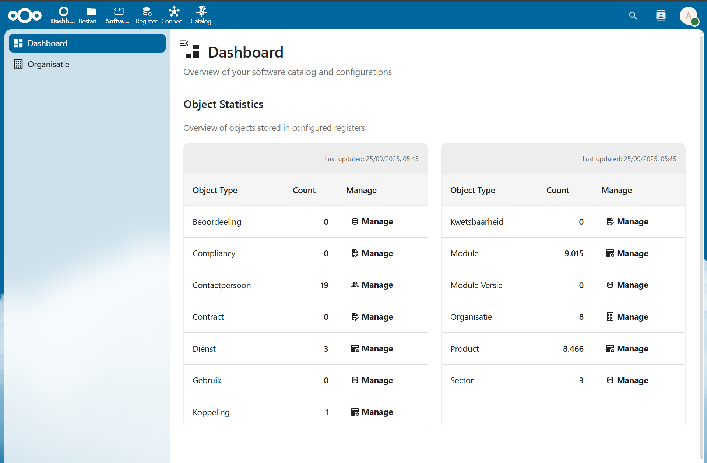
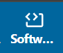
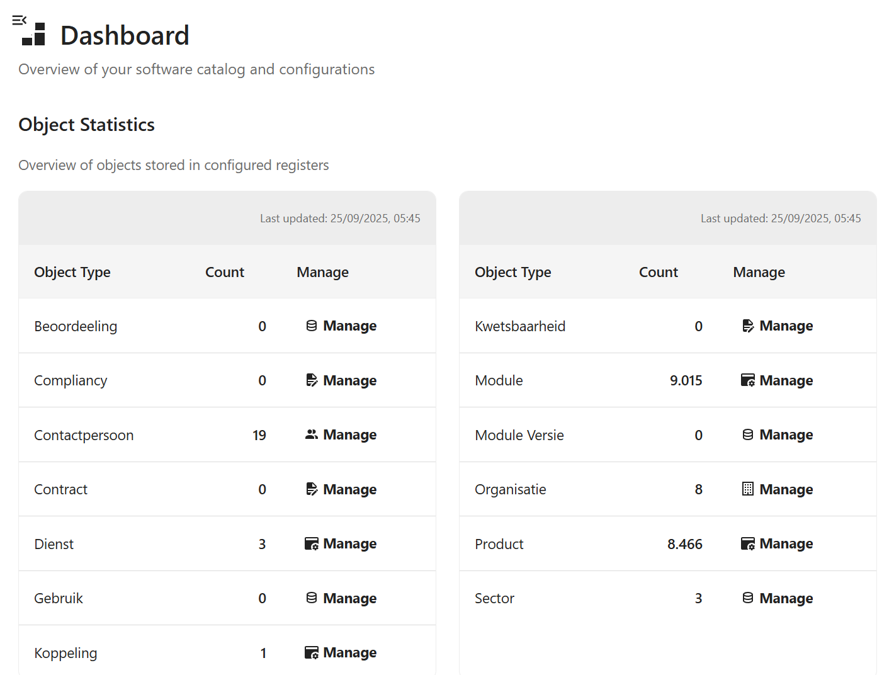
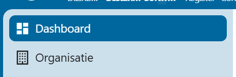

import Tabs from '@theme/Tabs';
import TabItem from '@theme/TabItem';

# Algemeen

Het functioneel beheer van de softwarecatalogus vindt plaats via de softwarecatalogus NextCloud app. Onder functioneel beheer verstaan we: 

- [Aanmaken en wijzigen van Organisaties](./Organisaties.md)
- [Contactpersonen en gebruikers toewijzen aan organisaties](./Gebruikers.md)
- [Activeren (accepteren van inschrijvingen) en deactiveren van organisaties](./Organisaties.md#activeren)
- [Wijzigen van gebruikers wachtwoorden](./Gebruikers.md)
- [Wijzigen van gebruikers rechten](./Gebruikers.md)

Daarnaast is er ook nog technisch beheer op de softwarecatalogus, dat vindt plaats via:

- OpenRegister voor data
- OpenCatalogi voor zoeken

## Waar vind ik de app?

De app bevindt zich in de NextCloud omgeving onder het softwarecatalogus icoon. Na op het icoon te hebben geklikt wordt je doorverwezen naar het dashboard.

Op het dashboard vind je een kort overzicht van de huidige inhoud van de softwarecatalogus.

Links van het dashboard vind je het menu dat verwijst naar de individuele beheerpagina's.

