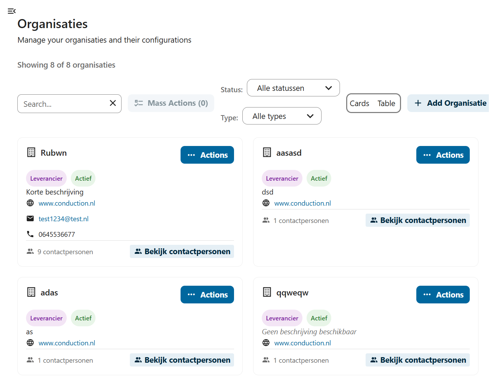
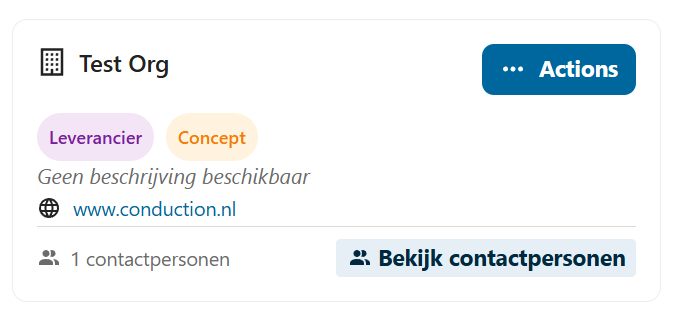
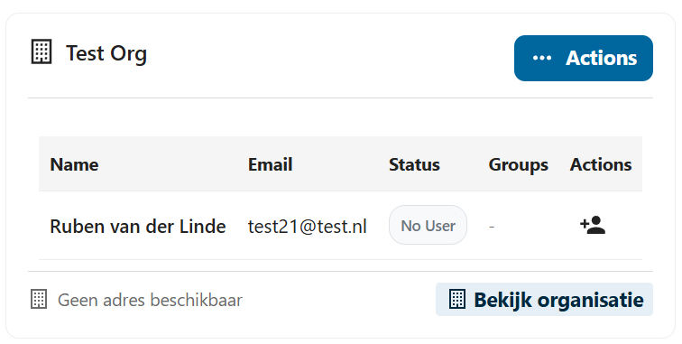
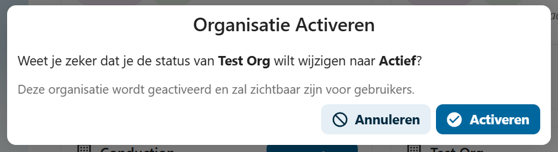

import Tabs from '@theme/Tabs';
import TabItem from '@theme/TabItem';

# Organisaties beheren

Op de organisatiepagina vindt u alle in de softwarecatalogus actieve organisaties. Tip: Boven aan de pagina kunt u filteren en zoeken, bijvoorbeeld op de status concept.

Op de organisatiecard vindt u de kerngegevens van de organisatie.

Door op 'bekijk contactpersonen' te drukken kunt u contactpersonen en gebruikers inzien. 

## Activeren

Activeren kan even duren omdat...

