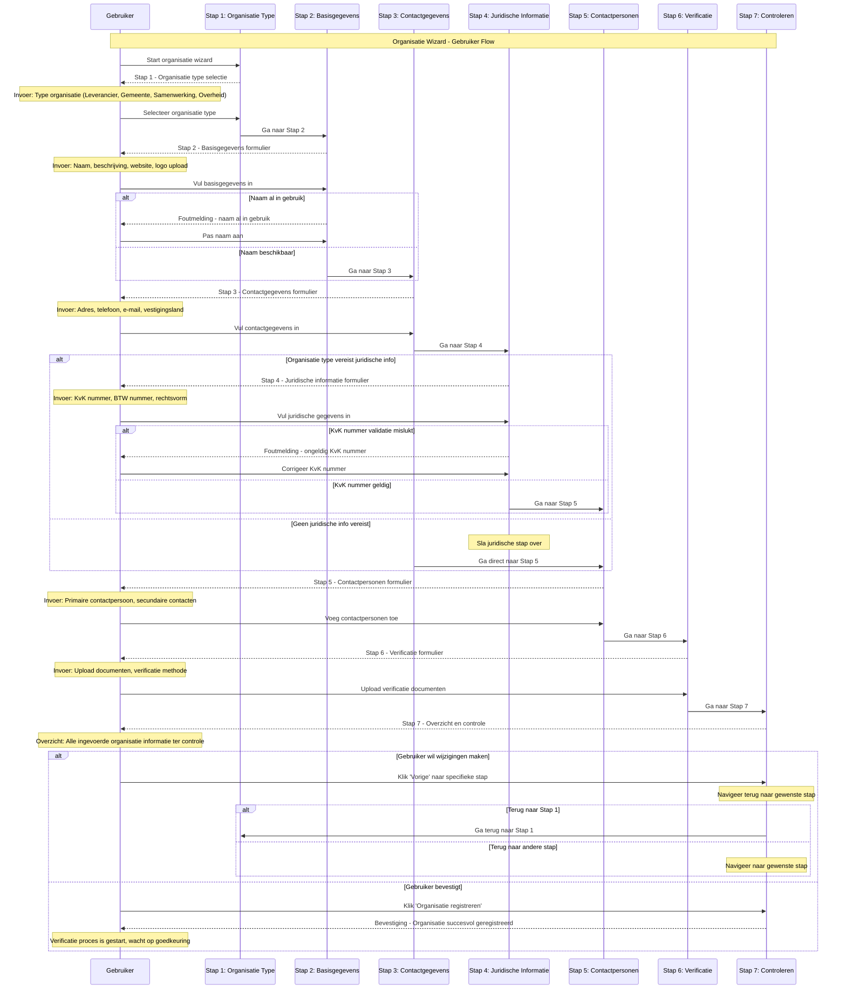

import ApiSchema from '@theme/ApiSchema';
import Tabs from '@theme/Tabs';
import TabItem from '@theme/TabItem';

# K001 - Organisatie

## Beschrijving
Organisaties zijn de verschillende partijen die betrokken zijn bij de softwarecatalogus. Dit kunnen leveranciers, gemeenten, samenwerkingsverbanden of andere overheidsorganisaties zijn. Organisaties vormen de basis voor alle andere concepten in de catalogus.

## Schema Eigenschappen

<ApiSchema id="swc" example pointer="#/components/schemas/organisatie" />

## Relaties

### Heeft
- **Applicaties**: Software die de organisatie aanbiedt
- **Diensten**: Services die worden geleverd
- **Gebruikers**: Medewerkers met toegang tot de catalogus
- **Contactpersonen**: Aangewezen vertegenwoordigers

### Gebruikt
- **Applicaties**: Software van andere organisaties
- **Diensten**: Services van andere leveranciers
- **Standaarden**: Gehanteerde normen en protocollen

### Participatie
- **Lid van**: Samenwerkingsverbanden en communities
- **Partner van**: Andere organisaties in samenwerkingen
- **Leverancier voor**: Organisaties die hun software gebruiken

## Organisatie Types

### 🏢 Leveranciers
Commerciële bedrijven die software ontwikkelen en aanbieden aan overheidsorganisaties.

**Kenmerken:**
- Eigen software portfolio
- Commerciële doelstellingen
- Klantrelaties met gemeenten
- Ondersteuning en service verlening

### 🏛️ Gemeenten
Lokale overheidsorganisaties die software gebruiken voor hun dienstverlening.

**Kenmerken:**
- Applicatielandschap beheer
- Publieke dienstverlening
- Compliance met overheidsstandaarden
- Samenwerking met andere gemeenten

### 🤝 Samenwerkingsverbanden
Organisaties die meerdere gemeenten vertegenwoordigen of ondersteunen.

**Kenmerken:**
- Collectieve inkoop
- Gedeelde software oplossingen
- Kennisdeling en best practices
- Schaalvoordelen voor leden

### ⚙️ Overheidsorganisaties
Provincies, ministeries en andere overheidsinstanties.

**Kenmerken:**
- Specifieke overheidssoftware
- Regelgeving en compliance
- Interoperabiliteit vereisten
- Publieke verantwoording

## Contactpersonen 

<ApiSchema id="swc" example pointer="#/components/schemas/contactpersoon" />

## Autorisatie en Toegang

### Organisatie Rollen
- **Eigenaar**: Volledige controle over organisatie gegevens
- **Beheerder**: Kan gebruikers en applicaties beheren
- **Medewerker**: Kan organisatie gegevens bekijken en beperkt bewerken
- **Gast**: Alleen lees toegang tot publieke informatie

### Toegangsrechten
| Functionaliteit | Eigenaar | Beheerder | Medewerker | Gast |
|------------------|----------|-----------|------------|------|
| **Organisatie gegevens wijzigen** | ✅ | ✅ | ❌ | ❌ |
| **Gebruikers beheren** | ✅ | ✅ | ❌ | ❌ |
| **Applicaties toevoegen** | ✅ | ✅ | ✅ | ❌ |
| **Gegevens bekijken** | ✅ | ✅ | ✅ | ✅ (publiek) |
| **Rapportages genereren** | ✅ | ✅ | ✅ | ❌ |

## Gerelateerde Concepten
- [K002 - Applicatie](./K002-applicatie.md): Software die organisaties aanbieden of gebruiken
- [K003 - Dienst](./K003-dienst.md): Services die organisaties leveren
- [K004 - Gebruik](./K004-gebruik.md): Hoe organisaties applicaties gebruiken
- [K005 - Koppeling](./K005-koppeling.md): Integraties tussen applicaties
- [K006 - Suite](./K006-suite.md): Verzamelingen van applicaties
- [K007 - Component](./K007-component.md): Onderdelen van applicaties

## Persona Perspectief

### 🏛️ Voor Gemeenten (Maria - ICT-coördinator)
- **Doel**: Overzicht van leveranciers en hun betrouwbaarheid
- **Gebruik**: Zoeken naar geschikte leveranciers voor nieuwe software
- **Belang**: Verificatie van leverancier gegevens en referenties

### 🏢 Voor Leveranciers (Jan - Directeur ICT Solutions)
- **Doel**: Zichtbaarheid creëren voor alle gemeenten
- **Gebruik**: Organisatie profiel optimaliseren voor betere vindbaarheid
- **Belang**: Contactgegevens en bedrijfsinformatie actueel houden

### 🤝 Voor Samenwerkingen (Linda - Samenwerking Coördinator)
- **Doel**: Namens leden gemeenten software inkopen en beheren
- **Gebruik**: Samenwerking registreren met juridisch kader
- **Belang**: Duidelijke rol en bevoegdheden vastleggen

### ⚙️ Voor Functioneel Beheer (Peter - Functioneel Beheerder)
- **Doel**: Organisaties valideren en goedkeuren
- **Gebruik**: Nieuwe organisaties beoordelen en status toekennen
- **Belang**: Data kwaliteit en betrouwbaarheid waarborgen

## Gerelateerde Functionaliteiten
- [F002 - Organisatie Inrichten](../Functionaliteiten/F002-organisatie-inrichten.md)
- [F003 - Gebruikersbeheer](../Functionaliteiten/F003-gebruikersbeheer.md)
- [F010 - Lidmaatschapsbeheer](../Functionaliteiten/F010-lidmaatschapsbeheer.md)

## Organisatie Wizard

De Organisatie wizard begeleidt gebruikers door het proces van het registreren van een nieuwe organisatie in de GEMMA Softwarecatalogus.

<Tabs>
  <TabItem value="specificaties" label="Sequence Diagram" default>

  </TabItem>
  <TabItem value="stap1" label="Stap 1: Organisatie Type">
    <ul>
      <li>Organisatie Type: Selecteer type organisatie (Leverancier, Gemeente, Samenwerking, Overheid)</li>
    </ul>
  </TabItem>
  <TabItem value="stap2" label="Stap 2: Basisgegevens">
    <ul>
      <li>Basisgegevens: Naam, beschrijving, website, logo</li>
    </ul>
  </TabItem>
  <TabItem value="stap3" label="Stap 3: Contactgegevens">
    <ul>
      <li>Contactgegevens: Adres, telefoon, e-mail</li>
    </ul>
  </TabItem>
  <TabItem value="stap4" label="Stap 4: Juridische Informatie">
    <ul>
      <li>Juridische Informatie: KvK, BTW, rechtsvorm (indien van toepassing)</li>
    </ul>
  </TabItem>
  <TabItem value="stap5" label="Stap 5: Contactpersonen">
    <ul>
      <li>Contactpersonen: Primaire en secundaire contacten aanwijzen</li>
    </ul>
  </TabItem>
  <TabItem value="stap6" label="Stap 6: Verificatie">
    <ul>
      <li>Verificatie: Documenten uploaden voor verificatie</li>
    </ul>
  </TabItem>
  <TabItem value="stap7" label="Stap 7: Controleren">
    <ul>
      <li>Controleren: Overzicht en bevestiging van alle gegevens</li>
    </ul>
  </TabItem>
</Tabs>
