import ApiSchema from '@theme/ApiSchema';
import Tabs from '@theme/Tabs';
import TabItem from '@theme/TabItem';

# K002 - Applicatie

## Beschrijving
Applicaties zijn software producten die door leveranciers worden aangeboden en door organisaties kunnen worden gebruikt. Een applicatie kan bestaan uit meerdere modules of componenten en kan onderdeel zijn van een grotere suite. Applicaties worden in de software gezien als architecturale elementen ofwel modules en het onderliggende object heet derhalve ook module. Applicaties zijn elementen in de architecturale plaat van gemeenten en kunnen worden geëxporteerd naar AMEF bestanden.

## Schema Eigenschappen

<ApiSchema id="swc" example pointer="#/components/schemas/Module" />

## Applicatie Types

### 🏢 Enterprise Software
Grote, complexe applicaties voor organisatiebrede processen.

**Kenmerken:**
- Uitgebreide functionaliteit
- Hoge configuratiemogelijkheden
- Integratie met vele systemen
- Enterprise support niveau

### 📱 SaaS Applicaties
Cloud-gebaseerde software als service oplossingen.

**Kenmerken:**
- Webgebaseerde toegang
- Automatische updates
- Schaalbare infrastructuur
- Abonnement model

### 🔧 Specialistische Tools
Gerichte applicaties voor specifieke processen of afdelingen.

**Kenmerken:**
- Domein specifieke functionaliteit
- Eenvoudige implementatie
- Beperkte integratie vereisten
- Kosteneffectieve oplossing

### 🌐 Platform Oplossingen
Uitbreidbare platforms waarop andere applicaties kunnen worden gebouwd.

**Kenmerken:**
- Ontwikkelingsframework
- Plugin architectuur
- API-first ontwerp
- Ecosysteem van uitbreidingen

## Levenscyclus & Versie Beheer

### Module vs Module Versie
De **module** (applicatie) zelf bevat de algemene informatie zoals naam, beschrijving, aanbieder en technische specificaties. De **levenscyclus wordt beheerd per versie** via het `moduleVersie` object.

<ApiSchema id="swc" example pointer="#/components/schemas/moduleVersie" />

### Module Versie Lifecycle
Elke versie van een module heeft zijn eigen lifecycle met de volgende statussen:

#### 📋 Status Overzicht
- **in ontwikkeling**: Versie wordt nog ontwikkeld
- **in gebruik**: Versie is actief en beschikbaar
- **einde ondersteuning**: Versie wordt uitgefaseerd
- **teruggetrokken**: Versie is niet meer beschikbaar

#### 📅 Datum Tracking
- **datumInOntwikkeling**: Startdatum ontwikkelingsfase
- **datumInGebruik**: Startdatum actief gebruik
- **datumEindeOndersteuning**: Startdatum einde ondersteuning
- **datumTeruggetrokken**: Datum waarop versie teruggetrokken is

### Versie Beheer Strategie

#### 🔢 Semantic Versioning
Versienummering volgt het MAJOR.MINOR.PATCH formaat:
- **MAJOR**: Grote wijzigingen, mogelijk incompatibel
- **MINOR**: Nieuwe functionaliteiten, backwards compatible
- **PATCH**: Bug fixes, backwards compatible

#### 🌐 SaaS vs On-Premises
- **SaaS applicaties**: Meestal één actieve versie (automatische updates)
- **On-premises**: Meerdere versies kunnen tegelijk actief zijn
- **Hybrid**: Combinatie van beide modellen mogelijk

#### 📊 Versie Informatie
- **versie**: Versienummer (verplicht, semantic versioning)
- **beschrijvingKort**: Wat is nieuw in deze versie (max 255 karakters)
- **beschrijvingLang**: Uitgebreide release notes (Markdown, max 5000 karakters)
- **gebruiken**: Welke organisaties gebruiken deze specifieke versie

## Gerelateerde Concepten
- [K001 - Organisatie](./K001-organisatie.md): Leveranciers en gebruikers
- [K003 - Dienst](./K003-dienst.md): Services die applicaties bieden
- [K004 - Gebruik](./K004-gebruik.md): Hoe applicaties worden gebruikt
- [K005 - Koppeling](./K005-koppeling.md): Integraties tussen applicaties
- [K006 - Suite](./K006-suite.md): Verzamelingen van applicaties
- [K007 - Component](./K007-component.md): Onderdelen van applicaties

## Gerelateerde Functionaliteiten
- [F004 - Applicatiebeheer](../Functionaliteiten/F004-applicatiebeheer.md)
- [F005 - Dienstenbeheer](../Functionaliteiten/F005-dienstenbeheer.md)
- [F013 - Gebruik Beheer](../Functionaliteiten/F013-gebruik-beheer.md)

## Applicatie Wizard

De Applicatie wizard begeleidt gebruikers door het proces van het aanmelden van een nieuwe applicatie in de GEMMA Softwarecatalogus. Dit is de meest uitgebreide wizard met 7 stappen (plus een conditionele stap 2b voor versie beheer bij On-Premise hosting).

<Tabs>
  <TabItem value="specificaties" label="Sequence Diagram" default>
    ```mermaid
    sequenceDiagram
        participant U as Gebruiker
        participant S0 as Stap 0: Organisatie Selectie
        participant S1 as Stap 1: Applicatie Info
        participant S2 as Stap 2: Licentie/Hosting
        participant S2b as Stap 2b: Versies
        participant S3 as Stap 3: Referentie Componenten
        participant S4 as Stap 4: Standaarden
        participant S5 as Stap 5: Koppelingen
        participant S6 as Stap 6: Diensten
        participant S7 as Stap 7: Controleren

        Note over U,S7: Applicatie Wizard - Gebruiker Flow

        %% Entry Point Keuze
        U->>S0: Start applicatie wizard
        S0-->>U: Toon entry point keuze
        Note over U: Keuze: 'Applicatie registreren' (eigen org) of 'Applicatie melden' (andere org)
        
        alt Applicatie melden (voor andere organisatie)
            U->>S0: Kies 'Applicatie melden'
            
            %% Stap 0: Aanbieder Selectie
            S0-->>U: Stap 0 - Aanbieder selectie formulier
            Note over U: Invoer: Zoek bestaande aanbieder of 'Nieuwe aanbieder'
            
            alt Bestaande aanbieder selecteren
                U->>S0: Selecteer bestaande aanbieder uit lijst
                S0-->>U: Toon applicaties van geselecteerde aanbieder (controle)
                Note over U: Overzicht: Bestaande applicaties ter verificatie (wens)
                U->>S0: Bevestig aanbieder keuze
            else Nieuwe aanbieder aanmaken
                U->>S0: Klik 'Ik kan de gewenste leverancier niet vinden'
                S0-->>U: Nieuwe aanbieder formulier
                Note over U: Invoer: Naam aanbieder + Website URL
            end
            
        else Applicatie registreren (eigen organisatie)
            U->>S0: Kies 'Applicatie registreren'
            Note over S0: Sla aanbieder selectie over - gebruik eigen organisatie
        end

        %% Stap 1: Algemene Applicatie Gegevens
        S0->>S1: Ga naar Stap 1
        S1-->>U: Stap 1 - Algemene applicatie gegevens
        Note over U: Invoer: Naam, BeschrijvingKort, BeschrijvingLang, Contactpersoon, Website
        U->>S1: Vul algemene gegevens in
        

        %% Stap 2: Licentie / Hosting
        S2-->>U: Stap 2 - Licentie / Hosting informatie
        Note over U: Invoer: Licentievorm (Open source/Commercieel), Specifieke licentie, Kosten, Hosting vorm (SaaS/On-premise/Hybrid), Data locatie, Hosting provider
        U->>S2: Vul licentie en hosting gegevens in
        
        %% Conditionele Stap: Versies (alleen bij On-premise)
        alt Hosting = On-premise
            S2->>S2b: Ga naar Versie beheer
            S2b-->>U: Stap 2b - Versie beheer (optioneel)
            Note over U: Invoer: Versienummer, Status (Productie/Beta/Alpha)
            U->>S2b: Voeg versie(s) toe (optioneel)
            S2b->>S3: Ga naar Stap 3
        else Hosting = SaaS/Cloud
            S2->>S3: Ga naar Stap 3
        end

        %% Stap 3: Referentie Componenten
        S3-->>U: Stap 3 - GEMMA referentiecomponenten
        Note over U: Invoer: Zoek referentiecomponent → Selecteer → Toevoegen aan lijst (herhaal voor meerdere componenten)
        
        loop Voor elk referentiecomponent
            U->>S3: Zoek referentiecomponent
            U->>S3: Selecteer component uit zoekresultaten
            U->>S3: Voeg toe aan lijst
            S3-->>U: Component toegevoegd aan lijst
        end
        
        S3->>S4: Ga naar Stap 4

        %% Stap 4: Standaarden
        S4-->>U: Stap 4 - Standaarden compliance
        Note over U: Overzicht: Alle standaarden van geselecteerde referentiecomponenten worden automatisch getoond
        
        loop Voor elke standaard
            S4-->>U: Toon standaard (gekoppeld aan referentiecomponent)
            Note over U: Invoer: Voldoet applicatie aan standaard? (ja/nee)
            U->>S4: Selecteer compliance status
            
            alt Applicatie voldoet aan standaard
                Note over U: Invoer: Upload bewijsstuk of verwijs naar bewijs (URL/document)
                U->>S4: Upload bewijs of voeg referentie toe
            end
        end
        
        S4->>S5: Ga naar Stap 5

        %% Stap 5: Koppelingen
        S5-->>U: Stap 5 - Koppelingen met andere applicaties
        Note over U: Invoer: Selecteer Applicatie B + Richting + Soort koppeling + Beschrijving
        U->>S5: Definieer koppelingen (optioneel)
        S5->>S6: Ga naar Stap 6

        %% Stap 6: Diensten
        S6-->>U: Stap 6 - Diensten die applicatie biedt
        Note over U: Invoer: Dienst type (API/Webservice/Interface) + Naam + Beschrijving
        U->>S6: Voeg diensten toe (optioneel)
        S6->>S7: Ga naar Stap 7

        %% Stap 7: Controleren
        S7-->>U: Stap 7 - Overzicht en controle
        Note over U: Overzicht: Alle ingevoerde gegevens ter controle
        
        alt Gebruiker wil wijzigingen maken
            U->>S7: Klik 'Vorige' naar specifieke stap
            Note over S7: Navigeer terug naar gewenste stap
            alt Terug naar Stap 1
                S7->>S1: Ga terug naar Stap 1
            else Terug naar Stap 2
                S7->>S2: Ga terug naar Stap 2
            else Terug naar andere stap
                Note over S7: Navigeer naar gewenste stap
            end
        else Gebruiker bevestigt
            U->>S7: Klik 'Applicatie aanmelden'
            S7-->>U: Bevestiging - Applicatie succesvol aangemeld
            Note over U: Applicatie is opgeslagen en beschikbaar in catalogus
        end
    ```
  </TabItem>
  <TabItem value="stap0" label="Stap 0: Organisatie Selectie">
    <ul>
      <li>Organisatie Selectie (optioneel - alleen bij melden voor anderen)</li>
      <li>Wens: Na selecteren Organisatie tonen van applicaties van die organisatie zodert er minder doubleurs worden aangemaakt</li>
    </ul>
    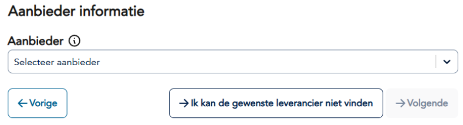
    <ul>
      <li>Organisatie opvoeren (optioneel - alleen ná klikken op "Ik kan de gewenste leverancier niet vinden")</li>
      <li>Wens: Organisatie formulier terugbrengen tot naam + website</li>
      <li>Wens: Organisatie naam controleren op doubleurs</li>
    </ul>
    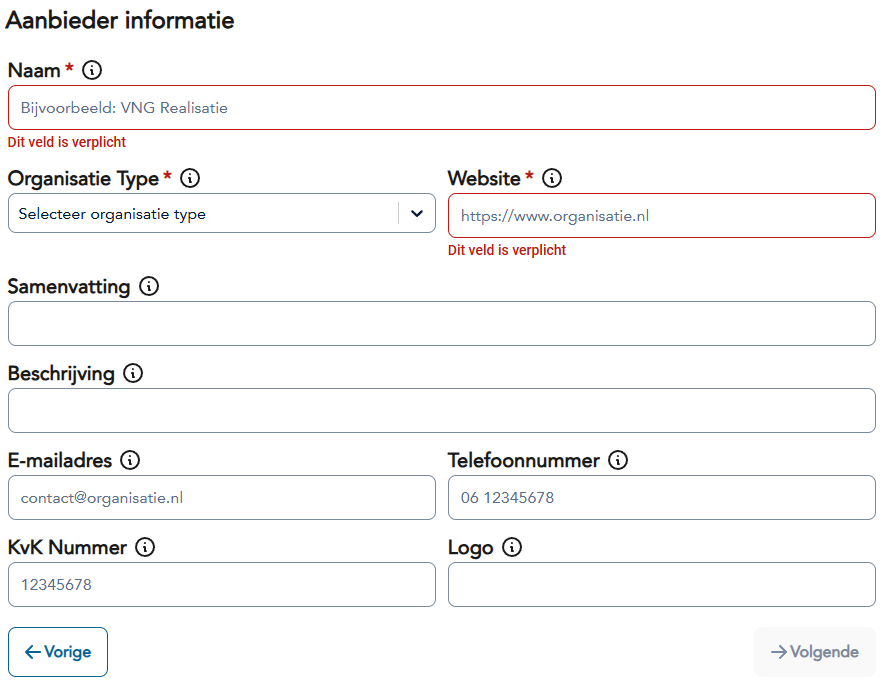
  </TabItem>
  <TabItem value="stap1" label="Stap 1: Applicatie Informatie">
    <ul>
      <li>Applicatie Informatie: naam, website, beschrijving, logo, contact</li>
      <li>Wens: Applicatie naam controleren op doubleurs</li>
    </ul>
    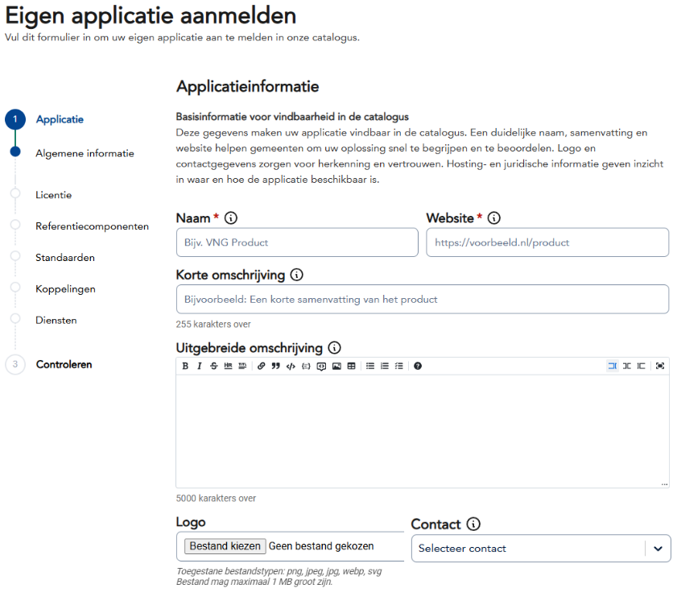
  </TabItem>
  <TabItem value="stap2" label="Stap 2: Licentie/Hosting">
    <ul>
      <li>Licentie / Hosting: licentievorm, hosting type, data locatie</li>
    </ul>
    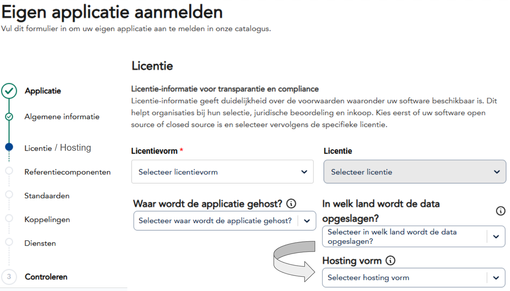
  </TabItem>
  <TabItem value="stap2b" label="Stap 2b: Versies (conditioneel)">
    <ul>
      <li>Versie Beheer (alleen bij On-Premise hosting): versienummer, status (Productie/Beta/Alpha)</li>
    </ul>
   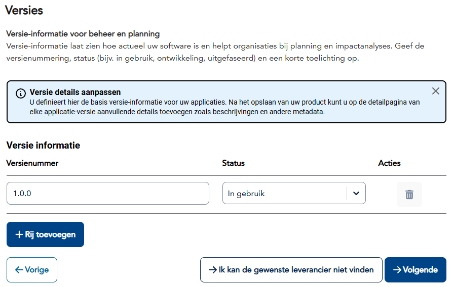
    
  </TabItem>
  <TabItem value="stap3" label="Stap 3: Referentie Componenten">
    <ul>
      <li>Referentie Componenten: zoek en voeg GEMMA componenten één voor één toe</li>
    </ul>
    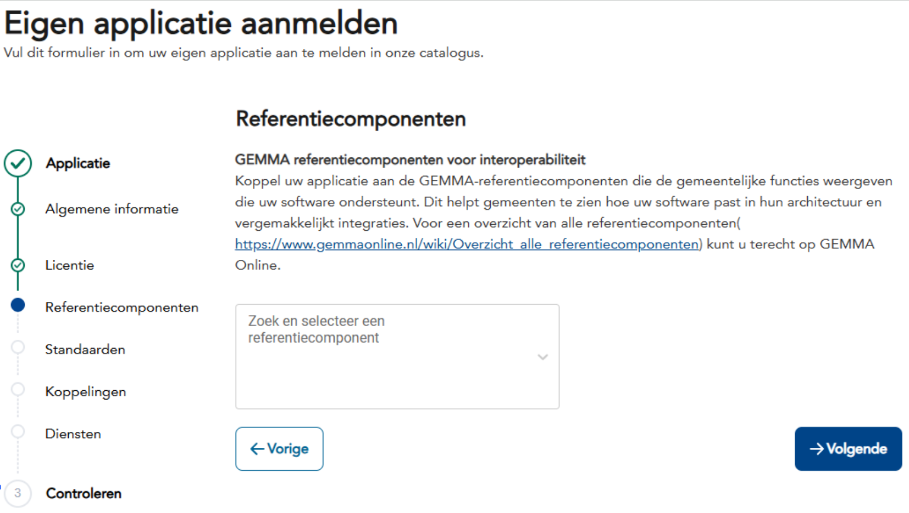
    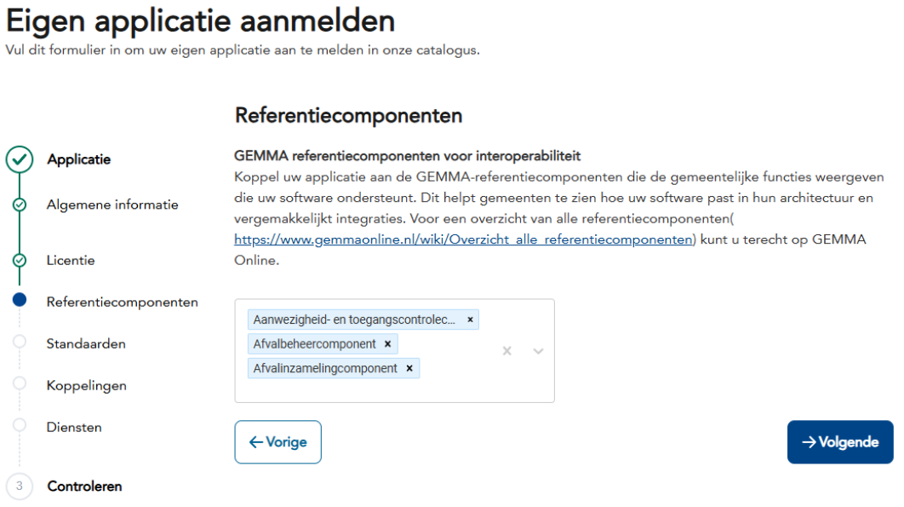
  </TabItem>
  <TabItem value="stap4" label="Stap 4: Standaarden">
    <ul>
      <li>Standaarden: automatisch getoond op basis van referentiecomponenten, per standaard compliance en bewijs</li>
    </ul>
    
  </TabItem>
  <TabItem value="stap5" label="Stap 5: Koppelingen">
    <ul>
      <li>Koppelingen: integraties met andere applicaties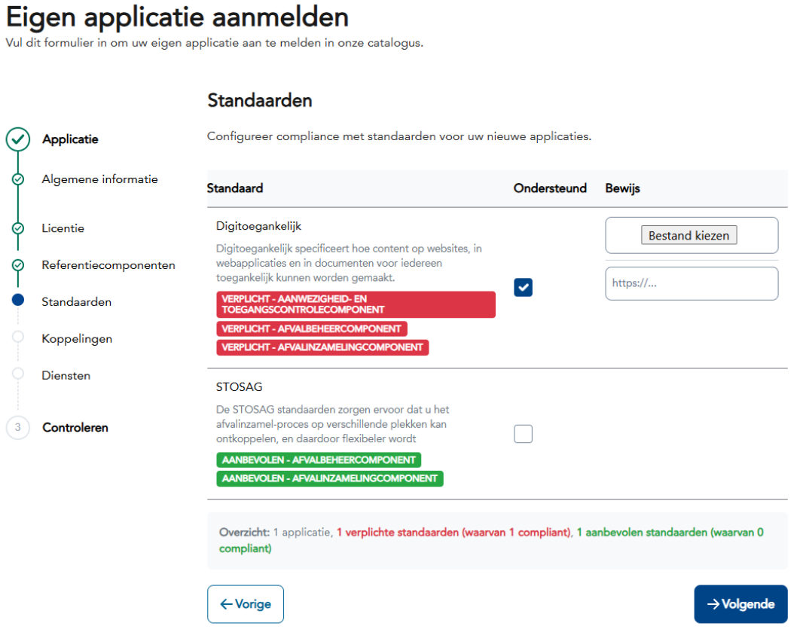</li>
    </ul>
    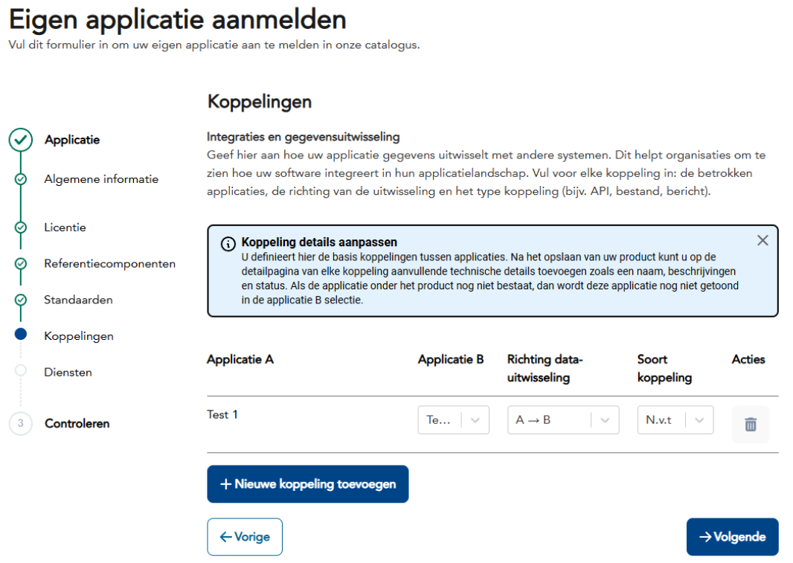
  </TabItem>
  <TabItem value="stap6" label="Stap 6: Diensten">
    <ul>
      <li>Diensten: services die de applicatie biedt</li>
    </ul>
    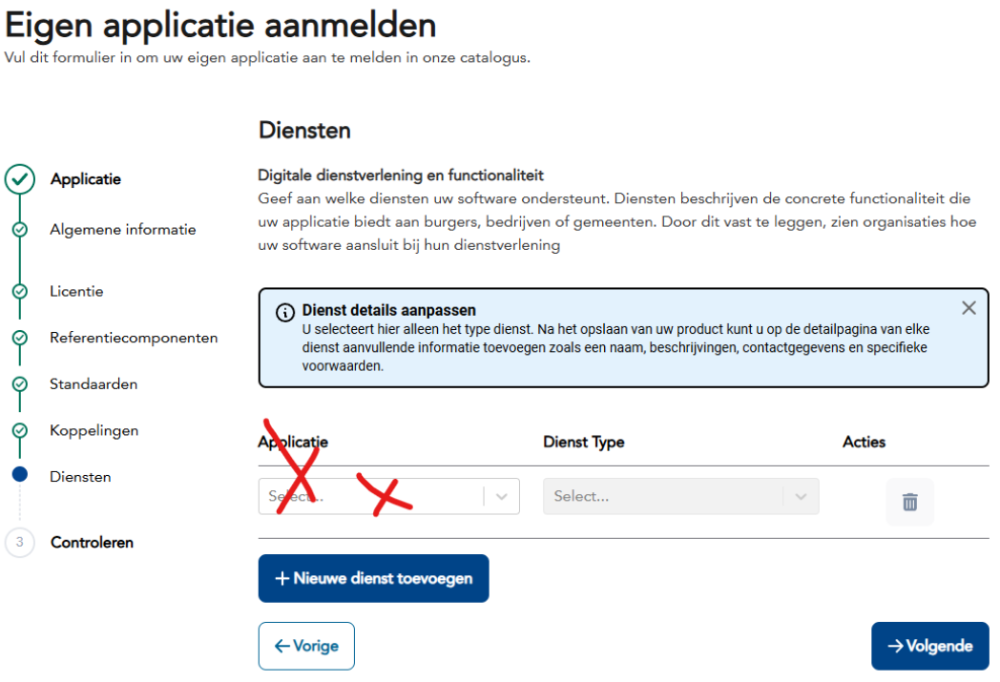
  </TabItem>
  <TabItem value="stap7" label="Stap 7: Controleren">
    <ul>
      <li>Controleren: samengevoegd overzicht en bevestiging</li>
    </ul>
    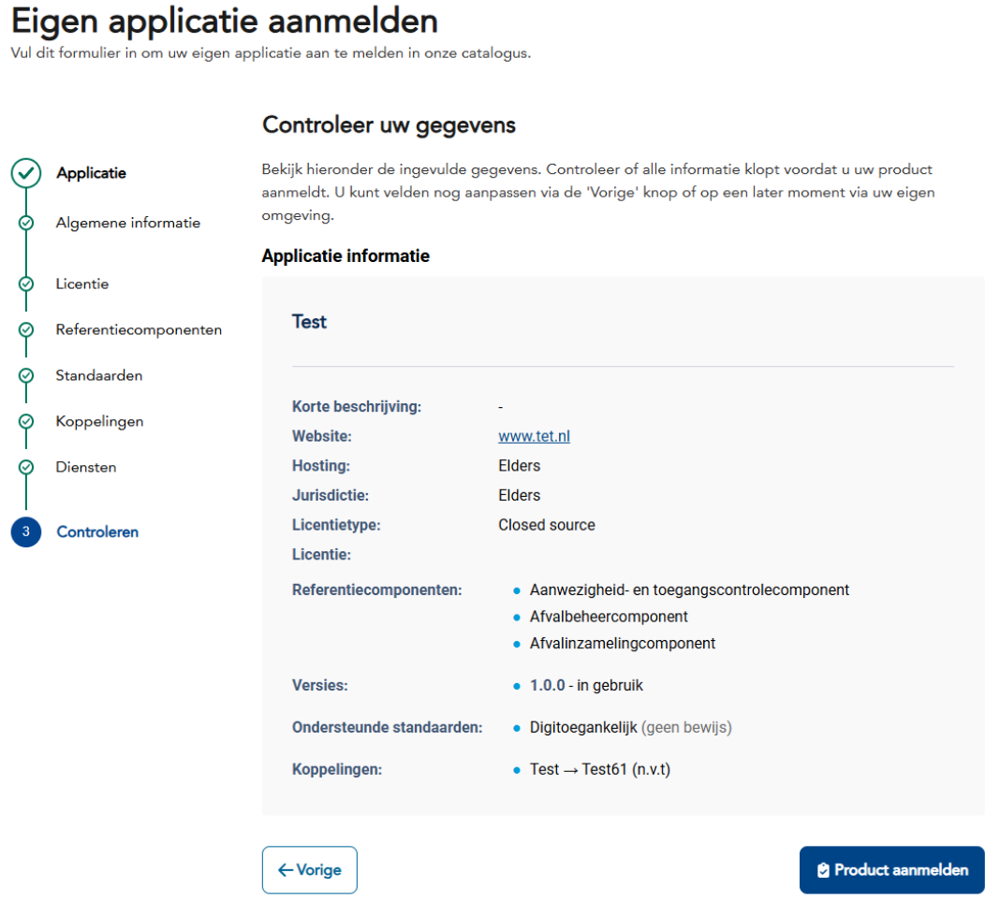
  </TabItem>
</Tabs>
