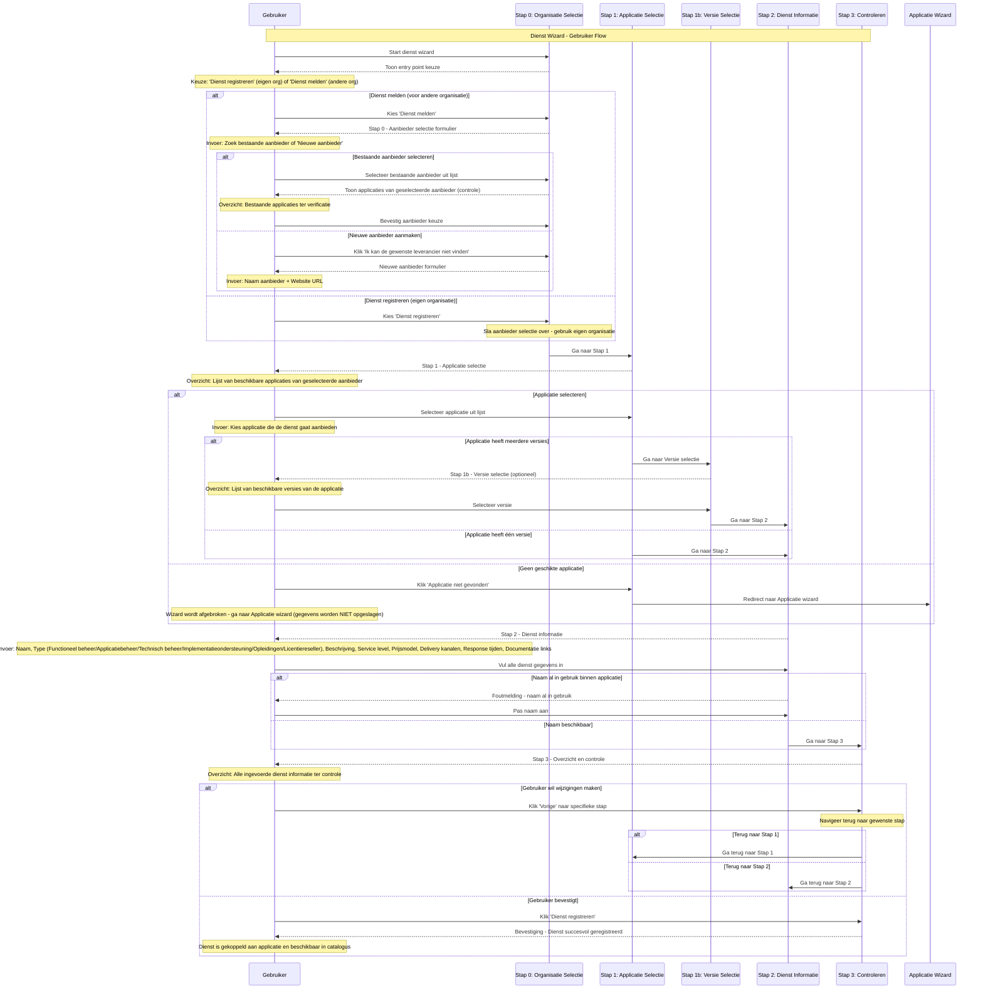
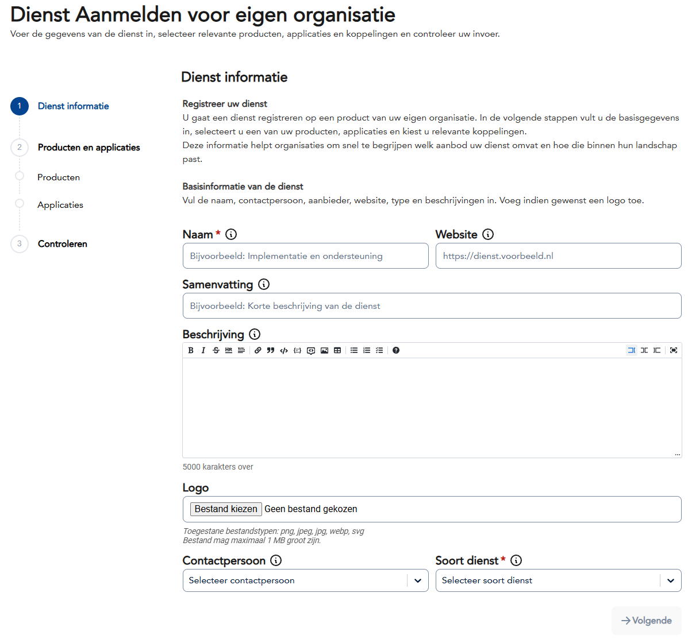
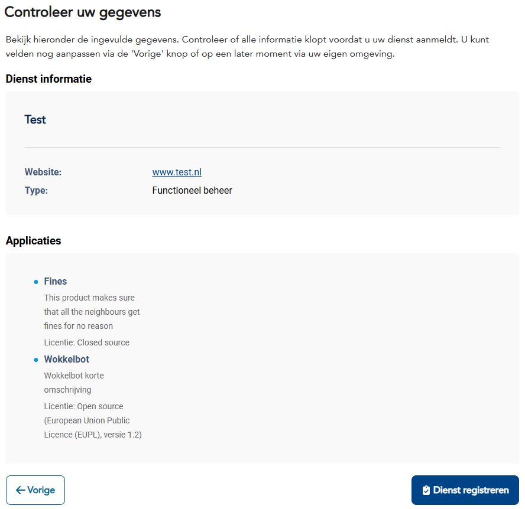

import ApiSchema from '@theme/ApiSchema';
import Tabs from '@theme/Tabs';
import TabItem from '@theme/TabItem';

# K003 - Dienst

## Beschrijving
Diensten zijn specifieke services die door leveranciers of samenwerkingen worden aangeboden op één of meerdere applicaties. Dit betreft het aanbod van verschillende soorten ondersteuning en services rondom software, zoals functioneel beheer, technische ondersteuning, implementatie en training. Diensten vormen de brug tussen leveranciers en organisaties die hun software gebruiken.

## Schema Eigenschappen

<ApiSchema id="swc" example pointer="#/components/schemas/dienst" />

## Relaties

### Aanbod
- **Aangeboden door**: Applicatie die de dienst levert
- **Eigendom van**: Organisatie (leverancier)
- **Onderhouden door**: Ontwikkel- en supportteam
- **Gehost op**: Infrastructuur en platform

### Gebruik
- **Gebruikt door**: Organisaties en applicaties
- **Geïntegreerd in**: Andere systemen en processen
- **Afhankelijk van**: Andere diensten of componenten
- **Monitored door**: Monitoring en alerting systemen

### Standaarden
- **Voldoet aan**: Technische standaarden en protocollen
- **Implementeert**: Interface specificaties
- **Ondersteunt**: Data uitwisseling standaarden
- **Gecertificeerd voor**: Compliance vereisten

## Dienst Types

### 🎯 Functioneel Beheer
Ondersteuning bij het functioneel gebruik en beheer van de applicatie.

**Kenmerken:**
- Advies over optimaal gebruik
- Configuratie ondersteuning
- Proces optimalisatie
- Best practices begeleiding
- Gebruikers ondersteuning

**Voorbeelden:**
- Workflow configuratie
- Rapportage inrichting
- Gebruikersrechten beheer
- Proces optimalisatie advies

### ⚙️ Applicatiebeheer
Technische ondersteuning en beheer van de applicatie zelf.

**Kenmerken:**
- Technische configuratie
- Performance monitoring
- Update management
- Backup en recovery
- Integratie ondersteuning

**Voorbeelden:**
- Systeem configuratie
- Database beheer
- API configuratie
- Performance tuning

### 🔧 Technisch Beheer
Infrastructurele en technische ondersteuning van de onderliggende systemen.

**Kenmerken:**
- Server beheer
- Netwerk configuratie
- Beveiliging management
- Monitoring en alerting
- Disaster recovery

**Voorbeelden:**
- Hosting services
- Security management
- Backup services
- Monitoring dashboards

### 🚀 Implementatieondersteuning
Begeleiding bij de implementatie en uitrol van de applicatie.

**Kenmerken:**
- Project management
- Migratie ondersteuning
- Go-live begeleiding
- Integratie realisatie
- Change management

**Voorbeelden:**
- Data migratie
- Systeem integratie
- Gebruikers migratie
- Pilot begeleiding

### 📚 Opleidingen
Training en kennisoverdracht voor gebruikers en beheerders.

**Kenmerken:**
- Gebruikerstraining
- Beheerders cursussen
- Online learning platforms
- Certificering programma's
- Kennisbank toegang

**Voorbeelden:**
- Eindgebruiker training
- Administrator cursus
- E-learning modules
- Certificering trajecten

### 💼 Licentiereseller
Verkoop en beheer van software licenties en abonnementen.

**Kenmerken:**
- Licentie verkoop
- Volume kortingen
- Licentie beheer tools
- Compliance monitoring
- Renewal management

**Voorbeelden:**
- Software licenties
- SaaS abonnementen
- Volume licensing
- Enterprise agreements

## Dienst Aanbod

### 📋 Aanbod Definitie
Leveranciers en samenwerkingen definiëren hun diensten aanbod per applicatie.

- **Service portfolio**: Overzicht van alle aangeboden diensten
- **Applicatie koppeling**: Welke diensten bij welke applicaties horen
- **Service levels**: Verschillende niveaus van ondersteuning
- **Prijsmodellen**: Kosten en facturatie per dienst type

### 🎯 Service Scoping
Bepaling van de omvang en dekking van elke dienst.

- **Functionaliteit dekking**: Welke onderdelen worden ondersteund
- **Gebruikersgroepen**: Voor wie de dienst beschikbaar is
- **Geografische dekking**: Waar de dienst wordt aangeboden
- **Tijdsvensters**: Wanneer de dienst beschikbaar is

### 💰 Commerciële Aspecten
Prijsstelling en commerciële voorwaarden van diensten.

- **Prijsmodellen**: Vast tarief, per uur, abonnement
- **Volume kortingen**: Schaalvoordelen bij grotere afname
- **Contract voorwaarden**: SLA's en service garanties
- **Facturatie**: Hoe en wanneer wordt gefactureerd

### 📞 Service Delivery
Hoe diensten worden geleverd aan klanten.

- **Delivery kanalen**: Online, telefoon, on-site
- **Response tijden**: Hoe snel wordt gereageerd
- **Escalatie procedures**: Wat gebeurt bij problemen
- **Kwaliteitsborging**: Hoe wordt kwaliteit gewaarborgd

### 📊 Service Management
Beheer en monitoring van het diensten aanbod.

- **Performance monitoring**: Meting van service kwaliteit
- **Customer satisfaction**: Klant tevredenheid metingen
- **Service improvement**: Continue verbetering van diensten
- **Capacity planning**: Zorgen voor voldoende capaciteit

:::info Lifecycle Management
Het **aanbod** van diensten heeft geen lifecycle management. De **afname** van diensten door organisaties wordt beheerd via [K004 - Gebruik](./K004-gebruik.md), waar wel lifecycle management van toepassing is.
:::

## Gerelateerde Concepten
- [K001 - Organisatie](./K001-organisatie.md): Leveranciers en gebruikers van diensten
- [K002 - Applicatie](./K002-applicatie.md): Applicaties die diensten aanbieden
- [K004 - Gebruik](./K004-gebruik.md): Hoe diensten worden gebruikt
- [K005 - Koppeling](./K005-koppeling.md): Technische integraties via diensten
- [K007 - Component](./K007-component.md): Componenten die diensten implementeren

## Gerelateerde Functionaliteiten
- [F005 - Dienstenbeheer](../Functionaliteiten/F005-dienstenbeheer.md)
- [F004 - Applicatiebeheer](../Functionaliteiten/F004-applicatiebeheer.md)
- [F008 - Externe Koppelingen](../Functionaliteiten/F008-externe-koppelingen.md)

## Dienst Wizard

De Dienst wizard begeleidt gebruikers door het proces van het registreren van een nieuwe dienst in de GEMMA Softwarecatalogus.

<Tabs>
  <TabItem value="specificaties" label="Sequence Diagram" default>

  </TabItem>
  <TabItem value="stap0" label="Stap 0: Organisatie Selectie">
    <ul>
      <li>Organisatie Selectie (optioneel - alleen bij melden voor anderen)</li>
      <li>Wens: Na selecteren Organisatie tonen van applicaties van die organisatie zodert er minder doubleurs worden aangemaakt</li>
    </ul>
    
    <ul>
      <li>Organisatie opvoeren (optioneel - alleen ná klikken op "Ik kan de gewenste leverancier niet vinden")</li>
      <li>Wens: Organisatie formulier terugbrengen tot naam + website</li>
      <li>Wens: Organisatie naam controleren op doubleurs</li>
    </ul>
    
  </TabItem>
  <TabItem value="stap1" label="Stap 1: Applicatie Selectie">
    <ul>
      <li>Applicatie Selectie: Welke applicatie biedt de dienst aan</li>
    </ul>
    
  </TabItem>
  <TabItem value="stap1b" label="Stap 1b: Versie Selectie">
    <ul>
      <li>Versie Selectie (optioneel - alleen bij meerdere versies): Selecteer specifieke versie van de applicatie</li>
    </ul>
    
  </TabItem>
  <TabItem value="stap2" label="Stap 2: Dienst Informatie">
    <ul>
      <li>Dienst Informatie: Alle dienst eigenschappen in één uitgebreide stap (naam, type service, beschrijving, service level, prijsmodel, delivery kanalen, response tijden, documentatie)</li>
    </ul>
    
  </TabItem>
  <TabItem value="stap3" label="Stap 3: Controleren">
    <ul>
      <li>Controleren: Overzicht en bevestiging van alle gegevens</li>
    </ul>
    
  </TabItem>  
</Tabs>
