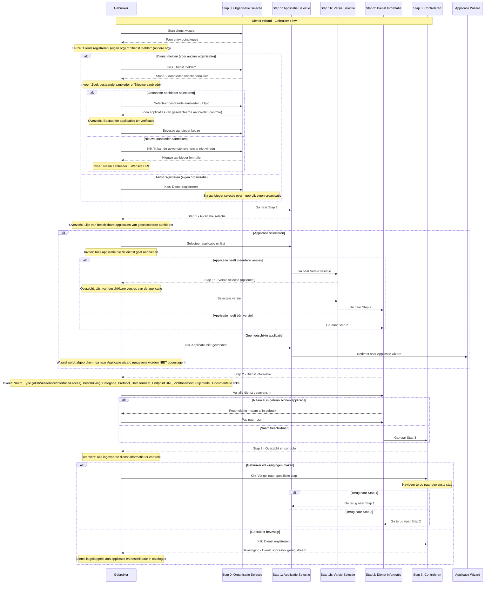

import ApiSchema from '@theme/ApiSchema';
import Tabs from '@theme/Tabs';
import TabItem from '@theme/TabItem';

# K003 - Dienst

## Beschrijving
Diensten zijn specifieke services of functionaliteiten die door applicaties worden aangeboden. Een applicatie kan meerdere diensten bieden, zoals API's, webservices, interfaces of geautomatiseerde processen. Diensten vormen de brug tussen applicaties en hun gebruikers.

## Schema Eigenschappen

<ApiSchema id="swc" example pointer="#/components/schemas/dienst" />

## Relaties

### Aanbod
- **Aangeboden door**: Applicatie die de dienst levert
- **Eigendom van**: Organisatie (leverancier)
- **Onderhouden door**: Ontwikkel- en supportteam
- **Gehost op**: Infrastructuur en platform

### Gebruik
- **Gebruikt door**: Organisaties en applicaties
- **Geïntegreerd in**: Andere systemen en processen
- **Afhankelijk van**: Andere diensten of componenten
- **Monitored door**: Monitoring en alerting systemen

### Standaarden
- **Voldoet aan**: Technische standaarden en protocollen
- **Implementeert**: Interface specificaties
- **Ondersteunt**: Data uitwisseling standaarden
- **Gecertificeerd voor**: Compliance vereisten

## Dienst Types

### 🔌 API Services
Programmatische interfaces voor data en functionaliteit toegang.

**Kenmerken:**
- RESTful of GraphQL endpoints
- JSON/XML data uitwisseling
- Authenticatie en autorisatie
- Rate limiting en throttling
- Uitgebreide documentatie

**Voorbeelden:**
- Zaakgegevens API
- Personen registratie API
- Document management API
- Notificatie service API

### 🌐 Web Services
SOAP-gebaseerde services voor enterprise integratie.

**Kenmerken:**
- WSDL service beschrijvingen
- XML message formaat
- WS-Security standaarden
- Enterprise service bus integratie
- Transactionele ondersteuning

**Voorbeelden:**
- Betalingsverwerking service
- Identity management service
- Workflow orchestration service
- Data synchronisatie service

### 📊 Rapportage Services
Geautomatiseerde rapportage en data analyse diensten.

**Kenmerken:**
- Scheduled report generatie
- Verschillende output formaten
- Parameteriseerbare rapporten
- Dashboard integraties
- Data visualisatie

**Voorbeelden:**
- Financiële rapportage
- Performance dashboards
- Compliance rapporten
- Gebruiksstatistieken

### 🔄 Batch Processen
Geautomatiseerde achtergrond processen voor data verwerking.

**Kenmerken:**
- Scheduled execution
- Grote data volumes
- Error recovery mechanismen
- Progress monitoring
- Result notifications

**Voorbeelden:**
- Data import/export
- Backup processen
- Data cleaning routines
- Archivering processen

### 📱 User Interfaces
Webgebaseerde interfaces voor eindgebruiker interactie.

**Kenmerken:**
- Responsive design
- Gebruiksvriendelijke interface
- Toegankelijkheidsondersteuning
- Multi-language support
- Mobile optimalisatie

**Voorbeelden:**
- Self-service portalen
- Administrative interfaces
- Citizen service portals
- Mobile applications

## Service Lifecycle

### 🚀 Ontwikkeling
- **Requirements analyse**: Functionele en technische vereisten
- **API design**: Interface ontwerp en specificatie
- **Implementatie**: Ontwikkeling en unit testing
- **Documentatie**: API documentatie en gebruikershandleidingen

### 🧪 Testing
- **Unit testing**: Individuele functie tests
- **Integration testing**: Koppeling met andere systemen
- **Performance testing**: Load en stress testing
- **Security testing**: Penetratie en vulnerability tests

### 📦 Deployment
- **Staging deployment**: Test omgeving uitrol
- **Production deployment**: Live omgeving uitrol
- **Monitoring setup**: Performance en error monitoring
- **Documentation publishing**: Publieke documentatie

### 🔄 Operatie
- **Monitoring**: Continue bewaking van performance
- **Maintenance**: Regulier onderhoud en updates
- **Support**: Gebruikersondersteuning en troubleshooting
- **Optimization**: Performance en functionaliteit verbeteringen

### 📈 Evolutie
- **Version management**: Nieuwe versies en backward compatibility
- **Feature enhancement**: Uitbreiding van functionaliteit
- **Integration expansion**: Nieuwe koppelingen en integraties
- **Scaling**: Capaciteit uitbreiding bij groeiend gebruik

### 🔚 Retirement
- **Deprecation notice**: Aankondiging van uitfasering
- **Migration support**: Ondersteuning bij overgang naar alternatief
- **Sunset period**: Geleidelijke afbouw van ondersteuning
- **Service termination**: Definitieve beëindiging van dienst

## Gerelateerde Concepten
- [K001 - Organisatie](./K001-organisatie.md): Leveranciers en gebruikers van diensten
- [K002 - Applicatie](./K002-applicatie.md): Applicaties die diensten aanbieden
- [K004 - Gebruik](./K004-gebruik.md): Hoe diensten worden gebruikt
- [K005 - Koppeling](./K005-koppeling.md): Technische integraties via diensten
- [K007 - Component](./K007-component.md): Componenten die diensten implementeren

## Gerelateerde Functionaliteiten
- [F005 - Dienstenbeheer](../Functionaliteiten/F005-dienstenbeheer.md)
- [F004 - Applicatiebeheer](../Functionaliteiten/F004-applicatiebeheer.md)
- [F008 - Externe Koppelingen](../Functionaliteiten/F008-externe-koppelingen.md)

## Dienst Wizard

De Dienst wizard begeleidt gebruikers door het proces van het registreren van een nieuwe dienst in de GEMMA Softwarecatalogus.

<Tabs>
  <TabItem value="specificaties" label="Sequence Diagram" default>

  </TabItem>
  <TabItem value="stap0" label="Stap 0: Organisatie Selectie">
    <ul>
      <li>Organisatie Selectie (optioneel - alleen bij melden voor anderen): Selecteer aanbieder of maak nieuwe aan</li>
    </ul>
  </TabItem>
  <TabItem value="stap1" label="Stap 1: Applicatie Selectie">
    <ul>
      <li>Applicatie Selectie: Welke applicatie biedt de dienst aan</li>
    </ul>
  </TabItem>
  <TabItem value="stap1b" label="Stap 1b: Versie Selectie">
    <ul>
      <li>Versie Selectie (optioneel - alleen bij meerdere versies): Selecteer specifieke versie van de applicatie</li>
    </ul>
  </TabItem>
  <TabItem value="stap2" label="Stap 2: Dienst Informatie">
    <ul>
      <li>Dienst Informatie: Alle dienst eigenschappen in één uitgebreide stap (naam, type, beschrijving, technische specs, toegang, prijsmodel, documentatie)</li>
    </ul>
  </TabItem>
  <TabItem value="stap3" label="Stap 3: Controleren">
    <ul>
      <li>Controleren: Overzicht en bevestiging van alle gegevens</li>
    </ul>
  </TabItem>
</Tabs>
