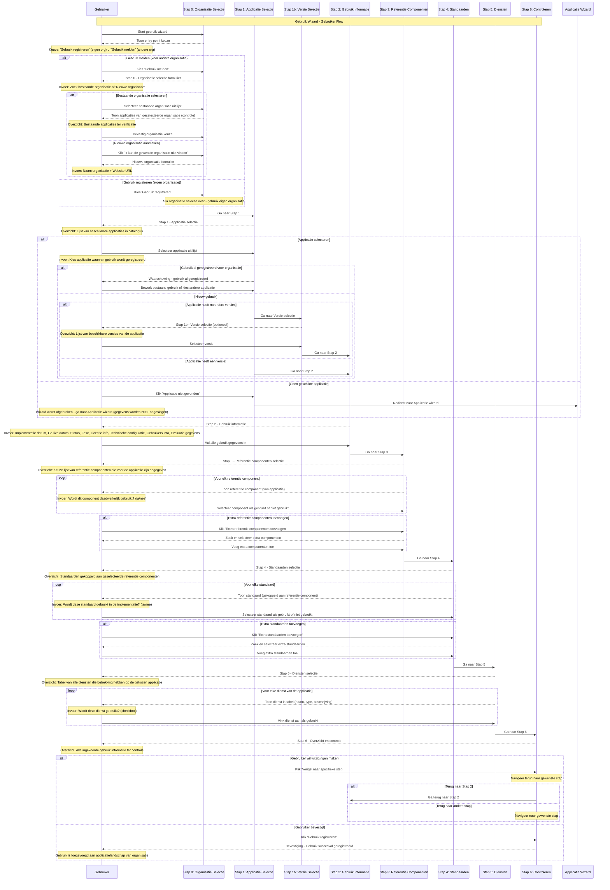
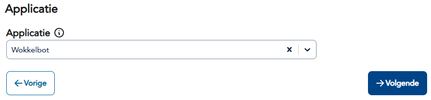
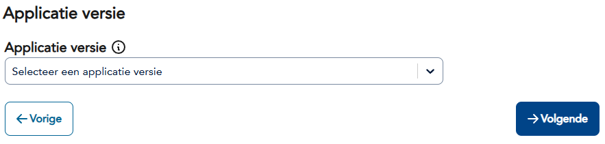
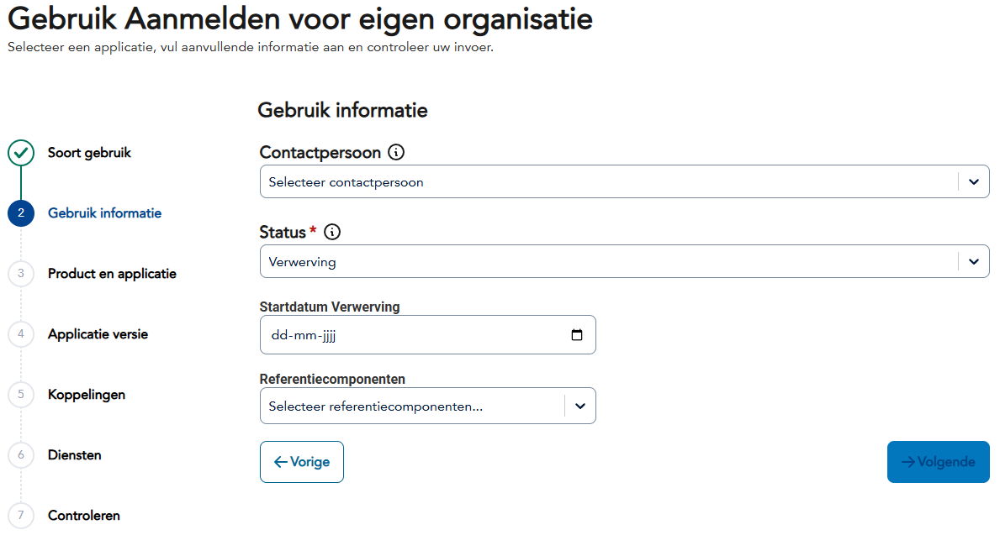
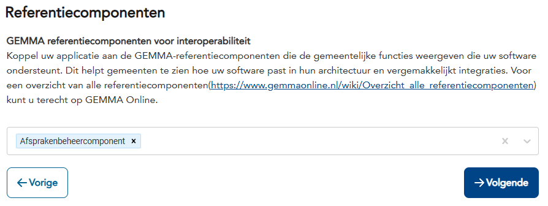
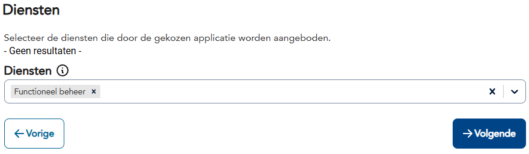
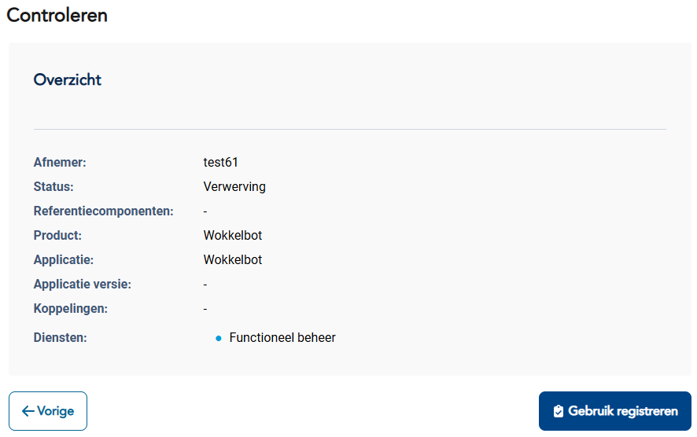

import ApiSchema from '@theme/ApiSchema';
import Tabs from '@theme/Tabs';
import TabItem from '@theme/TabItem';

# K004 - Gebruik

## Beschrijving
Gebruik beschrijft hoe organisaties applicaties inzetten in hun ICT-landschap. Dit omvat zowel de technische als functionele aspecten van het gebruik, inclusief implementatie details, gebruikerservaring en bedrijfswaarde realisatie.

## Schema Eigenschappen

<ApiSchema id="swc" example pointer="#/components/schemas/gebruik" />

## Relaties

### Organisatorisch
- **Gebruikt door**: Organisatie (gemeente, leverancier, samenwerking)
- **Van applicatie**: Specifieke applicatie die wordt gebruikt
- **Beheerd door**: IT afdeling of externe partij
- **Ondersteund door**: Leverancier of support organisatie

### Technisch
- **Gekoppeld aan**: Andere applicaties in het landschap
- **Afhankelijk van**: Infrastructuur en platforms
- **Integreert met**: Externe systemen en diensten
- **Gebruikt diensten**: Specifieke services van de applicatie

### Functioneel
- **Ondersteunt processen**: Bedrijfsprocessen die worden ondersteund
- **Gebruikt door afdelingen**: Welke afdelingen maken gebruik
- **Vervult rollen**: Functionele rollen in de organisatie
- **Levert waarde**: Meetbare business value

## Gebruik Types

### 🏛️ Productie Gebruik
Volledig operationeel gebruik in de dagelijkse bedrijfsvoering.

**Kenmerken:**
- Live omgeving met echte data
- Volledige gebruikersbasis
- 24/7 beschikbaarheid vereist
- Formele support overeenkomsten
- Backup en disaster recovery

**Voorbeelden:**
- Zaaksysteem voor burgerzaken
- Financieel systeem voor boekhouding
- HR systeem voor personeelsbeheer
- CRM voor klantrelatiebeheer

### 🧪 Pilot Gebruik
Beperkte test implementatie om geschiktheid te evalueren.

**Kenmerken:**
- Beperkte gebruikersgroep
- Gecontroleerde omgeving
- Evaluatie criteria en KPI's
- Tijdelijke implementatie
- Intensieve begeleiding

**Voorbeelden:**
- Nieuwe workflow tool in één afdeling
- Innovatieve citizen service in één wijk
- Cloud migratie van één applicatie
- Nieuwe rapportage tool voor management

### 🔄 Migratie Gebruik
Overgang van oude naar nieuwe applicatie of versie.

**Kenmerken:**
- Parallelle systemen
- Data migratie processen
- Gebruikerstraining
- Rollback procedures
- Gefaseerde uitrol

**Voorbeelden:**
- Migratie van legacy systeem naar cloud
- Upgrade naar nieuwe versie
- Consolidatie van meerdere systemen
- Platform modernisering

### 📊 Analytische Gebruik
Gebruik voor rapportage, analyse en business intelligence.

**Kenmerken:**
- Read-only toegang tot data
- Batch processing
- Scheduled reports
- Dashboard integraties
- Data warehouse koppelingen

**Voorbeelden:**
- BI dashboards voor management
- Compliance rapportage
- Performance monitoring
- Trend analyse tools

### 🔧 Ontwikkeling Gebruik
Gebruik voor ontwikkeling, test en configuratie doeleinden.

**Kenmerken:**
- Ontwikkel en test omgevingen
- Sandbox configuraties
- API testing tools
- Prototype development
- Integration testing

**Voorbeelden:**
- API development platforms
- Test automation tools
- Configuration management
- Integration testing suites

## Gebruik Lifecycle

### 📋 Planning
- **Behoefteanalyse**: Identificatie van functionele requirements
- **Marktonderzoek**: Evaluatie van beschikbare oplossingen
- **Business case**: Kosten-baten analyse en ROI berekening
- **Projectplan**: Implementatie roadmap en mijlpalen

### 🚀 Implementatie
- **Procurement**: Aanschaf en contractering
- **Setup**: Technische installatie en configuratie
- **Integratie**: Koppeling met bestaande systemen
- **Training**: Gebruikerstraining en change management

### 📈 Adoptie
- **Rollout**: Gefaseerde uitrol naar gebruikers
- **Support**: Helpdesk en gebruikersondersteuning
- **Monitoring**: Performance en gebruiksmonitoring
- **Optimalisatie**: Aanpassingen en verbeteringen

### 🔄 Operatie
- **Dagelijks beheer**: Routine onderhoud en monitoring
- **Incident management**: Probleem oplossing en escalatie
- **Change management**: Wijzigingen en updates
- **Capacity management**: Capaciteitsplanning en scaling

### 📊 Evaluatie
- **Performance review**: Evaluatie van KPI's en doelstellingen
- **User satisfaction**: Gebruikerstevredenheid onderzoek
- **Cost analysis**: Kosten analyse en optimalisatie
- **Future planning**: Roadmap voor toekomstige ontwikkelingen

### 🔚 Uitfasering
- **End-of-life planning**: Voorbereiding op vervanging
- **Data migratie**: Overzetten van gegevens naar opvolger
- **User transition**: Overgang gebruikers naar nieuwe oplossing
- **Decommissioning**: Definitieve uitschakeling van systeem

## Gerelateerde Concepten
- [K001 - Organisatie](./K001-organisatie.md): Organisaties die applicaties gebruiken
- [K002 - Applicatie](./K002-applicatie.md): Applicaties die worden gebruikt
- [K003 - Dienst](./K003-dienst.md): Diensten die worden afgenomen
- [K005 - Koppeling](./K005-koppeling.md): Integraties in het gebruik
- [K007 - Component](./K007-component.md): Componenten die worden gebruikt

## Gerelateerde Functionaliteiten
- [F013 - Gebruik Beheer](../Functionaliteiten/F013-gebruik-beheer.md)
- [F004 - Applicatiebeheer](../Functionaliteiten/F004-applicatiebeheer.md)
- [F006 - Inzichten en Aanbevelingen](../Functionaliteiten/F006-inzichten-en-aanbevelingen.md)

## Gebruik Wizard

De Gebruik wizard begeleidt gebruikers door het proces van het registreren van applicatie gebruik in de GEMMA Softwarecatalogus.

<Tabs>
  <TabItem value="specificaties" label="Sequence Diagram" default>

  </TabItem>
  <TabItem value="stap0" label="Stap 0: Organisatie Selectie">
    <ul>
      <li>Organisatie Selectie (optioneel - alleen bij melden voor anderen)</li>
      <li>Wens: Na selecteren Organisatie tonen van applicaties van die organisatie zodert er minder doubleurs worden aangemaakt</li>
    </ul>
    
    <ul>
      <li>Organisatie opvoeren (optioneel - alleen ná klikken op "Ik kan de gewenste leverancier niet vinden")</li>
      <li>Wens: Organisatie formulier terugbrengen tot naam + website</li>
      <li>Wens: Organisatie naam controleren op doubleurs</li>
    </ul>
    
  </TabItem>
  <TabItem value="stap1" label="Stap 1: Applicatie Selectie">
    <ul>
      <li>Organisatie Selectie (optioneel - alleen bij melden voor anderen)</li>
      <li>Wens: Na selecteren Organisatie tonen van applicaties van die organisatie zodert er minder doubleurs worden aangemaakt</li>
    </ul>
    
    <ul>
      <li>Organisatie opvoeren (optioneel - alleen ná klikken op "Ik kan de gewenste leverancier niet vinden")</li>
      <li>Wens: Organisatie formulier terugbrengen tot naam + website</li>
      <li>Wens: Organisatie naam controleren op doubleurs</li>
    </ul>
    
    
  </TabItem>
  <TabItem value="stap1b" label="Stap 1b: Versie Selectie">
    <ul>
      <li>Versie Selectie (optioneel - alleen bij meerdere versies): Selecteer specifieke versie van de applicatie</li>
    </ul>
    
  </TabItem>
  <TabItem value="stap2" label="Stap 2: Gebruik Informatie">
    <ul>
      <li>Gebruik Informatie: Alle gebruik eigenschappen in één uitgebreide stap (implementatie details, licentie info, technische configuratie, gebruikers info, evaluatie gegevens)</li>
    </ul>
   
  </TabItem>
  <TabItem value="stap3" label="Stap 3: Referentie Componenten">
    <ul>
      <li>Referentie Componenten: Selecteer welke referentie componenten daadwerkelijk worden gebruikt, met optie om extra componenten toe te voegen</li>
      <li>deze mist in de huidige wizard, mag worden weergegeven als een tabel met checkboxes</li>
      <li>Er kunnen door gebruiker ook referentie componenten worden toegeveogd die geen onderdeel van de applicaite</li>
    </ul>
    
  </TabItem>
  <TabItem value="stap4" label="Stap 4: Standaarden">
    <ul>
      <li>Standaarden: Selecteer welke standaarden worden gebruikt in de implementatie, met optie om extra standaarden toe te voegen</li>
    </ul>
    
  </TabItem>
  <TabItem value="stap5" label="Stap 5: Diensten">
    <ul>
      <li>Diensten: Tabel van alle diensten van de applicatie met checkboxes om aan te geven welke worden gebruikt</li>
    </ul>
    
  </TabItem>
  <TabItem value="stap6" label="Stap 6: Controleren">
    <ul>
      <li>Controleren: Overzicht en bevestiging van alle gegevens</li>
    </ul>
    
  </TabItem>
</Tabs>
