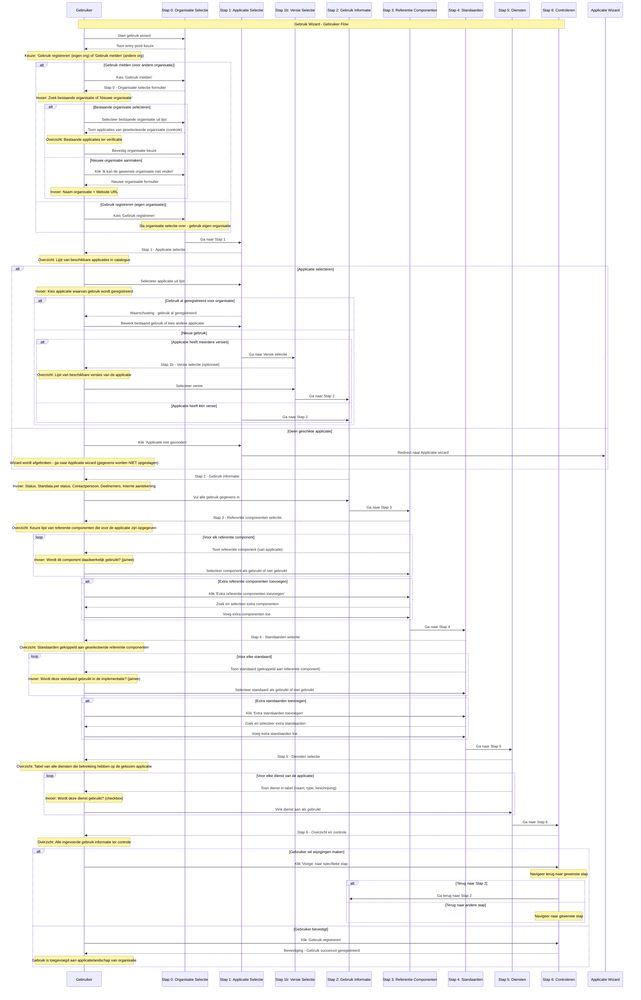

import ApiSchema from '@theme/ApiSchema';
import Tabs from '@theme/Tabs';
import TabItem from '@theme/TabItem';

# K004 - Gebruik

## Beschrijving
Gebruik beschrijft hoe organisaties applicaties inzetten in hun ICT-landschap. Dit omvat zowel de technische als functionele aspecten van het gebruik, inclusief implementatie details, gebruikerservaring en bedrijfswaarde realisatie.

## Schema Eigenschappen

<ApiSchema id="swc" example pointer="#/components/schemas/gebruik" />

## Relaties

### Organisatorisch
- **Gebruikt door**: Organisatie (gemeente, leverancier, samenwerking)
- **Van applicatie**: Specifieke applicatie die wordt gebruikt
- **Beheerd door**: IT afdeling of externe partij
- **Ondersteund door**: Leverancier of support organisatie

### Technisch
- **Gekoppeld aan**: Andere applicaties in het landschap
- **Afhankelijk van**: Infrastructuur en platforms
- **Integreert met**: Externe systemen en diensten
- **Gebruikt diensten**: Specifieke services van de applicatie

### Functioneel
- **Ondersteunt processen**: Bedrijfsprocessen die worden ondersteund
- **Gebruikt door afdelingen**: Welke afdelingen maken gebruik
- **Vervult rollen**: Functionele rollen in de organisatie
- **Levert waarde**: Meetbare business value

## Gebruik Status

Het gebruik van een applicatie doorloopt verschillende statussen die de levenscyclus van de implementatie weergeven:

### 🔍 Verwerving
De organisatie onderzoekt en evalueert de applicatie voor mogelijke implementatie.

**Kenmerken:**
- Marktonderzoek en evaluatie
- Proof of concept activiteiten
- Business case ontwikkeling
- Leverancier selectie

### 📋 Gepland
De beslissing is genomen om de applicatie te implementeren en er is een implementatieplan.

**Kenmerken:**
- Goedgekeurde business case
- Projectplan en tijdlijn
- Budget toegewezen
- Contractonderhandelingen

### ✅ In productie
De applicatie is actief in gebruik binnen de organisatie.

**Kenmerken:**
- Live omgeving operationeel
- Gebruikers zijn getraind
- Support processen actief
- Monitoring en beheer ingesteld

### ⚠️ Uit te faseren
De organisatie heeft besloten om het gebruik van de applicatie te beëindigen.

**Kenmerken:**
- End-of-life planning
- Migratiestrategie bepaald
- Data archivering voorbereid
- Gebruikers geïnformeerd

### 🔚 Uitgefaseerd
Het gebruik van de applicatie is volledig beëindigd.

**Kenmerken:**
- Applicatie is uitgeschakeld
- Data is gemigreerd of gearchiveerd
- Licenties zijn opgezegd
- Documentatie is bijgewerkt

## Gebruik Eigenschappen

### 🏢 Organisatie Gegevens
- **Afnemer**: De organisatie die de applicatie gebruikt
- **Contactpersoon**: Verantwoordelijke persoon voor dit gebruik
- **Deelnemers**: Andere organisaties die deelnemen (bij samenwerkingen)
- **Interne Aantekening**: Aanvullende interne informatie

### 📅 Tijdlijn Gegevens
- **Startdatum Verwerving**: Wanneer de evaluatie is gestart
- **Startdatum Gepland**: Geplande implementatiedatum
- **Startdatum In Productie**: Wanneer de applicatie live is gegaan
- **Startdatum Uit Te Faseren**: Wanneer uitfasering begint
- **Startdatum Uitgefaseerd**: Wanneer gebruik definitief is beëindigd

### 🔗 Applicatie Koppelingen
- **Module**: De specifieke applicatie die wordt gebruikt
- **Module Versie**: De specifieke versie van de applicatie
- **Referentiecomponenten**: GEMMA componenten waarvoor de applicatie wordt gebruikt
- **AMEF Elementen**: Architectuur elementen die worden ondersteund

### 🤝 Diensten en Koppelingen
- **Diensten**: Services die worden afgenomen bij dit gebruik
- **Koppelingen**: Integraties die worden gebruikt binnen dit gebruik

## Gerelateerde Concepten
- [K001 - Organisatie](./K001-organisatie.md): Organisaties die applicaties gebruiken
- [K002 - Applicatie](./K002-applicatie.md): Applicaties die worden gebruikt
- [K003 - Dienst](./K003-dienst.md): Diensten die worden afgenomen
- [K005 - Koppeling](./K005-koppeling.md): Integraties in het gebruik
- [K007 - Component](./K007-component.md): Componenten die worden gebruikt

## Persona Perspectief

### 🏛️ Voor Gemeenten (Maria - ICT-coördinator)
- **Doel**: Compleet overzicht van eigen applicatielandschap
- **Gebruik**: Registreren van alle applicaties die de gemeente gebruikt
- **Belang**: Inzicht in kosten, afhankelijkheden en lifecycle planning

### 🏢 Voor Leveranciers (Jan - Directeur ICT Solutions)
- **Doel**: Inzicht in wie hun software gebruikt
- **Gebruik**: Gebruik melden van eigen applicaties bij gemeenten
- **Belang**: Klantenbeheer en referentie cases

### 🤝 Voor Samenwerkingen (Linda - Samenwerking Coördinator)
- **Doel**: Gebruik namens leden registreren en beheren
- **Gebruik**: Centraal overzicht van software gebruik door alle leden
- **Belang**: Gezamenlijke inkoop en beheer optimalisatie

### ⚙️ Voor Functioneel Beheer (Peter - Functioneel Beheerder)
- **Doel**: Overzicht van software gebruik in gemeentelijke sector
- **Gebruik**: Valideren en analyseren van gebruik registraties
- **Belang**: Marktinzichten en trend analyse

### 🏗️ Voor Architectuur Experts (Sarah - Enterprise Architect)
- **Doel**: Architectuur compliance en standaarden gebruik monitoren
- **Gebruik**: Analyseren welke referentie componenten en standaarden gebruikt worden
- **Belang**: GEMMA adoptie en compliance monitoring

## Gerelateerde Functionaliteiten
- [F013 - Gebruik Beheer](../Functionaliteiten/F013-gebruik-beheer.md)
- [F004 - Applicatiebeheer](../Functionaliteiten/F004-applicatiebeheer.md)
- [F006 - Inzichten en Aanbevelingen](../Functionaliteiten/F006-inzichten-en-aanbevelingen.md)

## Gebruik Wizard

De Gebruik wizard begeleidt gebruikers door het proces van het registreren van applicatie gebruik in de GEMMA Softwarecatalogus.

<Tabs>
  <TabItem value="specificaties" label="Sequence Diagram" default>

  </TabItem>
  <TabItem value="stap0" label="Stap 0: Organisatie Selectie">
    <ul>
      <li>Organisatie Selectie (optioneel - alleen bij melden voor anderen)</li>
      <li>Wens: Na selecteren Organisatie tonen van applicaties van die organisatie zodert er minder doubleurs worden aangemaakt</li>
    </ul>
    
    <ul>
      <li>Organisatie opvoeren (optioneel - alleen ná klikken op "Ik kan de gewenste leverancier niet vinden")</li>
      <li>Wens: Organisatie formulier terugbrengen tot naam + website</li>
      <li>Wens: Organisatie naam controleren op doubleurs</li>
    </ul>
    
  </TabItem>
  <TabItem value="stap1" label="Stap 1: Applicatie Selectie">
    <ul>
      <li>Organisatie Selectie (optioneel - alleen bij melden voor anderen)</li>
      <li>Wens: Na selecteren Organisatie tonen van applicaties van die organisatie zodert er minder doubleurs worden aangemaakt</li>
    </ul>
    
    <ul>
      <li>Organisatie opvoeren (optioneel - alleen ná klikken op "Ik kan de gewenste leverancier niet vinden")</li>
      <li>Wens: Organisatie formulier terugbrengen tot naam + website</li>
      <li>Wens: Organisatie naam controleren op doubleurs</li>
    </ul>
    
    
  </TabItem>
  <TabItem value="stap1b" label="Stap 1b: Versie Selectie">
    <ul>
      <li>Versie Selectie (optioneel - alleen bij meerdere versies): Selecteer specifieke versie van de applicatie</li>
    </ul>
    
  </TabItem>
  <TabItem value="stap2" label="Stap 2: Gebruik Informatie">
    <ul>
      <li>Gebruik Informatie: Status, Startdata per status, Contactpersoon, Deelnemers, Interne aantekening</li>
      <li>Status keuze bepaalt welke startdata velden relevant zijn</li>
      <li>Deelnemers alleen relevant bij samenwerkingsverbanden</li>
    </ul>
   
  </TabItem>
  <TabItem value="stap3" label="Stap 3: Referentie Componenten">
    <ul>
      <li>Referentie Componenten: Selecteer welke referentie componenten daadwerkelijk worden gebruikt, met optie om extra componenten toe te voegen</li>
      <li>deze mist in de huidige wizard, mag worden weergegeven als een tabel met checkboxes</li>
      <li>Er kunnen door gebruiker ook referentie componenten worden toegeveogd die geen onderdeel van de applicaite</li>
    </ul>
    
  </TabItem>
  <TabItem value="stap4" label="Stap 4: Standaarden">
    <ul>
      <li>Standaarden: Selecteer welke standaarden worden gebruikt in de implementatie, met optie om extra standaarden toe te voegen</li>
    </ul>
    
  </TabItem>
  <TabItem value="stap5" label="Stap 5: Diensten">
    <ul>
      <li>Diensten: Tabel van alle diensten van de applicatie met checkboxes om aan te geven welke worden gebruikt</li>
    </ul>
    
  </TabItem>
  <TabItem value="stap6" label="Stap 6: Controleren">
    <ul>
      <li>Controleren: Overzicht en bevestiging van alle gegevens</li>
    </ul>
    
  </TabItem>
</Tabs>
