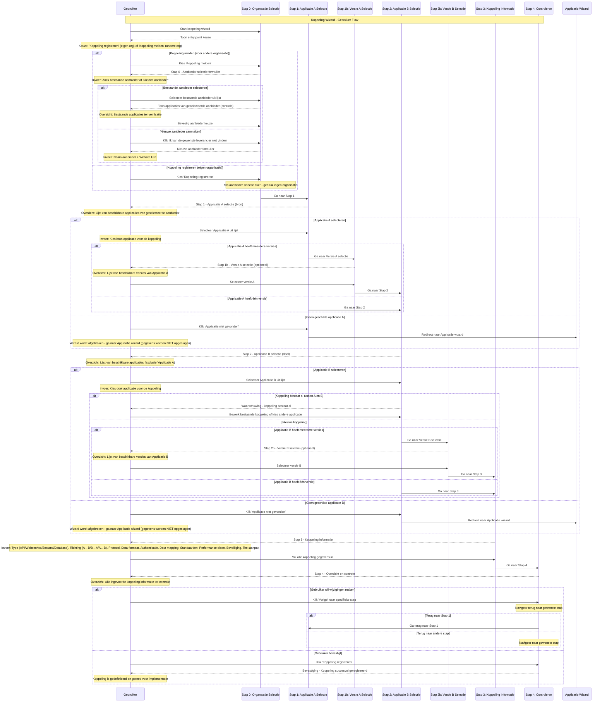

import ApiSchema from '@theme/ApiSchema';
import Tabs from '@theme/Tabs';
import TabItem from '@theme/TabItem';

# K005 - Koppeling

## Beschrijving
Koppelingen beschrijven de technische integraties tussen verschillende applicaties. Dit kunnen API-koppelingen, bestandsuitwisselingen, database koppelingen of andere vormen van data-uitwisseling zijn. Koppelingen zijn essentieel voor een geïntegreerd applicatielandschap.

## Schema Eigenschappen

<ApiSchema id="swc" example pointer="#/components/schemas/koppeling" />

## Relaties

### Applicaties
- **Verbindt**: Twee of meer applicaties
- **Gebruikt door**: Organisaties die de applicaties gebruiken
- **Beheerd door**: IT teams of externe partijen
- **Ondersteund door**: Leveranciers van de gekoppelde applicaties

### Standaarden
- **Implementeert**: Technische standaarden
- **Voldoet aan**: Compliance vereisten
- **Gebruikt**: Data uitwisseling protocollen
- **Ondersteunt**: Interoperabiliteit frameworks

### Infrastructuur
- **Loopt over**: Netwerk infrastructuur
- **Gebruikt**: Middleware en integration platforms
- **Afhankelijk van**: Database en storage systemen
- **Monitored door**: Monitoring en alerting systemen

## Koppeling Types

### 🔌 API Koppelingen
Real-time programmatische integraties via REST of GraphQL APIs.

**Kenmerken:**
- Synchrone communicatie
- JSON/XML data uitwisseling
- HTTP/HTTPS protocol
- Real-time data toegang
- Stateless architectuur

**Voorbeelden:**
- BRP koppeling voor persoongegevens
- BAG koppeling voor adresgegevens
- Zaaksysteem naar DMS koppeling
- CRM naar e-mail marketing integratie

### 🌐 Webservice Koppelingen
SOAP-gebaseerde enterprise integraties met uitgebreide functionaliteit.

**Kenmerken:**
- WSDL service definities
- XML message formaat
- WS-Security standaarden
- Transactionele ondersteuning
- Enterprise service bus integratie

**Voorbeelden:**
- StUF-ZKN zaakservices
- DigiKoppeling services
- Suwinet koppelingen
- GBA/BRP webservices

### 📁 Bestandsuitwisseling
Batch-gebaseerde data uitwisseling via bestanden.

**Kenmerken:**
- Asynchrone verwerking
- Grote data volumes
- Scheduled transfers
- FTP/SFTP protocol
- Verschillende bestandsformaten

**Voorbeelden:**
- Salarisverwerking export
- Factuur import/export
- Backup data transfers
- Rapportage distributie

### 🗄️ Database Koppelingen
Directe database toegang en synchronisatie.

**Kenmerken:**
- SQL-gebaseerde toegang
- Real-time of batch sync
- Transactionele integriteit
- Database triggers
- Replicatie mechanismen

**Voorbeelden:**
- Data warehouse ETL
- Master data synchronisatie
- Backup en archivering
- Business intelligence feeds

### 📨 Message Queue Koppelingen
Asynchrone berichtuitwisseling via message brokers.

**Kenmerken:**
- Publish/subscribe patronen
- Message persistence
- Load balancing
- Error recovery
- Scalable architectuur

**Voorbeelden:**
- Event-driven architectuur
- Workflow orchestration
- Notification services
- Integration patterns

## Koppeling Lifecycle

### 📋 Analyse en Design
- **Requirements analyse**: Functionele en technische vereisten
- **Architectuur design**: Integratie patronen en technologie keuzes
- **Data mapping**: Mapping tussen verschillende data modellen
- **Security design**: Beveiliging en toegangscontrole ontwerp

### 🛠️ Ontwikkeling
- **Interface development**: API of service ontwikkeling
- **Data transformation**: Implementatie van data conversie logica
- **Error handling**: Foutafhandeling en recovery mechanismen
- **Testing**: Unit, integration en performance testing

### 🚀 Deployment
- **Environment setup**: Configuratie van test en productie omgevingen
- **Security configuration**: Implementatie van beveiliging
- **Monitoring setup**: Performance en health monitoring
- **Documentation**: Technische en gebruikersdocumentatie

### 🔄 Operatie
- **Monitoring**: Continue bewaking van performance en beschikbaarheid
- **Maintenance**: Regulier onderhoud en updates
- **Support**: Incident management en troubleshooting
- **Optimization**: Performance tuning en capacity planning

### 📈 Evolutie
- **Version management**: Nieuwe versies en backward compatibility
- **Enhancement**: Uitbreiding van functionaliteit
- **Migration**: Overgang naar nieuwe technologieën
- **Scaling**: Capaciteit uitbreiding bij groeiend gebruik

### 🔚 Retirement
- **Deprecation**: Aankondiging van uitfasering
- **Migration planning**: Overgang naar vervangend systeem
- **Data preservation**: Behoud van historische gegevens
- **Decommissioning**: Definitieve uitschakeling

## Gerelateerde Concepten
- [K002 - Applicatie](./K002-applicatie.md): Applicaties die worden gekoppeld
- [K003 - Dienst](./K003-dienst.md): Diensten die worden gebruikt in koppelingen
- [K004 - Gebruik](./K004-gebruik.md): Gebruik context van koppelingen
- [K007 - Component](./K007-component.md): Componenten die koppelingen implementeren

## Gerelateerde Functionaliteiten
- [F008 - Externe Koppelingen](../Functionaliteiten/F008-externe-koppelingen.md)
- [F004 - Applicatiebeheer](../Functionaliteiten/F004-applicatiebeheer.md)
- [F013 - Gebruik Beheer](../Functionaliteiten/F013-gebruik-beheer.md)

## Koppeling Wizard

De Koppeling wizard begeleidt gebruikers door het proces van het definiëren van een nieuwe integratie tussen applicaties.

<Tabs>
  <TabItem value="specificaties" label="Sequence Diagram" default>

  </TabItem>
  <TabItem value="stap0" label="Stap 0: Organisatie Selectie">
    <ul>
      <li>Organisatie Selectie (optioneel - alleen bij melden voor anderen): Selecteer aanbieder of maak nieuwe aan</li>
    </ul>
  </TabItem>
  <TabItem value="stap1" label="Stap 1: Applicatie A Selectie">
    <ul>
      <li>Applicatie A Selectie: Bron applicatie voor de koppeling</li>
    </ul>
  </TabItem>
  <TabItem value="stap1b" label="Stap 1b: Versie A Selectie">
    <ul>
      <li>Versie A Selectie (optioneel - alleen bij meerdere versies): Selecteer specifieke versie van Applicatie A</li>
    </ul>
  </TabItem>
  <TabItem value="stap2" label="Stap 2: Applicatie B Selectie">
    <ul>
      <li>Applicatie B Selectie: Doel applicatie voor de koppeling</li>
    </ul>
  </TabItem>
  <TabItem value="stap2b" label="Stap 2b: Versie B Selectie">
    <ul>
      <li>Versie B Selectie (optioneel - alleen bij meerdere versies): Selecteer specifieke versie van Applicatie B</li>
    </ul>
  </TabItem>
  <TabItem value="stap3" label="Stap 3: Koppeling Informatie">
    <ul>
      <li>Koppeling Informatie: Alle koppeling eigenschappen in één uitgebreide stap (type, richting, protocol, data mapping, standaarden, performance, beveiliging, testing)</li>
    </ul>
  </TabItem>
  <TabItem value="stap4" label="Stap 4: Controleren">
    <ul>
      <li>Controleren: Overzicht en bevestiging van alle gegevens</li>
    </ul>
  </TabItem>
</Tabs>
