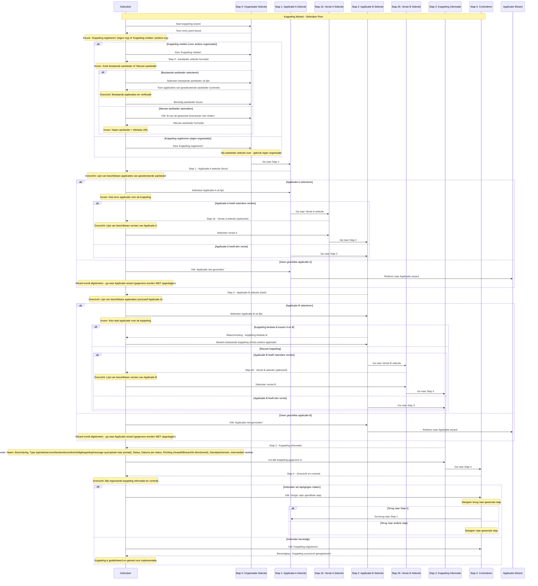

import ApiSchema from '@theme/ApiSchema';
import Tabs from '@theme/Tabs';
import TabItem from '@theme/TabItem';

# K005 - Koppeling

## Beschrijving
Koppelingen beschrijven de technische integraties tussen applicaties (modules) onderling en/of met buitengemeentelijke voorzieningen. Hetzelfde koppeling object wordt gebruikt voor zowel het aanbod (welke koppelingen zijn beschikbaar voor een applicatie) als voor het gebruik (welke koppelingen hebben afnemers daadwerkelijk geïmplementeerd).

## Schema Eigenschappen

<ApiSchema id="swc" example pointer="#/components/schemas/koppeling" />

## Relaties

### Modules (Applicaties)
- **Module A**: De bron module waarvan gegevens worden uitgewisseld
- **Module B**: De doel module waarnaar gegevens worden uitgewisseld (optioneel)
- **Intermediair Module**: Module die wordt gebruikt voor realisatie van de koppeling

### Buitengemeentelijke Voorzieningen
- **Buitengemeentelijke Voorziening**: Externe voorziening waarmee wordt gekoppeld (alternatief voor Module B)

### Organisatie en Diensten
- **Aanbieder**: De organisatie die de koppeling aanbiedt
- **Dienst**: De dienst die deze koppeling gebruikt

### Standaarden
- **Standaardversies**: Standaarden die door deze koppeling worden geïmplementeerd

## Koppeling Types

Het schema ondersteunt de volgende koppeling types:

### 🔌 API
Moderne REST of GraphQL API koppelingen voor real-time data uitwisseling.

### 🌐 Webservices
SOAP-gebaseerde webservice koppelingen, vaak gebruikt voor overheidsstandaarden.

### 📁 Bestandsoverdracht
Batch-gebaseerde uitwisseling via bestanden (CSV, XML, etc.).

### 🔗 DigiKoppeling
Overheidsstandaard voor veilige gegevensuitwisseling tussen overheden.

### 📨 Message Queue
Asynchrone berichtuitwisseling via message brokers.

### 🌐 Upload naar portaal
Handmatige of geautomatiseerde upload naar webportalen.

### ❓ N.v.t.
Voor koppelingen waar het type niet van toepassing is of onbekend.

## Koppeling Status

De koppeling doorloopt verschillende statussen die de levenscyclus weergeven:

### 🛠️ In ontwikkeling
De koppeling wordt ontwikkeld en getest.

**Kenmerken:**
- Technische specificatie wordt uitgewerkt
- Ontwikkeling en testing in gang
- Nog niet beschikbaar voor productie gebruik

### ✅ In gebruik
De koppeling is operationeel en beschikbaar voor gebruik.

**Kenmerken:**
- Volledig getest en goedgekeurd
- Beschikbaar voor implementatie door afnemers
- Documentatie en support beschikbaar

### ⚠️ Einde ondersteuning
De koppeling wordt niet meer actief ondersteund maar is nog beschikbaar.

**Kenmerken:**
- Geen nieuwe features of updates
- Beperkte support beschikbaar
- Migratie naar alternatief wordt aanbevolen

### 🔚 Teruggetrokken
De koppeling is niet meer beschikbaar.

**Kenmerken:**
- Volledig uitgefaseerd
- Geen ondersteuning meer
- Alternatieve oplossing vereist

## Gegevensuitwisseling Richting

### A naar B
Gegevens stromen van Module A naar Module B (of buitengemeentelijke voorziening).

### B naar A  
Gegevens stromen van Module B (of buitengemeentelijke voorziening) naar Module A.

### Bi-directioneel
Gegevens kunnen in beide richtingen stromen.

## Gerelateerde Concepten
- [K002 - Applicatie](./K002-applicatie.md): Applicaties die worden gekoppeld
- [K003 - Dienst](./K003-dienst.md): Diensten die worden gebruikt in koppelingen
- [K004 - Gebruik](./K004-gebruik.md): Gebruik context van koppelingen
- [K007 - Component](./K007-component.md): Componenten die koppelingen implementeren

## Persona Perspectief

### 🏛️ Voor Gemeenten (Maria - ICT-coördinator)
- **Doel**: Overzicht van alle integraties in het applicatielandschap
- **Gebruik**: Inzicht in afhankelijkheden en risico's van koppelingen
- **Belang**: Impact analyse bij wijzigingen en uitval scenario's

### 🏢 Voor Leveranciers (Jan - Directeur ICT Solutions)
- **Doel**: Koppelingen aanbieden en beschikbaar stellen
- **Gebruik**: Integratie mogelijkheden van eigen applicaties registreren
- **Belang**: Interoperabiliteit en ecosysteem participatie

### 🤝 Voor Samenwerkingen (Linda - Samenwerking Coördinator)
- **Doel**: Gestandaardiseerde koppelingen voor leden
- **Gebruik**: Koppelingen definiëren die door meerdere leden gebruikt worden
- **Belang**: Efficiëntie en consistentie in integraties

### 🔒 Voor Security Officers (Mark - Information Security Officer)
- **Doel**: Security aspecten van data uitwisseling beoordelen
- **Gebruik**: Koppelingen controleren op veilige data overdracht
- **Belang**: Data beveiliging en compliance waarborgen

### 🏗️ Voor Architectuur Experts (Sarah - Enterprise Architect)
- **Doel**: Architectuur compliance van integraties valideren
- **Gebruik**: Standaarden en protocollen van koppelingen beoordelen
- **Belang**: Interoperabiliteit en architectuur consistentie

## Gerelateerde Functionaliteiten
- [F008 - Externe Koppelingen](../Functionaliteiten/F008-externe-koppelingen.md)
- [F004 - Applicatiebeheer](../Functionaliteiten/F004-applicatiebeheer.md)
- [F013 - Gebruik Beheer](../Functionaliteiten/F013-gebruik-beheer.md)

## Koppeling Wizard

De Koppeling wizard begeleidt gebruikers door het proces van het definiëren van een nieuwe integratie tussen applicaties.

<Tabs>
  <TabItem value="specificaties" label="Sequence Diagram" default>

  </TabItem>
  <TabItem value="stap0" label="Stap 0: Organisatie Selectie">
    <ul>
      <li>Organisatie Selectie (optioneel - alleen bij melden voor anderen)</li>
      <li>Wens: Na selecteren Organisatie tonen van applicaties van die organisatie zodert er minder doubleurs worden aangemaakt</li>
    </ul>
    
    <ul>
      <li>Organisatie opvoeren (optioneel - alleen ná klikken op "Ik kan de gewenste leverancier niet vinden")</li>
      <li>Wens: Organisatie formulier terugbrengen tot naam + website</li>
      <li>Wens: Organisatie naam controleren op doubleurs</li>
    </ul>
    
  </TabItem>
  <TabItem value="stap1" label="Stap 1: Applicatie A Selectie">
    <ul>
      <li>Applicatie A Selectie: Bron applicatie voor de koppeling</li>
    </ul>
  </TabItem>
  <TabItem value="stap1b" label="Stap 1b: Versie A Selectie">
    <ul>
      <li>Versie A Selectie (optioneel - alleen bij meerdere versies): Selecteer specifieke versie van Applicatie A</li>
    </ul>
  </TabItem>
  <TabItem value="stap2" label="Stap 2: Applicatie B Selectie">
    <ul>
      <li>Applicatie B Selectie: Doel applicatie voor de koppeling</li>
    </ul>
  </TabItem>
  <TabItem value="stap2b" label="Stap 2b: Versie B Selectie">
    <ul>
      <li>Versie B Selectie (optioneel - alleen bij meerdere versies): Selecteer specifieke versie van Applicatie B</li>
    </ul>
  </TabItem>
  <TabItem value="stap3" label="Stap 3: Koppeling Informatie">
    <ul>
      <li>Koppeling Informatie: Naam, Beschrijving, Type, Status, Datums per status, Gegevensuitwisseling richting</li>
      <li>Optioneel: Standaardversies die worden geïmplementeerd</li>
      <li>Optioneel: Intermediaire module voor realisatie van de koppeling</li>
    </ul>
  </TabItem>
  <TabItem value="stap4" label="Stap 4: Controleren">
    <ul>
      <li>Controleren: Overzicht en bevestiging van alle gegevens</li>
    </ul>
  </TabItem>
</Tabs>
