import ApiSchema from '@theme/ApiSchema';
import Tabs from '@theme/Tabs';
import TabItem from '@theme/TabItem';

# K006 - Suite (Niet geimplementeerd concept)

## Beschrijving
Een suite is een verzameling van gerelateerde applicaties die samen een compleet softwarepakket vormen. Denk hierbij aan een kantoorsuite met tekstverwerker, spreadsheet en presentatiesoftware. Suites bieden vaak een geïntegreerde gebruikerservaring en gedeelde functionaliteiten.

## Schema Eigenschappen

<ApiSchema id="swc" example pointer="#/components/schemas/suite" />

## Relaties

### Bevat
- **Applicaties**: Individuele applicaties die deel uitmaken van de suite
- **Componenten**: Herbruikbare bouwstenen binnen de suite
- **Diensten**: Gedeelde services die door de suite worden aangeboden
- **Documentatie**: Overkoepelende documentatie voor de gehele suite

### Gebruik
- **Gebruikt door**: Organisaties die de suite inzetten
- **Geïntegreerd met**: Externe systemen via de individuele applicaties
- **Ondersteund door**: Leverancier van de suite
- **Beheerd door**: IT afdeling van de organisatie

### Standaarden
- **Voldoet aan**: Overkoepelende standaarden voor de suite
- **Implementeert**: Specifieke standaarden per applicatie
- **Gecertificeerd voor**: Compliance vereisten voor het gehele pakket

## Suite Types

### 🏢 Kantoorsuites
Geïntegreerde pakketten voor algemene kantoorproductiviteit.

**Kenmerken:**
- Tekstverwerking, spreadsheets, presentaties
- E-mail en agenda functionaliteit
- Cloud-integratie en samenwerking
- Licentiebeheer voor de gehele suite
- Gedeelde gebruikersinterface elementen

**Voorbeelden:**
- Microsoft 365 (Word, Excel, PowerPoint, Outlook)
- Google Workspace (Docs, Sheets, Slides, Gmail)
- LibreOffice (Writer, Calc, Impress)

### 📊 Business Suites
Geïntegreerde applicaties voor specifieke bedrijfsprocessen.

**Kenmerken:**
- ERP, CRM, HRM functionaliteit
- Gedeelde data modellen
- End-to-end procesondersteuning
- Modulaire opbouw met integratiemogelijkheden
- Centralized reporting en analytics

**Voorbeelden:**
- SAP Business Suite
- Oracle E-Business Suite
- Microsoft Dynamics 365

### ⚙️ Ontwikkelingssuites
Pakketten met tools voor softwareontwikkeling en -beheer.

**Kenmerken:**
- IDE's, compilers, debuggers
- Version control integratie
- Test automation tools
- Deployment en CI/CD functionaliteit
- Project management tools

**Voorbeelden:**
- JetBrains All Products Pack
- Visual Studio Enterprise
- Eclipse IDE for Java Developers

### ☁️ Cloud Suites
Volledig cloud-native pakketten met geïntegreerde services.

**Kenmerken:**
- SaaS-gebaseerd
- Schaalbare infrastructuur
- Automatische updates en onderhoud
- Pay-as-you-go modellen
- Integratie met andere cloud services

**Voorbeelden:**
- Salesforce Cloud
- Adobe Creative Cloud
- Amazon Web Services (diverse services)

## Suite Lifecycle

### 📋 Planning en Samenstelling
- **Marktanalyse**: Identificatie van behoeften en trends
- **Productstrategie**: Definitie van de suite visie en doelstellingen
- **Applicatie selectie**: Keuze van individuele applicaties
- **Integratie design**: Ontwerp van de integratie tussen applicaties

### 🛠️ Ontwikkeling en Integratie
- **Applicatie ontwikkeling**: Ontwikkeling van nieuwe applicaties
- **Integratie implementatie**: Realisatie van koppelingen
- **Gedeelde componenten**: Ontwikkeling van herbruikbare componenten
- **Testen**: Functionele, integratie en performance tests

### 🚀 Lancering en Adoptie
- **Marketing en sales**: Promotie en verkoop van de suite
- **Implementatie**: Uitrol bij klanten
- **Training**: Gebruikerstraining en adoptieprogramma's
- **Support**: Helpdesk en ondersteuning voor de gehele suite

### 🔄 Beheer en Onderhoud
- **Versiebeheer**: Updates en upgrades van de suite
- **Bug fixing**: Oplossen van problemen
- **Security management**: Beveiliging van de suite
- **Performance monitoring**: Bewaking van prestaties

### 📈 Evolutie en Uitbreiding
- **Nieuwe functionaliteiten**: Toevoegen van nieuwe features
- **Applicatie toevoeging**: Integratie van nieuwe applicaties
- **Marktuitbreiding**: Nieuwe doelgroepen en sectoren
- **Technologische updates**: Aanpassing aan nieuwe technologieën

### 🔚 Uitfasering
- **End-of-life planning**: Strategie voor het beëindigen van de suite
- **Migratiepaden**: Ondersteuning bij overgang naar alternatieven
- **Data archivering**: Behoud van historische gegevens
- **Decommissioning**: Definitieve uitschakeling

## Gerelateerde Concepten
- [K001 - Organisatie](./K001-organisatie.md): Leveranciers en gebruikers van suites
- [K002 - Applicatie](./K002-applicatie.md): Individuele applicaties in een suite
- [K003 - Dienst](./K003-dienst.md): Diensten die door de suite worden aangeboden
- [K004 - Gebruik](./K004-gebruik.md): Hoe suites worden gebruikt
- [K005 - Koppeling](./K005-koppeling.md): Integraties tussen applicaties in een suite
- [K007 - Component](./K007-component.md): Onderdelen van applicaties in een suite

## Gerelateerde Functionaliteiten
- [F004 - Applicatiebeheer](../Functionaliteiten/F004-applicatiebeheer.md)
- [F005 - Dienstenbeheer](../Functionaliteiten/F005-dienstenbeheer.md)
- [F013 - Gebruik Beheer](../Functionaliteiten/F013-gebruik-beheer.md)

## Suite Wizard

De Suite wizard begeleidt gebruikers door het proces van het registreren van een nieuwe suite in de GEMMA Softwarecatalogus.

```mermaid
sequenceDiagram
    participant U as Gebruiker
    participant W as Suite Wizard
    participant AS as Applicatie Service
    participant DB as Database
    participant AW as Applicatie Wizard

    Note over U,W: Suite Wizard - Gebruiker Flow

    %% Stap 1: Suite Informatie
    U->>W: Start suite wizard
    W-->>U: Stap 1 - Suite informatie formulier
    Note over U: Invoer: Naam, BeschrijvingKort, BeschrijvingLang, Website, Logo URL
    U->>W: Vul suite informatie in
    W->>W: Valideer suite informatie
    W->>W: Sla suite informatie op (tijdelijk)
    U->>W: Ga naar Stap 2

    %% Stap 2: Aanbieder Selectie
    W-->>U: Stap 2 - Aanbieder selectie
    Note over U: Invoer: Zoek bestaande aanbieder of 'Nieuwe aanbieder'
    
    alt Bestaande aanbieder selecteren
        U->>W: Selecteer bestaande aanbieder uit lijst
        W->>W: Valideer aanbieder
        W->>W: Sla aanbieder ID op (tijdelijk)
        U->>W: Ga naar Stap 3
    else Nieuwe aanbieder aanmaken
        U->>W: Klik 'Nieuwe aanbieder'
        W-->>U: Nieuwe aanbieder formulier
        Note over U: Invoer: Naam aanbieder + Website URL
        U->>W: Vul aanbieder gegevens in
        W->>W: Valideer aanbieder gegevens
        W->>W: Sla nieuwe aanbieder op (tijdelijk)
        U->>W: Ga naar Stap 3
    end

    %% Stap 3: Applicaties Toevoegen
    W-->>U: Stap 3 - Applicaties toevoegen
    Note over U: Invoer: Zoek applicatie → Selecteer → Toevoegen aan lijst (herhaal voor meerdere applicaties)
    
    loop Voor elke applicatie
        U->>W: Zoek applicatie
        U->>W: Selecteer applicatie uit zoekresultaten
        U->>W: Voeg toe aan lijst
        W-->>U: Applicatie toegevoegd aan lijst
    end
    
    alt Geen geschikte applicatie gevonden
        U->>W: Klik 'Applicatie niet gevonden'
        W->>AW: Redirect naar Applicatie wizard
        Note over U: Wizard wordt afgebroken - ga naar Applicatie wizard (gegevens worden NIET opgeslagen)
    else Applicaties toegevoegd
        U->>W: Ga naar Stap 4
    end

    %% Stap 4: Gedeelde Componenten
    W-->>U: Stap 4 - Gedeelde componenten
    Note over U: Invoer: Zoek component → Selecteer → Toevoegen aan lijst (optioneel)
    U->>W: Voeg gedeelde componenten toe (optioneel)
    W->>W: Sla gedeelde componenten op (tijdelijk)
    U->>W: Ga naar Stap 5

    %% Stap 5: Gedeelde Diensten
    W-->>U: Stap 5 - Gedeelde diensten
    Note over U: Invoer: Zoek dienst → Selecteer → Toevoegen aan lijst (optioneel)
    U->>W: Voeg gedeelde diensten toe (optioneel)
    W->>W: Sla gedeelde diensten op (tijdelijk)
    U->>W: Ga naar Stap 6

    %% Stap 6: Licentie en Kosten
    W-->>U: Stap 6 - Licentie en kosten
    Note over U: Invoer: Licentiemodel, Totale kosten, Licentievoorwaarden
    U->>W: Vul licentie en kosten informatie in
    W->>W: Sla licentie en kosten op (tijdelijk)
    U->>W: Ga naar Stap 7

    %% Stap 7: Documentatie
    W-->>U: Stap 7 - Documentatie
    Note over U: Invoer: Link naar overkoepelende documentatie, Gebruikershandleidingen
    U->>W: Voeg documentatie links toe (optioneel)
    W->>W: Sla documentatie op (tijdelijk)
    U->>W: Ga naar Stap 8

    %% Stap 8: Contactpersonen
    W-->>U: Stap 8 - Contactpersonen
    Note over U: Invoer: Primaire contactpersoon, Technische contactpersoon
    U->>W: Voeg contactpersonen toe (optioneel)
    W->>W: Sla contactpersonen op (tijdelijk)
    U->>W: Ga naar Stap 9

    %% Stap 9: Controleren
    W-->>U: Stap 9 - Overzicht en controle
    Note over U: Overzicht: Alle ingevoerde suite gegevens ter controle
    
    alt Gebruiker wil wijzigingen maken
        U->>W: Klik 'Vorige' naar specifieke stap
        Note over W: Navigeer terug naar gewenste stap
        W-->>U: Toon geselecteerde stap voor aanpassing
    else Gebruiker bevestigt
        U->>W: Klik 'Suite registreren'
        W->>AS: Stuur suite gegevens voor opslag
        AS->>DB: Sla suite op
        DB-->>AS: Suite opgeslagen
        AS-->>U: Bevestiging - Suite succesvol geregistreerd
        Note over U: Suite is opgeslagen en beschikbaar in catalogus
    end
```

<Tabs>
  <TabItem value="specificaties" label="Sequence Diagram" default>

  </TabItem>
  <TabItem value="stap1" label="Stap 1: Suite Informatie">
    <ul>
      <li>Suite Informatie: Naam, korte en lange beschrijving, website, logo</li>
    </ul>
  </TabItem>
  <TabItem value="stap2" label="Stap 2: Aanbieder Selectie">
    <ul>
      <li>Aanbieder Selectie: Zoek bestaande aanbieder of maak nieuwe aanbieder aan</li>
    </ul>
  </TabItem>
  <TabItem value="stap3" label="Stap 3: Applicaties Toevoegen">
    <ul>
      <li>Applicaties Toevoegen: Zoek en voeg individuele applicaties toe aan de suite</li>
    </ul>
  </TabItem>
  <TabItem value="stap4" label="Stap 4: Gedeelde Componenten">
    <ul>
      <li>Gedeelde Componenten: Voeg herbruikbare componenten toe (optioneel)</li>
    </ul>
  </TabItem>
  <TabItem value="stap5" label="Stap 5: Gedeelde Diensten">
    <ul>
      <li>Gedeelde Diensten: Voeg gedeelde diensten toe (optioneel)</li>
    </ul>
  </TabItem>
  <TabItem value="stap6" label="Stap 6: Licentie en Kosten">
    <ul>
      <li>Licentie en Kosten: Definieer licentiemodel en totale kosten</li>
    </ul>
  </TabItem>
  <TabItem value="stap7" label="Stap 7: Documentatie">
    <ul>
      <li>Documentatie: Voeg links toe naar overkoepelende documentatie (optioneel)</li>
    </ul>
  </TabItem>
  <TabItem value="stap8" label="Stap 8: Contactpersonen">
    <ul>
      <li>Contactpersonen: Voeg primaire en technische contactpersonen toe (optioneel)</li>
    </ul>
  </TabItem>
  <TabItem value="stap9" label="Stap 9: Controleren">
    <ul>
      <li>Controleren: Overzicht en bevestiging van alle suite gegevens</li>
    </ul>
  </TabItem>
</Tabs>
