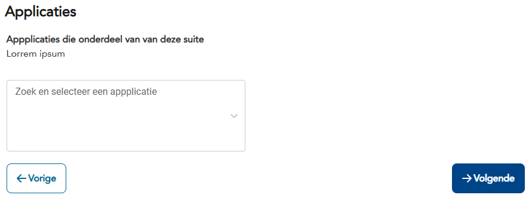

import ApiSchema from '@theme/ApiSchema';
import Tabs from '@theme/Tabs';
import TabItem from '@theme/TabItem';

# K006 - Suite

:::info Concept Status
**K006 - Suite** is een **concept** dat nog niet is geïmplementeerd in de GEMMA Softwarecatalogus. De wizard en functionaliteiten zijn in ontwikkeling.
:::

## Beschrijving
Een suite is een verzameling van modules (applicaties) die samen een product vormen. Dit is een eenvoudig beschrijvend object dat de relatie tussen gerelateerde applicaties vastlegt, zoals Microsoft Office (Word, Excel, PowerPoint) of Adobe Creative Suite.

## Schema Eigenschappen

<ApiSchema id="swc" example pointer="#/components/schemas/suite" />

### Basis Informatie
- **Naam**: Naam van de suite (verplicht)
- **Korte omschrijving**: Korte beschrijving van de suite (verplicht)
- **Uitgebreide omschrijving**: Uitgebreide beschrijving in markdown formaat
- **Logo**: URL naar het logo van de suite
- **Website**: Website van de suite

### Relaties
- **Contactpersoon**: Contactpersoon voor de suite
- **Applicaties**: De modules (applicaties) die onderdeel zijn van deze suite

## Voorbeelden van Suites

### 🏢 Kantoorsuites
- **Microsoft Office**: Word, Excel, PowerPoint, Outlook
- **Google Workspace**: Docs, Sheets, Slides, Gmail
- **LibreOffice**: Writer, Calc, Impress, Draw

### 🏛️ Gemeentelijke Suites
- **Centric Suite**: Burgerzaken, Vergunningen, Handhaving modules
- **Atos Suite**: Zaakgericht werken, DMS, Workflow modules
- **Roxit Suite**: Burgerzaken, Financiën, Personeelszaken modules

### 💼 ERP Suites
- **SAP ERP**: FI, CO, MM, SD, HR modules
- **Microsoft Dynamics 365**: Sales, Finance, Operations modules
- **Odoo**: CRM, Accounting, Inventory, Manufacturing modules

### ☁️ Cloud Suites
- **Salesforce Cloud**: Sales, Service, Marketing modules
- **Adobe Creative Cloud**: Photoshop, Illustrator, InDesign modules
- **Microsoft 365**: Office apps, Teams, SharePoint modules

## Gerelateerde Concepten
- [K001 - Organisatie](./K001-organisatie.md): Leveranciers en gebruikers van suites
- [K002 - Applicatie](./K002-applicatie.md): Individuele applicaties in een suite
- [K003 - Dienst](./K003-dienst.md): Diensten die door de suite worden aangeboden
- [K004 - Gebruik](./K004-gebruik.md): Hoe suites worden gebruikt
- [K005 - Koppeling](./K005-koppeling.md): Integraties tussen applicaties in een suite
- [K007 - Component](./K007-component.md): Onderdelen van applicaties in een suite

## Persona Perspectief

### 🏛️ Voor Gemeenten (Maria - ICT-coördinator)
- **Doel**: Overzicht van complete software pakketten
- **Gebruik**: Zoeken naar geïntegreerde oplossingen voor meerdere processen
- **Belang**: Kostenefficiëntie en consistente gebruikerservaring

### 🏢 Voor Leveranciers (Jan - Directeur ICT Solutions)
- **Doel**: Gerelateerde applicaties bundelen en promoten
- **Gebruik**: Suite samenstellen uit eigen applicatie portfolio
- **Belang**: Hogere verkoop waarde en klant binding

### 🏗️ Voor Architectuur Experts (Sarah - Enterprise Architect)
- **Doel**: Architectuur samenhang van gerelateerde applicaties beoordelen
- **Gebruik**: Suite compliance met GEMMA principes valideren
- **Belang**: Consistentie en interoperabiliteit binnen suites

## Gerelateerde Functionaliteiten
- [F004 - Applicatiebeheer](../Functionaliteiten/F004-applicatiebeheer.md)
- [F005 - Dienstenbeheer](../Functionaliteiten/F005-dienstenbeheer.md)
- [F013 - Gebruik Beheer](../Functionaliteiten/F013-gebruik-beheer.md)

## Suite Wizard

De Suite wizard begeleidt gebruikers door het proces van het registreren van een nieuwe suite in de GEMMA Softwarecatalogus.

```mermaid
sequenceDiagram
    participant U as Gebruiker
    participant W as Suite Wizard
    participant AS as Applicatie Service
    participant DB as Database
    participant AW as Applicatie Wizard

    Note over U,W: Suite Wizard - Gebruiker Flow

    %% Stap 1: Suite Informatie
    U->>W: Start suite wizard
    W-->>U: Stap 1 - Suite informatie formulier
    Note over U: Invoer: Naam, Korte omschrijving, Uitgebreide omschrijving, Website, Logo URL, Contactpersoon
    U->>W: Vul suite informatie in
    W->>W: Valideer suite informatie
    W->>W: Sla suite informatie op (tijdelijk)
    U->>W: Ga naar Stap 2

    %% Stap 2: Aanbieder Selectie
    W-->>U: Stap 2 - Aanbieder selectie
    Note over U: Invoer: Zoek bestaande aanbieder of 'Nieuwe aanbieder'
    
    alt Bestaande aanbieder selecteren
        U->>W: Selecteer bestaande aanbieder uit lijst
        W->>W: Valideer aanbieder
        W->>W: Sla aanbieder ID op (tijdelijk)
        U->>W: Ga naar Stap 3
    else Nieuwe aanbieder aanmaken
        U->>W: Klik 'Nieuwe aanbieder'
        W-->>U: Nieuwe aanbieder formulier
        Note over U: Invoer: Naam aanbieder + Website URL
        U->>W: Vul aanbieder gegevens in
        W->>W: Valideer aanbieder gegevens
        W->>W: Sla nieuwe aanbieder op (tijdelijk)
        U->>W: Ga naar Stap 3
    end

    %% Stap 3: Applicaties Toevoegen
    W-->>U: Stap 3 - Applicaties toevoegen
    Note over U: Invoer: Zoek applicatie → Selecteer → Toevoegen aan lijst (herhaal voor meerdere applicaties)
    
    loop Voor elke applicatie
        U->>W: Zoek applicatie
        U->>W: Selecteer applicatie uit zoekresultaten
        U->>W: Voeg toe aan lijst
        W-->>U: Applicatie toegevoegd aan lijst
    end
    
    alt Geen geschikte applicatie gevonden
        U->>W: Klik 'Applicatie niet gevonden'
        W->>AW: Redirect naar Applicatie wizard
        Note over U: Wizard wordt afgebroken - ga naar Applicatie wizard (gegevens worden NIET opgeslagen)
    else Applicaties toegevoegd
        U->>W: Ga naar Stap 4
    end

    %% Stap 4: Gedeelde Componenten
    W-->>U: Stap 4 - Gedeelde componenten
    Note over U: Invoer: Zoek component → Selecteer → Toevoegen aan lijst (optioneel)
    U->>W: Voeg gedeelde componenten toe (optioneel)
    W->>W: Sla gedeelde componenten op (tijdelijk)
    U->>W: Ga naar Stap 5

    %% Stap 5: Gedeelde Diensten
    W-->>U: Stap 5 - Gedeelde diensten
    Note over U: Invoer: Zoek dienst → Selecteer → Toevoegen aan lijst (optioneel)
    U->>W: Voeg gedeelde diensten toe (optioneel)
    W->>W: Sla gedeelde diensten op (tijdelijk)
    U->>W: Ga naar Stap 6

    %% Stap 6: Licentie en Kosten
    W-->>U: Stap 6 - Licentie en kosten
    Note over U: Invoer: Licentiemodel, Totale kosten, Licentievoorwaarden
    U->>W: Vul licentie en kosten informatie in
    W->>W: Sla licentie en kosten op (tijdelijk)
    U->>W: Ga naar Stap 7

    %% Stap 7: Documentatie
    W-->>U: Stap 7 - Documentatie
    Note over U: Invoer: Link naar overkoepelende documentatie, Gebruikershandleidingen
    U->>W: Voeg documentatie links toe (optioneel)
    W->>W: Sla documentatie op (tijdelijk)
    U->>W: Ga naar Stap 8

    %% Stap 8: Contactpersonen
    W-->>U: Stap 8 - Contactpersonen
    Note over U: Invoer: Primaire contactpersoon, Technische contactpersoon
    U->>W: Voeg contactpersonen toe (optioneel)
    W->>W: Sla contactpersonen op (tijdelijk)
    U->>W: Ga naar Stap 9

    %% Stap 9: Controleren
    W-->>U: Stap 9 - Overzicht en controle
    Note over U: Overzicht: Alle ingevoerde suite gegevens ter controle
    
    alt Gebruiker wil wijzigingen maken
        U->>W: Klik 'Vorige' naar specifieke stap
        Note over W: Navigeer terug naar gewenste stap
        W-->>U: Toon geselecteerde stap voor aanpassing
    else Gebruiker bevestigt
        U->>W: Klik 'Suite registreren'
        W->>AS: Stuur suite gegevens voor opslag
        AS->>DB: Sla suite op
        DB-->>AS: Suite opgeslagen
        AS-->>U: Bevestiging - Suite succesvol geregistreerd
        Note over U: Suite is opgeslagen en beschikbaar in catalogus
    end
```

<Tabs>
  <TabItem value="specificaties" label="Sequence Diagram" default>

  </TabItem>
  <TabItem value="stap0" label="Stap 0: Organisatie Selectie">
    <ul>
      <li>Organisatie Selectie (optioneel - alleen bij melden voor anderen)</li>
      <li>Wens: Na selecteren Organisatie tonen van applicaties van die organisatie zodert er minder doubleurs worden aangemaakt</li>
    </ul>
    
    <ul>
      <li>Organisatie opvoeren (optioneel - alleen ná klikken op "Ik kan de gewenste leverancier niet vinden")</li>
      <li>Wens: Organisatie formulier terugbrengen tot naam + website</li>
      <li>Wens: Organisatie naam controleren op doubleurs</li>
    </ul>
    
  </TabItem>
  <TabItem value="stap1" label="Stap 1: Suite Informatie">
    <ul>
      <li>Suite Informatie: Naam, korte en lange beschrijving, website, logo</li>
    </ul>
  </TabItem>
  <TabItem value="stap2" label="Stap 2: Aanbieder Selectie">
    <ul>
      <li>Aanbieder Selectie: Zoek bestaande aanbieder of maak nieuwe aanbieder aan</li>
    </ul>
  </TabItem>
  <TabItem value="stap3" label="Stap 3: Applicaties Toevoegen">
    <ul>
      <li>Applicaties Toevoegen: Zoek en voeg individuele applicaties toe aan de suite</li>
    </ul>
   
  </TabItem>
  <TabItem value="stap4" label="Stap 4: Gedeelde Componenten">
    <ul>
      <li>Gedeelde Componenten: Voeg herbruikbare componenten toe (optioneel)</li>
    </ul>
  </TabItem>
  <TabItem value="stap5" label="Stap 5: Gedeelde Diensten">
    <ul>
      <li>Gedeelde Diensten: Voeg gedeelde diensten toe (optioneel)</li>
    </ul>
  </TabItem>
  <TabItem value="stap6" label="Stap 6: Licentie en Kosten">
    <ul>
      <li>Licentie en Kosten: Definieer licentiemodel en totale kosten</li>
    </ul>
  </TabItem>
  <TabItem value="stap7" label="Stap 7: Documentatie">
    <ul>
      <li>Documentatie: Voeg links toe naar overkoepelende documentatie (optioneel)</li>
    </ul>
  </TabItem>
  <TabItem value="stap8" label="Stap 8: Contactpersonen">
    <ul>
      <li>Contactpersonen: Voeg primaire en technische contactpersonen toe (optioneel)</li>
    </ul>
  </TabItem>
  <TabItem value="stap9" label="Stap 9: Controleren">
    <ul>
      <li>Controleren: Overzicht en bevestiging van alle suite gegevens</li>
    </ul>
  </TabItem>
</Tabs>
