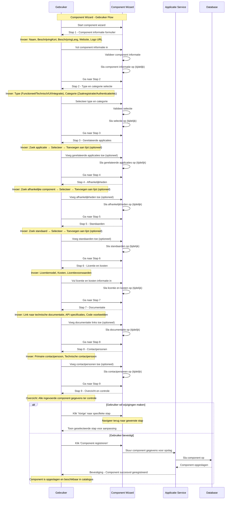

import ApiSchema from '@theme/ApiSchema';
import Tabs from '@theme/Tabs';
import TabItem from '@theme/TabItem';

# K007 - Component  (Niet geimplementeerd concept)

## Beschrijving
Een component is een specifiek onderdeel of module van een applicatie dat een bepaalde functionaliteit biedt. Componenten kunnen herbruikbaar zijn tussen verschillende applicaties en vormen de bouwstenen van complexe software systemen. Ze kunnen variëren van kleine utility functies tot grote functionele modules. Voorbeelden hiervan lopen van een zaakregistratie component tot een specifieke library.

## Schema Eigenschappen

<ApiSchema id="swc" example pointer="#/components/schemas/component" />

## Relaties

### Onderdeel van
- **Applicaties**: Componenten maken deel uit van applicaties
- **Suites**: Gedeelde componenten binnen een suite
- **Andere componenten**: Hiërarchische relaties tussen componenten
- **Diensten**: Componenten implementeren specifieke diensten

### Gebruik
- **Gebruikt door**: Applicaties en andere componenten
- **Geïntegreerd in**: Software systemen
- **Afhankelijk van**: Andere componenten of libraries
- **Levert functionaliteit aan**: Hoger gelegen applicaties

### Standaarden
- **Voldoet aan**: Technische standaarden en protocollen
- **Implementeert**: Interface specificaties
- **Ondersteunt**: Data uitwisseling standaarden
- **Gecertificeerd voor**: Compliance vereisten

## Component Types

### ⚙️ Functionele Componenten
Componenten die specifieke bedrijfsfunctionaliteit leveren.

**Kenmerken:**
- Encapsuleert bedrijfslogica
- Herbruikbaar in verschillende contexten
- Duidelijk gedefinieerde interfaces
- Onafhankelijk van specifieke applicaties
- Testbaar en onderhoudbaar

**Voorbeelden:**
- Zaakregistratie component
- Document management component
- Authenticatie component
- Notificatie component

### 🛠️ Technische Componenten
Componenten die technische functionaliteit leveren, vaak generiek.

**Kenmerken:**
- Database connectiviteit
- Logging en monitoring
- Caching mechanismen
- Message queuing
- Security utilities

**Voorbeelden:**
- Database connector
- Logging framework
- Cache manager
- Message broker client

### 🧩 UI Componenten
Herbruikbare componenten voor de gebruikersinterface.

**Kenmerken:**
- Visuele elementen
- Interactieve controls
- Consistent design
- Responsief gedrag
- Toegankelijkheidsondersteuning

**Voorbeelden:**
- Datumkiezer component
- Tabel component
- Formulier veld component
- Navigatiebalk component

### 🔗 Integratie Componenten
Componenten die zorgen voor integratie met externe systemen.

**Kenmerken:**
- API clients
- Data transformatie
- Protocol adapters
- Error handling voor externe communicatie
- Retry mechanismen

**Voorbeelden:**
- Digikoppeling adapter
- REST API client
- SOAP webservice connector
- Bestandsuitwisseling handler

## Component Lifecycle

### 📋 Design en Specificatie
- **Behoefteanalyse**: Identificatie van herbruikbare functionaliteit
- **Component design**: Ontwerp van interfaces en interne structuur
- **API specificatie**: Gedetailleerde beschrijving van de API
- **Testplan**: Definitie van testscenario's

### 🛠️ Ontwikkeling en Testen
- **Implementatie**: Codering van de component
- **Unit testen**: Testen van individuele functies
- **Integratie testen**: Testen van de interactie met andere componenten
- **Documentatie**: Technische documentatie en code voorbeelden

### 📦 Publicatie en Distributie
- **Versiebeheer**: Beheer van component versies
- **Pakketbeheer**: Publicatie naar een component repository
- **Distributie**: Beschikbaar stellen aan andere teams/applicaties
- **Ondersteuning**: Documentatie en support voor gebruikers

### 🔄 Gebruik en Onderhoud
- **Integratie**: Gebruik in applicaties
- **Monitoring**: Bewaking van performance en stabiliteit
- **Bug fixing**: Oplossen van problemen
- **Updates**: Nieuwe versies en verbeteringen

### 📈 Evolutie
- **Feature toevoeging**: Uitbreiding van functionaliteit
- **Refactoring**: Verbetering van interne structuur
- **Technologische updates**: Aanpassing aan nieuwe technologieën
- **Prestatie optimalisatie**: Verbetering van snelheid en efficiëntie

### 🔚 Uitfasering
- **Deprecation**: Aankondiging van uitfasering
- **Migratie**: Ondersteuning bij overgang naar alternatieven
- **Archivering**: Opslag van oude versies
- **Verwijdering**: Definitieve verwijdering uit repository

## Gerelateerde Concepten
- [K002 - Applicatie](./K002-applicatie.md): Applicaties die componenten gebruiken
- [K003 - Dienst](./K003-dienst.md): Diensten die door componenten worden geleverd
- [K004 - Gebruik](./K004-gebruik.md): Gebruik van componenten in applicaties
- [K005 - Koppeling](./K005-koppeling.md): Koppelingen die componenten implementeren
- [K006 - Suite](./K006-suite.md): Suites die componenten delen

## Gerelateerde Functionaliteiten
- [F004 - Applicatiebeheer](../Functionaliteiten/F004-applicatiebeheer.md)
- [F005 - Dienstenbeheer](../Functionaliteiten/F005-dienstenbeheer.md)
- [F008 - Externe Koppelingen](../Functionaliteiten/F008-externe-koppelingen.md)

## Component Wizard

De Component wizard begeleidt gebruikers door het proces van het registreren van een nieuwe component in de GEMMA Softwarecatalogus.

<Tabs>
  <TabItem value="specificaties" label="Sequence Diagram" default>

  </TabItem>
  <TabItem value="stap1" label="Stap 1: Component Informatie">
    <ul>
      <li>Component Informatie: Naam, korte en lange beschrijving, website, logo</li>
    </ul>
  </TabItem>
  <TabItem value="stap2" label="Stap 2: Type en Categorie">
    <ul>
      <li>Type en Categorie: Selecteer type (Functioneel/Technisch/UI/Integratie) en categorie</li>
    </ul>
  </TabItem>
  <TabItem value="stap3" label="Stap 3: Gerelateerde Applicaties">
    <ul>
      <li>Gerelateerde Applicaties: Voeg applicaties toe waar de component deel van uitmaakt (optioneel)</li>
    </ul>
  </TabItem>
  <TabItem value="stap4" label="Stap 4: Afhankelijkheden">
    <ul>
      <li>Afhankelijkheden: Voeg afhankelijke componenten of libraries toe (optioneel)</li>
    </ul>
  </TabItem>
  <TabItem value="stap5" label="Stap 5: Standaarden">
    <ul>
      <li>Standaarden: Voeg standaarden toe waaraan de component voldoet (optioneel)</li>
    </ul>
  </TabItem>
  <TabItem value="stap6" label="Stap 6: Licentie en Kosten">
    <ul>
      <li>Licentie en Kosten: Definieer licentiemodel en kosten</li>
    </ul>
  </TabItem>
  <TabItem value="stap7" label="Stap 7: Documentatie">
    <ul>
      <li>Documentatie: Voeg links toe naar technische documentatie (optioneel)</li>
    </ul>
  </TabItem>
  <TabItem value="stap8" label="Stap 8: Contactpersonen">
    <ul>
      <li>Contactpersonen: Voeg primaire en technische contactpersonen toe (optioneel)</li>
    </ul>
  </TabItem>
  <TabItem value="stap9" label="Stap 9: Controleren">
    <ul>
      <li>Controleren: Overzicht en bevestiging van alle component gegevens</li>
    </ul>
  </TabItem>
</Tabs>
