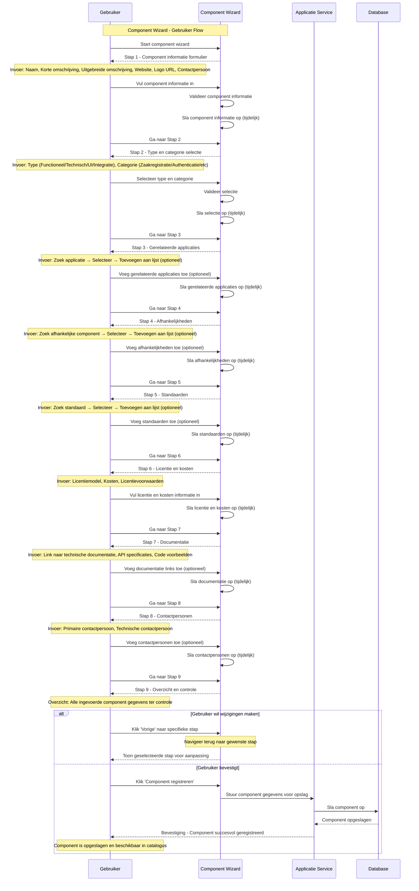

import ApiSchema from '@theme/ApiSchema';
import Tabs from '@theme/Tabs';
import TabItem from '@theme/TabItem';

# K007 - Component

:::info Concept Status
**K007 - Component** is een **concept** dat nog niet is geïmplementeerd in de GEMMA Softwarecatalogus. De wizard en functionaliteiten zijn in ontwikkeling.
:::

## Beschrijving
Een component is een logische groepering van modules (applicaties). Dit is een eenvoudig beschrijvend object dat de relatie tussen gerelateerde applicaties vastlegt, zoals een zaakregistratie component dat verschillende zaak-gerelateerde modules groepeert.

## Schema Eigenschappen

<ApiSchema id="swc" example pointer="#/components/schemas/component" />

### Basis Informatie
- **Naam**: Naam van het component (verplicht)
- **Korte omschrijving**: Korte beschrijving van het component (verplicht)
- **Uitgebreide omschrijving**: Uitgebreide beschrijving in markdown formaat
- **Logo**: URL naar het logo van het component
- **Website**: Website van het component

### Relaties
- **Contactpersoon**: Contactpersoon voor het component
- **Modules**: De modules (applicaties) die onderdeel zijn van dit component

## Voorbeelden van Componenten

### 🏛️ Gemeentelijke Componenten
- **Zaakregistratie Component**: Zaaksysteem, Workflow module, Document module
- **Burgerzaken Component**: BRP module, Paspoort module, Uittreksel module
- **Vergunningen Component**: Aanvraag module, Toetsing module, Verlening module

### 💼 Bedrijfsprocessen Componenten
- **HR Component**: Personeelssysteem, Salarisverwerking, Verlof module
- **Financiën Component**: Boekhouding, Facturering, Rapportage module
- **CRM Component**: Klantbeheer, Contacthistorie, Marketing module

### 🔧 Technische Componenten
- **Authenticatie Component**: Login module, SSO module, Rechten module
- **Document Component**: DMS, Archivering, Zoek module
- **Integratie Component**: API gateway, Message broker, ETL module

## Gerelateerde Concepten
- [K002 - Applicatie](./K002-applicatie.md): Applicaties die componenten gebruiken
- [K003 - Dienst](./K003-dienst.md): Diensten die door componenten worden geleverd
- [K004 - Gebruik](./K004-gebruik.md): Gebruik van componenten in applicaties
- [K005 - Koppeling](./K005-koppeling.md): Koppelingen die componenten implementeren
- [K006 - Suite](./K006-suite.md): Suites die componenten delen

## Persona Perspectief

### 🏛️ Voor Gemeenten (Maria - ICT-coördinator)
- **Doel**: Overzicht van functionele groeperingen van applicaties
- **Gebruik**: Zoeken naar applicaties per functiegebied (bijv. zaakregistratie)
- **Belang**: Functionele dekking en proces ondersteuning

### 🏢 Voor Leveranciers (Jan - Directeur ICT Solutions)
- **Doel**: Applicaties groeperen per functiegebied
- **Gebruik**: Component portfolio opbouwen voor betere positionering
- **Belang**: Markt segmentatie en specialisatie tonen

### 🏗️ Voor Architectuur Experts (Sarah - Enterprise Architect)
- **Doel**: Functionele architectuur en component samenhang beoordelen
- **Gebruik**: Component compliance met GEMMA referentie architectuur
- **Belang**: Functionele consistentie en herbruikbaarheid

## Gerelateerde Functionaliteiten
- [F004 - Applicatiebeheer](../Functionaliteiten/F004-applicatiebeheer.md)
- [F005 - Dienstenbeheer](../Functionaliteiten/F005-dienstenbeheer.md)
- [F008 - Externe Koppelingen](../Functionaliteiten/F008-externe-koppelingen.md)

## Component Wizard

De Component wizard begeleidt gebruikers door het proces van het registreren van een nieuwe component in de GEMMA Softwarecatalogus.

<Tabs>
  <TabItem value="specificaties" label="Sequence Diagram" default>

  </TabItem>
  <TabItem value="stap0" label="Stap 0: Organisatie Selectie">
    <ul>
      <li>Organisatie Selectie (optioneel - alleen bij melden voor anderen)</li>
      <li>Wens: Na selecteren Organisatie tonen van applicaties van die organisatie zodert er minder doubleurs worden aangemaakt</li>
    </ul>
    
    <ul>
      <li>Organisatie opvoeren (optioneel - alleen ná klikken op "Ik kan de gewenste leverancier niet vinden")</li>
      <li>Wens: Organisatie formulier terugbrengen tot naam + website</li>
      <li>Wens: Organisatie naam controleren op doubleurs</li>
    </ul>
    
  </TabItem>
  <TabItem value="stap1" label="Stap 1: Component Informatie">
    <ul>
      <li>Component Informatie: Naam, korte en lange beschrijving, website, logo</li>
    </ul>
  </TabItem>
  <TabItem value="stap2" label="Stap 2: Type en Categorie">
    <ul>
      <li>Type en Categorie: Selecteer type (Functioneel/Technisch/UI/Integratie) en categorie</li>
    </ul>
  </TabItem>
  <TabItem value="stap3" label="Stap 3: Gerelateerde Applicaties">
    <ul>
      <li>Gerelateerde Applicaties: Voeg applicaties toe waar de component deel van uitmaakt (optioneel)</li>
    </ul>
  </TabItem>
  <TabItem value="stap4" label="Stap 4: Afhankelijkheden">
    <ul>
      <li>Afhankelijkheden: Voeg afhankelijke componenten of libraries toe (optioneel)</li>
    </ul>
  </TabItem>
  <TabItem value="stap5" label="Stap 5: Standaarden">
    <ul>
      <li>Standaarden: Voeg standaarden toe waaraan de component voldoet (optioneel)</li>
    </ul>
  </TabItem>
  <TabItem value="stap6" label="Stap 6: Licentie en Kosten">
    <ul>
      <li>Licentie en Kosten: Definieer licentiemodel en kosten</li>
    </ul>
  </TabItem>
  <TabItem value="stap7" label="Stap 7: Documentatie">
    <ul>
      <li>Documentatie: Voeg links toe naar technische documentatie (optioneel)</li>
    </ul>
  </TabItem>
  <TabItem value="stap8" label="Stap 8: Contactpersonen">
    <ul>
      <li>Contactpersonen: Voeg primaire en technische contactpersonen toe (optioneel)</li>
    </ul>
  </TabItem>
  <TabItem value="stap9" label="Stap 9: Controleren">
    <ul>
      <li>Controleren: Overzicht en bevestiging van alle component gegevens</li>
    </ul>
  </TabItem>
</Tabs>
