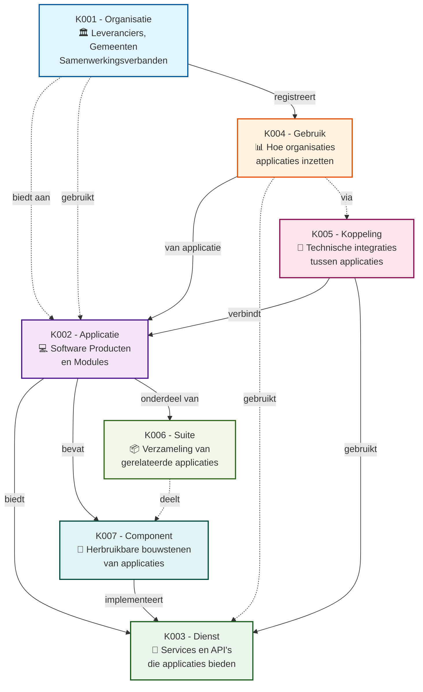

# Kern Concepten Overzicht

De GEMMA Softwarecatalogus is gebaseerd op **7 kern concepten** die samen het complete ecosysteem van gemeentelijke software beschrijven. Elk concept heeft zijn eigen specifieke rol en relaties met andere concepten.

## Concepten Relatie Diagram

## Concepten Overzicht

| Concept | Beschrijving | Primaire Functie | Status |
|---------|--------------|------------------|--------|
| **[K001 - Organisatie](./K001-organisatie.md)** | Leveranciers, gemeenten en samenwerkingsverbanden | Basis voor alle andere concepten | ✅ Geïmplementeerd |
| **[K002 - Applicatie](./K002-applicatie.md)** | Software producten en modules | Centrale software catalogus | ✅ Geïmplementeerd |
| **[K003 - Dienst](./K003-dienst.md)** | Services die leveranciers aanbieden op applicaties | Ondersteuning en service verlening | ✅ Geïmplementeerd |
| **[K004 - Gebruik](./K004-gebruik.md)** | Hoe organisaties applicaties gebruiken | Implementatie en adoptie | ✅ Geïmplementeerd |
| **[K005 - Koppeling](./K005-koppeling.md)** | Integraties tussen applicaties | Technische koppelingen | ✅ Geïmplementeerd |
| **[K006 - Suite](./K006-suite.md)** | Verzameling van gerelateerde applicaties | Geïntegreerde pakketten | 🚧 **Concept** |
| **[K007 - Component](./K007-component.md)** | Herbruikbare onderdelen van applicaties | Modulaire architectuur | 🚧 **Concept** |

:::warning Concept Status
**K006 - Suite** en **K007 - Component** zijn conceptuele uitbreidingen die nog niet volledig zijn geïmplementeerd in de GEMMA Softwarecatalogus. De wizards en functionaliteiten zijn in ontwikkeling.
:::

## Relatie Types

### 🔗 Directe Relaties (doorgetrokken lijnen)
- **Organisatie → Applicatie**: Organisaties bieden applicaties aan of gebruiken ze
- **Applicatie → Dienst**: Leveranciers bieden diensten aan op applicaties
- **Applicatie → Component**: Applicaties bevatten componenten
- **Applicatie → Suite**: Applicaties kunnen onderdeel zijn van suites
- **Gebruik → Applicatie**: Gebruik beschrijft hoe een applicatie wordt ingezet
- **Koppeling → Applicatie**: Koppelingen verbinden applicaties
- **Component → Dienst**: Componenten implementeren diensten

### ⚡ Indirecte Relaties (stippellijnen)
- **Suite ↔ Component**: Suites kunnen componenten delen
- **Gebruik ↔ Dienst**: Gebruik kan specifieke diensten betreffen
- **Gebruik ↔ Koppeling**: Gebruik kan koppelingen bevatten
- **Koppeling ↔ Dienst**: Koppelingen gebruiken diensten

## Wizard Flow Overzicht

Alle concepten hebben hun eigen wizard voor registratie:

### 🎯 Primaire Wizards (Standalone)
- **K001 - Organisatie**: Volledig zelfstandige wizard
- **K002 - Applicatie**: Meest uitgebreide wizard (7-8 stappen)

### 🔄 Afhankelijke Wizards (Vereisen Applicatie)
- **K003 - Dienst**: Start met applicatie selectie
- **K004 - Gebruik**: Start met applicatie selectie  
- **K005 - Koppeling**: Start met twee applicatie selecties

### 📦 Compositie Wizards (Verzamelen) - 🚧 In Ontwikkeling
- **K006 - Suite**: Verzamelt meerdere applicaties *(concept)*
- **K007 - Component**: Kan aan meerdere applicaties gekoppeld worden *(concept)*

## Navigatie

Gebruik de sidebar om naar specifieke concepten te navigeren, of klik op de links in de tabel hierboven voor gedetailleerde informatie over elk concept, inclusief hun wizard sequence diagrammen.
