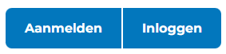
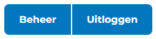
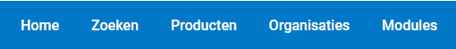
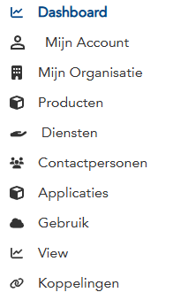

# F000 - Navigatie en Menustructuur

## Beschrijving
Deze functionaliteit beschrijft hoe gebruikers kunnen navigeren door de GEMMA Softwarecatalogus en welke menustructuren beschikbaar zijn voor verschillende gebruikerstypen.

## Toepasselijk voor
- 🏛️ **Gemeenten**: Navigeren door gemeente-specifieke functies
- 🤝 **Samenwerkingen & Communities**: Toegang tot samenwerking-specifieke menu's
- 🏢 **Leveranciers**: Navigeren door leverancier-specifieke functies
- ⚙️ **Functioneel Beheer**: Toegang tot alle beheerfuncties
- 👁️ **Bezoekers**: Beperkte navigatie voor publieke informatie

## Menustructuur Overzicht

De GEMMA Softwarecatalogus heeft drie verschillende menu's die elk een specifieke functie hebben:

### 1. 👤 Gebruikersmenu (Rechtsboven)


**Voor niet-ingelogde gebruikers:**
```
👤 Gebruiker
├── 🔑 Aanmelden
└── 📝 Inloggen
```

**Voor ingelogde gebruikers:**
```
👤 Gebruiker
├── ⚙️ Beheer
└── 🚪 Uitloggen
```

### 2. 🧭 Hoofdmenu (Hoofdnavigatie)

Dit menu is zichtbaar voor alle bezoekers (ingelogd en niet-ingelogd):

```
🏠 Home
├── 📊 Overzicht softwarecatalogus
├── 📈 Statistieken
└── 🎯 Introductie

🔍 Zoeken
├── 🔎 Geavanceerd zoeken
├── 📊 Filters en sortering
├── 💡 Zoeksuggesties
└── 📋 Zoekresultaten

💻 Producten
├── 🔍 → Doorverwijzing naar Zoeken
├── 🏷️ → Filter: "Producten" actief
└── 📱 Overzicht van alle software

🏢 Organisaties  
├── 🔍 → Doorverwijzing naar Zoeken
├── 🏷️ → Filter: "Organisaties" actief
└── 🏛️ Overzicht van gemeenten en leveranciers

🧩 Modules
├── 🔍 → Doorverwijzing naar Zoeken
├── 🏷️ → Filter: "Modules" actief
└── 🔧 Overzicht van software modules
```

### 3. ⚙️ Beheermenu (Alleen op beheerpagina)



Dit menu is alleen zichtbaar voor ingelogde gebruikers op de beheerpagina:

```
📊 Dashboard
├── 📈 Persoonlijk overzicht
├── 🔔 Meldingen
├── 📋 Recente activiteiten
└── 🎯 Snelkoppelingen

👤 Mijn Account
├── ⚙️ Profiel instellingen
├── 🔑 Wachtwoord wijzigen
├── 📧 E-mail voorkeuren
└── 🔐 Beveiliging

🏢 Mijn Organisatie
├── ⚙️ Organisatie-instellingen
├── 📞 Contactgegevens
├── 🤝 Lidmaatschappen
└── 🏆 Certificeringen

💻 Producten
├── 📱 Mijn Applicaties
├── ➕ Nieuwe Applicatie
├── ✏️ Bewerken
└── 📊 Statistieken

🛠️ Diensten
├── 🔧 Mijn Diensten
├── ➕ Nieuwe Dienst
├── 💰 Prijsmodellen
└── 📋 Service Level Agreements

👥 Contactpersonen
├── 📋 Contactenlijst
├── ➕ Contact Toevoegen
├── 👥 Teams
└── 📞 Communicatie

📱 Applicaties
├── 🔍 Applicatie Zoeken
├── 📊 Gebruik Overzicht
├── ⭐ Beoordelingen
└── 🔗 Koppelingen

💼 Gebruik
├── 📊 Mijn Applicatielandschap
├── ➕ Gebruik Registreren
├── 📋 Contracten
└── 📈 Gebruik Statistieken

🗺️ Kaarten
├── 🏛️ Gemeente Kaart
├── 🏢 Leverancier Kaart
├── 📊 Gebruik Visualisatie
└── 🔗 Koppelingen Diagram

📚 Documentatie
├── 📖 Gebruikershandleidingen
├── 🎯 Klantreizen
├── ⚙️ Functionaliteiten
├── 🔧 API Documentatie
└── ❓ Veelgestelde Vragen
```

## Toegang per Gebruikersrol

### 🧭 Hoofdmenu Toegang
Het **Hoofdmenu** (Home, Zoeken, Producten, Organisaties, Modules) is voor **alle bezoekers** toegankelijk, zowel ingelogd als niet-ingelogd.

### ⚙️ Beheermenu Toegang
Het **Beheermenu** is alleen zichtbaar voor **ingelogde gebruikers** en de beschikbare functionaliteiten verschillen per rol:

### 🏛️ Gemeenten
- **Dashboard**: Applicatielandschap overzicht, meldingen over software updates
- **Mijn Account**: Profiel en voorkeuren beheren
- **Mijn Organisatie**: Gemeente gegevens en lidmaatschappen
- **Producten**: Alleen bekijken van software aanbod (geen bewerken)
- **Diensten**: Zoeken en beoordelen van leveranciers
- **Contactpersonen**: Eigen contacten beheren
- **Applicaties**: Software zoeken en vergelijken
- **Gebruik**: Volledig beheer van eigen applicatielandschap
- **Kaarten**: Visualisatie van eigen applicatielandschap
- **Documentatie**: Toegang tot alle documentatie

### 🏢 Leveranciers
- **Dashboard**: Verkoop overzicht, interesse tracking, klant activiteit
- **Mijn Account**: Profiel en bedrijfsgegevens
- **Mijn Organisatie**: Bedrijfsprofiel en certificeringen
- **Producten**: Volledig beheer van eigen software portfolio
- **Diensten**: Beheer van eigen diensten en partnerships
- **Contactpersonen**: Klanten en partners beheren
- **Applicaties**: Marktoverzicht en concurrentie analyse
- **Gebruik**: Gebruik voorstellen voor eigen software, klantoverzicht
- **Kaarten**: Visualisatie van klanten en marktpenetratie
- **Documentatie**: Toegang tot alle documentatie

### 🤝 Samenwerkingen & Communities
- **Dashboard**: Leden overzicht, activiteit tracking, doelstellingen
- **Mijn Account**: Profiel van de samenwerking/community
- **Mijn Organisatie**: Missie, visie en statuten
- **Producten**: Gezamenlijke software (alleen samenwerkingen)
- **Diensten**: Collectieve inkoop, leverancier relaties
- **Contactpersonen**: Leden en partners beheren
- **Applicaties**: Software voor leden zoeken
- **Gebruik**: Gebruik registreren voor leden, gezamenlijke contracten
- **Kaarten**: Visualisatie van leden en hun software gebruik
- **Documentatie**: Toegang tot alle documentatie

### ⚙️ Functioneel Beheer
- **Volledige Toegang**: Tot alle menu-items en functionaliteiten
- **Extra Functies**: Gebruikersbeheer, content moderatie, systeem configuratie
- **Monitoring**: Gebruik statistieken, performance metrics, audit trails
- **Onderhoud**: Data backup, cleanup, incident management

### 👁️ VNG-raadpleger
- **Beperkte Toegang**: Alleen lezen van geanonimiseerde data
- **Dashboard**: Algemene statistieken en trends
- **Rapportages**: Toegang tot algemene rapporten
- **Geen Bewerking**: Kan geen data wijzigen of toevoegen

### 🌐 Bezoekers (niet ingelogd)
- **Alleen Hoofdmenu**: Home, Zoeken, Producten, Organisaties, Modules
- **Geen Beheermenu**: Geen toegang tot persoonlijke of beheer functionaliteiten
- **Publieke Informatie**: Alleen basis software en organisatie informatie

## Gebruikershandleidingen

### 👤 Gebruikersmenu Navigatie

Het **Gebruikersmenu** (rechtsboven) biedt:
- **Voor bezoekers**: Directe toegang tot aanmelden en inloggen
- **Voor ingelogde gebruikers**: Snelle toegang tot beheeromgeving en uitloggen
- **Altijd zichtbaar**: Op elke pagina beschikbaar
- **Eenvoudige toegang**: Minimale klikken naar belangrijke functies

### 🧭 Hoofdmenu Gebruik

Het **Hoofdmenu** (hoofdnavigatie) bevat:
- **🏠 Home**: Startpagina met overzicht en introductie
- **🔍 Zoeken**: Centrale zoekfunctionaliteit met filters
- **💻 Producten**: Snelkoppeling naar software overzicht (via zoeken)
- **🏢 Organisaties**: Snelkoppeling naar organisatie overzicht (via zoeken)  
- **🧩 Modules**: Snelkoppeling naar modules overzicht (via zoeken)
- **Publiek toegankelijk**: Voor alle bezoekers beschikbaar
- **Consistent**: Zelfde menu op alle publieke pagina's

### ⚙️ Beheermenu Navigatie

Het **Beheermenu** (alleen op beheerpagina) biedt:
- **📊 Dashboard**: Persoonlijk overzicht en snelkoppelingen
- **👤 Mijn Account**: Profiel en account instellingen
- **🏢 Mijn Organisatie**: Organisatie gegevens en instellingen
- **Functionaliteit menu's**: Producten, Diensten, Contactpersonen, etc.
- **📚 Documentatie**: Toegang tot alle hulpbronnen
- **Rolgebaseerd**: Inhoud aangepast aan gebruikersrol

### Contextmenu's

**Rechtsklik menu's** bieden snelle acties:
- **Bewerken**: Direct bewerken van items
- **Delen**: Content delen met anderen
- **Exporteren**: Data export opties
- **Verwijderen**: Items verwijderen (waar toegestaan)

### Zoeken en Filteren

**Zoekfunctionaliteit** is beschikbaar via:
- **Globale Zoekbalk**: Zoeken door alle content
- **Sectie Filters**: Filteren binnen specifieke secties
- **Geavanceerd Zoeken**: Complexe zoekopdrachten
- **Opgeslagen Zoekopdrachten**: Herbruikbare filters

### Documentatie Menu

Het **📚 Documentatie** menu biedt toegang tot alle hulpbronnen:

#### 📖 Gebruikershandleidingen
- **Stap-voor-stap instructies** voor alle functionaliteiten
- **Screenshots en voorbeelden** van werkelijke gebruik
- **Veelvoorkomende scenario's** en oplossingen
- **Best practices** voor optimaal gebruik

#### 🎯 Klantreizen
- **Gemeente Klantreis**: Hoe gemeenten de catalogus gebruiken
- **Leverancier Klantreis**: Van registratie tot klantwerving
- **Samenwerking Klantreis**: Collectieve inkoop en beheer
- **Functioneel Beheer**: Beheer en onderhoud van het platform

#### ⚙️ Functionaliteiten
- **Functionaliteiten Overzicht**: Alle beschikbare functies
- **Gedetailleerde Beschrijvingen**: Per functionaliteit uitgelegd
- **Autorisatie Matrices**: Wie heeft toegang tot wat
- **Processtappen**: Hoe elke functionaliteit werkt

#### 🔧 Technische Documentatie
- **API Documentatie**: Voor ontwikkelaars en integraties
- **Data Modellen**: Structuur van de gegevens
- **Export Formaten**: AMEFF, CSV en andere formaten
- **Technische Specificaties**: Systeemvereisten en architectuur

#### ❓ Veelgestelde Vragen
- **Algemene Vragen**: Over het gebruik van de catalogus
- **Technische Vragen**: Over integraties en export
- **Account Vragen**: Over toegang en gebruikersbeheer
- **Troubleshooting**: Oplossingen voor veelvoorkomende problemen

### Responsive Design

De interface past zich aan verschillende schermformaten aan:
- **Desktop**: Volledig menu zichtbaar
- **Tablet**: Inklapbaar zijmenu
- **Mobiel**: Hamburger menu
- **Touch Optimized**: Grote knoppen voor touch screens

## Toegankelijkheid

### Keyboard Navigatie
- **Tab**: Navigeren tussen elementen
- **Enter/Space**: Activeren van knoppen
- **Escape**: Sluiten van dialogen
- **Arrow Keys**: Navigeren in menu's

### Screen Reader Support
- **Alt Text**: Beschrijvingen voor afbeeldingen
- **ARIA Labels**: Toegankelijke labels
- **Heading Structure**: Logische heading hiërarchie
- **Focus Indicators**: Duidelijke focus states

## Formulieren vs Wizards

De GEMMA Softwarecatalogus gebruikt twee verschillende typen formulieren, afhankelijk van de complexiteit van de taak:

### 🔧 Simpele Formulieren
**Wanneer gebruiken**: Voor eenvoudige taken met weinig velden of stappen.

**Kenmerken**:
- Alle velden op één pagina
- Directe opslag na 'Opslaan'
- Overzichtelijk en snel in te vullen
- Meestal voor wijzigingen of eenvoudige toevoegingen

**Voorbeelden in de catalogus**:
- Contactgegevens wijzigen
- Organisatie-informatie bijwerken
- Gebruiker uitnodigen
- Wachtwoord wijzigen
- Eenvoudige zoekfilters instellen

### 🧙‍♂️ Wizards (Stap-voor-stap formulieren)
**Wanneer gebruiken**: Voor complexe processen die begeleiding nodig hebben.

**Kenmerken**:
- Meerdere stappen/pagina's
- Voortgangsindicator bovenaan
- 'Volgende' en 'Vorige' knoppen
- Validatie per stap
- Overzicht aan het eind voor bevestiging

**Wizards in de catalogus**:

#### Voor Leveranciers 🏢
- **Aanmaken nieuw product**: Stap-voor-stap proces voor het toevoegen van software
  - Stap 1: Basisinformatie (naam, beschrijving, categorie)
  - Stap 2: Technische specificaties (GEMMA componenten, hosting)
  - Stap 3: Documentatie en media (screenshots, handleidingen)
  - Stap 4: Prijsmodel en licenties
  - Stap 5: Overzicht en publiceren

- **Melden missend gebruik**: Leverancier meldt dat gemeente hun software gebruikt
  - Stap 1: Gemeente selecteren
  - Stap 2: Product/dienst specificeren
  - Stap 3: Gebruiksdetails (sinds wanneer, welke modules)
  - Stap 4: Contactpersoon bij gemeente
  - Stap 5: Bevestiging en verzenden

- **Aanmaken dienst**: Nieuwe dienst toevoegen bij bestaande software
  - Stap 1: Dienst type kiezen (hosting, support, implementatie)
  - Stap 2: Dienst details en beschrijving
  - Stap 3: Prijsmodel en voorwaarden
  - Stap 4: Beschikbaarheid en regio's
  - Stap 5: Overzicht en activeren

#### Voor Gemeenten 🏛️
- **Melden missend product**: Gemeente meldt software die niet in catalogus staat
  - Stap 1: Software identificeren (naam, leverancier)
  - Stap 2: Gebruiksdetails (welke afdeling, sinds wanneer)
  - Stap 3: Functionaliteit beschrijven
  - Stap 4: Contactgegevens leverancier (indien bekend)
  - Stap 5: Aanvullende informatie en verzenden

- **Aanmaken gebruik**: Gemeente registreert gebruik van bestaande software
  - Stap 1: Software selecteren uit catalogus
  - Stap 2: Gebruiksdetails (afdeling, aantal gebruikers)
  - Stap 3: Implementatie informatie (go-live datum, versie)
  - Stap 4: Tevredenheid en beoordeling
  - Stap 5: Bevestiging en opslaan

- **Registreren koppeling**: Gemeente registreert koppeling tussen systemen
  - Stap 1: Bronsysteem selecteren
  - Stap 2: Doelsysteem selecteren  
  - Stap 3: Koppeling type en richting
  - Stap 4: Technische details (API, bestandsuitwisseling)
  - Stap 5: Validatie en opslaan

### 💡 Tips voor Gebruikers

#### Bij Wizards:
- **Sla tussentijds op**: Gebruik 'Concept opslaan' om je voortgang te bewaren
- **Voortgangsbalk**: Zie hoeveel stappen er nog komen
- **Validatie**: Rode velden moeten ingevuld worden voor je verder kunt
- **Overzicht**: Controleer alles in de laatste stap voor je bevestigt
- **Terug navigeren**: Je kunt altijd terug naar vorige stappen

#### Bij Simpele Formulieren:
- **Verplichte velden**: Zijn gemarkeerd met een * (asterisk)
- **Directe feedback**: Foutmeldingen verschijnen direct bij invoer
- **Annuleren**: Wijzigingen gaan verloren als je annuleert zonder opslaan

### 🎯 Wanneer Welk Type?

| Criteria | Simpel Formulier | Wizard |
|----------|------------------|--------|
| **Aantal velden** | < 10 velden | > 10 velden |
| **Complexiteit** | Eenvoudig | Complex proces |
| **Begeleiding nodig** | Nee | Ja |
| **Meerdere categorieën** | Nee | Ja |
| **Validatie tussen stappen** | Nee | Ja |
| **Concepten opslaan** | Niet nodig | Gewenst |

## Autorisatie Matrix

| Functionaliteit | Aanbod-beheerder | Gebruik-beheerder | Gebruik-raadpleger | Functioneel beheerder | VNG-raadpleger | Bezoeker |
|------------------|------------------|-------------------|--------------------|-----------------------|----------------|----------|
| **Dashboard toegang** | ✅ (leverancier) | ✅ (gemeente) | ✅ (gemeente) | ✅ (volledig) | ✅ (beperkt) | ❌ |
| **Organisatie menu** | ✅ (eigen org) | ✅ (eigen org) | 👁️ (eigen org) | ✅ (alle org) | 👁️ (alle org) | ❌ |
| **Aanbod beheer menu** | ✅ (eigen aanbod) | ❌ | ❌ | ✅ (alle aanbod) | 👁️ (alle aanbod) | ❌ |
| **Gebruik beheer menu** | ❌ | ✅ (eigen gebruik) | 👁️ (eigen gebruik) | ✅ (alle gebruik) | 👁️ (alle gebruik) | ❌ |
| **Systeem beheer menu** | ❌ | ❌ | ❌ | ✅ (volledig) | ❌ | ❌ |
| **Publieke zoekfunctie** | ✅ | ✅ | ✅ | ✅ | ✅ | ✅ |

## Vervolgfunctionaliteiten
- [F001 - Toegang Verkrijgen](./F001-toegang-verkrijgen.md)
- [F002 - Organisatie Inrichten](./F002-organisatie-inrichten.md)
- [F009 - Beheer en Configuratie](./F009-beheer-en-configuratie.md)
