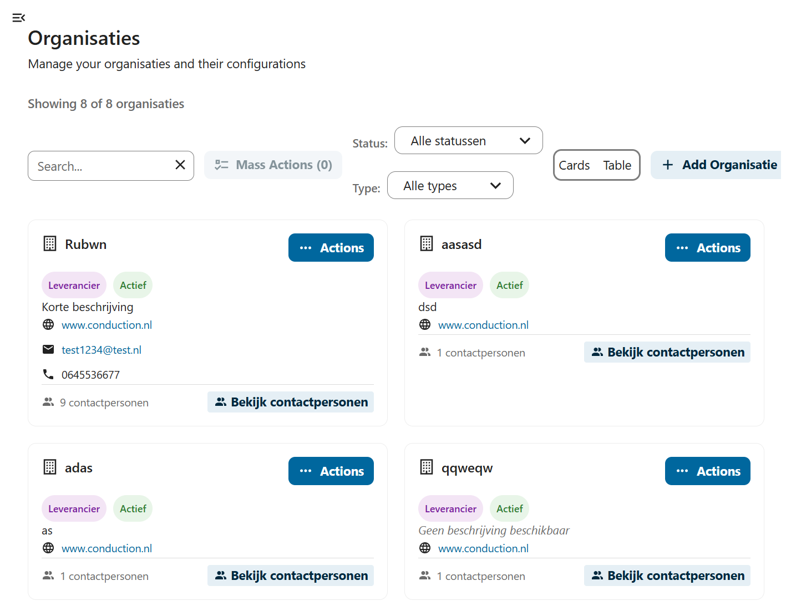
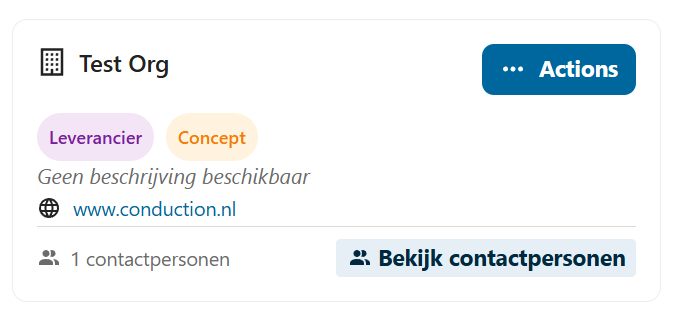
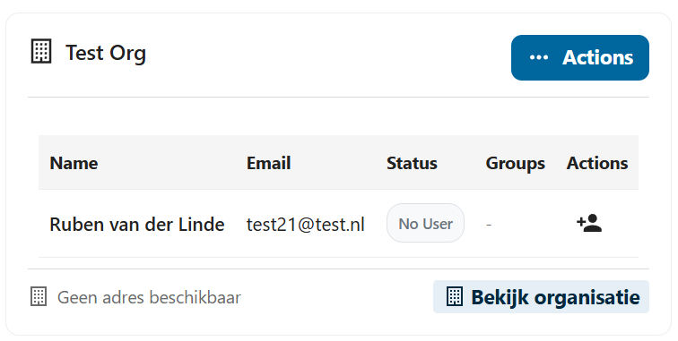
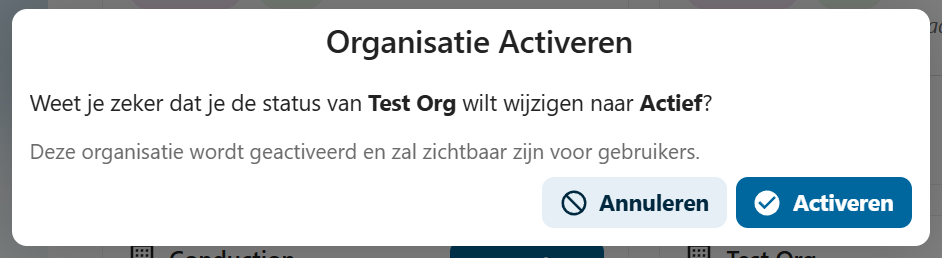
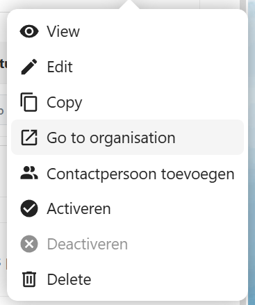

# F002 - Organisatie Inrichten

## Beschrijving
Deze functionaliteit beschrijft hoe organisaties hun profiel en informatie kunnen inrichten in de GEMMA Softwarecatalogus.

## Toepasselijk voor
- 🏛️ **Gemeenten**: Organisatie-informatie bijwerken, deelname aan samenwerkingen
- 🤝 **Samenwerkingen & Communities**: Profiel inrichten, leden werven
- 🏢 **Leveranciers**: Bedrijfsprofiel opzetten, collega's uitnodigen
- ⚙️ **Functioneel Beheer**: Organisaties beheren en goedkeuren

## Processtappen

### Voor Gemeenten
| Stap | Actie | Beschrijving |
|------|-------|--------------|
| 2.1 | Organisatie-informatie opvoeren | Organisatiegegevens bijwerken |
| 2.2 | Toevoegen aan samenwerking | Organisatie toevoegen aan een samenwerking |
| 2.3 | Verwijderen van samenwerking | Organisatie verwijderen uit een samenwerking |

### Voor Samenwerkingen & Communities
| Stap | Actie | Beschrijving |
|------|-------|--------------|
| 2.1 | Potentiële leden benaderen | Samenwerking benadert gemeenten en leveranciers |
| 2.2 | Lidmaatschap aangeven | Gemeenten/leveranciers geven via hun beheerders aan lid te zijn |
| 2.3 | Lidmaatschap bevestigen | Samenwerking bevestigt het lidmaatschap |

### Voor Leveranciers
| Stap | Actie | Beschrijving |
|------|-------|--------------|
| 2.1 | Collega's aanmaken | Andere gebruikers uitnodigen voor toegang tot de organisatie |
| 2.2 | Organisatie-informatie opvoeren | Naam, contactgegevens, certificeringen, et cetera invullen |
| 2.3 | Logo en certificeringen toevoegen | Visuele identiteit en kwaliteitskeurmerken uploaden |

### Voor Functioneel Beheer
| Stap | Actie | Beschrijving |
|------|-------|--------------|
| 2.1 | Beoordeel aangemelde organisaties | Beoordeel nieuw aangemelde leveranciers |
| 2.2 | Voeg samenwerking toe | Voeg een samenwerking, aanbieder of bijzondere gemeente toe |
| 2.3 | Verwijder organisatie uit samenwerking | Verwijder de organisatie uit een bestaande samenwerking |

## Gerelateerde Issues
- [#73](https://github.com/VNG-Realisatie/Softwarecatalogus/issues/73) - Collega's uitnodigen
- [#66](https://github.com/VNG-Realisatie/Softwarecatalogus/issues/66) - Organisatie-informatie
- [#140](https://github.com/VNG-Realisatie/Softwarecatalogus/issues/140) - Organisaties beoordelen
- [#142](https://github.com/VNG-Realisatie/Softwarecatalogus/issues/142) - Samenwerking toevoegen
- [#143](https://github.com/VNG-Realisatie/Softwarecatalogus/issues/143) - Bijzondere organisatie

## Gebruikershandleidingen

### Organisaties Beheren

Op de organisatiepagina vindt u alle in de softwarecatalogus actieve organisaties. Tip: Boven aan de pagina kunt u filteren en zoeken, bijvoorbeeld op de status concept.

Op de organisatiecard vindt u de kerngegevens van de organisatie.

Door op 'bekijk contactpersonen' te drukken kunt u contactpersonen en gebruikers inzien.

### Organisaties Activeren

Activeren kan even duren omdat het systeem verschillende controles uitvoert en de organisatie volledig inricht voor gebruik.

:::note Activatieproces
Tijdens het activeren worden alle benodigde configuraties en rechten ingesteld. Dit proces kan enkele minuten duren.
:::

### Organisatie Menu

Vanuit het organisatie menu heeft u toegang tot alle beheerfuncties:

Hier kunt u:
- Organisatiegegevens bewerken
- Contactpersonen beheren
- Gebruikers en groepen beheren
- Organisatie activeren/deactiveren
- Organisatie verwijderen (indien toegestaan)

## Autorisatie Matrix

| Functionaliteit | Aanbod-beheerder | Gebruik-beheerder | Gebruik-raadpleger | Functioneel beheerder | VNG-raadpleger | Bezoeker |
|------------------|------------------|-------------------|--------------------|-----------------------|----------------|----------|
| **Beheren organisaties** | ✅ (eigen organisatie) | ✅ (eigen organisatie) | ❌ | ✅ (alles) | ❌ | ❌ |
| **Registreren extra organisatie informatie** | ✅ (eigen organisatie) | ✅ (eigen organisatie) | ❌ | ✅ (alles) | ❌ | ❌ |
| **Ontsluiten organisaties** | ✅ (eigen organisatie) | ✅ (eigen organisatie) | ❌ | ✅ (alles) | ❌ | ❌ |

### Detailering
- [Organisatie Beheer View](https://vng-realisatie.github.io/Softwarecatalogus-Archi-repository/id-5af2e6f1-0ffa-403a-b8e5-1bf6153acfe1/views/id-2b4dbac4101a40d2ba58276e47a276ea.html)

## Vervolgfunctionaliteiten
- [F003 - Gebruikersbeheer](./F003-gebruikersbeheer.md)
- [F004 - Applicatiebeheer](./F004-applicatiebeheer.md)
