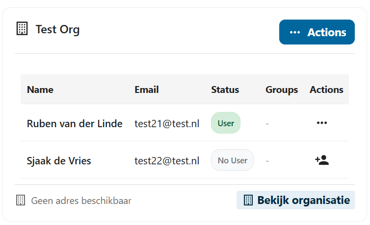
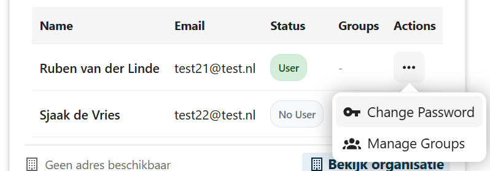
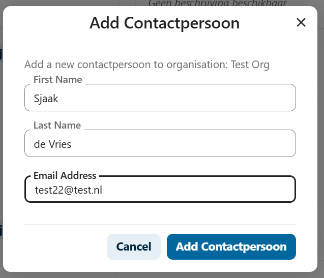
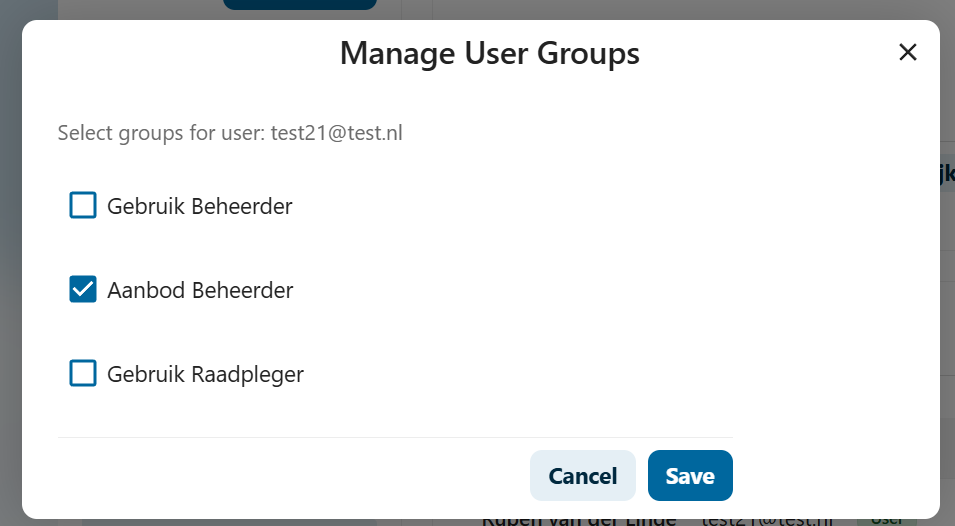
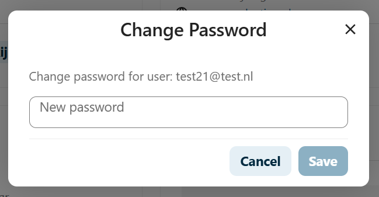
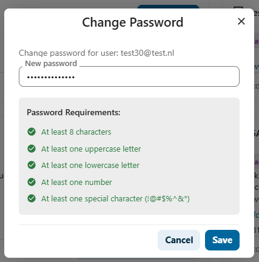

# F003 - Gebruikersbeheer

## Beschrijving
Deze functionaliteit beschrijft hoe gebruikers kunnen worden beheerd binnen organisaties in de GEMMA Softwarecatalogus.

## Toepasselijk voor
- 🏛️ **Gemeenten**: Collega's uitnodigen en accounts beheren
- 🤝 **Samenwerkingen & Communities**: Niet van toepassing (geen eigen gebruikers)
- 🏢 **Leveranciers**: Team uitbreiden en rollen toewijzen
- ⚙️ **Functioneel Beheer**: Gebruikers toevoegen aan organisaties

## Processtappen

### Voor Gemeenten
| Stap | Actie | Beschrijving |
|------|-------|--------------|
| 3.1 | Overzicht gebruikers | Bekijk het overzicht van gebruikers binnen de organisatie |
| 3.2 | Nieuwe gebruiker toevoegen | Voeg een nieuwe gebruiker toe |
| 3.3 | E-mail met inloggegevens | Automatische e-mail met inloggegevens wordt verstuurd |
| 3.4 | Account activeren | Activeer het account en stel wachtwoord in bij eerste inlog |

### Voor Leveranciers
| Stap | Actie | Beschrijving |
|------|-------|--------------|
| 3.1 | Collega's uitnodigen | Team uitbreiden met nieuwe gebruikers |
| 3.2 | Rollen toewijzen | Verschillende toegangsrechten per gebruiker |
| 3.3 | Account activatie | Nieuwe gebruikers activeren hun account |

### Voor Functioneel Beheer
| Stap | Actie | Beschrijving |
|------|-------|--------------|
| 3.1 | Voeg gebruikers toe | Voeg gebruikers toe aan gemeenten, leveranciers of samenwerkingen |
| 3.2 | Raadpleeg gebruikersoverzicht | Raadpleeg en beheer gebruikers per organisatie |
| 3.3 | Wachtwoorden beheren | Wijzigen van gebruikers wachtwoorden |
| 3.4 | Rechten wijzigen | Wijzigen van gebruikers rechten |

## Gerelateerde Issues
- [#60](https://github.com/VNG-Realisatie/Softwarecatalogus/issues/60) - Nieuwe gebruiker toevoegen
- [#63](https://github.com/VNG-Realisatie/Softwarecatalogus/issues/63) - Gebruiker toevoegen
- [#64](https://github.com/VNG-Realisatie/Softwarecatalogus/issues/64) - Gebruikers beheren
- [#65](https://github.com/VNG-Realisatie/Softwarecatalogus/issues/65) - Account activatie
- [#62](https://github.com/VNG-Realisatie/Softwarecatalogus/issues/62) - Gebruikersoverzicht

## Gebruikershandleidingen

### Wachtwoord Beheer voor Beheerders

Als organisatie beheerder kunt u wachtwoorden van gebruikers in uw organisatie beheren:

#### Wachtwoord Resetten
1. **Ga naar gebruikersbeheer** in uw organisatie dashboard
2. **Selecteer de gebruiker** wiens wachtwoord gereset moet worden
3. **Klik op "Wachtwoord resetten"**
4. **De gebruiker ontvangt een e-mail** met reset instructies
5. **Gebruiker kan nieuw wachtwoord instellen** via de link in de e-mail

#### Nieuwe Gebruiker Uitnodigen
1. **Ga naar gebruikersbeheer**
2. **Klik op "Nieuwe gebruiker toevoegen"**
3. **Vul gebruikersgegevens in**:
   - Naam
   - E-mailadres
   - Rol binnen organisatie
4. **Verstuur uitnodiging**
5. **Gebruiker ontvangt e-mail** met activatie link
6. **Gebruiker activeert account** en stelt wachtwoord in

#### Account Activatie Problemen
Als een gebruiker problemen heeft met account activatie:
1. **Controleer spam/junk folder** voor activatie e-mail
2. **Vraag nieuwe activatie e-mail aan** via gebruikersbeheer
3. **Neem contact op met functioneel beheerder** als problemen aanhouden

:::warning Beveiliging
Deel nooit wachtwoorden via onveilige kanalen. Gebruik altijd de officiële reset functionaliteit.
:::

### Contactpersonen Beheren

U vindt gebruikers door op het label 'gebruikers' te drukken in de organisatiecard.

#### Gebruikers Overzicht

In het gebruikersoverzicht ziet u alle gebruikers van uw organisatie:

Hier kunt u:
- Nieuwe contactpersonen toevoegen
- Bestaande gebruikers bewerken
- Wachtwoorden resetten
- Gebruikersgroepen beheren
- Gebruikers activeren/deactiveren

#### Contactpersoon Toevoegen

Om een nieuwe contactpersoon toe te voegen:

1. **Klik op 'Contactpersoon toevoegen'**
2. **Vul de gegevens in**:
   - Voornaam
   - Achternaam
   - E-mailadres
3. **Klik op 'Add Contactpersoon'**
4. **De gebruiker ontvangt een uitnodiging** via e-mail

#### Gebruikersgroepen Beheren

Voor het toewijzen van rollen en rechten:

Beschikbare groepen:
- **Gebruik Beheerder**: Kan organisatie en gebruikers beheren
- **Aanbod Beheerder**: Kan applicaties en diensten beheren  
- **Gebruik Raadpleger**: Kan alleen informatie bekijken

#### Wachtwoord Beheren

Voor wachtwoordbeheer van gebruikers:

1. **Selecteer de gebruiker**
2. **Klik op 'Change Password'**
3. **Voer het nieuwe wachtwoord in** (of laat het systeem er een genereren)
4. **Klik op 'Save'**
5. **Deel het nieuwe wachtwoord veilig** met de gebruiker

## Autorisatie Matrix

| Functionaliteit | Aanbod-beheerder | Gebruik-beheerder | Gebruik-raadpleger | Functioneel beheerder | VNG-raadpleger | Bezoeker |
|------------------|------------------|-------------------|--------------------|-----------------------|----------------|----------|
| **Beheren gebruikers en rollen** | ✅ (eigen organisatie) | ✅ (eigen organisatie) | ❌ | ✅ (alles) | ❌ | ❌ |

### Detailering
- [Toegangsbeveiliging View](https://vng-realisatie.github.io/Softwarecatalogus-Archi-repository/id-5af2e6f1-0ffa-403a-b8e5-1bf6153acfe1/views/id-555385bb67ab4f2681ba9d174051fd30.html)

## Vervolgfunctionaliteiten
- [F004 - Applicatiebeheer](./F004-applicatiebeheer.md)
- [F005 - Dienstenbeheer](./F005-dienstenbeheer.md)
