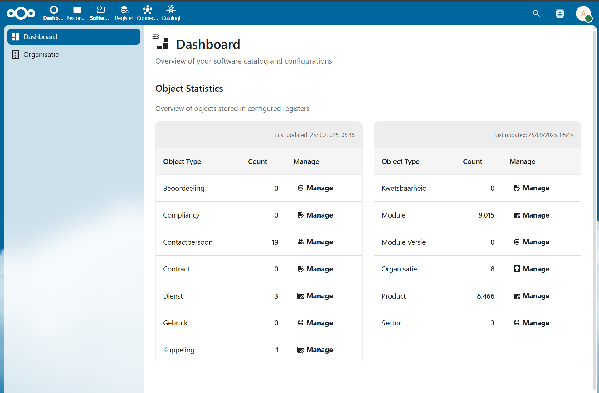
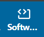
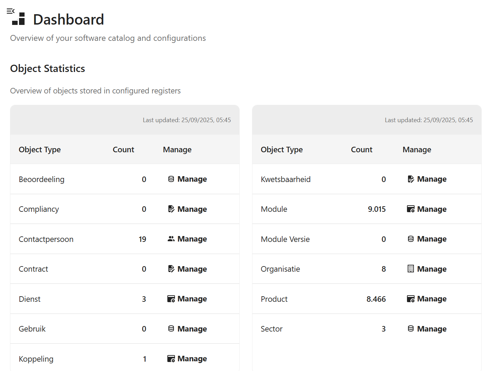
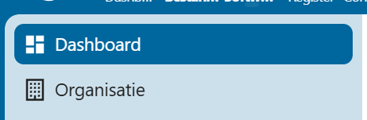

# F009 - Beheer en Configuratie

## Beschrijving
Deze functionaliteit beschrijft het beheer van systeem configuratie en content. Dit is exclusief voor functioneel beheerders.

## Toepasselijk voor
- 🏛️ **Gemeenten**: ❌ Geen toegang
- 🤝 **Samenwerkingen & Communities**: ❌ Geen toegang
- 🏢 **Leveranciers**: ❌ Geen toegang
- ⚙️ **Functioneel Beheer**: ✅ Volledige toegang

## Processtappen

### Voor Functioneel Beheer
| Stap | Actie | Beschrijving |
|------|-------|--------------|
| 9.1 | Beheren configuratie | Systeem instellingen en parameters beheren |
| 9.2 | Beheren content | Website content, menu's en teksten beheren |
| 9.3 | Systeem monitoring | Prestaties en beschikbaarheid monitoren |
| 9.4 | Backup beheer | Data backup en recovery procedures |

## Gebruikershandleidingen

### Toegang tot het Beheerssysteem

Het functioneel beheer van de softwarecatalogus vindt plaats via de softwarecatalogus NextCloud app. Als functioneel beheerder heeft u toegang tot alle beheerfuncties.

#### Waar vind ik de app?

De app bevindt zich in de NextCloud omgeving onder het softwarecatalogus icoon. Na op het icoon te hebben geklikt wordt je doorverwezen naar het dashboard.

Op het dashboard vind je een kort overzicht van de huidige inhoud van de softwarecatalogus.

Links van het dashboard vind je het menu dat verwijst naar de individuele beheerpagina's.

### AMEFF-Bestand Importeren

:::caution Alleen voor catalogusbeheerders
Deze functionaliteit is uitsluitend bedoeld voor beheerders van catalogi en is niet toegankelijk voor functioneel beheerders van organisaties binnen een catalogus.
:::

#### Inleiding

AMEFF-bestanden (Archimate Model Exchange File Format) zijn architecturele bestanden die de basis vormen voor een catalogus. Deze bestanden bevatten modelelementen, relaties en diagrammen die geïmporteerd kunnen worden in de applicatie.

Het doel van AMEFF-imports is het inladen van de architecturele basis van een catalogus. Dit is een beheertaak die alleen uitgevoerd kan worden door catalogusbeheerders met de juiste rechten.

#### Stappen voor het importeren van een AMEFF-bestand

##### 1. Inloggen op het platform

1. Open de applicatie in uw webbrowser
2. Klik op de inlogknop rechtsboven in het scherm
3. Voer uw inloggegevens in
4. U wordt doorgestuurd naar uw dashboard

##### 2. Navigeren naar AMEFF importeren

1. Zoek in het dashboard naar de knop 'AMEFF importeren'
2. Klik op deze knop om het importeervenster te openen

##### 3. Invoeren van de benodigde URL's

In het importvenster moet u twee URL's opgeven:

1. **URL Gemma**: Dit is de URL naar de detailpagina's van Gemma Online
   - Bijvoorbeeld: 'https://www.gemmaonline.nl/index.php?title=...'
   - Deze URL wordt gebruikt in de views om door te verwijzen naar externe bronnen met gedetailleerde informatie

2. **URL naar Archimate(XML)**:
   - Dit moet een URL zijn naar een AMEFF-bestand dat beschikbaar is op een weblocatie
   - Bijvoorbeeld: 'https://raw.githubusercontent.com/VNG-Realisatie/...'

:::note
Op dit moment kunnen alleen AMEFF-bestanden uit de VNG-catalogus worden geïmporteerd. De applicatie ondersteunt nog geen uploads van lokale bestanden.
:::

##### 4. Starten van de import

Nadat u beide URL's heeft ingevoerd:

1. Klik op de blauwe knop 'Gemma inlezen'
2. Het systeem start het importeren van het AMEFF-bestand

##### 5. Voortgang van de import

Na het starten van de import verschijnt een nieuw scherm dat de voortgang toont:

- De applicatie toont welke onderdelen worden geïmporteerd:
  - Relations (relaties)
  - Model (modelstructuur)
  - Views (diagrammen)
  - Elements (objecten)
- Een vinkje geeft aan welke onderdelen succesvol zijn geïmporteerd

#### Resultaten en logging

De gebruikersinterface voor gedetailleerde resultaten is momenteel in ontwikkeling. Om toch inzicht te krijgen in de resultaten kunt u de browser-inspector gebruiken:

1. Open de developer tools in uw browser (meestal F12 of rechtermuisknop → Inspecteren)
2. Navigeer naar het tabblad 'Network' of 'Netwerk'
3. Zoek naar API-requests gerelateerd aan de import
4. Bekijk de response van deze requests

In de API-resultaten vindt u een log met de volgende informatie:
- Aantal objecten gevonden
- Aantal objecten aangemaakt
- Aantal objecten bijgewerkt
- Aantal objecten verwijderd
- Het log-ID van de synchronisatie-acties

#### Rollbacks en ongedaan maken van imports

Als er problemen zijn met een import, kan deze ongedaan gemaakt worden:

- Volledige rollbacks van een synchronisatie kunnen via de backend worden uitgevoerd
- Rollbacks van individuele objecten zijn ook mogelijk via de backend

:::note
Deze rollback-functionaliteit is alleen beschikbaar voor beheerders met toegang tot de backend.
:::

## Autorisatie Matrix

| Functionaliteit | Aanbod-beheerder | Gebruik-beheerder | Gebruik-raadpleger | Functioneel beheerder | VNG-raadpleger | Bezoeker |
|------------------|------------------|-------------------|--------------------|-----------------------|----------------|----------|
| **Beheren configuratie** | ❌ | ❌ | ❌ | ✅ (alles) | ❌ | ❌ |
| **Beheren content** | ❌ | ❌ | ❌ | ✅ (alles) | ❌ | ❌ |

### Detailering
- [Beheren content en configuratie View](https://vng-realisatie.github.io/Softwarecatalogus-Archi-repository/id-5af2e6f1-0ffa-403a-b8e5-1bf6153acfe1/views/id-efbe3b80784843b5814e636ab35ada49.html)

## Gerelateerde Issues
Deze functionaliteit heeft geen directe GitHub issues omdat het systeem beheer betreft.

## Vervolgfunctionaliteiten
- Deze functionaliteit ondersteunt alle andere functionaliteiten
