import ApiSchema from '@theme/ApiSchema';
import Tabs from '@theme/Tabs';
import TabItem from '@theme/TabItem';

# K001 - Organisatie

## Beschrijving
Organisaties zijn de verschillende partijen die betrokken zijn bij de softwarecatalogus. Dit kunnen leveranciers, gemeenten, samenwerkingsverbanden of andere overheidsorganisaties zijn. Organisaties vormen de basis voor alle andere concepten in de catalogus.

## Kenmerken

<ApiSchema id="swc" example pointer="#/components/schemas/organisatie" />

## Relaties

### Heeft
- **Applicaties**: Software die de organisatie aanbiedt
- **Diensten**: Services die worden geleverd
- **Gebruikers**: Medewerkers met toegang tot de catalogus
- **Contactpersonen**: Aangewezen vertegenwoordigers

### Gebruikt
- **Applicaties**: Software van andere organisaties
- **Diensten**: Services van andere leveranciers
- **Standaarden**: Gehanteerde normen en protocollen

### Participatie
- **Lid van**: Samenwerkingsverbanden en communities
- **Partner van**: Andere organisaties in samenwerkingen
- **Leverancier voor**: Organisaties die hun software gebruiken

## Organisatie Types

### 🏢 Leveranciers
Commerciële bedrijven die software ontwikkelen en aanbieden aan overheidsorganisaties.

**Kenmerken:**
- Eigen software portfolio
- Commerciële doelstellingen
- Klantrelaties met gemeenten
- Ondersteuning en service verlening

### 🏛️ Gemeenten
Lokale overheidsorganisaties die software gebruiken voor hun dienstverlening.

**Kenmerken:**
- Applicatielandschap beheer
- Publieke dienstverlening
- Compliance met overheidsstandaarden
- Samenwerking met andere gemeenten

### 🤝 Samenwerkingsverbanden
Organisaties die meerdere gemeenten vertegenwoordigen of ondersteunen.

**Kenmerken:**
- Collectieve inkoop
- Gedeelde software oplossingen
- Kennisdeling en best practices
- Schaalvoordelen voor leden

### ⚙️ Overheidsorganisaties
Provincies, ministeries en andere overheidsinstanties.

**Kenmerken:**
- Specifieke overheidssoftware
- Regelgeving en compliance
- Interoperabiliteit vereisten
- Publieke verantwoording

## Contactpersonen 

<ApiSchema id="swc" example pointer="#/components/schemas/contactpersoon" />

## Autorisatie en Toegang

### Organisatie Rollen
- **Eigenaar**: Volledige controle over organisatie gegevens
- **Beheerder**: Kan gebruikers en applicaties beheren
- **Medewerker**: Kan organisatie gegevens bekijken en beperkt bewerken
- **Gast**: Alleen lees toegang tot publieke informatie

### Toegangsrechten
| Functionaliteit | Eigenaar | Beheerder | Medewerker | Gast |
|------------------|----------|-----------|------------|------|
| **Organisatie gegevens wijzigen** | ✅ | ✅ | ❌ | ❌ |
| **Gebruikers beheren** | ✅ | ✅ | ❌ | ❌ |
| **Applicaties toevoegen** | ✅ | ✅ | ✅ | ❌ |
| **Gegevens bekijken** | ✅ | ✅ | ✅ | ✅ (publiek) |
| **Rapportages genereren** | ✅ | ✅ | ✅ | ❌ |

## Gerelateerde Functionaliteiten
- [F002 - Organisatie Inrichten](./F002-organisatie-inrichten.md)
- [F003 - Gebruikersbeheer](./F003-gebruikersbeheer.md)
- [F010 - Lidmaatschapsbeheer](./F010-lidmaatschapsbeheer.md)

## Organisatie Wizard

De Organisatie wizard begeleidt gebruikers door het proces van het registreren van een nieuwe organisatie in de GEMMA Softwarecatalogus.

### Wizard Stappen

1. **Organisatie Type**: Selecteer type organisatie (Leverancier, Gemeente, Samenwerking, Overheid)
2. **Basisgegevens**: Naam, beschrijving, website, logo
3. **Contactgegevens**: Adres, telefoon, e-mail
4. **Juridische Informatie**: KvK, BTW, rechtsvorm (indien van toepassing)
5. **Contactpersonen**: Primaire en secundaire contacten aanwijzen
6. **Verificatie**: Documenten uploaden voor verificatie
7. **Controleren**: Overzicht en bevestiging van alle gegevens

### Sequence Diagram

```mermaid
sequenceDiagram
    participant U as Gebruiker
    participant W as Wizard Controller
    participant OS as Organisatie Service
    participant VS as Verificatie Service
    participant CS as Contact Service
    participant DB as Database

    Note over U,DB: Organisatie Wizard - Nieuwe Organisatie Registreren

    %% Stap 1: Organisatie Type
    U->>W: Start organisatie wizard
    W-->>U: Toon organisatie type selectie
    Note over U: Leverancier, Gemeente, Samenwerking, Overheid
    U->>W: Selecteer organisatie type
    W->>OS: Valideer organisatie type
    OS-->>W: Type gevalideerd
    U->>W: Volgende stap

    %% Stap 2: Basisgegevens
    W-->>U: Toon basisgegevens formulier
    Note over U: Naam, beschrijving, website, logo upload
    U->>W: Vul basisgegevens in
    W->>OS: Valideer organisatie naam (uniciteit)
    OS->>DB: Check naam beschikbaarheid
    DB-->>OS: Naam beschikbaar/bezet
    OS-->>W: Validatie resultaat
    
    alt Naam al in gebruik
        W-->>U: Toon foutmelding - naam al in gebruik
        U->>W: Pas naam aan
    else Naam beschikbaar
        U->>W: Volgende stap
    end

    %% Stap 3: Contactgegevens
    W-->>U: Toon contactgegevens formulier
    Note over U: Adres, telefoon, e-mail, vestigingsland
    U->>W: Vul contactgegevens in
    W->>OS: Valideer contactgegevens
    OS-->>W: Contactgegevens gevalideerd
    U->>W: Volgende stap

    %% Stap 4: Juridische Informatie (Conditioneel)
    alt Organisatie type vereist juridische info
        W-->>U: Toon juridische informatie formulier
        Note over U: KvK nummer, BTW nummer, rechtsvorm
        U->>W: Vul juridische gegevens in
        W->>VS: Valideer KvK nummer (indien ingevuld)
        VS->>DB: Check KvK in externe database
        DB-->>VS: KvK validatie resultaat
        VS-->>W: Juridische gegevens gevalideerd
        U->>W: Volgende stap
    else Geen juridische info vereist
        Note over W: Sla juridische stap over
    end

    %% Stap 5: Contactpersonen
    W-->>U: Toon contactpersonen formulier
    Note over U: Primaire contactpersoon, secundaire contacten
    U->>W: Voeg contactpersonen toe
    W->>CS: Valideer contactpersoon gegevens
    CS-->>W: Contactpersonen gevalideerd
    U->>W: Volgende stap

    %% Stap 6: Verificatie
    W-->>U: Toon verificatie formulier
    Note over U: Upload documenten, verificatie methode
    U->>W: Upload verificatie documenten
    W->>VS: Verwerk verificatie documenten
    VS->>DB: Sla documenten op
    DB-->>VS: Documenten opgeslagen
    VS-->>W: Verificatie gestart
    U->>W: Volgende stap

    %% Stap 7: Controleren
    W->>OS: Verzamel alle organisatie gegevens
    W->>CS: Verzamel contactpersoon gegevens
    W->>VS: Verzamel verificatie status
    
    par Parallel data ophalen
        OS-->>W: Organisatie overzicht
    and
        CS-->>W: Contactpersonen overzicht
    and
        VS-->>W: Verificatie overzicht
    end
    
    W-->>U: Toon samengevoegd overzicht
    Note over U: Alle informatie voor finale controle
    
    alt Gebruiker bevestigt
        U->>W: Organisatie registreren (bevestigen)
        
        %% Opslaan in database
        par Parallel opslaan
            W->>OS: Sla organisatie op
            OS->>DB: Insert organisatie
        and
            W->>CS: Sla contactpersonen op
            CS->>DB: Insert contactpersonen
        and
            W->>VS: Start verificatie proces
            VS->>DB: Update verificatie status
        end
        
        par Database responses
            DB-->>OS: Organisatie opgeslagen
        and
            DB-->>CS: Contactpersonen opgeslagen
        and
            DB-->>VS: Verificatie gestart
        end
        
        W-->>U: Bevestiging - Organisatie succesvol geregistreerd
        Note over U: Verificatie proces is gestart, wacht op goedkeuring
        
    else Gebruiker gaat terug
        U->>W: Vorige stap
        Note over W: Navigeer terug naar gewenste stap voor aanpassingen
    end

    %% Verificatie Proces (Asynchroon)
    Note over VS,DB: Verificatie proces loopt asynchroon
    VS->>VS: Controleer documenten
    VS->>DB: Update verificatie status
    
    alt Verificatie succesvol
        VS->>OS: Activeer organisatie
        OS->>DB: Update organisatie status naar 'Actief'
        OS->>U: Stuur bevestiging e-mail
    else Verificatie mislukt
        VS->>OS: Markeer als 'Verificatie vereist'
        OS->>U: Stuur e-mail met aanvullende vereisten
    end
```

## Verificatie Proces

### Automatische Verificatie
- **KvK validatie**: Automatische controle bij Nederlandse Kamer van Koophandel
- **E-mail verificatie**: Bevestiging van e-mailadres
- **Website controle**: Validatie van website URL

### Handmatige Verificatie
- **Document controle**: Handmatige review van geüploade documenten
- **Telefonische verificatie**: Bevestiging via telefoon (indien nodig)
- **Referentie controle**: Controle van referenties en bestaande relaties

### Verificatie Status
- **Niet geverifieerd**: Nieuwe organisatie, nog niet gecontroleerd
- **In behandeling**: Verificatie proces is gestart
- **Geverifieerd**: Organisatie is goedgekeurd en actief
- **Afgewezen**: Verificatie mislukt, aanvullende informatie vereist
- **Geschorst**: Tijdelijk gedeactiveerd

## Implementatie Overwegingen

### Data Validatie
- **Uniciteit**: Organisatie namen moeten uniek zijn binnen type
- **Formaat controle**: E-mail, telefoon, website URL validatie
- **Verplichte velden**: Afhankelijk van organisatie type
- **Internationale ondersteuning**: Verschillende adres formaten

### Beveiliging
- **Toegangscontrole**: Rol-gebaseerde autorisatie
- **Data encryptie**: Gevoelige gegevens versleuteld opslaan
- **Audit trail**: Logging van alle wijzigingen
- **Privacy compliance**: GDPR/AVG naleving

### Performance
- **Caching**: Organisatie gegevens cachen voor snelle toegang
- **Indexering**: Database indexen voor zoek performance
- **Lazy loading**: Gerelateerde gegevens alleen laden wanneer nodig
- **Batch processing**: Bulk operaties voor grote datasets
