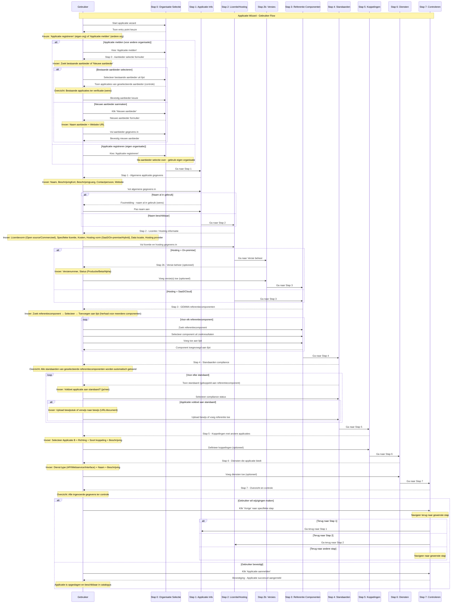

import ApiSchema from '@theme/ApiSchema';
import Tabs from '@theme/Tabs';
import TabItem from '@theme/TabItem';

# K002 - Applicatie

## Beschrijving
Applicaties zijn software producten die door leveranciers worden aangeboden en door organisaties kunnen worden gebruikt. Een applicatie kan bestaan uit meerdere modules of componenten en kan onderdeel zijn van een grotere suite. Applicaties worden in de software gezien als architecturale elementen ofwel modules en het onderliggende object heet derhalve ook module. Applicaties zijn elementen in de architecturale plaat van gemeenten en kunnen worden geëxporteerd naar AMEF bestanden.

## Schema Eigenschappen

<ApiSchema id="swc" example pointer="#/components/schemas/module" />

## Belangrijke Kenmerken

### Basisinformatie (Verplicht)
- **naam**: Naam van de module (max 200 karakters, verplicht)
- **beschrijvingKort**: Korte omschrijving (max 255 karakters, verplicht)
- **beschrijvingLang**: Uitgebreide beschrijving in Markdown formaat (max 5000 karakters)
- **website**: Website URL van de module
- **logo**: URL naar het logo van de module
- **contactpersoon**: Gekoppelde contactpersoon voor de module

### Hosting & Deployment
- **cloudDienstverleningsmodel**: Array met hosting vormen (On-premises, IaaS, PaaS, SaaS)
- **hostingJurisdictie**: Jurisdictie waar data wordt opgeslagen (NL, EU, US, Elders)
- **hostingLocatie**: Locatie waar applicatie wordt gehost (NL, EU, US, Elders)

### Licentie Informatie
- **licentietype**: Type licentie (Open source, Closed source)
- **licentie**: Specifieke licentie bij Open Source (MIT, GPL, Apache, BSD, EUPL)

### Organisatie & Relaties
- **aanbieder**: Gekoppelde organisatie die de module aanbiedt
- **type**: Type module (Applicatie, Systeemsoftware)

### GEMMA Integratie
- **referentieComponenten**: Array van GEMMA referentiecomponenten
- **standaarden**: Array van AMEF standaard ID's
- **standaardenGemma**: Array van GEMMA standaard ID's

### Gerelateerde Objecten
- **omvat**: Andere modules die onderdeel zijn van deze module
- **onderdeelVan**: Modules waarvan deze module onderdeel is
- **diensten**: Diensten waarvan deze module onderdeel is
- **koppelingen**: Koppelingen waarbij deze module betrokken is
- **compliancy**: Standaarden compliance registraties
- **moduleVersies**: Versies van deze module
- **gebruiken**: Gebruik registraties van deze module
- **beoordelingen**: Beoordelingen van deze module
- **kwetsbaarheden**: Kwetsbaarheden die deze module treffen

## Applicatie Types

### 🏢 Enterprise Software
Grote, complexe applicaties voor organisatiebrede processen.

**Kenmerken:**
- Uitgebreide functionaliteit
- Hoge configuratiemogelijkheden
- Integratie met vele systemen
- Enterprise support niveau

### 📱 SaaS Applicaties
Cloud-gebaseerde software als service oplossingen.

**Kenmerken:**
- Webgebaseerde toegang
- Automatische updates
- Schaalbare infrastructuur
- Abonnement model

### 🔧 Specialistische Tools
Gerichte applicaties voor specifieke processen of afdelingen.

**Kenmerken:**
- Domein specifieke functionaliteit
- Eenvoudige implementatie
- Beperkte integratie vereisten
- Kosteneffectieve oplossing

### 🌐 Platform Oplossingen
Uitbreidbare platforms waarop andere applicaties kunnen worden gebouwd.

**Kenmerken:**
- Ontwikkelingsframework
- Plugin architectuur
- API-first ontwerp
- Ecosysteem van uitbreidingen

## Levenscyclus & Versie Beheer

### Module vs Module Versie
De **module** (applicatie) zelf bevat de algemene informatie zoals naam, beschrijving, aanbieder en technische specificaties. De **levenscyclus wordt beheerd per versie** via het `moduleVersie` object.

<ApiSchema id="swc" example pointer="#/components/schemas/moduleVersie" />

### Module Versie Lifecycle
Elke versie van een module heeft zijn eigen lifecycle met de volgende statussen:

#### 📋 Status Overzicht
- **in ontwikkeling**: Versie wordt nog ontwikkeld
- **in gebruik**: Versie is actief en beschikbaar
- **einde ondersteuning**: Versie wordt uitgefaseerd
- **teruggetrokken**: Versie is niet meer beschikbaar

#### 📅 Datum Tracking
- **datumInOntwikkeling**: Startdatum ontwikkelingsfase
- **datumInGebruik**: Startdatum actief gebruik
- **datumEindeOndersteuning**: Startdatum einde ondersteuning
- **datumTeruggetrokken**: Datum waarop versie teruggetrokken is

### Versie Beheer Strategie

#### 🔢 Semantic Versioning
Versienummering volgt het MAJOR.MINOR.PATCH formaat:
- **MAJOR**: Grote wijzigingen, mogelijk incompatibel
- **MINOR**: Nieuwe functionaliteiten, backwards compatible
- **PATCH**: Bug fixes, backwards compatible

#### 🌐 SaaS vs On-Premises
- **SaaS applicaties**: Meestal één actieve versie (automatische updates)
- **On-premises**: Meerdere versies kunnen tegelijk actief zijn
- **Hybrid**: Combinatie van beide modellen mogelijk

#### 📊 Versie Informatie
- **versie**: Versienummer (verplicht, semantic versioning)
- **beschrijvingKort**: Wat is nieuw in deze versie (max 255 karakters)
- **beschrijvingLang**: Uitgebreide release notes (Markdown, max 5000 karakters)
- **gebruiken**: Welke organisaties gebruiken deze specifieke versie

## Gerelateerde Concepten
- [K001 - Organisatie](./K001-organisatie.md): Leveranciers en gebruikers
- [K003 - Dienst](./K003-dienst.md): Services die applicaties bieden
- [K004 - Gebruik](./K004-gebruik.md): Hoe applicaties worden gebruikt
- [K005 - Koppeling](./K005-koppeling.md): Integraties tussen applicaties
- [K006 - Suite](./K006-suite.md): Verzamelingen van applicaties
- [K007 - Component](./K007-component.md): Onderdelen van applicaties

## Gerelateerde Functionaliteiten
- [F004 - Applicatiebeheer](./F004-applicatiebeheer.md)
- [F005 - Dienstenbeheer](./F005-dienstenbeheer.md)
- [F013 - Gebruik Beheer](./F013-gebruik-beheer.md)

## Applicatie Wizard

De Applicatie wizard begeleidt gebruikers door het proces van het aanmelden van een nieuwe applicatie in de GEMMA Softwarecatalogus. Dit is de meest uitgebreide wizard met 7 stappen.

### Wizard Stappen

**Stap 0**: Organisatie Selectie (optioneel - alleen bij aanmelden voor anderen)
**Stap 1**: Applicatie Informatie (naam, website, beschrijving, logo, contact)
**Stap 2**: Licentie / Hosting (licentievorm, hosting type, data locatie, versies bij On-Premises)
**Stap 3**: Referentie Componenten (zoek en voeg GEMMA componenten één voor één toe)
**Stap 4**: Standaarden (automatisch getoond op basis van referentiecomponenten, per standaard compliance en bewijs)
**Stap 5**: Koppelingen (integraties met andere applicaties)
**Stap 6**: Diensten (services die de applicatie biedt)
**Stap 7**: Controleren (samengevoegd overzicht en bevestiging)

### Sequence Diagram

## Belangrijke Wizard Kenmerken

### Conditionele Stappen
- **Organisatie selectie**: Alleen bij aanmelden voor anderen
- **Versies beheer**: Alleen bij On-Premises hosting
- **Leverancier controle**: Tabel met bestaande applicaties ter verificatie

### Nieuwe Functionaliteiten
- **Contactpersoon toewijzing**: Directe koppeling van contactpersoon aan applicatie
- **Iteratieve component selectie**: Referentiecomponenten één voor één zoeken en toevoegen
- **Automatische standaarden koppeling**: Standaarden worden automatisch getoond op basis van geselecteerde referentiecomponenten
- **Bewijs management**: Per standaard bewijs uploaden of verwijzen naar externe documentatie
- **Samengevoegd overzicht**: Alle informatie in één scherm voor finale controle

### UX Verbeteringen
- **Weggevallen kolommen**: Applicatie kolom in Standaarden en Diensten voor meer ruimte
- **Automatische selectie**: Applicatie A in Koppelingen is altijd de huidige applicatie
- **Land/hosting omgedraaid**: Betere titel lengte in Licentie/Hosting stap

## Implementatie Overwegingen

### Data Integriteit
- **Transactionele opslag**: Alle gerelateerde gegevens worden atomair opgeslagen
- **Referentiële integriteit**: Koppelingen tussen applicatie en gerelateerde entiteiten
- **Versie beheer**: Historische tracking van wijzigingen
- **Backup en recovery**: Automatische backup van applicatie gegevens

### Performance Optimalisatie
- **Lazy loading**: Gerelateerde gegevens alleen laden wanneer nodig
- **Caching strategie**: Applicatie metadata cachen voor snelle toegang
- **Database indexering**: Optimale indexen voor zoek en filter operaties
- **CDN integratie**: Snelle levering van afbeeldingen en documenten

### Beveiliging
- **Toegangscontrole**: Rol-gebaseerde autorisatie per applicatie
- **Data encryptie**: Gevoelige applicatie gegevens versleuteld opslaan
- **Audit logging**: Volledige traceerbaarheid van wijzigingen
- **Input validatie**: Uitgebreide validatie van alle invoer gegevens
