# K002 - Applicatie

## Beschrijving
Applicaties zijn software producten die door leveranciers worden aangeboden en door organisaties kunnen worden gebruikt. Een applicatie kan bestaan uit meerdere modules of componenten en kan onderdeel zijn van een grotere suite.

## Kenmerken

### Basisinformatie
- **Applicatie naam**: Officiële naam van de software
- **Beschrijving**: Korte en uitgebreide omschrijving van functionaliteiten
- **Categorie**: Type software (DMS, Financieel, HR, CRM, etc.)
- **Website**: Officiële product website
- **Logo**: Visuele identiteit van de applicatie
- **Screenshots**: Visuele presentatie van de gebruikersinterface

### Leverancier Informatie
- **Leverancier**: Organisatie die de software aanbiedt
- **Contactpersoon**: Aangewezen contactpersoon voor de applicatie
- **Support**: Ondersteuning en service informatie
- **Documentatie**: Links naar handleidingen en documentatie

### Technische Specificaties
- **Versies**: Verschillende releases van de software
- **Technologie stack**: Gebruikte programmeertalen en frameworks
- **Architectuur**: Monoliet, Microservices, Cloud-native
- **Integratie mogelijkheden**: API's, webservices, koppelingen
- **Schaalbaarheid**: Ondersteuning voor groei en uitbreiding

### Hosting en Deployment
- **Hosting type**: SaaS, On-premise, Hybrid, Cloud
- **Cloud providers**: AWS, Azure, Google Cloud, Nederlandse cloud
- **Data locatie**: Waar worden gegevens opgeslagen
- **Compliance**: Certificeringen en standaarden naleving

### Licentie en Prijsmodel
- **Licentiemodel**: Open source, Commercieel, Freemium, Enterprise
- **Specifieke licentie**: GPL, MIT, Apache, Proprietary
- **Prijsstructuur**: Per gebruiker, Per maand, Eenmalig, Volume korting
- **Kosten**: Transparante prijsinformatie

## Relaties

### Eigendom
- **Eigendom van**: Organisatie (leverancier)
- **Ontwikkeld door**: Ontwikkelteam of externe partijen
- **Onderhouden door**: Support en ontwikkel organisatie

### Gebruik
- **Gebruikt door**: Organisaties (klanten)
- **Geïmplementeerd bij**: Specifieke implementaties
- **Licenties**: Actieve licentie overeenkomsten

### Structuur
- **Bestaat uit**: Componenten en modules
- **Onderdeel van**: Suite of product familie
- **Afhankelijk van**: Andere applicaties of services
- **Integreert met**: Externe systemen en applicaties

### Functionaliteit
- **Biedt**: Diensten en services
- **Ondersteunt**: Standaarden en protocollen
- **Gekoppeld aan**: GEMMA referentiecomponenten
- **Voldoet aan**: Compliance vereisten

## Applicatie Types

### 🏢 Enterprise Software
Grote, complexe applicaties voor organisatiebrede processen.

**Kenmerken:**
- Uitgebreide functionaliteit
- Hoge configuratiemogelijkheden
- Integratie met vele systemen
- Enterprise support niveau

### 📱 SaaS Applicaties
Cloud-gebaseerde software als service oplossingen.

**Kenmerken:**
- Webgebaseerde toegang
- Automatische updates
- Schaalbare infrastructuur
- Abonnement model

### 🔧 Specialistische Tools
Gerichte applicaties voor specifieke processen of afdelingen.

**Kenmerken:**
- Domein specifieke functionaliteit
- Eenvoudige implementatie
- Beperkte integratie vereisten
- Kosteneffectieve oplossing

### 🌐 Platform Oplossingen
Uitbreidbare platforms waarop andere applicaties kunnen worden gebouwd.

**Kenmerken:**
- Ontwikkelingsframework
- Plugin architectuur
- API-first ontwerp
- Ecosysteem van uitbreidingen

## Levenscyclus

### 🚀 Ontwikkeling
- **Concept fase**: Idee en marktonderzoek
- **Design fase**: Architectuur en gebruikersinterface ontwerp
- **Ontwikkeling**: Programmeren en testen
- **Beta testing**: Gebruikerstests en feedback verwerking

### 📦 Release
- **Productie release**: Officiële lancering
- **Versie beheer**: Systematische versie nummering
- **Deployment**: Uitrol naar productie omgeving
- **Documentatie**: Gebruikershandleidingen en technische documentatie

### 🔄 Onderhoud
- **Bug fixes**: Oplossen van problemen
- **Security updates**: Beveiligingspatches
- **Feature updates**: Nieuwe functionaliteiten
- **Performance optimalisatie**: Verbeteringen in snelheid en efficiëntie

### 📈 Evolutie
- **Major releases**: Grote functionaliteitsuitbreidingen
- **Platform migratie**: Overstap naar nieuwe technologieën
- **Integratie uitbreiding**: Nieuwe koppelingen en API's
- **Markt aanpassingen**: Reactie op veranderende behoeften

### 🔚 End-of-Life
- **Deprecation**: Aankondiging van uitfasering
- **Migration path**: Overgang naar opvolger
- **Support beëindiging**: Einde van ondersteuning
- **Data migratie**: Overzetten van gegevens

## Gerelateerde Concepten
- [K001 - Organisatie](./K001-organisatie.md): Leveranciers en gebruikers
- [K003 - Dienst](./K003-dienst.md): Services die applicaties bieden
- [K004 - Gebruik](./K004-gebruik.md): Hoe applicaties worden gebruikt
- [K005 - Koppeling](./K005-koppeling.md): Integraties tussen applicaties
- [K006 - Suite](./K006-suite.md): Verzamelingen van applicaties
- [K007 - Component](./K007-component.md): Onderdelen van applicaties

## Gerelateerde Functionaliteiten
- [F004 - Applicatiebeheer](./F004-applicatiebeheer.md)
- [F005 - Dienstenbeheer](./F005-dienstenbeheer.md)
- [F013 - Gebruik Beheer](./F013-gebruik-beheer.md)

## Applicatie Wizard

De Applicatie wizard begeleidt gebruikers door het proces van het aanmelden van een nieuwe applicatie in de GEMMA Softwarecatalogus. Dit is de meest uitgebreide wizard met 7 stappen.

### Wizard Stappen

**Stap 0**: Organisatie Selectie (optioneel - alleen bij aanmelden voor anderen)
**Stap 1**: Applicatie Informatie (naam, website, beschrijving, logo, contact)
**Stap 2**: Licentie / Hosting (licentievorm, hosting type, data locatie, versies bij On-Premises)
**Stap 3**: Referentie Componenten (zoek en voeg GEMMA componenten één voor één toe)
**Stap 4**: Standaarden (automatisch getoond op basis van referentiecomponenten, per standaard compliance en bewijs)
**Stap 5**: Koppelingen (integraties met andere applicaties)
**Stap 6**: Diensten (services die de applicatie biedt)
**Stap 7**: Controleren (samengevoegd overzicht en bevestiging)

### Sequence Diagram

```mermaid
sequenceDiagram
    participant U as Gebruiker
    participant W as Applicatie Wizard

    Note over U,W: Applicatie Wizard - Gebruiker Flow

    %% Entry Point Keuze
    U->>W: Start applicatie wizard
    W-->>U: Toon entry point keuze
    Note over U: Keuze: 'Applicatie registreren' (eigen org) of 'Applicatie melden' (andere org)
    
    alt Applicatie melden (voor andere organisatie)
        U->>W: Kies 'Applicatie melden'
        
        %% Stap 0: Aanbieder Selectie
        W-->>U: Stap 0 - Aanbieder selectie formulier
        Note over U: Invoer: Zoek bestaande aanbieder of 'Nieuwe aanbieder'
        
        alt Bestaande aanbieder selecteren
            U->>W: Selecteer bestaande aanbieder uit lijst
            W-->>U: Toon applicaties van geselecteerde aanbieder (controle)
            Note over U: Overzicht: Bestaande applicaties ter verificatie (wens)
            U->>W: Bevestig aanbieder keuze
        else Nieuwe aanbieder aanmaken
            U->>W: Klik 'Nieuwe aanbieder'
            W-->>U: Nieuwe aanbieder formulier
            Note over U: Invoer: Naam aanbieder + Website URL
            U->>W: Vul aanbieder gegevens in
            W-->>U: Bevestig nieuwe aanbieder
        end
        
    else Applicatie registreren (eigen organisatie)
        U->>W: Kies 'Applicatie registreren'
        Note over W: Sla aanbieder selectie over - gebruik eigen organisatie
    end

    %% Stap 1: Algemene Applicatie Gegevens
    W-->>U: Stap 1 - Algemene applicatie gegevens
    Note over U: Invoer: Naam, BeschrijvingKort, BeschrijvingLang, Contactpersoon, Website
    U->>W: Vul algemene gegevens in
    
    alt Naam al in gebruik
        W-->>U: Foutmelding - naam al in gebruik (wens)
        U->>W: Pas naam aan
    else Naam beschikbaar
        U->>W: Ga naar volgende stap
    end

    %% Stap 2: Licentie / Hosting
    W-->>U: Stap 2 - Licentie / Hosting informatie
    Note over U: Invoer: Licentievorm (Open source/Commercieel), Specifieke licentie, Kosten, Hosting vorm (SaaS/On-premise/Hybrid), Data locatie, Hosting provider
    U->>W: Vul licentie en hosting gegevens in
    
    %% Conditionele Stap: Versies (alleen bij On-premise)
    alt Hosting = On-premise
        W-->>U: Stap 2b - Versie beheer (optioneel)
        Note over U: Invoer: Versienummer, Status (Productie/Beta/Alpha)
        U->>W: Voeg versie(s) toe (optioneel)
    end
    
    U->>W: Ga naar volgende stap

    %% Stap 3: Referentie Componenten
    W-->>U: Stap 3 - GEMMA referentiecomponenten
    Note over U: Invoer: Zoek referentiecomponent → Selecteer → Toevoegen aan lijst (herhaal voor meerdere componenten)
    
    loop Voor elk referentiecomponent
        U->>W: Zoek referentiecomponent
        U->>W: Selecteer component uit zoekresultaten
        U->>W: Voeg toe aan lijst
        W-->>U: Component toegevoegd aan lijst
    end
    
    U->>W: Ga naar volgende stap

    %% Stap 4: Standaarden
    W-->>U: Stap 4 - Standaarden compliance
    Note over U: Overzicht: Alle standaarden van geselecteerde referentiecomponenten worden automatisch getoond
    
    loop Voor elke standaard
        W-->>U: Toon standaard (gekoppeld aan referentiecomponent)
        Note over U: Invoer: Voldoet applicatie aan standaard? (ja/nee)
        U->>W: Selecteer compliance status
        
        alt Applicatie voldoet aan standaard
            Note over U: Invoer: Upload bewijsstuk of verwijs naar bewijs (URL/document)
            U->>W: Upload bewijs of voeg referentie toe
        end
    end
    
    U->>W: Ga naar volgende stap

    %% Stap 5: Koppelingen
    W-->>U: Stap 5 - Koppelingen met andere applicaties
    Note over U: Invoer: Selecteer Applicatie B + Richting + Soort koppeling + Beschrijving
    U->>W: Definieer koppelingen (optioneel)
    U->>W: Ga naar volgende stap

    %% Stap 6: Diensten
    W-->>U: Stap 6 - Diensten die applicatie biedt
    Note over U: Invoer: Dienst type (API/Webservice/Interface) + Naam + Beschrijving
    U->>W: Voeg diensten toe (optioneel)
    U->>W: Ga naar volgende stap

    %% Stap 7: Controleren
    W-->>U: Stap 7 - Overzicht en controle
    Note over U: Overzicht: Alle ingevoerde gegevens ter controle
    
    alt Gebruiker wil wijzigingen maken
        U->>W: Klik 'Vorige' naar specifieke stap
        Note over W: Navigeer terug naar gewenste stap
        W-->>U: Toon geselecteerde stap voor aanpassing
    else Gebruiker bevestigt
        U->>W: Klik 'Applicatie aanmelden'
        W-->>U: Bevestiging - Applicatie succesvol aangemeld
        Note over U: Applicatie is opgeslagen en beschikbaar in catalogus
    end
```

## Belangrijke Wizard Kenmerken

### Conditionele Stappen
- **Organisatie selectie**: Alleen bij aanmelden voor anderen
- **Versies beheer**: Alleen bij On-Premises hosting
- **Leverancier controle**: Tabel met bestaande applicaties ter verificatie

### Nieuwe Functionaliteiten
- **Contactpersoon toewijzing**: Directe koppeling van contactpersoon aan applicatie
- **Iteratieve component selectie**: Referentiecomponenten één voor één zoeken en toevoegen
- **Automatische standaarden koppeling**: Standaarden worden automatisch getoond op basis van geselecteerde referentiecomponenten
- **Bewijs management**: Per standaard bewijs uploaden of verwijzen naar externe documentatie
- **Samengevoegd overzicht**: Alle informatie in één scherm voor finale controle

### UX Verbeteringen
- **Weggevallen kolommen**: Applicatie kolom in Standaarden en Diensten voor meer ruimte
- **Automatische selectie**: Applicatie A in Koppelingen is altijd de huidige applicatie
- **Land/hosting omgedraaid**: Betere titel lengte in Licentie/Hosting stap

## Implementatie Overwegingen

### Data Integriteit
- **Transactionele opslag**: Alle gerelateerde gegevens worden atomair opgeslagen
- **Referentiële integriteit**: Koppelingen tussen applicatie en gerelateerde entiteiten
- **Versie beheer**: Historische tracking van wijzigingen
- **Backup en recovery**: Automatische backup van applicatie gegevens

### Performance Optimalisatie
- **Lazy loading**: Gerelateerde gegevens alleen laden wanneer nodig
- **Caching strategie**: Applicatie metadata cachen voor snelle toegang
- **Database indexering**: Optimale indexen voor zoek en filter operaties
- **CDN integratie**: Snelle levering van afbeeldingen en documenten

### Beveiliging
- **Toegangscontrole**: Rol-gebaseerde autorisatie per applicatie
- **Data encryptie**: Gevoelige applicatie gegevens versleuteld opslaan
- **Audit logging**: Volledige traceerbaarheid van wijzigingen
- **Input validatie**: Uitgebreide validatie van alle invoer gegevens
