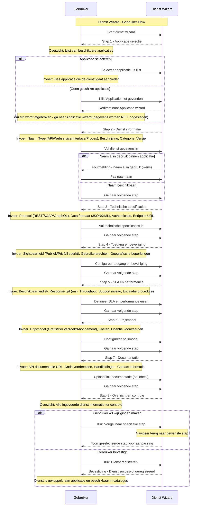

# K003 - Dienst

## Beschrijving
Diensten zijn specifieke services of functionaliteiten die door applicaties worden aangeboden. Een applicatie kan meerdere diensten bieden, zoals API's, webservices, interfaces of geautomatiseerde processen. Diensten vormen de brug tussen applicaties en hun gebruikers.

## Kenmerken

### Basisinformatie
- **Dienst naam**: Officiële naam van de service
- **Beschrijving**: Wat de dienst doet en welke waarde het biedt
- **Categorie**: Type dienst (API, Webservice, Interface, Proces, Rapportage)
- **Versie**: Versienummer van de dienst
- **Status**: Actief, Beta, Deprecated, Uitgeschakeld

### Technische Specificaties
- **Type**: API, Webservice, Interface, Batch proces, Real-time service
- **Protocol**: HTTP/HTTPS, SOAP, REST, GraphQL, WebSocket, FTP
- **Data formaat**: JSON, XML, CSV, PDF, Excel
- **Authenticatie**: OAuth, API Key, Basic Auth, Certificate, SAML
- **Endpoint**: URL of toegangspunt voor de dienst
- **Rate limiting**: Beperkingen op gebruik en frequentie

### Functionele Aspecten
- **Input parameters**: Welke gegevens zijn vereist
- **Output formaat**: Wat levert de dienst op
- **Business regels**: Logica en validaties die worden toegepast
- **Error handling**: Hoe worden fouten afgehandeld en gecommuniceerd
- **Logging**: Welke activiteiten worden gelogd

### Toegankelijkheid
- **Zichtbaarheid**: Publiek, Privé, Beperkt, Partner-only
- **Gebruikers**: Wie kan de dienst gebruiken
- **Rechten**: Welke permissies zijn vereist
- **Geografische beperkingen**: Regionale beschikbaarheid

### Service Level Agreement (SLA)
- **Beschikbaarheid**: Uptime garanties (99.9%, 99.99%)
- **Response tijd**: Maximale reactietijd
- **Throughput**: Aantal verzoeken per seconde/minuut
- **Support niveau**: 24/7, kantooruren, best-effort
- **Escalatie procedures**: Hoe worden problemen geëscaleerd

### Kosten en Licenties
- **Prijsmodel**: Gratis, Per verzoek, Abonnement, Volume-gebaseerd
- **Kosten**: Transparante prijsinformatie
- **Licentie voorwaarden**: Gebruiksvoorwaarden en beperkingen
- **Fair use policy**: Redelijk gebruik beleid

## Relaties

### Aanbod
- **Aangeboden door**: Applicatie die de dienst levert
- **Eigendom van**: Organisatie (leverancier)
- **Onderhouden door**: Ontwikkel- en supportteam
- **Gehost op**: Infrastructuur en platform

### Gebruik
- **Gebruikt door**: Organisaties en applicaties
- **Geïntegreerd in**: Andere systemen en processen
- **Afhankelijk van**: Andere diensten of componenten
- **Monitored door**: Monitoring en alerting systemen

### Standaarden
- **Voldoet aan**: Technische standaarden en protocollen
- **Implementeert**: Interface specificaties
- **Ondersteunt**: Data uitwisseling standaarden
- **Gecertificeerd voor**: Compliance vereisten

## Dienst Types

### 🔌 API Services
Programmatische interfaces voor data en functionaliteit toegang.

**Kenmerken:**
- RESTful of GraphQL endpoints
- JSON/XML data uitwisseling
- Authenticatie en autorisatie
- Rate limiting en throttling
- Uitgebreide documentatie

**Voorbeelden:**
- Zaakgegevens API
- Personen registratie API
- Document management API
- Notificatie service API

### 🌐 Web Services
SOAP-gebaseerde services voor enterprise integratie.

**Kenmerken:**
- WSDL service beschrijvingen
- XML message formaat
- WS-Security standaarden
- Enterprise service bus integratie
- Transactionele ondersteuning

**Voorbeelden:**
- Betalingsverwerking service
- Identity management service
- Workflow orchestration service
- Data synchronisatie service

### 📊 Rapportage Services
Geautomatiseerde rapportage en data analyse diensten.

**Kenmerken:**
- Scheduled report generatie
- Verschillende output formaten
- Parameteriseerbare rapporten
- Dashboard integraties
- Data visualisatie

**Voorbeelden:**
- Financiële rapportage
- Performance dashboards
- Compliance rapporten
- Gebruiksstatistieken

### 🔄 Batch Processen
Geautomatiseerde achtergrond processen voor data verwerking.

**Kenmerken:**
- Scheduled execution
- Grote data volumes
- Error recovery mechanismen
- Progress monitoring
- Result notifications

**Voorbeelden:**
- Data import/export
- Backup processen
- Data cleaning routines
- Archivering processen

### 📱 User Interfaces
Webgebaseerde interfaces voor eindgebruiker interactie.

**Kenmerken:**
- Responsive design
- Gebruiksvriendelijke interface
- Toegankelijkheidsondersteuning
- Multi-language support
- Mobile optimalisatie

**Voorbeelden:**
- Self-service portalen
- Administrative interfaces
- Citizen service portals
- Mobile applications

## Service Lifecycle

### 🚀 Ontwikkeling
- **Requirements analyse**: Functionele en technische vereisten
- **API design**: Interface ontwerp en specificatie
- **Implementatie**: Ontwikkeling en unit testing
- **Documentatie**: API documentatie en gebruikershandleidingen

### 🧪 Testing
- **Unit testing**: Individuele functie tests
- **Integration testing**: Koppeling met andere systemen
- **Performance testing**: Load en stress testing
- **Security testing**: Penetratie en vulnerability tests

### 📦 Deployment
- **Staging deployment**: Test omgeving uitrol
- **Production deployment**: Live omgeving uitrol
- **Monitoring setup**: Performance en error monitoring
- **Documentation publishing**: Publieke documentatie

### 🔄 Operatie
- **Monitoring**: Continue bewaking van performance
- **Maintenance**: Regulier onderhoud en updates
- **Support**: Gebruikersondersteuning en troubleshooting
- **Optimization**: Performance en functionaliteit verbeteringen

### 📈 Evolutie
- **Version management**: Nieuwe versies en backward compatibility
- **Feature enhancement**: Uitbreiding van functionaliteit
- **Integration expansion**: Nieuwe koppelingen en integraties
- **Scaling**: Capaciteit uitbreiding bij groeiend gebruik

### 🔚 Retirement
- **Deprecation notice**: Aankondiging van uitfasering
- **Migration support**: Ondersteuning bij overgang naar alternatief
- **Sunset period**: Geleidelijke afbouw van ondersteuning
- **Service termination**: Definitieve beëindiging van dienst

## Gerelateerde Concepten
- [K001 - Organisatie](./K001-organisatie.md): Leveranciers en gebruikers van diensten
- [K002 - Applicatie](./K002-applicatie.md): Applicaties die diensten aanbieden
- [K004 - Gebruik](./K004-gebruik.md): Hoe diensten worden gebruikt
- [K005 - Koppeling](./K005-koppeling.md): Technische integraties via diensten
- [K007 - Component](./K007-component.md): Componenten die diensten implementeren

## Gerelateerde Functionaliteiten
- [F005 - Dienstenbeheer](./F005-dienstenbeheer.md)
- [F004 - Applicatiebeheer](./F004-applicatiebeheer.md)
- [F008 - Externe Koppelingen](./F008-externe-koppelingen.md)

## Dienst Wizard

De Dienst wizard begeleidt gebruikers door het proces van het registreren van een nieuwe dienst in de GEMMA Softwarecatalogus.

### Wizard Stappen

1. **Applicatie Selectie**: Welke applicatie biedt de dienst aan
2. **Dienst Informatie**: Naam, type, beschrijving en categorie
3. **Technische Specificaties**: Protocol, formaat, authenticatie, endpoint
4. **Toegang en Beveiliging**: Wie kan de dienst gebruiken en onder welke voorwaarden
5. **SLA en Performance**: Service level agreements en performance garanties
6. **Prijsmodel**: Kosten, licenties en gebruiksvoorwaarden
7. **Documentatie**: API documentatie, voorbeelden en handleidingen
8. **Controleren**: Overzicht en bevestiging van alle gegevens

### Sequence Diagram

## Belangrijke Wizard Kenmerken

### Applicatie Koppeling
- **Eigendom validatie**: Alleen applicaties van eigen organisatie selecteerbaar
- **Automatische koppeling**: Dienst wordt automatisch gekoppeld aan geselecteerde applicatie
- **Consistentie controle**: Technische specificaties moeten passen bij applicatie architectuur

### Technische Validatie
- **Endpoint validatie**: URL formaat en toegankelijkheid controle
- **Protocol compatibiliteit**: Controle op ondersteunde protocollen
- **Security configuratie**: Validatie van authenticatie en autorisatie instellingen
- **Performance realisme**: Controle op realistische SLA waarden

### Automatische Setup
- **API endpoint configuratie**: Automatische setup van technische endpoints
- **Monitoring activatie**: Automatische configuratie van performance monitoring
- **Rate limiting**: Automatische implementatie van gebruiksbeperkingen
- **Documentatie generatie**: Automatische API documentatie generatie

## Implementatie Overwegingen

### API Management
- **Gateway integratie**: Koppeling met API gateway voor centraal beheer
- **Version management**: Ondersteuning voor meerdere API versies
- **Deprecation handling**: Geleidelijke uitfasering van oude versies
- **Backward compatibility**: Ondersteuning voor bestaande integraties

### Monitoring en Analytics
- **Real-time monitoring**: Continue bewaking van dienst performance
- **Usage analytics**: Gedetailleerde gebruiksstatistieken
- **Error tracking**: Automatische detectie en rapportage van fouten
- **Capacity planning**: Voorspelling van toekomstige capaciteitsbehoeften

### Security en Compliance
- **Authentication integration**: Koppeling met identity providers
- **Authorization policies**: Granulaire toegangscontrole
- **Audit logging**: Volledige traceerbaarheid van API calls
- **Data protection**: Encryptie en privacy bescherming

### Developer Experience
- **Interactive documentation**: Swagger/OpenAPI documentatie
- **Code samples**: Voorbeelden in verschillende programmeertalen
- **SDKs en libraries**: Client libraries voor populaire platforms
- **Developer portal**: Self-service portal voor ontwikkelaars
