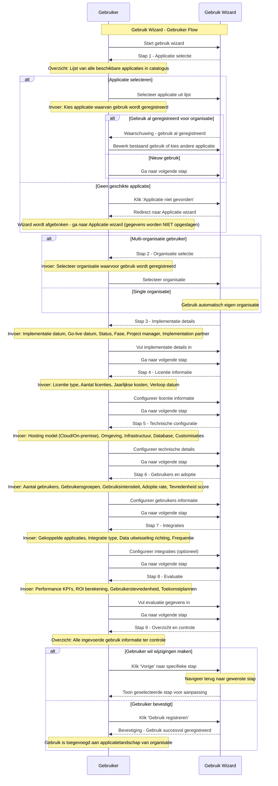

import ApiSchema from '@theme/ApiSchema';
import Tabs from '@theme/Tabs';
import TabItem from '@theme/TabItem';

# K004 - Gebruik

## Beschrijving
Gebruik beschrijft hoe organisaties applicaties inzetten in hun ICT-landschap. Dit omvat zowel de technische als functionele aspecten van het gebruik, inclusief implementatie details, gebruikerservaring en bedrijfswaarde realisatie.

## Kenmerken

<ApiSchema id="swc" example pointer="#/components/schemas/gebruik" />

## Relaties

### Organisatorisch
- **Gebruikt door**: Organisatie (gemeente, leverancier, samenwerking)
- **Van applicatie**: Specifieke applicatie die wordt gebruikt
- **Beheerd door**: IT afdeling of externe partij
- **Ondersteund door**: Leverancier of support organisatie

### Technisch
- **Gekoppeld aan**: Andere applicaties in het landschap
- **Afhankelijk van**: Infrastructuur en platforms
- **Integreert met**: Externe systemen en diensten
- **Gebruikt diensten**: Specifieke services van de applicatie

### Functioneel
- **Ondersteunt processen**: Bedrijfsprocessen die worden ondersteund
- **Gebruikt door afdelingen**: Welke afdelingen maken gebruik
- **Vervult rollen**: Functionele rollen in de organisatie
- **Levert waarde**: Meetbare business value

## Gebruik Types

### 🏛️ Productie Gebruik
Volledig operationeel gebruik in de dagelijkse bedrijfsvoering.

**Kenmerken:**
- Live omgeving met echte data
- Volledige gebruikersbasis
- 24/7 beschikbaarheid vereist
- Formele support overeenkomsten
- Backup en disaster recovery

**Voorbeelden:**
- Zaaksysteem voor burgerzaken
- Financieel systeem voor boekhouding
- HR systeem voor personeelsbeheer
- CRM voor klantrelatiebeheer

### 🧪 Pilot Gebruik
Beperkte test implementatie om geschiktheid te evalueren.

**Kenmerken:**
- Beperkte gebruikersgroep
- Gecontroleerde omgeving
- Evaluatie criteria en KPI's
- Tijdelijke implementatie
- Intensieve begeleiding

**Voorbeelden:**
- Nieuwe workflow tool in één afdeling
- Innovatieve citizen service in één wijk
- Cloud migratie van één applicatie
- Nieuwe rapportage tool voor management

### 🔄 Migratie Gebruik
Overgang van oude naar nieuwe applicatie of versie.

**Kenmerken:**
- Parallelle systemen
- Data migratie processen
- Gebruikerstraining
- Rollback procedures
- Gefaseerde uitrol

**Voorbeelden:**
- Migratie van legacy systeem naar cloud
- Upgrade naar nieuwe versie
- Consolidatie van meerdere systemen
- Platform modernisering

### 📊 Analytische Gebruik
Gebruik voor rapportage, analyse en business intelligence.

**Kenmerken:**
- Read-only toegang tot data
- Batch processing
- Scheduled reports
- Dashboard integraties
- Data warehouse koppelingen

**Voorbeelden:**
- BI dashboards voor management
- Compliance rapportage
- Performance monitoring
- Trend analyse tools

### 🔧 Ontwikkeling Gebruik
Gebruik voor ontwikkeling, test en configuratie doeleinden.

**Kenmerken:**
- Ontwikkel en test omgevingen
- Sandbox configuraties
- API testing tools
- Prototype development
- Integration testing

**Voorbeelden:**
- API development platforms
- Test automation tools
- Configuration management
- Integration testing suites

## Gebruik Lifecycle

### 📋 Planning
- **Behoefteanalyse**: Identificatie van functionele requirements
- **Marktonderzoek**: Evaluatie van beschikbare oplossingen
- **Business case**: Kosten-baten analyse en ROI berekening
- **Projectplan**: Implementatie roadmap en mijlpalen

### 🚀 Implementatie
- **Procurement**: Aanschaf en contractering
- **Setup**: Technische installatie en configuratie
- **Integratie**: Koppeling met bestaande systemen
- **Training**: Gebruikerstraining en change management

### 📈 Adoptie
- **Rollout**: Gefaseerde uitrol naar gebruikers
- **Support**: Helpdesk en gebruikersondersteuning
- **Monitoring**: Performance en gebruiksmonitoring
- **Optimalisatie**: Aanpassingen en verbeteringen

### 🔄 Operatie
- **Dagelijks beheer**: Routine onderhoud en monitoring
- **Incident management**: Probleem oplossing en escalatie
- **Change management**: Wijzigingen en updates
- **Capacity management**: Capaciteitsplanning en scaling

### 📊 Evaluatie
- **Performance review**: Evaluatie van KPI's en doelstellingen
- **User satisfaction**: Gebruikerstevredenheid onderzoek
- **Cost analysis**: Kosten analyse en optimalisatie
- **Future planning**: Roadmap voor toekomstige ontwikkelingen

### 🔚 Uitfasering
- **End-of-life planning**: Voorbereiding op vervanging
- **Data migratie**: Overzetten van gegevens naar opvolger
- **User transition**: Overgang gebruikers naar nieuwe oplossing
- **Decommissioning**: Definitieve uitschakeling van systeem

## Gerelateerde Concepten
- [K001 - Organisatie](./K001-organisatie.md): Organisaties die applicaties gebruiken
- [K002 - Applicatie](./K002-applicatie.md): Applicaties die worden gebruikt
- [K003 - Dienst](./K003-dienst.md): Diensten die worden afgenomen
- [K005 - Koppeling](./K005-koppeling.md): Integraties in het gebruik
- [K007 - Component](./K007-component.md): Componenten die worden gebruikt

## Gerelateerde Functionaliteiten
- [F013 - Gebruik Beheer](./F013-gebruik-beheer.md)
- [F004 - Applicatiebeheer](./F004-applicatiebeheer.md)
- [F006 - Inzichten en Aanbevelingen](./F006-inzichten-en-aanbevelingen.md)

## Gebruik Wizard

De Gebruik wizard begeleidt gebruikers door het proces van het registreren van applicatie gebruik in de GEMMA Softwarecatalogus.

### Wizard Stappen

1. **Organisatie Context**: Voor welke organisatie wordt het gebruik geregistreerd
2. **Applicatie Selectie**: Welke applicatie wordt gebruikt
3. **Implementatie Details**: Datum, status, project informatie
4. **Licentie Informatie**: Welke licenties zijn afgenomen en kosten
5. **Technische Configuratie**: Hosting, omgeving, infrastructuur details
6. **Gebruikers en Adoptie**: Aantal gebruikers, groepen, tevredenheid
7. **Integraties**: Koppelingen met andere systemen in het landschap
8. **Evaluatie**: Performance, KPI's en toekomstplannen
9. **Controleren**: Overzicht en bevestiging van alle gegevens

### Sequence Diagram

## Belangrijke Wizard Kenmerken

### Organisatie Context
- **Multi-organisatie ondersteuning**: Gebruikers kunnen gebruik registreren voor meerdere organisaties
- **Toegangscontrole**: Alleen organisaties waar gebruiker toegang toe heeft
- **Duplicaat detectie**: Controle op bestaand gebruik van applicatie door organisatie

### Licentie Integratie
- **Automatische opties**: Beschikbare licentie types worden opgehaald van applicatie
- **Kosten berekening**: Automatische berekening van totale kosten
- **Compliance controle**: Validatie van licentie aantallen vs gebruikers

### Portfolio Integratie
- **Landschap context**: Integraties worden getoond in context van bestaand landschap
- **Impact analyse**: Automatische analyse van portfolio impact
- **Optimalisatie suggesties**: AI-gedreven aanbevelingen voor verbetering

### Performance Monitoring
- **KPI tracking**: Systematische tracking van performance indicatoren
- **Benchmark vergelijking**: Vergelijking met andere organisaties (geanonimiseerd)
- **Trend analyse**: Historische ontwikkeling van gebruik en performance

## Implementatie Overwegingen

### Data Kwaliteit
- **Validatie regels**: Uitgebreide validatie van ingevoerde gegevens
- **Consistentie controles**: Cross-validatie tussen verschillende secties
- **Data enrichment**: Automatische aanvulling van gegevens waar mogelijk
- **Quality scoring**: Kwaliteitsscore voor gebruik registraties

### Analytics en Insights
- **Portfolio dashboards**: Real-time overzicht van applicatielandschap
- **Cost optimization**: Identificatie van kostenbesparingen
- **Usage patterns**: Analyse van gebruikspatronen en trends
- **Compliance monitoring**: Automatische controle op licentie compliance

### Integration Management
- **Dependency mapping**: Automatische mapping van applicatie afhankelijkheden
- **Impact analysis**: Analyse van wijzigingsimpact op integraties
- **Health monitoring**: Continue monitoring van integratie gezondheid
- **Performance optimization**: Optimalisatie van integratie performance

### Lifecycle Management
- **Renewal tracking**: Automatische tracking van licentie verloopdatums
- **Upgrade planning**: Ondersteuning bij upgrade en migratie planning
- **End-of-life management**: Proactieve signalering van end-of-life applicaties
- **Succession planning**: Ondersteuning bij applicatie vervanging
