import ApiSchema from '@theme/ApiSchema';
import Tabs from '@theme/Tabs';
import TabItem from '@theme/TabItem';

# K005 - Koppeling

## Beschrijving
Koppelingen beschrijven de technische integraties tussen verschillende applicaties. Dit kunnen API-koppelingen, bestandsuitwisselingen, database koppelingen of andere vormen van data-uitwisseling zijn. Koppelingen zijn essentieel voor een geïntegreerd applicatielandschap.

## Kenmerken

<ApiSchema id="swc" example pointer="#/components/schemas/koppeling" />

## Relaties

### Applicaties
- **Verbindt**: Twee of meer applicaties
- **Gebruikt door**: Organisaties die de applicaties gebruiken
- **Beheerd door**: IT teams of externe partijen
- **Ondersteund door**: Leveranciers van de gekoppelde applicaties

### Standaarden
- **Implementeert**: Technische standaarden
- **Voldoet aan**: Compliance vereisten
- **Gebruikt**: Data uitwisseling protocollen
- **Ondersteunt**: Interoperabiliteit frameworks

### Infrastructuur
- **Loopt over**: Netwerk infrastructuur
- **Gebruikt**: Middleware en integration platforms
- **Afhankelijk van**: Database en storage systemen
- **Monitored door**: Monitoring en alerting systemen

## Koppeling Types

### 🔌 API Koppelingen
Real-time programmatische integraties via REST of GraphQL APIs.

**Kenmerken:**
- Synchrone communicatie
- JSON/XML data uitwisseling
- HTTP/HTTPS protocol
- Real-time data toegang
- Stateless architectuur

**Voorbeelden:**
- BRP koppeling voor persoongegevens
- BAG koppeling voor adresgegevens
- Zaaksysteem naar DMS koppeling
- CRM naar e-mail marketing integratie

### 🌐 Webservice Koppelingen
SOAP-gebaseerde enterprise integraties met uitgebreide functionaliteit.

**Kenmerken:**
- WSDL service definities
- XML message formaat
- WS-Security standaarden
- Transactionele ondersteuning
- Enterprise service bus integratie

**Voorbeelden:**
- StUF-ZKN zaakservices
- DigiKoppeling services
- Suwinet koppelingen
- GBA/BRP webservices

### 📁 Bestandsuitwisseling
Batch-gebaseerde data uitwisseling via bestanden.

**Kenmerken:**
- Asynchrone verwerking
- Grote data volumes
- Scheduled transfers
- FTP/SFTP protocol
- Verschillende bestandsformaten

**Voorbeelden:**
- Salarisverwerking export
- Factuur import/export
- Backup data transfers
- Rapportage distributie

### 🗄️ Database Koppelingen
Directe database toegang en synchronisatie.

**Kenmerken:**
- SQL-gebaseerde toegang
- Real-time of batch sync
- Transactionele integriteit
- Database triggers
- Replicatie mechanismen

**Voorbeelden:**
- Data warehouse ETL
- Master data synchronisatie
- Backup en archivering
- Business intelligence feeds

### 📨 Message Queue Koppelingen
Asynchrone berichtuitwisseling via message brokers.

**Kenmerken:**
- Publish/subscribe patronen
- Message persistence
- Load balancing
- Error recovery
- Scalable architectuur

**Voorbeelden:**
- Event-driven architectuur
- Workflow orchestration
- Notification services
- Integration patterns

## Koppeling Lifecycle

### 📋 Analyse en Design
- **Requirements analyse**: Functionele en technische vereisten
- **Architectuur design**: Integratie patronen en technologie keuzes
- **Data mapping**: Mapping tussen verschillende data modellen
- **Security design**: Beveiliging en toegangscontrole ontwerp

### 🛠️ Ontwikkeling
- **Interface development**: API of service ontwikkeling
- **Data transformation**: Implementatie van data conversie logica
- **Error handling**: Foutafhandeling en recovery mechanismen
- **Testing**: Unit, integration en performance testing

### 🚀 Deployment
- **Environment setup**: Configuratie van test en productie omgevingen
- **Security configuration**: Implementatie van beveiliging
- **Monitoring setup**: Performance en health monitoring
- **Documentation**: Technische en gebruikersdocumentatie

### 🔄 Operatie
- **Monitoring**: Continue bewaking van performance en beschikbaarheid
- **Maintenance**: Regulier onderhoud en updates
- **Support**: Incident management en troubleshooting
- **Optimization**: Performance tuning en capacity planning

### 📈 Evolutie
- **Version management**: Nieuwe versies en backward compatibility
- **Enhancement**: Uitbreiding van functionaliteit
- **Migration**: Overgang naar nieuwe technologieën
- **Scaling**: Capaciteit uitbreiding bij groeiend gebruik

### 🔚 Retirement
- **Deprecation**: Aankondiging van uitfasering
- **Migration planning**: Overgang naar vervangend systeem
- **Data preservation**: Behoud van historische gegevens
- **Decommissioning**: Definitieve uitschakeling

## Gerelateerde Concepten
- [K002 - Applicatie](./K002-applicatie.md): Applicaties die worden gekoppeld
- [K003 - Dienst](./K003-dienst.md): Diensten die worden gebruikt in koppelingen
- [K004 - Gebruik](./K004-gebruik.md): Gebruik context van koppelingen
- [K007 - Component](./K007-component.md): Componenten die koppelingen implementeren

## Gerelateerde Functionaliteiten
- [F008 - Externe Koppelingen](./F008-externe-koppelingen.md)
- [F004 - Applicatiebeheer](./F004-applicatiebeheer.md)
- [F013 - Gebruik Beheer](./F013-gebruik-beheer.md)

## Koppeling Wizard

De Koppeling wizard begeleidt gebruikers door het proces van het definiëren van een nieuwe integratie tussen applicaties.

### 

```mermaid
sequenceDiagram
    participant U as Gebruiker
    participant W as Koppeling Wizard

    Note over U,W: Koppeling Wizard - Gebruiker Flow

    %% Stap 1: Applicatie A Selectie
    U->>W: Start koppeling wizard
    W-->>U: Stap 1 - Applicatie A selectie (bron)
    Note over U: Overzicht: Lijst van beschikbare applicaties
    
    alt Applicatie A selecteren
        U->>W: Selecteer Applicatie A uit lijst
        Note over U: Invoer: Kies bron applicatie voor de koppeling
    else Geen geschikte applicatie A
        U->>W: Klik 'Applicatie niet gevonden'
        W-->>U: Redirect naar Applicatie wizard
        Note over U: Wizard wordt afgebroken - ga naar Applicatie wizard (gegevens worden NIET opgeslagen)
    end

    %% Stap 2: Applicatie B Selectie
    W-->>U: Stap 2 - Applicatie B selectie (doel)
    Note over U: Overzicht: Lijst van beschikbare applicaties (exclusief Applicatie A)
    
    alt Applicatie B selecteren
        U->>W: Selecteer Applicatie B uit lijst
        Note over U: Invoer: Kies doel applicatie voor de koppeling
        
        alt Koppeling bestaat al tussen A en B
            W-->>U: Waarschuwing - koppeling bestaat al
            U->>W: Bewerk bestaande koppeling of kies andere applicatie
        else Nieuwe koppeling
            U->>W: Ga naar volgende stap
        end
        
    else Geen geschikte applicatie B
        U->>W: Klik 'Applicatie niet gevonden'
        W-->>U: Redirect naar Applicatie wizard
        Note over U: Wizard wordt afgebroken - ga naar Applicatie wizard (gegevens worden NIET opgeslagen)
    end

    %% Stap 3: Koppeling Type
    W-->>U: Stap 3 - Koppeling type
    Note over U: Invoer: Type (API/Webservice/Bestand/Database), Richting (A→B/B→A/A↔B), Frequentie
    U->>W: Selecteer koppeling type en eigenschappen
    U->>W: Ga naar volgende stap

    %% Stap 4: Technische Specificaties
    W-->>U: Stap 4 - Technische specificaties
    Note over U: Invoer: Protocol (REST/SOAP/FTP), Data formaat (JSON/XML/CSV), Authenticatie, Endpoint URL
    U->>W: Configureer technische specificaties
    U->>W: Ga naar volgende stap

    %% Stap 5: Data Mapping
    W-->>U: Stap 5 - Data mapping
    Note over U: Invoer: Bron velden, Doel velden, Transformatie regels, Validatie regels
    U->>W: Configureer data mapping
    U->>W: Ga naar volgende stap

    %% Stap 6: Standaarden
    W-->>U: Stap 6 - Standaarden
    Note over U: Invoer: Standaard selectie (StUF/RSGB/etc), Versie, Compliance niveau, Certificering
    U->>W: Selecteer standaarden (optioneel)
    U->>W: Ga naar volgende stap

    %% Stap 7: Performance en SLA
    W-->>U: Stap 7 - Performance en SLA
    Note over U: Invoer: Response tijd (ms), Throughput, Beschikbaarheid %, Recovery tijd, Monitoring
    U->>W: Definieer performance eisen en SLA
    U->>W: Ga naar volgende stap

    %% Stap 8: Beveiliging
    W-->>U: Stap 8 - Beveiliging
    Note over U: Invoer: Encryptie type, Toegangscontrole, Audit trail, Privacy compliance (GDPR)
    U->>W: Configureer beveiliging
    U->>W: Ga naar volgende stap

    %% Stap 9: Testing
    W-->>U: Stap 9 - Testing
    Note over U: Invoer: Test scenario's, Validatie criteria, Test data, Acceptance criteria
    U->>W: Definieer test aanpak
    U->>W: Ga naar volgende stap

    %% Stap 10: Controleren
    W-->>U: Stap 10 - Overzicht en controle
    Note over U: Overzicht: Alle ingevoerde koppeling informatie ter controle
    
    alt Gebruiker wil wijzigingen maken
        U->>W: Klik 'Vorige' naar specifieke stap
        Note over W: Navigeer terug naar gewenste stap
        W-->>U: Toon geselecteerde stap voor aanpassing
    else Gebruiker bevestigt
        U->>W: Klik 'Koppeling registreren'
        W-->>U: Bevestiging - Koppeling succesvol geregistreerd
        Note over U: Koppeling is gedefinieerd en gereed voor implementatie
    end
```

<Tabs>
  <TabItem value="specificaties" label="Sequence Diagram" default>

  </TabItem>
  <TabItem value="stap1" label="Stap 1: Applicatie A Selectie">
    <ul>
      <li>Applicatie A Selectie: Bron applicatie voor de koppeling</li>
    </ul>
  </TabItem>
  <TabItem value="stap2" label="Stap 2: Applicatie B Selectie">
    <ul>
      <li>Applicatie B Selectie: Doel applicatie voor de koppeling</li>
    </ul>
  </TabItem>
  <TabItem value="stap3" label="Stap 3: Koppeling Type">
    <ul>
      <li>Koppeling Type: Soort integratie en richting</li>
    </ul>
  </TabItem>
  <TabItem value="stap4" label="Stap 4: Technische Specificaties">
    <ul>
      <li>Technische Specificaties: Protocol, formaat, authenticatie</li>
    </ul>
  </TabItem>
  <TabItem value="stap5" label="Stap 5: Data Mapping">
    <ul>
      <li>Data Mapping: Welke gegevens worden uitgewisseld en hoe</li>
    </ul>
  </TabItem>
  <TabItem value="stap6" label="Stap 6: Standaarden">
    <ul>
      <li>Standaarden: Welke standaarden worden gebruikt</li>
    </ul>
  </TabItem>
  <TabItem value="stap7" label="Stap 7: Performance & SLA">
    <ul>
      <li>Performance en SLA: Service level agreements en performance eisen</li>
    </ul>
  </TabItem>
  <TabItem value="stap8" label="Stap 8: Beveiliging">
    <ul>
      <li>Beveiliging: Authenticatie, autorisatie en encryptie</li>
    </ul>
  </TabItem>
  <TabItem value="stap9" label="Stap 9: Testing">
    <ul>
      <li>Testing: Test scenario's en validatie criteria</li>
    </ul>
  </TabItem>
  <TabItem value="stap10" label="Stap 10: Controleren">
    <ul>
      <li>Controleren: Overzicht en bevestiging van alle gegevens</li>
    </ul>
  </TabItem>
</Tabs>

## Belangrijke Wizard Kenmerken

### Applicatie Compatibiliteit
- **Automatische validatie**: Controle op technische compatibiliteit tussen applicaties
- **Bestaande koppeling detectie**: Waarschuwing bij duplicate koppelingen
- **Capability matching**: Matching van ondersteunde protocollen en formaten

### Data Mapping Ondersteuning
- **Schema discovery**: Automatische detectie van data modellen
- **Transformatie wizard**: Visuele data mapping interface
- **Validatie regels**: Automatische generatie van data validatie
- **Test data generatie**: Automatische generatie van test datasets

### Standaarden Integratie
- **Automatische detectie**: Identificatie van relevante standaarden
- **Compliance checking**: Validatie van standaard naleving
- **Certificering ondersteuning**: Integratie met certificering processen
- **Version management**: Ondersteuning voor verschillende standaard versies

### Security by Design
- **Security templates**: Voorgedefinieerde security configuraties
- **Compliance checking**: Automatische GDPR/AVG compliance controle
- **Risk assessment**: Automatische security risk evaluatie
- **Audit trail setup**: Automatische configuratie van logging

## Implementatie Overwegingen

### Integration Architecture
- **Pattern library**: Herbruikbare integratie patronen
- **Middleware integration**: Koppeling met ESB en API gateways
- **Service mesh**: Ondersteuning voor moderne microservice architecturen
- **Event-driven architecture**: Ondersteuning voor event streaming platforms

### Monitoring en Observability
- **Real-time monitoring**: Continue bewaking van koppeling gezondheid
- **Performance analytics**: Gedetailleerde performance metrieken
- **Error tracking**: Automatische detectie en classificatie van fouten
- **Business impact analysis**: Impact analyse van koppeling storingen

### Lifecycle Management
- **Version control**: Systematisch beheer van koppeling versies
- **Change management**: Gecontroleerde wijzigingen en rollbacks
- **Dependency tracking**: Automatische tracking van afhankelijkheden
- **Impact analysis**: Analyse van wijzigingsimpact op andere koppelingen

### Governance en Compliance
- **Approval workflows**: Goedkeuringsprocessen voor nieuwe koppelingen
- **Compliance monitoring**: Continue monitoring van regelgeving naleving
- **Documentation management**: Automatisch bijhouden van documentatie
- **Audit support**: Ondersteuning voor compliance audits
