# K006 - Suite

## Beschrijving
Een suite is een verzameling van gerelateerde applicaties die samen een breder softwarepakket vormen. Suites bieden geïntegreerde oplossingen waarbij de verschillende applicaties naadloos samenwerken en vaak gemeenschappelijke functionaliteiten delen zoals gebruikersbeheer, rapportage en data opslag.

## Kenmerken

### Basis Informatie
- **Suite naam**: Officiële naam van de verzameling
- **Beschrijving**: Wat de suite omvat en welke waarde het biedt
- **Categorie**: Type suite (Office, ERP, CRM, HR, Financieel, etc.)
- **Website**: Officiële product website van de suite
- **Logo**: Visuele identiteit van de suite
- **Tagline**: Korte beschrijving van de suite propositie

### Leverancier Informatie
- **Leverancier**: Organisatie die de suite aanbiedt
- **Contactpersoon**: Aangewezen contactpersoon voor de suite
- **Support**: Ondersteuning en service informatie
- **Documentatie**: Links naar suite documentatie en handleidingen
- **Community**: Gebruikerscommunity en forums

### Suite Compositie
- **Applicaties**: Welke applicaties zijn onderdeel van de suite
- **Kern applicaties**: Verplichte onderdelen van de suite
- **Optionele modules**: Uitbreidingen die kunnen worden toegevoegd
- **Add-ons**: Externe uitbreidingen en plugins
- **Integratie niveau**: Hoe goed zijn de applicaties geïntegreerd

### Technische Architectuur
- **Platform**: Onderliggende technologie platform
- **Database**: Gedeelde of separate databases
- **Authenticatie**: Centraal gebruikersbeheer (SSO)
- **API's**: Gemeenschappelijke API's en services
- **Deployment**: Gezamenlijke of separate installatie

### Licentie en Prijsmodel
- **Licentiemodel**: Suite licentie, Per module, Gebruiker-gebaseerd
- **Bundel voordeel**: Kostenvoordeel vs individuele aankoop
- **Flexibiliteit**: Mogelijkheid om modules toe te voegen/verwijderen
- **Upgrade pad**: Overgang tussen verschillende suite niveaus
- **Volume korting**: Schaalvoordelen bij grotere implementaties

### Versie en Roadmap
- **Suite versie**: Versienummer van de complete suite
- **Release cyclus**: Hoe vaak worden nieuwe versies uitgebracht
- **Roadmap**: Toekomstige ontwikkelingen en uitbreidingen
- **Lifecycle**: Ondersteuning en end-of-life planning
- **Backward compatibility**: Compatibiliteit met eerdere versies

## Relaties

### Eigendom
- **Eigendom van**: Organisatie (leverancier)
- **Ontwikkeld door**: Ontwikkelteam of externe partijen
- **Onderhouden door**: Support en ontwikkel organisatie
- **Gemarkeerd als**: Product familie of brand

### Compositie
- **Bestaat uit**: Applicaties en modules
- **Bevat**: Kern functionaliteiten en services
- **Integreert**: Verschillende software componenten
- **Bundelt**: Gerelateerde functionaliteiten

### Gebruik
- **Gebruikt door**: Organisaties (klanten)
- **Geïmplementeerd bij**: Specifieke implementaties
- **Licenties**: Actieve suite licentie overeenkomsten
- **Ondersteund door**: Implementation partners

### Concurrentie
- **Concurreert met**: Andere suites in dezelfde categorie
- **Alternatief voor**: Individuele applicatie aankopen
- **Vergelijkbaar met**: Soortgelijke product families
- **Differentieert door**: Unieke waarde propositie

## Suite Types

### 📊 Enterprise Resource Planning (ERP)
Geïntegreerde bedrijfsvoering suites voor complete organisatie processen.

**Kenmerken:**
- Financieel beheer
- Human Resources
- Supply Chain Management
- Customer Relationship Management
- Business Intelligence
- Workflow management

**Voorbeelden:**
- SAP Business Suite
- Microsoft Dynamics 365
- Oracle E-Business Suite
- Exact Globe

### 📝 Office Productivity Suites
Kantoor applicaties voor documentcreatie en samenwerking.

**Kenmerken:**
- Tekstverwerking
- Spreadsheet applicatie
- Presentatie software
- E-mail en agenda
- Samenwerking tools
- Cloud synchronisatie

**Voorbeelden:**
- Microsoft Office 365
- Google Workspace
- LibreOffice Suite
- Apple iWork

### 🏛️ Gemeente Applicatie Suites
Gespecialiseerde suites voor gemeentelijke processen.

**Kenmerken:**
- Zaakgericht werken
- Burgerzaken
- Vergunningverlening
- Financieel beheer
- GIS en ruimtelijke ordening
- Digitale dienstverlening

**Voorbeelden:**
- Centric Gemeentelijke Suite
- Roxit Gemeente Oplossingen
- Atos Gemeentepakket
- Pink Roccade Gemeenten

### 🎨 Creative Suites
Applicaties voor creatieve en design werkzaamheden.

**Kenmerken:**
- Grafisch ontwerp
- Video editing
- Web development
- 3D modeling
- Audio productie
- Digital asset management

**Voorbeelden:**
- Adobe Creative Cloud
- Autodesk Design Suite
- Corel Graphics Suite
- Affinity Suite

### 🔒 Security Suites
Geïntegreerde beveiligingsoplossingen voor organisaties.

**Kenmerken:**
- Antivirus en anti-malware
- Firewall management
- Identity management
- Vulnerability scanning
- Incident response
- Compliance monitoring

**Voorbeelden:**
- Symantec Endpoint Protection Suite
- McAfee Total Protection
- Trend Micro Security Suite
- Microsoft Security Suite

## Suite Lifecycle

### 🚀 Conceptualisatie
- **Marktonderzoek**: Identificatie van klantbehoeften en markt gaps
- **Product strategie**: Definitie van suite scope en doelgroep
- **Architectuur planning**: Technische architectuur en integratie ontwerp
- **Business case**: Financiële haalbaarheid en ROI projectie

### 🛠️ Ontwikkeling
- **Component selectie**: Keuze van applicaties voor de suite
- **Integratie ontwikkeling**: Technische integratie tussen componenten
- **Gemeenschappelijke services**: Ontwikkeling van gedeelde functionaliteiten
- **Testing**: Uitgebreide integratie en performance testing

### 📦 Lancering
- **Go-to-market**: Marketing en sales strategie
- **Partner enablement**: Training van implementation partners
- **Documentation**: Complete suite documentatie en training materialen
- **Support setup**: Helpdesk en support processen

### 📈 Groei
- **Market adoption**: Klant acquisitie en market penetratie
- **Feature enhancement**: Uitbreiding van functionaliteiten
- **Ecosystem development**: Ontwikkeling van partner ecosystem
- **Customer success**: Klant ondersteuning en success management

### 🔄 Evolutie
- **Technology refresh**: Modernisering van onderliggende technologie
- **Component updates**: Updates van individuele applicaties
- **New integrations**: Toevoeging van nieuwe componenten
- **Platform migration**: Overgang naar nieuwe platforms

### 🔚 Consolidatie
- **Market maturity**: Volwassen markt met gevestigde posities
- **Optimization**: Focus op efficiency en cost optimization
- **Selective innovation**: Gerichte innovatie in specifieke gebieden
- **Succession planning**: Voorbereiding op next-generation suite

## Gerelateerde Concepten
- [K001 - Organisatie](./K001-organisatie.md): Leveranciers en gebruikers van suites
- [K002 - Applicatie](./K002-applicatie.md): Applicaties die onderdeel zijn van suites
- [K004 - Gebruik](./K004-gebruik.md): Hoe suites worden gebruikt
- [K005 - Koppeling](./K005-koppeling.md): Integraties binnen suites
- [K007 - Component](./K007-component.md): Componenten binnen suite applicaties

## Gerelateerde Functionaliteiten
- [F004 - Applicatiebeheer](./F004-applicatiebeheer.md)
- [F013 - Gebruik Beheer](./F013-gebruik-beheer.md)
- [F006 - Inzichten en Aanbevelingen](./F006-inzichten-en-aanbevelingen.md)

## Suite Wizard

De Suite wizard begeleidt gebruikers door het proces van het definiëren van een nieuwe suite in de GEMMA Softwarecatalogus.

### Wizard Stappen

1. **Suite Informatie**: Naam, beschrijving, categorie en leverancier
2. **Applicatie Selectie**: Welke applicaties behoren tot de suite
3. **Integratie Niveau**: Hoe zijn applicaties gekoppeld en geïntegreerd
4. **Architectuur**: Technische architectuur en gemeenschappelijke services
5. **Licentiemodel**: Hoe wordt de suite gelicenseerd en geprijsd
6. **Versie Beheer**: Versies van de suite en release management
7. **Voordelen**: Wat zijn de voordelen van de suite vs individuele aankoop
8. **Roadmap**: Toekomstige ontwikkelingen en uitbreidingen
9. **Controleren**: Overzicht en bevestiging van alle gegevens

### Sequence Diagram

```mermaid
sequenceDiagram
    participant U as Gebruiker
    participant W as Wizard Controller
    participant OS as Organisatie Service
    participant SS as Suite Service
    participant AS as Applicatie Service
    participant IS as Integratie Service
    participant LS as Licentie Service
    participant VS as Versie Service
    participant RS as Roadmap Service
    participant DB as Database

    Note over U,DB: Suite Wizard - Nieuwe Suite Definiëren

    %% Stap 1: Suite Informatie
    U->>W: Start suite wizard
    W->>OS: Haal organisatie informatie op
    OS->>DB: Query gebruiker organisatie
    DB-->>OS: Organisatie gegevens
    OS-->>W: Organisatie informatie
    W-->>U: Toon suite informatie formulier
    Note over U: Naam, beschrijving, categorie, website, logo, tagline
    U->>W: Vul suite gegevens in
    W->>SS: Valideer suite naam (uniciteit)
    SS->>DB: Check naam beschikbaarheid
    DB-->>SS: Naam beschikbaar/bezet
    SS-->>W: Validatie resultaat
    
    alt Naam al in gebruik
        W-->>U: Toon foutmelding - naam al in gebruik
        U->>W: Pas naam aan
    else Naam beschikbaar
        U->>W: Volgende stap
    end

    %% Stap 2: Applicatie Selectie
    W->>AS: Haal beschikbare applicaties op
    AS->>DB: Query applicaties van organisatie
    DB-->>AS: Applicatie lijst
    AS-->>W: Beschikbare applicaties
    W-->>U: Toon applicatie selectie formulier
    Note over U: Kern applicaties (verplicht), Optionele modules, Add-ons
    U->>W: Selecteer applicaties voor suite
    W->>SS: Valideer applicatie compatibiliteit
    SS->>SS: Controleer technische compatibiliteit
    SS->>SS: Valideer licentie compatibiliteit
    SS-->>W: Applicatie selectie gevalideerd
    U->>W: Volgende stap

    %% Stap 3: Integratie Niveau
    W->>IS: Haal integratie opties op
    IS->>DB: Query integratie patronen en mogelijkheden
    DB-->>IS: Integratie opties
    IS-->>W: Beschikbare integratie niveaus
    W-->>U: Toon integratie niveau formulier
    Note over U: Integratie type, Data sharing, SSO, Gemeenschappelijke UI
    U->>W: Definieer integratie niveau
    W->>IS: Valideer integratie configuratie
    IS->>IS: Controleer integratie haalbaarheid
    IS->>IS: Valideer architectuur consistentie
    IS-->>W: Integratie configuratie gevalideerd
    U->>W: Volgende stap

    %% Stap 4: Architectuur
    W-->>U: Toon architectuur formulier
    Note over U: Platform, Database strategie, API's, Deployment model
    U->>W: Definieer technische architectuur
    W->>SS: Valideer architectuur configuratie
    SS->>SS: Controleer platform compatibiliteit
    SS->>SS: Valideer deployment haalbaarheid
    SS-->>W: Architectuur configuratie gevalideerd
    U->>W: Volgende stap

    %% Stap 5: Licentiemodel
    W->>LS: Haal licentie opties op
    LS->>DB: Query beschikbare licentiemodellen
    DB-->>LS: Licentie opties
    LS-->>W: Beschikbare licentiemodellen
    W-->>U: Toon licentiemodel formulier
    Note over U: Licentie type, Bundel voordeel, Flexibiliteit, Volume korting
    U->>W: Configureer licentiemodel
    W->>LS: Valideer licentie configuratie
    LS->>LS: Bereken bundel voordeel
    LS->>LS: Valideer pricing consistentie
    LS-->>W: Licentie configuratie gevalideerd
    U->>W: Volgende stap

    %% Stap 6: Versie Beheer
    W->>VS: Haal versie informatie op van applicaties
    VS->>DB: Query versies van geselecteerde applicaties
    DB-->>VS: Applicatie versies
    VS-->>W: Versie informatie
    W-->>U: Toon versie beheer formulier
    Note over U: Suite versie, Release cyclus, Lifecycle, Backward compatibility
    U->>W: Definieer versie strategie
    W->>VS: Valideer versie configuratie
    VS->>VS: Controleer versie compatibiliteit
    VS->>VS: Valideer release planning
    VS-->>W: Versie configuratie gevalideerd
    U->>W: Volgende stap

    %% Stap 7: Voordelen
    W-->>U: Toon voordelen formulier
    Note over U: Kostenvoordeel, Integratie voordelen, Support voordelen, Training voordelen
    U->>W: Definieer suite voordelen
    W->>SS: Valideer voordelen claims
    SS->>SS: Controleer realistische voordelen
    SS->>SS: Bereken ROI impact
    SS-->>W: Voordelen gevalideerd
    U->>W: Volgende stap

    %% Stap 8: Roadmap
    W->>RS: Haal roadmap templates op
    RS->>DB: Query roadmap templates
    DB-->>RS: Roadmap templates
    RS-->>W: Beschikbare roadmap opties
    W-->>U: Toon roadmap formulier
    Note over U: Toekomstige features, Nieuwe applicaties, Technology updates, Timeline
    U->>W: Definieer suite roadmap
    W->>RS: Valideer roadmap planning
    RS->>RS: Controleer realistische timeline
    RS->>RS: Valideer resource planning
    RS-->>W: Roadmap gevalideerd
    U->>W: Volgende stap

    %% Stap 9: Controleren
    W->>SS: Verzamel suite configuratie
    W->>AS: Verzamel applicatie informatie
    W->>IS: Verzamel integratie configuratie
    W->>LS: Verzamel licentie informatie
    W->>VS: Verzamel versie informatie
    W->>RS: Verzamel roadmap informatie
    
    par Parallel data ophalen
        SS-->>W: Suite configuratie overzicht
    and
        AS-->>W: Applicatie overzicht
    and
        IS-->>W: Integratie overzicht
    and
        LS-->>W: Licentie overzicht
    and
        VS-->>W: Versie overzicht
    and
        RS-->>W: Roadmap overzicht
    end
    
    W-->>U: Toon samengevoegd overzicht
    Note over U: Alle suite informatie voor finale controle
    
    alt Gebruiker bevestigt
        U->>W: Suite registreren (bevestigen)
        
        %% Opslaan in database
        par Parallel opslaan
            W->>SS: Sla suite op
            SS->>DB: Insert suite
        and
            W->>AS: Koppel applicaties aan suite
            AS->>DB: Insert suite-applicatie relaties
        and
            W->>IS: Sla integratie configuratie op
            IS->>DB: Insert integratie specificaties
        and
            W->>LS: Sla licentie informatie op
            LS->>DB: Insert licentie configuratie
        and
            W->>VS: Sla versie informatie op
            VS->>DB: Insert versie planning
        and
            W->>RS: Sla roadmap op
            RS->>DB: Insert roadmap items
        end
        
        par Database responses
            DB-->>SS: Suite opgeslagen
        and
            DB-->>AS: Applicatie koppelingen opgeslagen
        and
            DB-->>IS: Integratie configuratie opgeslagen
        and
            DB-->>LS: Licentie configuratie opgeslagen
        and
            DB-->>VS: Versie informatie opgeslagen
        and
            DB-->>RS: Roadmap opgeslagen
        end
        
        %% Post-processing
        W->>SS: Genereer suite documentatie
        W->>SS: Setup suite monitoring
        W->>SS: Bereken suite metrics
        
        W-->>U: Bevestiging - Suite succesvol geregistreerd
        Note over U: Suite is nu beschikbaar in de catalogus
        
    else Gebruiker gaat terug
        U->>W: Vorige stap
        Note over W: Navigeer terug naar gewenste stap voor aanpassingen
    end

    %% Automatische Analyse (Asynchroon)
    Note over SS,DB: Automatische analyse loopt asynchroon
    SS->>SS: Analyseer suite samenhang
    SS->>SS: Bereken integratie score
    SS->>SS: Identificeer optimalisatie kansen
    SS->>DB: Update suite analytics
    
    alt Analyse succesvol
        SS->>U: Stuur suite insights e-mail
    else Analyse issues
        SS->>U: Stuur e-mail met aanbevelingen voor verbetering
    end
```

## Belangrijke Wizard Kenmerken

### Applicatie Compatibiliteit
- **Automatische validatie**: Controle op technische en licentie compatibiliteit
- **Integratie assessment**: Evaluatie van integratie mogelijkheden
- **Dependency analysis**: Analyse van afhankelijkheden tussen applicaties
- **Conflict detection**: Detectie van potentiële conflicten

### Architectuur Validatie
- **Platform consistency**: Controle op platform compatibiliteit
- **Integration feasibility**: Haalbaarheid van voorgestelde integraties
- **Performance impact**: Analyse van performance implicaties
- **Security assessment**: Evaluatie van security implicaties

### Business Value Calculation
- **ROI berekening**: Automatische berekening van return on investment
- **Cost-benefit analyse**: Vergelijking van suite vs individuele aankoop
- **TCO modeling**: Total Cost of Ownership berekening
- **Value realization**: Identificatie van waarde realisatie kansen

### Roadmap Planning
- **Timeline validation**: Controle op realistische planning
- **Resource assessment**: Evaluatie van benodigde resources
- **Risk identification**: Identificatie van potentiële risico's
- **Milestone tracking**: Systematische tracking van mijlpalen

## Implementatie Overwegingen

### Suite Architecture
- **Microservices support**: Ondersteuning voor moderne architectuur patronen
- **API gateway integration**: Centraal API management voor suite componenten
- **Event-driven architecture**: Ondersteuning voor event-based integraties
- **Container orchestration**: Ondersteuning voor containerized deployments

### Integration Management
- **Integration patterns**: Herbruikbare integratie patronen voor suite componenten
- **Data synchronization**: Automatische data synchronisatie tussen applicaties
- **Workflow orchestration**: Cross-applicatie workflow management
- **Event correlation**: Correlatie van events tussen suite componenten

### Lifecycle Management
- **Version synchronization**: Gecoördineerde versie releases van suite componenten
- **Dependency management**: Automatisch beheer van component afhankelijkheden
- **Rollback capabilities**: Mogelijkheid om suite updates terug te draaien
- **Compatibility testing**: Automatische compatibiliteit testing tussen versies

### Business Intelligence
- **Suite analytics**: Geïntegreerde analytics over suite gebruik
- **Cross-application reporting**: Rapportage over meerdere suite applicaties
- **Performance monitoring**: Monitoring van suite performance als geheel
- **Usage optimization**: Optimalisatie van suite gebruik en adoptie
