# K007 - Component

## Beschrijving
Een component is een specifiek onderdeel of module van een applicatie dat een bepaalde functionaliteit biedt. Componenten kunnen herbruikbaar zijn tussen verschillende applicaties en vormen de bouwstenen van complexe software systemen. Ze kunnen variëren van kleine utility functies tot grote functionele modules.

## Kenmerken

### Basis Informatie
- **Component naam**: Officiële naam van het onderdeel
- **Beschrijving**: Wat het component doet en welke functionaliteit het biedt
- **Type**: Module, Plugin, Service, Library, Widget, Microservice
- **Categorie**: Functionele classificatie (UI, Business Logic, Data Access, etc.)
- **Versie**: Versienummer van het component
- **Status**: Actief, Beta, Deprecated, Ontwikkeling, Gearchiveerd

### Applicatie Context
- **Applicatie**: Tot welke applicatie behoort het component
- **Vereist**: Is het component verplicht of optioneel
- **Positie**: Waar bevindt zich het component in de applicatie architectuur
- **Scope**: Lokaal, Gedeeld, Globaal beschikbaar
- **Eigenaar**: Wie is verantwoordelijk voor het component

### Functionele Aspecten
- **Functionaliteit**: Specifieke functies die het component biedt
- **Input**: Welke gegevens heeft het component nodig
- **Output**: Wat produceert het component
- **Business regels**: Welke bedrijfslogica is geïmplementeerd
- **Gebruikersinterface**: Heeft het component een UI component
- **API**: Programmatische interfaces die worden aangeboden

### Technische Specificaties
- **Technologie**: Programmeertaal en frameworks
- **Architectuur**: Hoe is het component gebouwd
- **Dependencies**: Afhankelijkheden van andere componenten of libraries
- **Resources**: CPU, geheugen en storage vereisten
- **Performance**: Response tijd en throughput karakteristieken
- **Schaalbaarheid**: Hoe schaalt het component onder load

### Integratie Aspecten
- **Interfaces**: Hoe communiceert het component met andere onderdelen
- **Protocols**: Welke communicatie protocollen worden gebruikt
- **Data formaten**: Ondersteunde input en output formaten
- **Events**: Welke events worden gegenereerd of geconsumeerd
- **Configuratie**: Instelbare parameters en opties
- **Monitoring**: Hoe kan het component worden gemonitord

### GEMMA Koppeling
- **Referentiecomponent**: Koppeling aan GEMMA referentiecomponenten
- **Standaarden**: Welke standaarden worden geïmplementeerd
- **Interoperabiliteit**: Hoe draagt het bij aan interoperabiliteit
- **Compliance**: Naleving van GEMMA richtlijnen
- **Certificering**: Formele certificeringen en validaties

## Relaties

### Structureel
- **Onderdeel van**: Applicatie of suite
- **Gebruikt door**: Andere componenten of applicaties
- **Afhankelijk van**: Andere componenten, libraries of services
- **Implementeert**: Interfaces en contracten

### Functioneel
- **Biedt**: Specifieke functionaliteiten en services
- **Ondersteunt**: Bedrijfsprocessen en use cases
- **Integreert met**: Externe systemen en services
- **Voldoet aan**: Functionele requirements

### Technisch
- **Gedeployed op**: Infrastructuur en platforms
- **Communiceert via**: Netwerk protocollen en APIs
- **Opgeslagen in**: Databases en storage systemen
- **Gemonitord door**: Monitoring en logging systemen

## Component Types

### 🎨 User Interface Components
Herbruikbare UI elementen en widgets voor gebruikersinterfaces.

**Kenmerken:**
- Visuele presentatie
- Gebruikersinteractie
- Responsive design
- Accessibility ondersteuning
- Theming en styling

**Voorbeelden:**
- Form validation component
- Data grid component
- Chart en grafiek widgets
- Navigation menu's
- Modal dialogs

### ⚙️ Business Logic Components
Componenten die bedrijfslogica en business rules implementeren.

**Kenmerken:**
- Business rule engine
- Workflow processing
- Calculation logic
- Validation rules
- Decision making

**Voorbeelden:**
- Zaakregistratie component
- Belasting berekening module
- Workflow engine
- Document classificatie
- Risk assessment module

### 🗄️ Data Access Components
Componenten voor data toegang en persistentie.

**Kenmerken:**
- Database abstractie
- CRUD operaties
- Query optimization
- Connection pooling
- Transaction management

**Voorbeelden:**
- ORM mappers
- Repository patterns
- Data access layers
- Cache managers
- Search engines

### 🔌 Integration Components
Componenten voor integratie met externe systemen.

**Kenmerken:**
- Protocol adapters
- Message transformation
- Error handling
- Retry mechanisms
- Circuit breakers

**Voorbeelden:**
- API connectors
- Message queue adapters
- File transfer modules
- Web service clients
- Event processors

### 🛡️ Security Components
Componenten voor beveiliging en toegangscontrole.

**Kenmerken:**
- Authentication
- Authorization
- Encryption/Decryption
- Audit logging
- Threat detection

**Voorbeelden:**
- Identity providers
- Access control modules
- Encryption libraries
- Audit trail components
- Security scanners

### 📊 Analytics Components
Componenten voor data analyse en rapportage.

**Kenmerken:**
- Data processing
- Statistical analysis
- Report generation
- Data visualization
- Performance metrics

**Voorbeelden:**
- Reporting engines
- Dashboard components
- Analytics processors
- KPI calculators
- Trend analyzers

## Component Lifecycle

### 🚀 Ontwikkeling
- **Requirements analyse**: Functionele en technische vereisten
- **Design**: Architectuur en interface ontwerp
- **Implementation**: Programmering en unit testing
- **Documentation**: Code documentatie en API specs

### 🧪 Testing
- **Unit testing**: Individuele functie tests
- **Integration testing**: Koppeling met andere componenten
- **Performance testing**: Load en stress testing
- **Security testing**: Vulnerability en penetratie tests

### 📦 Packaging
- **Build**: Compilatie en packaging
- **Versioning**: Versie beheer en tagging
- **Distribution**: Publicatie naar repositories
- **Documentation**: Gebruikers en ontwikkelaars documentatie

### 🚀 Deployment
- **Installation**: Installatie in target omgeving
- **Configuration**: Configuratie en parameterisatie
- **Integration**: Koppeling met andere systemen
- **Verification**: Verificatie van correcte werking

### 🔄 Operatie
- **Monitoring**: Performance en health monitoring
- **Maintenance**: Bug fixes en patches
- **Support**: Gebruikersondersteuning
- **Optimization**: Performance tuning

### 📈 Evolutie
- **Enhancement**: Nieuwe features en verbeteringen
- **Refactoring**: Code verbetering en modernisering
- **Migration**: Overgang naar nieuwe technologieën
- **Scaling**: Capaciteit uitbreiding

### 🔚 Retirement
- **Deprecation**: Aankondiging van uitfasering
- **Migration**: Overgang naar vervangend component
- **Archive**: Archivering van code en documentatie
- **Cleanup**: Verwijdering van dependencies

## Gerelateerde Concepten
- [K002 - Applicatie](./K002-applicatie.md): Applicaties die componenten bevatten
- [K003 - Dienst](./K003-dienst.md): Diensten die door componenten worden aangeboden
- [K005 - Koppeling](./K005-koppeling.md): Koppelingen tussen componenten
- [K006 - Suite](./K006-suite.md): Suites die componenten delen

## Gerelateerde Functionaliteiten
- [F004 - Applicatiebeheer](./F004-applicatiebeheer.md)
- [F008 - Externe Koppelingen](./F008-externe-koppelingen.md)
- [F013 - Gebruik Beheer](./F013-gebruik-beheer.md)

## Component Wizard

De Component wizard begeleidt gebruikers door het proces van het registreren van een nieuw component in de GEMMA Softwarecatalogus.

### Wizard Stappen

1. **Applicatie Context**: Tot welke applicatie behoort het component
2. **Component Informatie**: Naam, type, functionaliteit en beschrijving
3. **Technische Specificaties**: Technologie, architectuur, dependencies
4. **Interfaces**: Hoe communiceert het component met andere onderdelen
5. **GEMMA Koppeling**: Mapping naar GEMMA referentiecomponenten
6. **Performance**: Resource vereisten en performance karakteristieken
7. **Configuratie**: Instelbare parameters en opties
8. **Testing**: Test scenario's en validatie criteria
9. **Controleren**: Overzicht en bevestiging van alle gegevens

### Sequence Diagram

```mermaid
sequenceDiagram
    participant U as Gebruiker
    participant W as Wizard Controller
    participant AS as Applicatie Service
    participant CS as Component Service
    participant TS as Technische Service
    participant IS as Interface Service
    participant RS as Referentie Service
    participant PS as Performance Service
    participant CONFIG as Config Service
    participant TEST as Test Service
    participant DB as Database

    Note over U,DB: Component Wizard - Nieuw Component Registreren

    %% Stap 1: Applicatie Context
    U->>W: Start component wizard
    W->>AS: Haal beschikbare applicaties op
    AS->>DB: Query applicaties van gebruiker organisatie
    DB-->>AS: Applicatie lijst
    AS-->>W: Beschikbare applicaties
    W-->>U: Toon applicatie selectie
    Note over U: Selecteer applicatie waartoe component behoort
    U->>W: Selecteer applicatie
    W->>AS: Valideer applicatie eigendom
    AS-->>W: Applicatie toegang gevalideerd
    U->>W: Volgende stap

    %% Stap 2: Component Informatie
    W-->>U: Toon component informatie formulier
    Note over U: Naam, type, categorie, beschrijving, versie, status
    U->>W: Vul component gegevens in
    W->>CS: Valideer component naam (uniciteit binnen applicatie)
    CS->>DB: Check naam beschikbaarheid
    DB-->>CS: Naam beschikbaar/bezet
    CS-->>W: Validatie resultaat
    
    alt Naam al in gebruik
        W-->>U: Toon foutmelding - naam al in gebruik
        U->>W: Pas naam aan
    else Naam beschikbaar
        U->>W: Volgende stap
    end

    %% Stap 3: Technische Specificaties
    W-->>U: Toon technische specificaties formulier
    Note over U: Technologie, architectuur, dependencies, resources, schaalbaarheid
    U->>W: Vul technische specificaties in
    W->>TS: Valideer technische configuratie
    TS->>TS: Controleer technologie compatibiliteit met applicatie
    TS->>TS: Valideer dependency chains
    TS->>TS: Controleer resource vereisten
    TS-->>W: Technische specificaties gevalideerd
    U->>W: Volgende stap

    %% Stap 4: Interfaces
    W->>IS: Haal interface templates op
    IS->>DB: Query interface patronen en protocollen
    DB-->>IS: Interface opties
    IS-->>W: Beschikbare interface types
    W-->>U: Toon interfaces formulier
    Note over U: API's, Events, Protocols, Data formaten, Configuratie
    U->>W: Definieer component interfaces
    W->>IS: Valideer interface configuratie
    IS->>IS: Controleer interface consistentie
    IS->>IS: Valideer protocol ondersteuning
    IS-->>W: Interface configuratie gevalideerd
    U->>W: Volgende stap

    %% Stap 5: GEMMA Koppeling
    W->>RS: Haal GEMMA referentiecomponenten op
    RS->>DB: Query relevante referentiecomponenten
    DB-->>RS: GEMMA componenten
    RS-->>W: Beschikbare referentiecomponenten
    W-->>U: Toon GEMMA koppeling formulier
    Note over U: Referentiecomponent selectie, Standaarden, Compliance niveau
    U->>W: Selecteer GEMMA koppelingen
    W->>RS: Valideer GEMMA mapping
    RS->>RS: Controleer mapping consistentie
    RS->>RS: Valideer standaarden compliance
    RS-->>W: GEMMA koppeling gevalideerd
    U->>W: Volgende stap

    %% Stap 6: Performance
    W-->>U: Toon performance formulier
    Note over U: Response tijd, Throughput, Resource gebruik, Monitoring KPI's
    U->>W: Definieer performance karakteristieken
    W->>PS: Valideer performance specificaties
    PS->>PS: Controleer realistische performance waarden
    PS->>PS: Valideer monitoring mogelijkheden
    PS-->>W: Performance specificaties gevalideerd
    U->>W: Volgende stap

    %% Stap 7: Configuratie
    W->>CONFIG: Haal configuratie templates op
    CONFIG->>DB: Query configuratie patronen
    DB-->>CONFIG: Configuratie templates
    CONFIG-->>W: Beschikbare configuratie opties
    W-->>U: Toon configuratie formulier
    Note over U: Parameters, Default waarden, Validatie regels, Environment specifiek
    U->>W: Definieer configuratie opties
    W->>CONFIG: Valideer configuratie specificatie
    CONFIG->>CONFIG: Controleer parameter consistentie
    CONFIG->>CONFIG: Valideer default waarden
    CONFIG-->>W: Configuratie specificatie gevalideerd
    U->>W: Volgende stap

    %% Stap 8: Testing
    W->>TEST: Haal test templates op voor component type
    TEST->>DB: Query test scenario templates
    DB-->>TEST: Test templates
    TEST-->>W: Beschikbare test scenario's
    W-->>U: Toon testing formulier
    Note over U: Unit tests, Integration tests, Performance tests, Security tests
    U->>W: Definieer test aanpak
    W->>TEST: Valideer test configuratie
    TEST->>TEST: Controleer test coverage
    TEST->>TEST: Valideer test scenario's
    TEST-->>W: Test configuratie gevalideerd
    U->>W: Volgende stap

    %% Stap 9: Controleren
    W->>AS: Verzamel applicatie context
    W->>CS: Verzamel component configuratie
    W->>TS: Verzamel technische specificaties
    W->>IS: Verzamel interface configuratie
    W->>RS: Verzamel GEMMA koppelingen
    W->>PS: Verzamel performance specificaties
    W->>CONFIG: Verzamel configuratie opties
    W->>TEST: Verzamel test configuratie
    
    par Parallel data ophalen
        AS-->>W: Applicatie context overzicht
    and
        CS-->>W: Component configuratie overzicht
    and
        TS-->>W: Technische specificaties overzicht
    and
        IS-->>W: Interface configuratie overzicht
    and
        RS-->>W: GEMMA koppelingen overzicht
    and
        PS-->>W: Performance specificaties overzicht
    and
        CONFIG-->>W: Configuratie overzicht
    and
        TEST-->>W: Test configuratie overzicht
    end
    
    W-->>U: Toon samengevoegd overzicht
    Note over U: Alle component informatie voor finale controle
    
    alt Gebruiker bevestigt
        U->>W: Component registreren (bevestigen)
        
        %% Opslaan in database
        par Parallel opslaan
            W->>CS: Sla component op
            CS->>DB: Insert component
        and
            W->>TS: Sla technische specificaties op
            TS->>DB: Insert technische configuratie
        and
            W->>IS: Sla interface configuratie op
            IS->>DB: Insert interface specificaties
        and
            W->>RS: Sla GEMMA koppelingen op
            RS->>DB: Insert referentie koppelingen
        and
            W->>PS: Sla performance specificaties op
            PS->>DB: Insert performance configuratie
        and
            W->>CONFIG: Sla configuratie opties op
            CONFIG->>DB: Insert configuratie schema
        and
            W->>TEST: Sla test configuratie op
            TEST->>DB: Insert test scenario's
        end
        
        par Database responses
            DB-->>CS: Component opgeslagen
        and
            DB-->>TS: Technische configuratie opgeslagen
        and
            DB-->>IS: Interface configuratie opgeslagen
        and
            DB-->>RS: GEMMA koppelingen opgeslagen
        and
            DB-->>PS: Performance configuratie opgeslagen
        and
            DB-->>CONFIG: Configuratie schema opgeslagen
        and
            DB-->>TEST: Test configuratie opgeslagen
        end
        
        %% Post-processing
        W->>CS: Genereer component documentatie
        W->>CS: Setup component monitoring
        W->>CS: Registreer in component registry
        
        W-->>U: Bevestiging - Component succesvol geregistreerd
        Note over U: Component is nu beschikbaar in de catalogus
        
    else Gebruiker gaat terug
        U->>W: Vorige stap
        Note over W: Navigeer terug naar gewenste stap voor aanpassingen
    end

    %% Automatische Analyse (Asynchroon)
    Note over CS,DB: Automatische analyse loopt asynchroon
    CS->>CS: Analyseer component dependencies
    CS->>CS: Identificeer herbruik mogelijkheden
    CS->>CS: Bereken component metrics
    CS->>DB: Update component analytics
    
    alt Analyse succesvol
        CS->>U: Stuur component insights e-mail
    else Analyse issues
        CS->>U: Stuur e-mail met aanbevelingen voor optimalisatie
    end
```

## Belangrijke Wizard Kenmerken

### Applicatie Context Validatie
- **Eigendom controle**: Alleen componenten toevoegen aan eigen applicaties
- **Architectuur compatibiliteit**: Controle op technische compatibiliteit
- **Naming conventions**: Validatie van component naamgeving
- **Scope validatie**: Controle op component scope binnen applicatie

### Dependency Management
- **Dependency resolution**: Automatische resolutie van component afhankelijkheden
- **Circular dependency detection**: Detectie van circulaire afhankelijkheden
- **Version compatibility**: Controle op versie compatibiliteit
- **Conflict resolution**: Oplossing van dependency conflicten

### GEMMA Integration
- **Automatic mapping**: Automatische suggesties voor GEMMA koppelingen
- **Compliance checking**: Validatie van GEMMA compliance
- **Interoperability assessment**: Evaluatie van interoperabiliteit bijdrage
- **Standards validation**: Controle op standaarden naleving

### Performance Optimization
- **Resource estimation**: Schatting van resource vereisten
- **Performance modeling**: Modeling van performance karakteristieken
- **Bottleneck identification**: Identificatie van potentiële knelpunten
- **Optimization suggestions**: Suggesties voor performance optimalisatie

## Implementatie Overwegingen

### Component Registry
- **Centralized registry**: Centrale registratie van alle componenten
- **Metadata management**: Uitgebreid metadata beheer
- **Search en discovery**: Geavanceerde zoek en ontdek functionaliteiten
- **Version management**: Systematisch versie beheer

### Dependency Management
- **Dependency graphs**: Visuele representatie van afhankelijkheden
- **Impact analysis**: Analyse van wijzigingsimpact
- **Automated updates**: Geautomatiseerde dependency updates
- **Security scanning**: Automatische security vulnerability scanning

### Reusability Framework
- **Component templates**: Herbruikbare component templates
- **Best practices**: Gecodificeerde best practices
- **Quality metrics**: Kwaliteitsmetrieken voor componenten
- **Reuse analytics**: Analytics over component hergebruik

### Integration Platform
- **API management**: Centraal beheer van component API's
- **Event bus**: Centrale event bus voor component communicatie
- **Service mesh**: Ondersteuning voor service mesh architecturen
- **Monitoring integration**: Geïntegreerde monitoring van alle componenten
