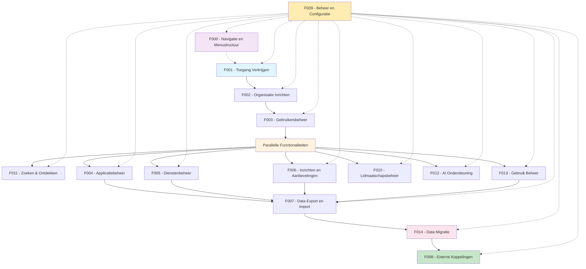

# Overzicht Functionaliteiten

De GEMMA Softwarecatalogus bestaat uit 14 hoofdfunctionaliteiten die door verschillende typen gebruikers worden gebruikt. Hieronder een overzicht:

## Functionaliteiten Matrix

| Functionaliteit | 🏛️ Gemeenten | 🤝 Samenwerkingen | 🏢 Leveranciers | ⚙️ Functioneel Beheer |
|-----------------|---------------|-------------------|------------------|----------------------|
| [F000 - Navigatie en Menustructuur](./F000-navigatie-en-menustructuur.md) | ✅ Gemeente UI | ✅ Samenwerking UI | ✅ Leverancier UI | ✅ Beheer UI |
| [F001 - Toegang Verkrijgen](./F001-toegang-verkrijgen.md) | ✅ Via VNG | ✅ Via VNG | ✅ Aanmelden | ✅ Direct |
| [F002 - Organisatie Inrichten](./F002-organisatie-inrichten.md) | ✅ Profiel | ✅ Leden werven | ✅ Bedrijfsprofiel | ✅ Organisaties beheren |
| [F003 - Gebruikersbeheer](./F003-gebruikersbeheer.md) | ✅ Collega's | ❌ N.v.t. | ✅ Team | ✅ Alle gebruikers |
| [F004 - Applicatiebeheer](./F004-applicatiebeheer.md) | ✅ Landschap | ✅ Aanbieden | ✅ Eigen apps | ✅ Concepten |
| [F005 - Dienstenbeheer](./F005-dienstenbeheer.md) | ✅ Zoeken/beoordelen | ❌ N.v.t. | ✅ Toevoegen | ❌ N.v.t. |
| [F006 - Inzichten en Aanbevelingen](./F006-inzichten-en-aanbevelingen.md) | ✅ AI/benchmarking | ❌ N.v.t. | ✅ Promotie | ✅ Rapportages |
| [F007 - Data Export en Import](./F007-data-export-import.md) | ✅ Export | ❌ N.v.t. | ✅ Export/Import | ✅ Samenvoegen |
| [F008 - Externe Koppelingen](./F008-externe-koppelingen.md) | ✅ Synchronisatie | ❌ N.v.t. | ❌ N.v.t. | ❌ N.v.t. |
| [F009 - Beheer en Configuratie](./F009-beheer-en-configuratie.md) | ❌ N.v.t. | ❌ N.v.t. | ❌ N.v.t. | ✅ Systeem beheer |
| [F010 - Lidmaatschapsbeheer](./F010-lidmaatschapsbeheer.md) | ✅ Lid worden | ✅ Leden beheren | ✅ Lid worden | ✅ Ondersteuning |
| [F011 - Zoeken & Ontdekken](./F011-zoeken-en-ontdekken.md) | ✅ Software zoeken | ✅ Oplossingen vinden | ✅ Marktonderzoek | ✅ Overzicht |
| [F012 - AI Ondersteuning](./F012-ai-ondersteuning.md) | ✅ AI Advies | ✅ Trends | ✅ Markt Intelligence | ✅ Data Analyse |
| [F013 - Gebruik Beheer](./F013-gebruik-beheer.md) | ✅ Applicatielandschap | ✅ Collectief gebruik | ✅ Klantoverzicht | ✅ Validatie |
| [F014 - Data Migratie](./F014-data-migratie.md) | ✅ Legacy migratie | ✅ Collectieve data | ✅ Product migratie | ✅ Migratie ondersteuning |

## Programma van Eisen (PvE) Overzicht

Alle functionaliteiten zijn gebaseerd op de PvE eisen uit de GitHub issues. Hieronder een overzicht van alle PvE eisen per onderdeel:

| Issue | Titel | Status | Onderdeel | Functionaliteit |
|-------|-------|--------|-----------|------------------|
| #174 | Testresultaten 2025-09-24 (blok 2) | open | Test | N.v.t. (operationeel) |
| #173 | Testresultaten 2025-09-24 (Blok 1) | open | Test | N.v.t. (operationeel) |
| #172 | Testresultaten Jeroen de Ruig 5/9/2025 acceptatietest | open | Test | N.v.t. (operationeel) |
| #144 | Overzicht organisaties met zoek- en filteropties | open | Gebruik | F011 - Zoeken & Ontdekken |
| #143 | Aanbieder registreren die nog niet bestaat | open | Aanbod | F002 - Organisatie Inrichten |
| #142 | Nieuwe organisaties en gebruikersaccounts aanmaken | closed | Beheer | F002 - Organisatie Inrichten |
| #141 | Organisaties samenvoegen bij herindeling/overname | open | Datamigratie | F014 - Data Migratie |
| #140 | Overzicht organisaties met status 'concept' | closed | Beheer | F002 - Organisatie Inrichten |
| #139 | Organisatiegegevens in concept registreren | closed | Aanbod | F001 - Toegang Verkrijgen |
| #106 | Tonen beschrijving bij concept (tooltip/glossary) | closed | Aanbod | F004 - Aanbod Beheer |
| #105 | Aanbieders zien geen applicatielandschappen van gebruikers | open | Gebruik | F005 - Dienstenbeheer |
| #75 | Rapportages maken over catalogus data | open | Beheer | F006 - Inzichten en Aanbevelingen |
| #74 | Overzicht organisaties die pakketten/diensten gebruiken | open | Gebruik | F005 - Dienstenbeheer |
| #73 | Meerdere contactpersonen registreren per pakket | open | Aanbod | F002 - Organisatie Inrichten |
| #72 | Exporteren ArchiMate | open | Datamigratie | F014 - Data Migratie |
| #71 | Importeren ArchiMate | open | Datamigratie | F014 - Data Migratie |
| #70 | Ontsluiten architectuur concepten (filteren) | open | Datamigratie | F014 - Data Migratie |
| #69 | Doorverwijzing naar GEMMA online vanuit architectuurconcepten | closed | Aanbod | F004 - Aanbod Beheer |
| #68 | Plotten op views | closed | Gebruik | F007 - Data Export en Import |
| #66 | Aanvullende organisatie-informatie delen | open | Aanbod | F002 - Organisatie Inrichten |
| #65 | Collega's toegang geven tot softwarecatalogus | open | Beheer | F003 - Gebruikersbeheer |
| #64 | Meerdere type gebruikersrollen met rechten | closed | Beheer | F003 - Gebruikersbeheer |
| #63 | Eerste (beheer)account aanmaken/fiateren | closed | Beheer | F003 - Gebruikersbeheer |
| #62 | Gebruikers gekoppeld aan organisatie | closed | Beheer | F003 - Gebruikersbeheer |
| #61 | Nieuwe gebruikers aanmelden bij bestaande organisatie | closed | Beheer | F003 - Gebruikersbeheer |
| #60 | Voor meerdere organisaties pakketoverzichten bewerken | open | Gebruik | F003 - Gebruikersbeheer |
| #59 | Alle informatie over applicaties invoeren | open | Gebruik | F013 - Gebruik Beheer |
| #58 | Pakketten door aanbod-beheerders koppelen aan applicatielandschap | open | Gebruik | F013 - Gebruik Beheer |
| #57 | Samenwerkingsverband pakketten opvoeren voor gemeenten | open | Gebruik | F010 - Lidmaatschapsbeheer |
| #56 | Koppelingen registreren tussen applicaties | open | Gebruik | F013 - Gebruik Beheer |
| #55 | Bij koppeling aangeven of standaard wordt gebruikt | open | Gebruik | F013 - Gebruik Beheer |
| #54 | Statistieken over pakketoverzicht | open | Gebruik | F006 - Inzichten en Aanbevelingen |
| #30 | Menustructuur kunnen aanpassen | closed | Beheer | F009 - Beheer en Configuratie |
| #29 | Toelichtende teksten en foutmeldingen maken/wijzigen | closed | Beheer | F009 - Beheer en Configuratie |
| #28 | Verschillende soorten content publiceren | closed | Beheer | F009 - Beheer en Configuratie |
| #23 | Reeds geregistreerde gegevens weer zien in nieuwe catalogus | open | Datamigratie | F014 - Data Migratie |
| #22 | Pakketoverzicht filteren op eigenschappen | open | Gebruik | F007 - Data Export en Import |
| #21 | Zoeken en filteren in gebruikte pakketten | open | Gebruik | F004 - Aanbod Beheer |
| #20 | 'Gluren bij de buren' - pakketten andere gemeenten | open | Gebruik | F006 - Inzichten en Aanbevelingen |
| #19 | Zien welke gemeenten pakket gebruiken | open | Gebruik | F006 - Inzichten en Aanbevelingen |
| #18 | Geregistreerde pakketten selecteren en toevoegen | open | Gebruik | F013 - Gebruik Beheer |
| #15 | Data vanuit softwarecatalogus exporteren | open | Datamigratie | F007 - Data Export en Import |
| #12 | Namens aanbieder pakketten opvoeren die ontbreken | open | Gebruik | F013 - Gebruik Beheer |
| #11 | Overzicht door gebruik-beheerders geregistreerde pakketten | open | Beheer | F004 - Aanbod Beheer |
| #10 | Registreren welke organisaties pakket gebruiken | open | Aanbod | F006 - Inzichten en Aanbevelingen |
| #9 | Aangeven of applicatie on-premise of Cloud wordt aangeboden | closed | Aanbod | F004 - Aanbod Beheer |
| #8 | Door gebruik-beheerders toegevoegde pakketten zien | open | Aanbod | F006 - Inzichten en Aanbevelingen |
| #7 | Licentievorm per pakket registreren | closed | Aanbod | F004 - Aanbod Beheer |
| #6 | Registreren welke standaarden door pakket worden ondersteund | open | Aanbod | F004 - Aanbod Beheer |
| #5 | Voor elk pakket contactpersoon aanwijzen | closed | Aanbod | F004 - Aanbod Beheer |
| #3 | Pakketten zoeken/filteren op standaarden ondersteuning | open | Aanbod | F005 - Dienstenbeheer |

### Onderdelen Verdeling
- **Beheer** (9 issues): Systeem beheer, gebruikersbeheer, organisatie beheer
- **Aanbod** (11 issues): Software aanbieden, productinformatie, leveranciers
- **Gebruik** (16 issues): Applicatielandschap, software gebruik, gemeenten
- **Datamigratie** (6 issues): Import/export, legacy migratie, data overzetten
- **Test** (3 issues): Operationele test issues (niet functioneel)

## Functionaliteiten Flow

## Gebruikerstypen

### 🏛️ Gemeenten
Gemeenten gebruiken de catalogus om hun applicatielandschap te beheren, software te zoeken, en inzichten te verkrijgen over hun ICT-omgeving.

**Primaire functionaliteiten**: F000, F001, F002, F003, F004, F005, F006, F007, F008, F010, F011, F012, F013, F014

### 🤝 Samenwerkingen & Communities
Samenwerkingen hebben een unieke positie als zowel aanbieder als afnemer van software voor hun leden.

**Primaire functionaliteiten**: F000, F001, F002, F004, F010, F011, F012, F013, F014

### 🏢 Leveranciers
Leveranciers gebruiken de catalogus om hun software zichtbaar te maken voor gemeenten en diensten aan te bieden.

**Primaire functionaliteiten**: F000, F001, F002, F003, F004, F005, F006, F007, F010, F011, F012, F013, F014

### ⚙️ Functioneel Beheer
VNG medewerkers die de catalogus beheren en organisaties ondersteunen.

**Primaire functionaliteiten**: F000, F001, F002, F003, F004, F006, F007, F009, F010, F011, F012, F013, F014

## Implementatie Volgorde

1. **Interface** (F000): Navigatie en menustructuur
2. **Basis** (F001-F003): Toegang, organisatie en gebruikers
3. **Kern** (F004-F005): Applicaties en diensten
4. **Samenwerking** (F010): Lidmaatschapsbeheer
5. **Gebruik** (F013): Applicatielandschap beheer
6. **Toegevoegde Waarde** (F006, F012): Inzichten en AI ondersteuning
7. **Zoeken** (F011): Zoeken en ontdekken
8. **Integratie** (F007-F008): Export en externe koppelingen
9. **Migratie** (F014): Data migratie ondersteuning
10. **Beheer** (F009): Systeem beheer en configuratie

## Autorisatie Rollen

De autorisatie matrix gebruikt de volgende rollen:

- **Aanbod-beheerder**: Leveranciers die hun software aanbieden
- **Gebruik-beheerder**: Gemeentelijke beheerders die software gebruik beheren
- **Gebruik-raadpleger**: Gemeentelijke medewerkers die alleen kunnen kijken
- **Functioneel beheerder**: VNG medewerkers die de catalogus beheren
- **VNG-raadpleger**: VNG medewerkers met alleen lees-toegang
- **Bezoeker**: Publieke bezoekers zonder account