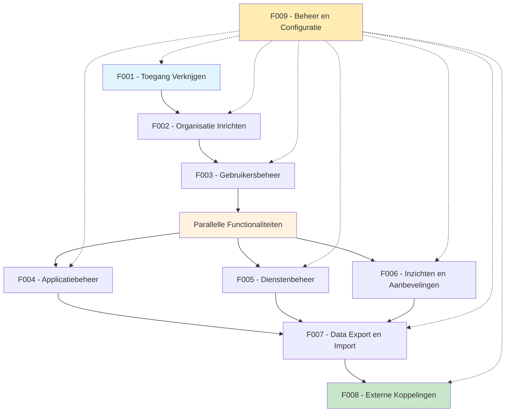

# Overzicht Functionaliteiten

De GEMMA Softwarecatalogus bestaat uit 9 hoofdfunctionaliteiten die door verschillende typen gebruikers worden gebruikt. Hieronder een overzicht:

## Functionaliteiten Matrix

| Functionaliteit | 🏛️ Gemeenten | 🤝 Samenwerkingen | 🏢 Leveranciers | ⚙️ Functioneel Beheer |
|-----------------|---------------|-------------------|------------------|----------------------|
| [F001 - Toegang Verkrijgen](./F001-toegang-verkrijgen.md) | ✅ Via VNG | ✅ Via VNG | ✅ Aanmelden | ✅ Direct |
| [F002 - Organisatie Inrichten](./F002-organisatie-inrichten.md) | ✅ Profiel | ✅ Leden werven | ✅ Bedrijfsprofiel | ✅ Organisaties beheren |
| [F003 - Gebruikersbeheer](./F003-gebruikersbeheer.md) | ✅ Collega's | ❌ N.v.t. | ✅ Team | ✅ Alle gebruikers |
| [F004 - Applicatiebeheer](./F004-applicatiebeheer.md) | ✅ Landschap | ✅ Aanbieden | ✅ Eigen apps | ✅ Concepten |
| [F005 - Dienstenbeheer](./F005-dienstenbeheer.md) | ✅ Zoeken/beoordelen | ❌ N.v.t. | ✅ Toevoegen | ❌ N.v.t. |
| [F006 - Inzichten en Aanbevelingen](./F006-inzichten-en-aanbevelingen.md) | ✅ AI/benchmarking | ❌ N.v.t. | ✅ Promotie | ✅ Rapportages |
| [F007 - Data Export en Import](./F007-data-export-import.md) | ✅ Export | ❌ N.v.t. | ✅ Export/Import | ✅ Samenvoegen |
| [F008 - Externe Koppelingen](./F008-externe-koppelingen.md) | ✅ Synchronisatie | ❌ N.v.t. | ❌ N.v.t. | ❌ N.v.t. |
| [F009 - Beheer en Configuratie](./F009-beheer-en-configuratie.md) | ❌ N.v.t. | ❌ N.v.t. | ❌ N.v.t. | ✅ Systeem beheer |

## Functionaliteiten Flow

## Gebruikerstypen

### 🏛️ Gemeenten
Gemeenten gebruiken de catalogus om hun applicatielandschap te beheren, software te zoeken, en inzichten te verkrijgen over hun ICT-omgeving.

**Primaire functionaliteiten**: F001, F002, F003, F004, F005, F006, F007, F008

### 🤝 Samenwerkingen & Communities
Samenwerkingen hebben een unieke positie als zowel aanbieder als afnemer van software voor hun leden.

**Primaire functionaliteiten**: F001, F002, F004

### 🏢 Leveranciers
Leveranciers gebruiken de catalogus om hun software zichtbaar te maken voor gemeenten en diensten aan te bieden.

**Primaire functionaliteiten**: F001, F002, F003, F004, F005, F006, F007

### ⚙️ Functioneel Beheer
VNG medewerkers die de catalogus beheren en organisaties ondersteunen.

**Primaire functionaliteiten**: F001, F002, F003, F004, F006, F007, F009

## Implementatie Volgorde

1. **Basis** (F001-F003): Toegang, organisatie en gebruikers
2. **Kern** (F004-F005): Applicaties en diensten
3. **Toegevoegde Waarde** (F006): Inzichten en aanbevelingen
4. **Integratie** (F007-F008): Export en externe koppelingen
5. **Beheer** (F009): Systeem beheer en configuratie

## Autorisatie Rollen

De autorisatie matrix gebruikt de volgende rollen:

- **Aanbod-beheerder**: Leveranciers die hun software aanbieden
- **Gebruik-beheerder**: Gemeentelijke beheerders die software gebruik beheren
- **Gebruik-raadpleger**: Gemeentelijke medewerkers die alleen kunnen kijken
- **Functioneel beheerder**: VNG medewerkers die de catalogus beheren
- **VNG-raadpleger**: VNG medewerkers met alleen lees-toegang
- **Bezoeker**: Publieke bezoekers zonder account
