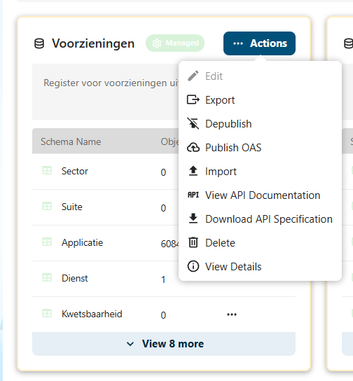

# API-documentatie raadplegen

De Softwarecatalogus biedt een uitgebreide REST API waarmee externe systemen data kunnen opvragen en beheren. De API-documentatie is beschikbaar als interactieve Redoc-pagina en als OpenAPI-specificatie.

## API-documentatie vinden

### Via de beheeromgeving

1. Log in op het Nextcloud-backend als **admin**
2. Klik op **OpenRegister** in de linkermenubalk
3. Klik op **API Documentation** in het linkermenu
4. De API-documentatie opent in een nieuw tabblad



### Via Redocly (openbaar)

De API-documentatie is openbaar beschikbaar via Redocly. Deze pagina's tonen de volledige OpenAPI-specificatie in een interactief formaat:

| Register | Redocly-documentatie | Beschrijving |
|----------|---------------------|--------------|
| **Voorzieningen** | [Softwarecatalogus API](https://redocly.github.io/redoc/?url=https%3A%2F%2Fbackend.accept.opencatalogi.nl%2Findex.php%2Fapps%2Fopenregister%2Fapi%2Fregisters%2F2%2Foas) | Applicaties, diensten, koppelingen, organisaties, standaarden |
| **GEMMA/AMEF** | [GEMMA-architectuur API](https://redocly.github.io/redoc/?url=https%3A%2F%2Fbackend.accept.opencatalogi.nl%2Findex.php%2Fapps%2Fopenregister%2Fapi%2Fregisters%2F3%2Foas#tag/Element) | Elementen, relaties, views, modellen, property-definities |

### Via de documentatiesite

De API-documentatie is ook beschikbaar op de documentatiesite:

| Documentatie | URL | Beschrijving |
|-------------|-----|--------------|
| **Softwarecatalogus API** | [`/Softwarecatalogus/api`](/api) | Volledige API-specificatie van de Softwarecatalogus |
| **GEMMA API** | [`/Softwarecatalogus/gemma`](/gemma) | GEMMA-standaard API-specificatie |

## Beschikbare endpoints

De API biedt endpoints voor alle objecttypen in de Softwarecatalogus:

| Endpoint | Beschrijving |
|----------|--------------|
| **Applicaties** | Software-applicaties in de catalogus |
| **Organisaties** | Gemeenten, leveranciers en samenwerkingsverbanden |
| **Voorzieningen** | Diensten en koppelingen |
| **Standaarden** | Ondersteunde standaarden en versies |
| **Referentiecomponenten** | GEMMA-referentiecomponenten |

## GEMMA-architectuur API

De GEMMA-architectuur (ArchiMate-modeldata) is opvraagbaar via een eigen register in de API. Dit is een invulling van [issue #148](https://github.com/VNG-Realisatie/Softwarecatalogus/issues/148): *"De GEMMA-architectuur is opvraagbaar met een API"*.

Het GEMMA/AMEF-register bevat de volgende objecttypen:

| Objecttype | Aantal | Beschrijving |
|------------|--------|--------------|
| **Element** | 2.741 | ArchiMate-elementen (applicatiecomponenten, bedrijfsprocessen, capabilities, etc.) |
| **Relation** | 5.790 | Relaties tussen elementen (composition, association, realization, etc.) |
| **View** | 74 | ArchiMate-views (diagrammen) |
| **Model** | 1 | Het GEMMA-architectuurmodel |
| **PropertyDefinition** | 249 | Definitie van eigenschappen (metadata-velden zoals "bron", "Object ID", "GEMMA type") |

De **PropertyDefinitions** bevatten de definities van de metadata-velden die in het AMEFF-bestand via `propertyDefinitionRef` worden gekoppeld aan elementen en relaties. In de genormaliseerde velden op het hoofdniveau van objecten zijn deze properties al geexpandeerd (bijv. `gemmaType`, `toelichting`, `bron`). De PropertyDefinition-endpoint is daarom voornamelijk relevant voor technische integraties die de ruwe XML-structuur verwerken.

### ID-velden

Het GEMMA-model kent meerdere identificatievelden. Dit is historisch gegroeid en elk ID heeft een eigen functie:

| Veld | Herkomst | Beschrijving | Voorbeeld |
|------|----------|--------------|-----------|
| `identifier` | ArchiMate (Archi-tool) | Door de Archi-tool gegenereerde GUID. Wordt gebruikt om interne relaties te leggen (`source`/`target` in relaties verwijzen naar deze `identifier`). Dit is het `identifier`-attribuut uit het AMEFF XML-bestand. | `id-9309d3a988c244f39a8f72d9f4e91f50` |
| `objectId` | GEMMA-beheer | Door GEMMA-beheer toegekende UUID. Onderdeel van stabiele URI's naar GEMMA-objecten. Komt overeen met de URL's op [GEMMA online](https://gemmaonline.nl) (`gemmaonline.nl/wiki/GEMMA/id-{objectId}`). | `0eb3c0ce-eedd-4498-a5ba-8d7dc2a6df15` |
| `@self.id` | Open Register | Intern ID van het Open Register-platform. Wordt automatisch gegenereerd bij import en is gelijk aan het `objectId` wanneer dit beschikbaar is. | `0eb3c0ce-eedd-4498-a5ba-8d7dc2a6df15` |

:::note Niet alle ArchiMate-modellen hebben een Object ID
Het veld `objectId` is specifiek voor het GEMMA-model en wordt door GEMMA-beheer onderhouden. Andere ArchiMate-modellen die in de toekomst mogelijk worden geimporteerd, hoeven dit veld niet te bevatten. De API werkt ook zonder `objectId` — het `identifier`-veld is altijd aanwezig.
:::

### De `xml`-property

Elk object in het GEMMA/AMEF-register bevat een `xml`-property met de **volledige, ongewijzigde data** uit het oorspronkelijke AMEFF XML-bestand. Dit omvat geneste elementen zoals `name` (met taalattribuut), `documentation` en alle `properties` met hun `propertyDefinitionRef`-verwijzingen.

De overige velden op het hoofdniveau van het object (zoals `type`, `gemmaType`, `toelichting`) zijn **geextraheerde en genormaliseerde waarden** uit deze XML-structuur, bedoeld voor eenvoudig filteren en weergeven. De `xml`-property dient als bron van waarheid wanneer de volledige ArchiMate-data nodig is.

:::tip XML uitsluiten voor performance
De `xml`-property kan aanzienlijk groot zijn. Gebruik `_unset=xml` om deze uit te sluiten wanneer u alleen de genormaliseerde velden nodig heeft, of gebruik `_fields` om precies op te geven welke velden u wilt ontvangen.
:::

### Voorbeeldverzoeken

Alle elementen opvragen:

```
GET /index.php/apps/openregister/api/objects/vng-gemma/element
```

Een specifiek element opvragen (op UUID):

```
GET /index.php/apps/openregister/api/objects/vng-gemma/element/{uuid}
```

Alleen specifieke velden opvragen (zie [Queryparameters](#queryparameters)):

```
GET /index.php/apps/openregister/api/objects/vng-gemma/element?_fields=identifier,type,gemmaType,toelichting
```

Alle relaties van een bepaald ArchiMate-type opvragen:

```
GET /index.php/apps/openregister/api/objects/vng-gemma/relation?type=Composition
```

## Queryparameters

De API ondersteunt diverse queryparameters om de response aan te passen:

| Parameter | Doel | Voorbeeld |
|-----------|------|-----------|
| `_fields` | Alleen opgegeven velden retourneren (sparse fieldset) | `?_fields=identifier,type,gemmaType` |
| `_extend` | Gerelateerde objecten inline meegeven | `?_extend=organisatie,contactpersoon` |
| `_unset` | Specifieke velden uitsluiten van de response | `?_unset=xml,properties` |
| `_search` | Zoeken in objecteigenschappen | `?_search=gemeentelijk` |
| `_limit` | Maximum aantal resultaten per pagina | `?_limit=50` |
| `_offset` | Resultaten overslaan (paginering) | `?_offset=100` |
| `_page` | Paginanummer | `?_page=2` |

:::note Parameters zonder underscore
De parameters zijn ook beschikbaar zonder underscore-prefix: `?fields=...`, `?extend=...`, etc.
:::

## Basisgebruik

### Objecten opvragen

De API werkt via standaard HTTP-verzoeken. Een voorbeeld om alle applicaties op te vragen:

```
GET /index.php/apps/opencatalogi/api/search?_queries[]=voorzieningen
```

### Authenticatie

- **Publieke endpoints** (zoeken, raadplegen) zijn zonder authenticatie beschikbaar
- **Beheerendpoints** (aanmaken, bewerken, verwijderen) vereisen authenticatie via Nextcloud basic auth

### Responsformaat

Alle API-responses worden geretourneerd in **JSON-formaat**. De Redoc-documentatie toont voor elk endpoint de verwachte request- en response-structuur.

## Ontwerpkeuzes

Bij de implementatie van de GEMMA-architectuur API ([#148](https://github.com/VNG-Realisatie/Softwarecatalogus/issues/148)) zijn een aantal bewuste ontwerpkeuzes gemaakt. Deze sectie documenteert de overwegingen achter die keuzes.

### API-naam: GEMMA i.p.v. ArchiMate

In [#148](https://github.com/VNG-Realisatie/Softwarecatalogus/issues/148) werd voorgesteld om de API te hernoemen van "GEMMA API" naar "ArchiMate API". Deze hernoemenming is op dit moment niet doorgevoerd. Bij het werkend krijgen van de AMEF-platen op de frontend was het noodzakelijk om zo min mogelijk wijzigingen aan het datamodel te doen. Het hernoemen van het register zou de bestaande views en frontend-integratie in gevaar brengen. Het register-slug `vng-gemma` blijft daarom gehandhaafd.

### Veldnaam `type` i.p.v. `archiMateType`

Het ArchiMate-type wordt voor zowel elementen als relaties via het veld `type` geretourneerd, niet als `archiMateType`. Bij elementen bevat dit waarden als `ApplicationComponent`, `BusinessProcess`, `Capability`; bij relaties waarden als `Composition`, `Association`, `Realization`. Dit is een bewuste keuze voor consistentie:

- **Alle objecttypen** in het voorzieningen-datamodel (applicatie, dienst, koppeling, organisatie) gebruiken `type` als veldnaam voor het objecttype
- De ontwikkelrichting is juist om samengestelde veldnamen zoals `dienstType` te **vereenvoudigen** naar `type`
- Een uitzondering maken voor ArchiMate-objecten zou inconsistentie introduceren in de API
- Het oorspronkelijke ArchiMate-element `<element xsi:type="...">` wordt direct vertaald naar het `type`-veld

### Geen `model-id` queryparameter

Het filteren op model via een `model-id` parameter is op dit moment niet geimplementeerd:

- Er is momenteel **slechts een GEMMA-model** in het register
- Het ondersteunen van meerdere modellen was een **wens**, geen eis vanuit het PvE
- Het implementeren van model-filtering introduceert extra complexiteit en risico op regressie, zonder dat daar op dit moment een concrete use-case tegenover staat

Mocht in de toekomst behoefte ontstaan aan meerdere modellen, dan kan dit alsnog worden toegevoegd.

### Lege waarden worden meegeleverd

De API retourneert alle velden van een object, ook als de waarde `null` is. Uit analyse van de database blijkt dat 26 van de 86 elementvelden (circa 30%) **nooit** gevuld zijn in de huidige dataset. Toch worden deze meegeleverd. De reden hiervoor is de architectuur van de frontend.

**TypeScript-entiteiten in de frontend**

De frontend van de Softwarecatalogus is gebouwd met [TypeScript](https://www.typescriptlang.org/) en definieert voor elk objecttype een zogeheten *entity type*. Dit is een getypeerde objectdefinitie die beschrijft welke velden een object heeft en van welk datatype ze zijn. Bijvoorbeeld:

```typescript
// Voorbeeld uit opencatalogi/src/entities/publication/publication.types.ts
export type TPublication = {
    id: string
    title: string
    summary: string
    description: string
    status: 'Concept' | 'Published' | 'Withdrawn' | 'Archived'
    organization: string
    // ... alle verwachte velden
}
```

De frontend-code gaat ervan uit dat **alle gedeclareerde velden aanwezig zijn** in de API-response, ook als de waarde `null` is. Wanneer de API plotseling velden weglaat, kan dit leiden tot runtime-fouten wanneer de code `object.eigenschap` probeert te benaderen op een veld dat niet in de response zit (`undefined` i.p.v. `null`).

Meer informatie over TypeScript-types: [TypeScript Handbook — Object Types](https://www.typescriptlang.org/docs/handbook/2/objects.html)

**Sparse fieldsets via `_fields` als alternatief**

Om toch selectief alleen gevulde of relevante velden op te halen biedt de API de `_fields` queryparameter. Dit is conform de [NL API Strategie — API-09](https://docs.geostandaarden.nl/api/def-hr-API-Strategie-ext-20211013/#api-09) (sparse fieldsets / gedeeltelijke representatie).

Gebruik:

```
GET /api/objects/vng-gemma/element?_fields=identifier,type,gemmaType,toelichting,gemmaUrl
```

Hiermee ontvangt u **alleen de opgegeven velden**, plus de verplichte metadatavelden `@self` en `id`. Velden die niet in de `_fields`-lijst staan worden weggelaten uit de response — ook als ze een waarde hebben.

Dit geeft API-consumenten volledige controle over de payloadgrootte, zonder dat de standaard response-structuur verandert voor bestaande integraties.

## Tips voor gebruik

:::tip Interactieve documentatie
De Redoc-pagina's zijn interactief: u kunt de endpoints uitklappen om de parameters, request body en mogelijke responses te bekijken. Gebruik de zoekfunctie bovenin om snel een specifiek endpoint te vinden.
:::

:::tip OpenAPI-specificatie downloaden
De onderliggende OpenAPI-specificaties (YAML/JSON) kunnen worden gebruikt om automatisch API-clients te genereren voor uw programmeertaal. Dit is handig bij het bouwen van integraties met de Softwarecatalogus.
:::

:::tip Payload verkleinen met `_fields`
De GEMMA-elementen hebben 86 velden, waarvan veel vaak leeg zijn. Gebruik `_fields` om alleen de velden op te halen die u nodig heeft. Dit verkleint de response en verbetert de performance aanzienlijk, vooral bij grote collecties.
:::

## Bekende aandachtspunten

- De API-documentatie wordt automatisch gegenereerd vanuit de OpenAPI-specificatie. Bij wijzigingen in de API kan het even duren voordat de documentatie is bijgewerkt
- Niet alle endpoints zijn publiek toegankelijk — beheerendpoints vereisen de juiste autorisatierol
- De rate limiting van de API is ingesteld op basis van het IP-adres. Bij veelvuldig gebruik vanuit hetzelfde adres kan tijdelijk een beperking optreden

## Gerelateerde handleidingen

- [Export beheer](./export-beheer.md) — Registers en schema's exporteren via de beheeromgeving
- [Facetbeheer](./facet-beheer.md) — Zoekfacetten configureren (bepaalt welke filters beschikbaar zijn in de API)
