# Applicatiebeheer

Applicaties zijn software producten die door leveranciers worden aangeboden en door gemeenten worden gebruikt. Leveranciers publiceren applicaties via een 6-staps wizard, gemeenten registreren hun gebruik via een aparte wizard.

## Tabeloverzicht

### Als leverancier

Navigeer naar `/beheer/applicaties` om het overzicht van uw gepubliceerde applicaties te zien. De tabel toont alleen applicaties van uw eigen organisatie.

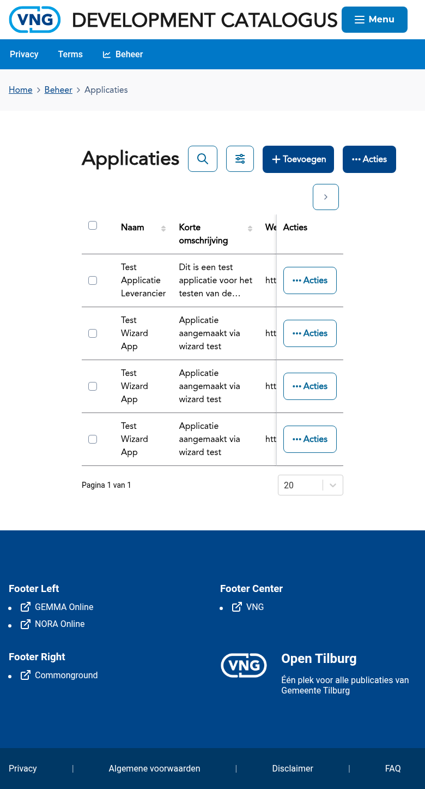

### Als gemeente

Gemeenten zien in het applicatieoverzicht de applicaties die zij in gebruik hebben geregistreerd.

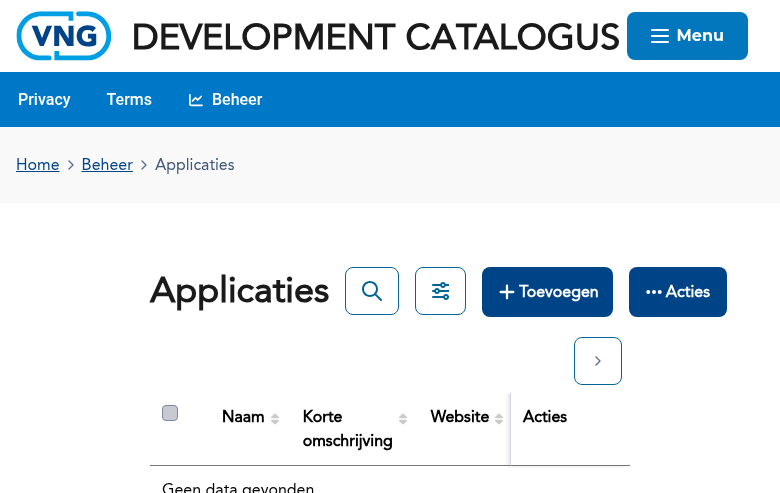

---

## Als leverancier: applicatie publiceren

Als leverancier publiceert u applicaties via een wizard met 6 stappen. De wizard is bereikbaar via:
- Het beheerdashboard → kaart **Applicatie publiceren**
- Direct via `/forms/applicatie?type=eigen`

### Stap 1 — Basisgegevens

Vul de basisgegevens van uw applicatie in: naam, beschrijving, applicatietype en hostingvorm.

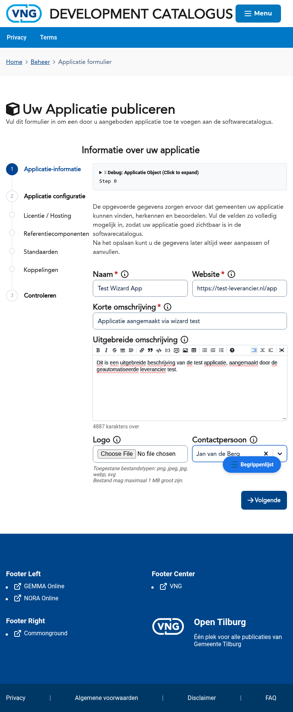

### Stap 2 — Aanvullende informatie

Voeg aanvullende informatie toe zoals de website-URL, licentievorm en beschikbare versies.

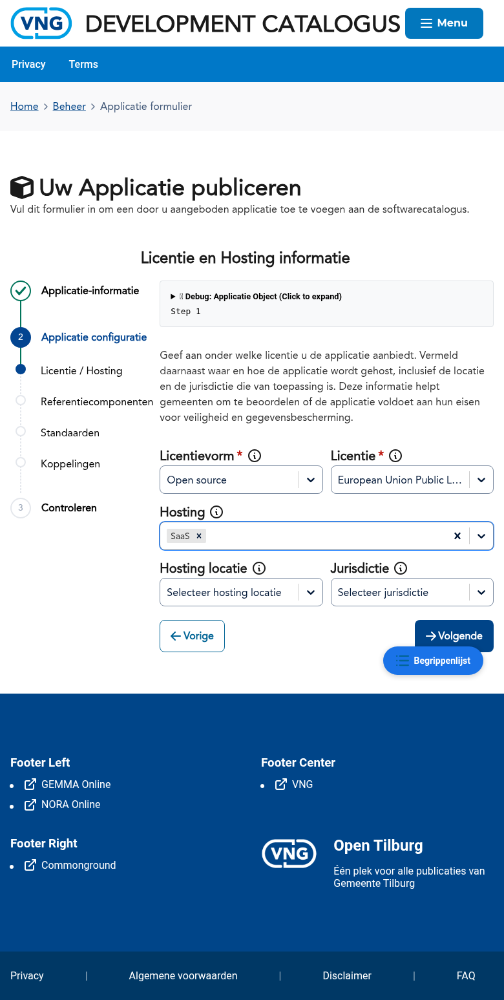

### Stap 3 — Referentiecomponenten

Koppel uw applicatie aan GEMMA-referentiecomponenten. Dit maakt uw applicatie vindbaar voor gemeenten die zoeken op basis van hun functionele behoeften.

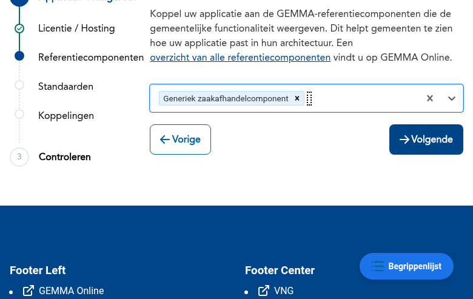

### Stap 4 — Standaarden

Geef aan welke standaarden uw applicatie ondersteunt. Standaarden worden automatisch voorgesteld op basis van de geselecteerde referentiecomponenten.

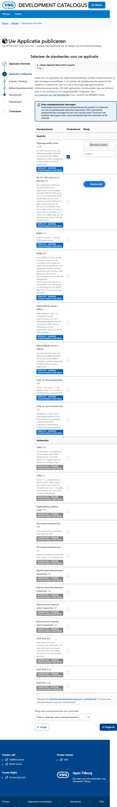

### Stap 5 — Koppelingen

Registreer de beschikbare koppelingen van uw applicatie met andere systemen of buitengemeentelijke voorzieningen.

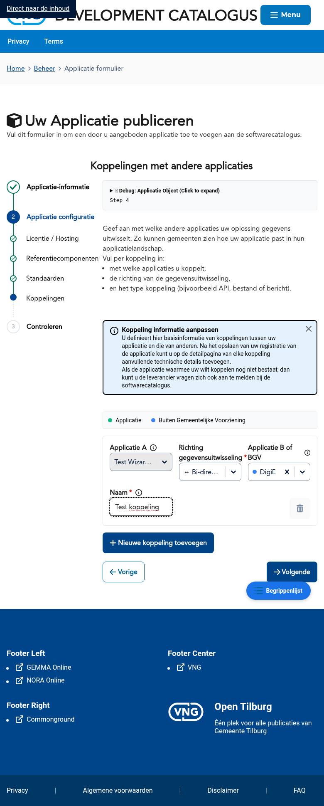

### Stap 6 — Controleren

Controleer alle ingevoerde gegevens voordat u de applicatie publiceert. U kunt teruggaan naar eerdere stappen om wijzigingen aan te brengen.

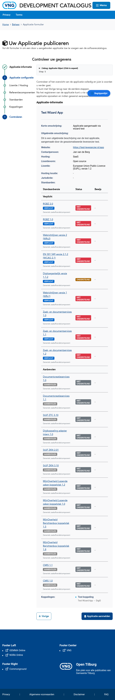

### Resultaat

Na het klikken op **Publiceren** wordt uw applicatie aangemeld in de catalogus.

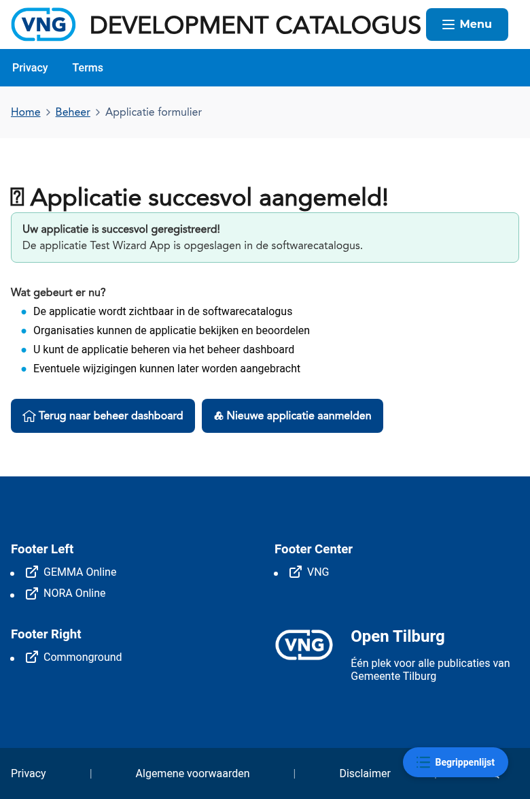

---

## Als gemeente: gebruik registreren

Als gemeente registreert u het gebruik van een applicatie via een wizard met 4 stappen. De wizard is bereikbaar via:
- Het beheerdashboard → kaart **Applicatie toevoegen**
- Direct via `/forms/gebruik/applicatie?type=gemeente`

### Stap 1 — Applicatie selecteren

Selecteer de applicatie die u in gebruik wilt nemen uit de catalogus. U kunt zoeken op naam. Als de gewenste applicatie niet in de lijst staat, kunt u deze handmatig toevoegen via de knop "Ik kan de gewenste applicatie niet vinden".

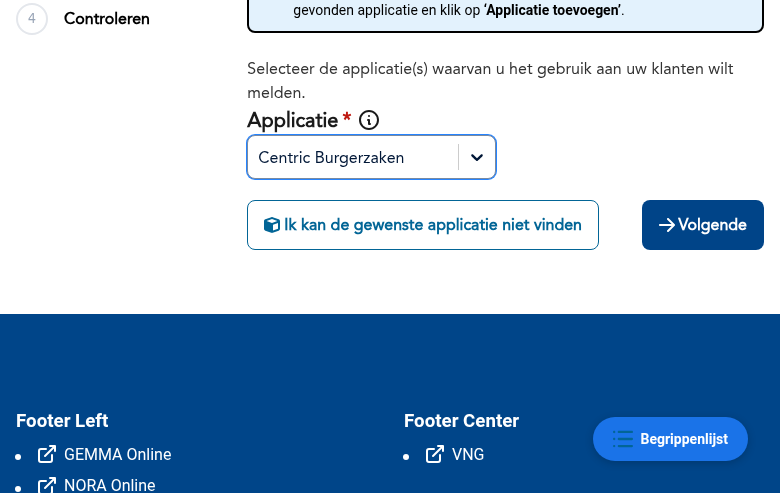

### Stap 2 — Gebruiksinformatie

Vul de gebruiksinformatie in: hosting, interne notitie, status (bijv. Verwerving), startdatum en applicatieversie.

### Stap 3 — Referentiecomponenten

Voeg eventueel extra referentiecomponenten toe naast de componenten die door de leverancier zijn aangegeven.

### Stap 4 — Controleren

Controleer alle gegevens en klik op **Gebruik registreren** om het gebruik vast te leggen.

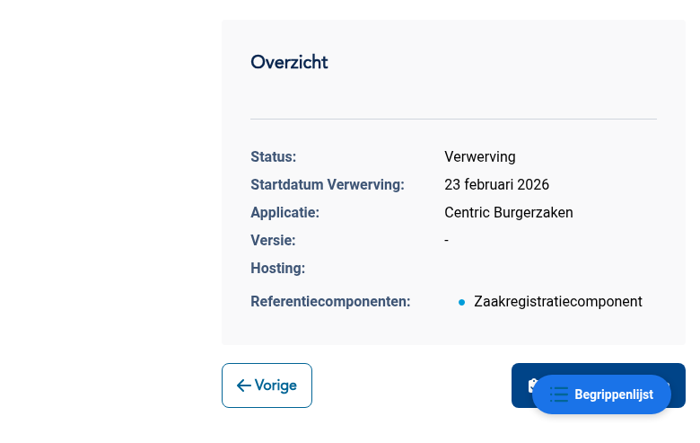

### Resultaat

Na registratie verschijnt een succesbericht met een samenvatting van het geregistreerde gebruik.

---

## Bekende aandachtspunten

- De leverancier-wizard maakt automatisch een standaard **applicatieversie** aan voor SaaS-applicaties
- Bij het registreren van gebruik als gemeente wordt de status standaard op **Verwerving** gezet
- Applicaties zijn pas zichtbaar in de publieke catalogus nadat ze volledig zijn gepubliceerd

## Gerelateerde documentatie

- [K002 - Applicatie](/docs/Concepten/k002-applicatie) — Uitleg van het concept Applicatie
- [F004 - Aanbod Beheer](/docs/Functionaliteiten/f004-aanbod-beheer) — Functionele specificatie van applicatiebeheer
- [Gebruik](./gebruik.md) — Handleiding voor het beheren van gebruik
