# Dienstenbeheer

Diensten zijn specifieke services die door leveranciers worden aangeboden op applicaties, zoals functioneel beheer, technische ondersteuning, implementatie en training. Leveranciers publiceren diensten via een 3-staps wizard.

## Tabeloverzicht

### Als leverancier

Navigeer naar `/beheer/diensten` om het overzicht van uw gepubliceerde diensten te zien. De tabel toont alleen diensten van uw eigen organisatie.

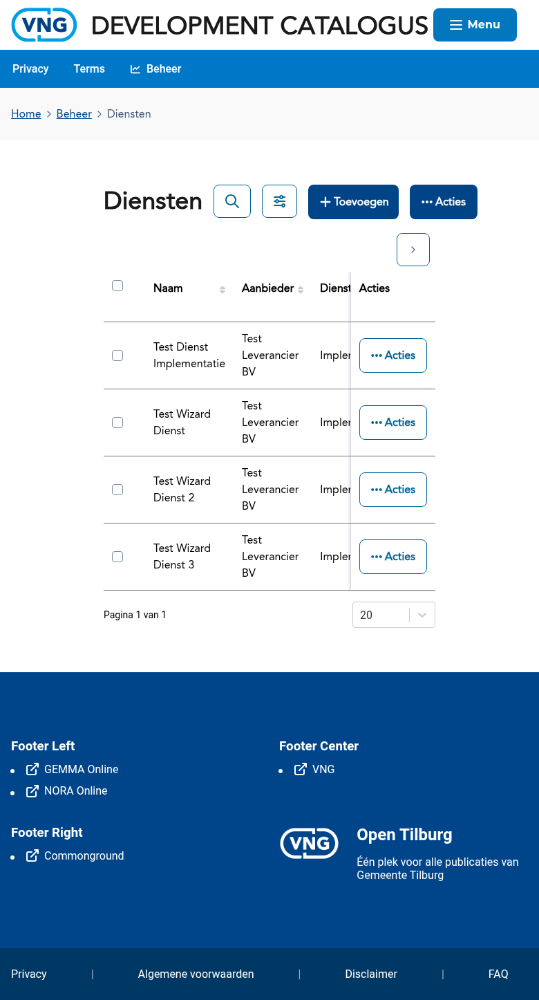

De tabel bevat kolommen zoals de naam van de dienst, het diensttype, de gekoppelde applicatie(s) en de aanmaakdatum.

---

## Als leverancier: dienst publiceren

Als leverancier publiceert u diensten via een wizard met 3 stappen. De wizard is bereikbaar via:
- Het beheerdashboard → kaart **Dienst publiceren**
- De knop **Toevoegen** in het dienstenoverzicht
- Direct via `/forms/dienst?type=eigen`

### Stap 1 — Basisgegevens

Vul de basisgegevens van uw dienst in: naam, beschrijving en diensttype (bijv. functioneel beheer, technisch beheer, implementatieondersteuning, opleidingen of licentiereseller).

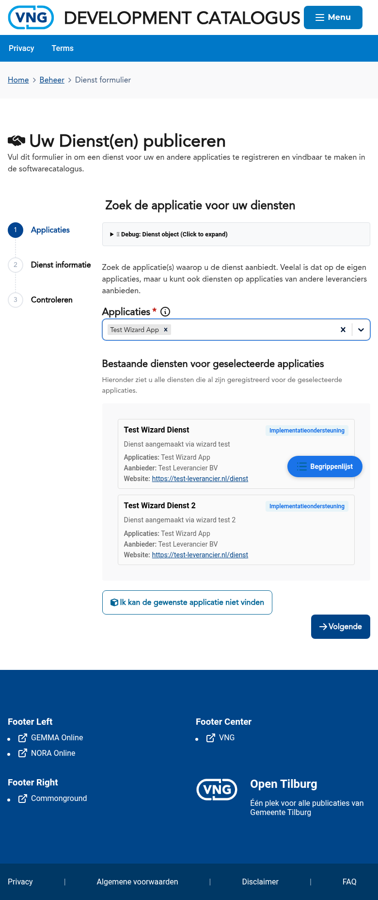

### Stap 2 — Applicaties koppelen

Selecteer de applicatie(s) waarop deze dienst van toepassing is. U kunt meerdere applicaties koppelen.

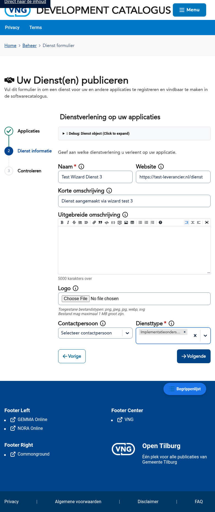

### Stap 3 — Aanvullende informatie

Voeg eventueel aanvullende informatie toe, zoals een website-URL of contactgegevens voor de dienst.

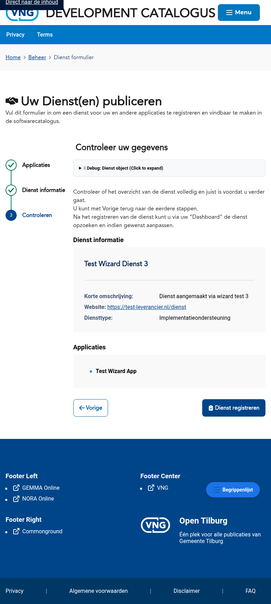

### Controleren

Controleer alle ingevoerde gegevens in het overzicht voordat u de dienst publiceert.

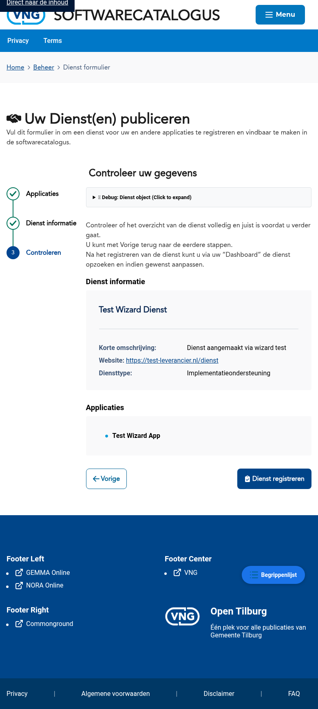

### Resultaat

Na het klikken op **Dienst registreren** wordt de dienst aangemeld in de catalogus.

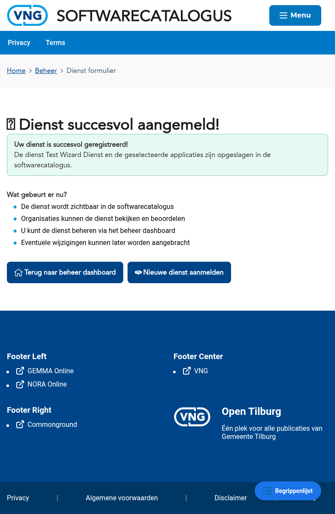

---

## Als gemeente: diensten beheren

### Tabeloverzicht

Gemeenten zien in het dienstenoverzicht (`/beheer/diensten`) de diensten die beschikbaar zijn voor hun applicaties.

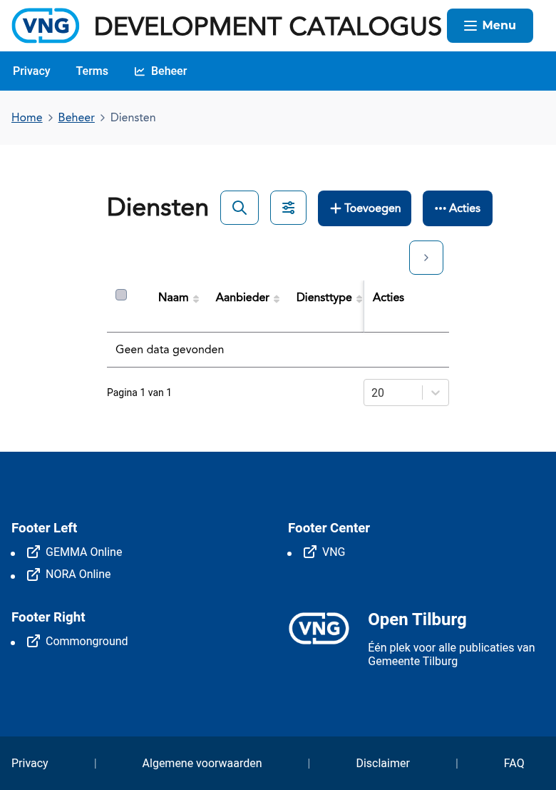

### Dienst toevoegen

Gemeenten kunnen diensten toevoegen via de knop **Toevoegen** in het dienstenoverzicht. De wizard heeft 3 stappen: Applicaties, Dienst informatie en Controleren.

#### Stap 1 — Applicaties

Selecteer de applicatie(s) waarop de dienst betrekking heeft.

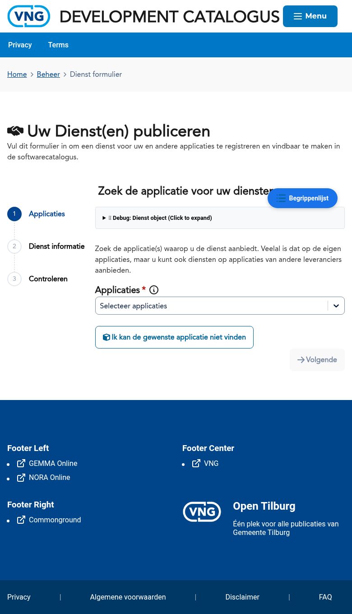

#### Stap 2 — Dienst informatie

Vul de dienstgegevens in: naam, website, beschrijving (kort en uitgebreid), logo, contactpersoon en diensttype (functioneel beheer, applicatiebeheer, technisch beheer, implementatieondersteuning, opleidingen of licentiereseller).

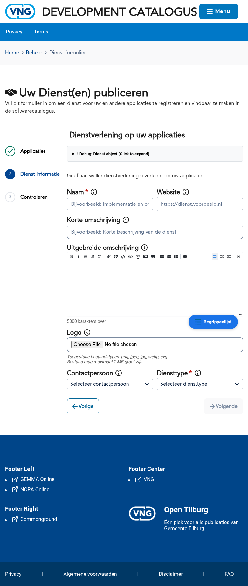

#### Stap 3 — Controleren

Controleer het overzicht met de ingevoerde gegevens voordat u de dienst registreert.

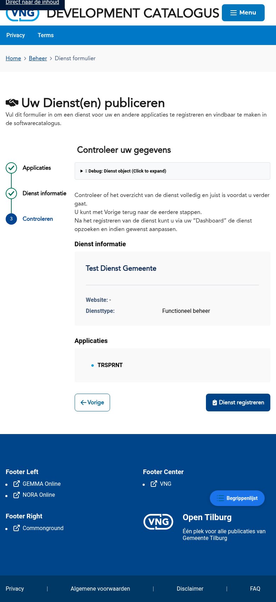

#### Resultaat

Na registratie verschijnt een succesbericht.

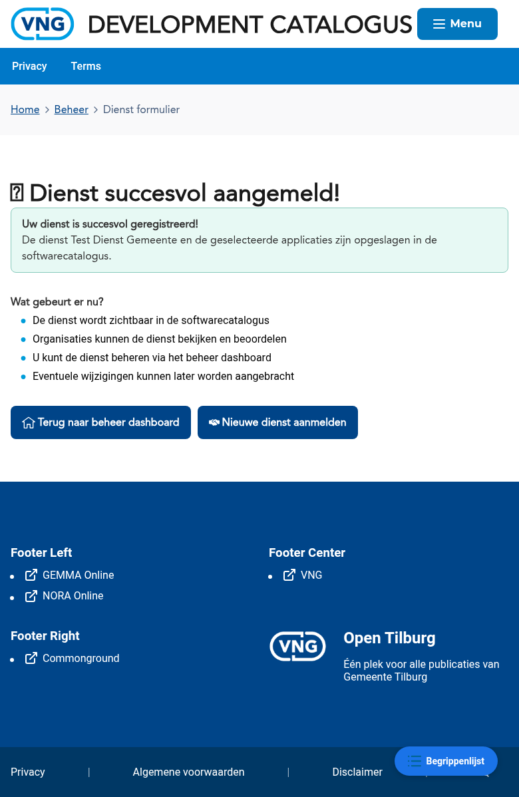

---

## Bekende aandachtspunten

- Een dienst moet aan minimaal één applicatie gekoppeld zijn
- De beschikbare diensttypen zijn: functioneel beheer, technisch beheer, applicatiebeheer, implementatieondersteuning, opleidingen en licentiereseller
- Diensten zijn zichtbaar op de detailpagina van de gekoppelde applicatie(s)

## Gerelateerde documentatie

- [K003 - Dienst](/docs/Concepten/k003-dienst) — Uitleg van het concept Dienst
- [F005 - Dienstenbeheer](/docs/Functionaliteiten/f005-dienstenbeheer) — Functionele specificatie van dienstenbeheer
- [Applicaties](./applicaties.md) — Handleiding voor applicatiebeheer
