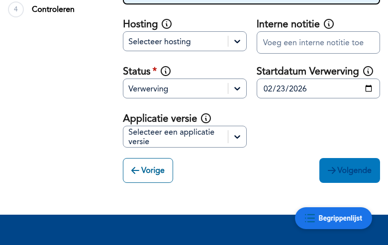
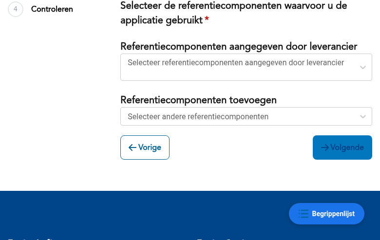
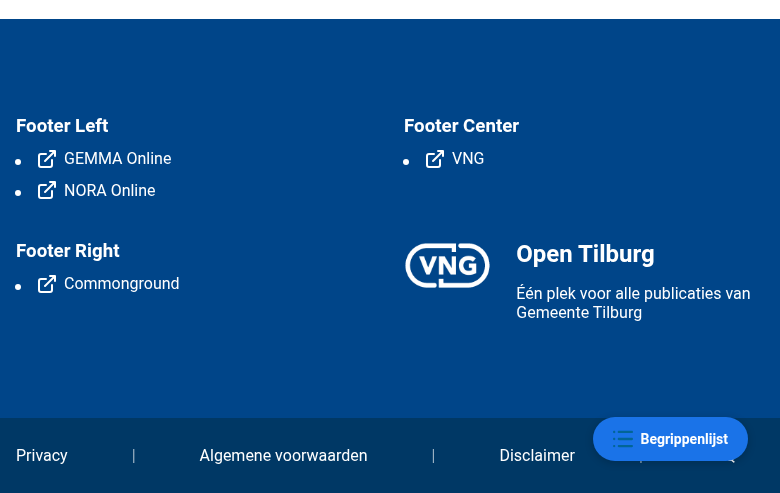
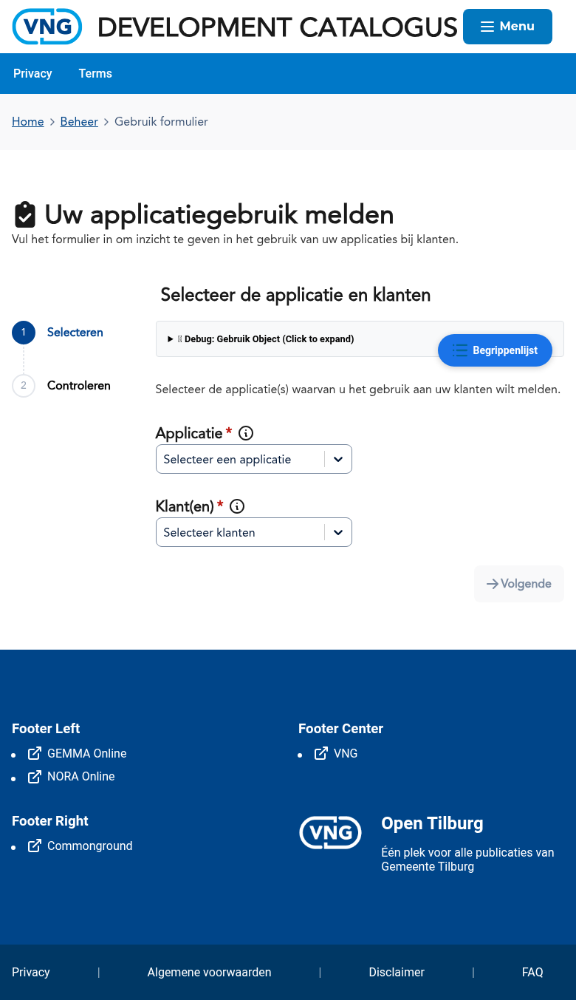
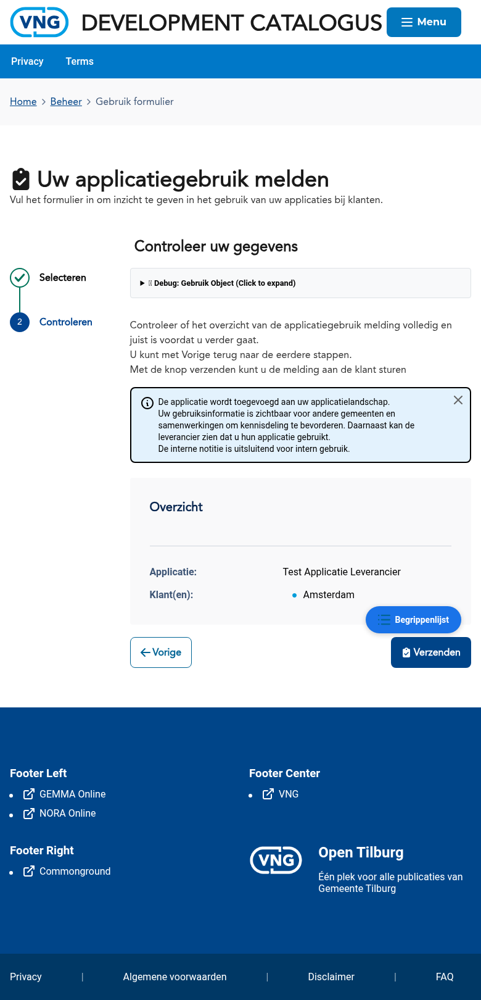
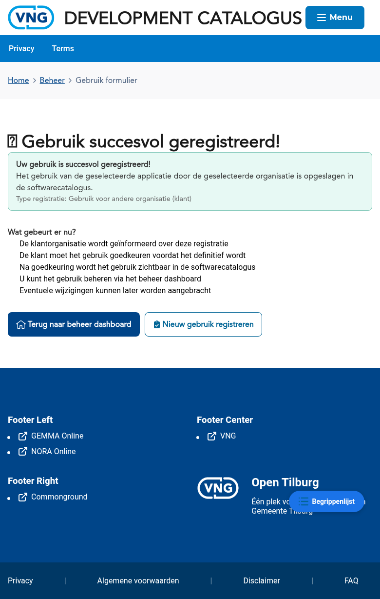

# Gebruikbeheer

Gebruik beschrijft hoe organisaties applicaties inzetten in hun ICT-landschap. Gemeenten registreren hun gebruik via een wizard, en leveranciers kunnen gebruik voorstellen aan gemeenten die hun applicatie afnemen.

## Twee perspectieven

| Perspectief | Actie | Beschrijving |
|-------------|-------|--------------|
| **Gemeente** | Gebruik registreren | De gemeente registreert welke applicaties zij in gebruik heeft |
| **Leverancier** | Applicatiegebruik melden | De leverancier meldt gebruik van zijn applicatie bij klanten (gemeenten/samenwerkingen) |

---

## Als gemeente: gebruik registreren

Als gemeente registreert u het gebruik van een applicatie via een wizard met 4 stappen. De wizard is bereikbaar via:
- Het beheerdashboard → kaart **Applicatie toevoegen**
- Direct via `/forms/gebruik/applicatie?type=gemeente`

:::tip
De "Applicatie toevoegen" wizard voor gemeenten is hetzelfde als de gebruik-registratie wizard. Door een applicatie toe te voegen aan uw landschap registreert u het gebruik ervan.
:::

### Stap 1 — Applicatie selecteren

Selecteer de applicatie die u in gebruik wilt nemen uit de catalogus. U kunt zoeken op naam.

Als de gewenste applicatie niet in de lijst staat, kunt u deze handmatig toevoegen via de knop **Ik kan de gewenste applicatie niet vinden**.

### Stap 2 — Gebruiksinformatie

Vul de gebruiksinformatie in:
- **Hosting** — Hoe wordt de applicatie gehost (SaaS, on-premise, hybrid)
- **Interne notitie** — Eventuele interne opmerkingen
- **Status** — De huidige status (bijv. Verwerving, In gebruik, Uitfasering)
- **Startdatum** — Wanneer is de verwerving of het gebruik gestart
- **Applicatieversie** — Welke versie wordt gebruikt

### Stap 3 — Referentiecomponenten

Voeg referentiecomponenten toe waarvoor u deze applicatie inzet. De door de leverancier aangegeven componenten worden als suggestie getoond.

### Stap 4 — Controleren

Controleer alle gegevens en klik op **Gebruik registreren**.

### Resultaat

Na registratie verschijnt een succesbericht. De applicatie is nu onderdeel van uw applicatielandschap.

---

## Als leverancier: applicatiegebruik melden

Leveranciers kunnen het gebruik van hun applicatie bij klanten (gemeenten of samenwerkingen) melden. Dit helpt gemeenten om hun applicatielandschap actueel te houden.

De wizard is bereikbaar via:
- Het beheerdashboard → kaart **Applicatiegebruik melden**
- Direct via `/forms/gebruik/applicatie?type=ontbrekend-organisatie`

### Stap 1 — Applicatie en klant(en) selecteren

Selecteer uw applicatie en één of meer klanten (gemeenten/samenwerkingen) waarvoor u het gebruik wilt melden.

### Stap 2 — Controleren

Controleer het overzicht met de geselecteerde applicatie en klant(en) voordat u het gebruik meldt.

### Resultaat

Na het klikken op **Verzenden** verschijnt een succesbericht. De klantorganisatie wordt geinformeerd en moet het gebruik goedkeuren voordat het definitief wordt.

:::info
Het gemelde gebruik wordt pas definitief wanneer de klantorganisatie het gebruik goedkeurt.
:::

---

## Bekende aandachtspunten

- Bij het registreren van gebruik wordt de status standaard op **Verwerving** gezet
- De startdatum wordt automatisch ingevuld met de huidige datum
- Gebruik dat door een leverancier is voorgesteld, moet door de gemeente worden geaccepteerd
- Het applicatielandschap is alleen zichtbaar voor de eigen organisatie en voor functioneel beheerders

## Gerelateerde documentatie

- [K004 - Gebruik](/docs/Concepten/k004-gebruik) — Uitleg van het concept Gebruik
- [F013 - Gebruik Beheer](/docs/Functionaliteiten/f013-gebruik-beheer) — Functionele specificatie van gebruikbeheer
- [Applicaties](./applicaties.md) — Handleiding voor applicatiebeheer
- [Koppelingen](./koppelingen.md) — Handleiding voor koppelingenbeheer
