# Koppelingenbeheer

Koppelingen beschrijven de technische integraties tussen applicaties onderling en met buitengemeentelijke voorzieningen. Hetzelfde koppeling-object wordt gebruikt voor zowel het aanbod (welke koppelingen biedt een applicatie) als het gebruik (welke koppelingen heeft een gemeente geimplementeerd).

## Tabeloverzicht

### Als leverancier

Navigeer naar `/beheer/koppelingen` om het overzicht van uw geregistreerde koppelingen te zien. De tabel toont alleen koppelingen van uw eigen organisatie.

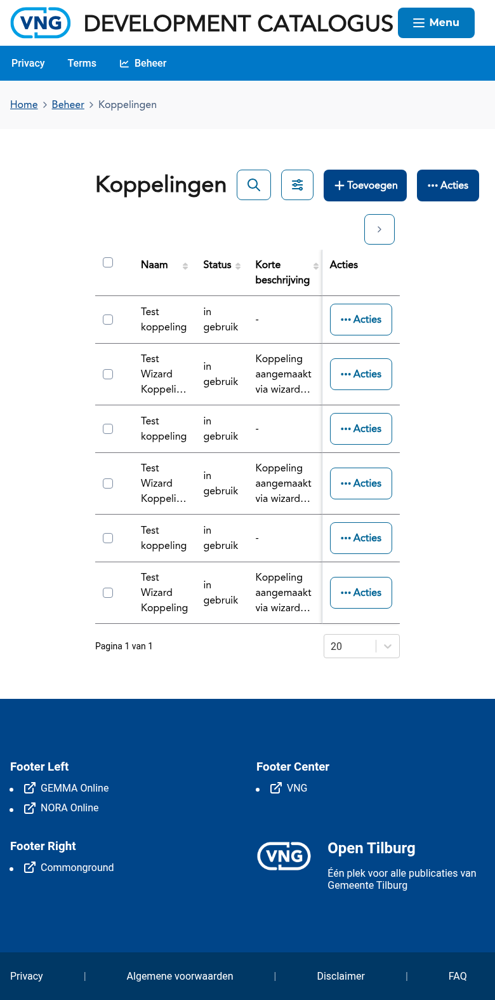

De tabel toont de richting van de koppeling (van applicatie A naar applicatie B), het type koppeling en de aanmaakdatum.

---

## Als leverancier: koppeling registreren

Als leverancier registreert u koppelingen via een wizard met 4 stappen. De wizard is bereikbaar via:
- Het beheerdashboard → kaart **Koppeling registreren**
- De knop **Toevoegen** in het koppelingenoverzicht
- Direct via `/forms/koppeling?type=eigen-organisatie`

### Stap 1 — Basisgegevens

Selecteer de bronapplicatie en doelapplicatie (of buitengemeentelijke voorziening) van de koppeling. Geef de richting aan.

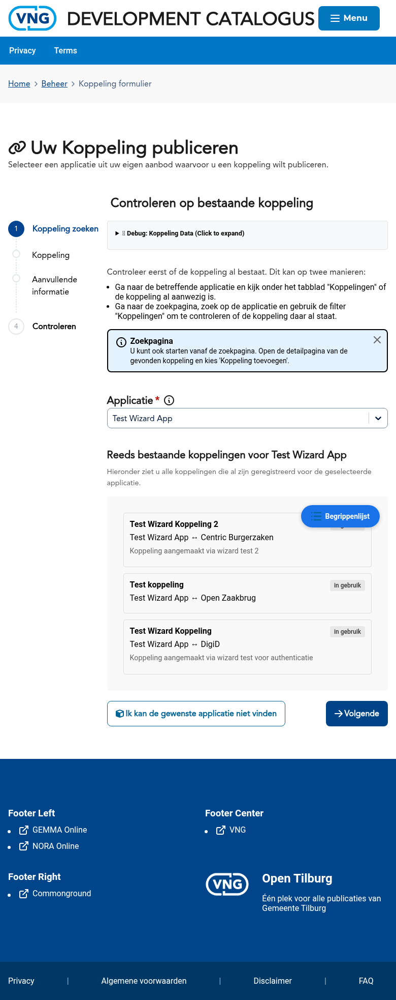

### Stap 2 — Koppelingsdetails

Vul de details in van de koppeling: het type koppeling, het gebruikte protocol en een beschrijving.

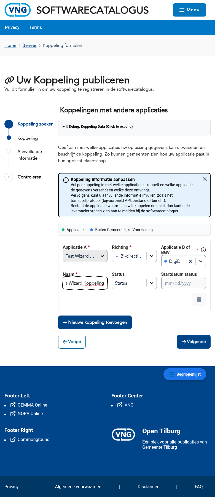

### Stap 3 — Aanvullende informatie

Voeg eventueel aanvullende informatie toe, zoals documentatie-URL's of technische specificaties.

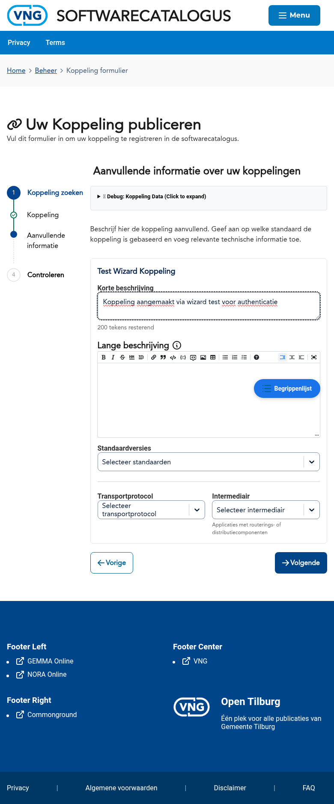

### Stap 4 — Controleren

Controleer alle ingevoerde gegevens voordat u de koppeling registreert. U kunt teruggaan naar eerdere stappen om wijzigingen aan te brengen.

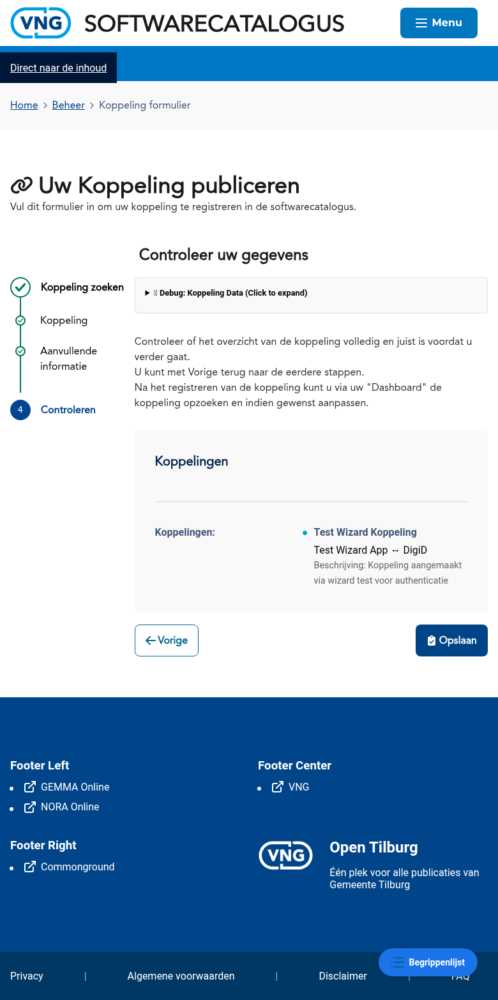

### Resultaat

Na het klikken op **Koppeling registreren** wordt de koppeling opgeslagen.

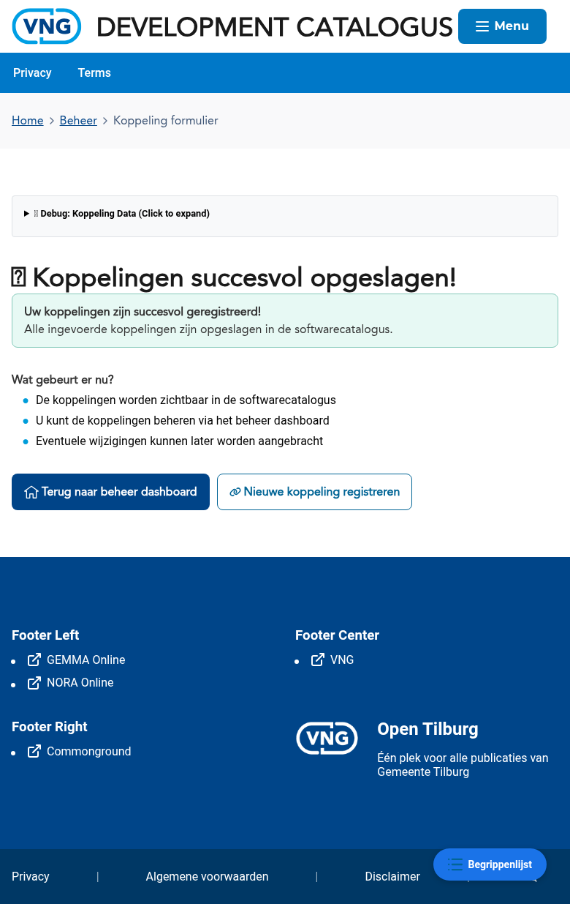

---

## Als gemeente: koppelingen beheren

### Tabeloverzicht

Gemeenten zien in het koppelingenoverzicht (`/beheer/koppelingen`) de koppelingen die zijn geregistreerd voor hun applicaties.

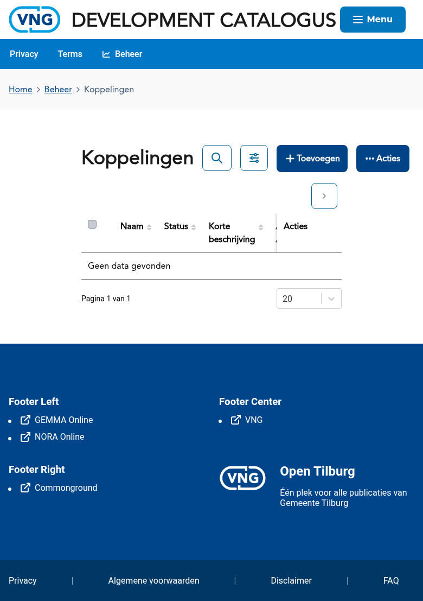

### Koppeling toevoegen

Gemeenten kunnen koppelingen toevoegen via de knop **Toevoegen** in het koppelingenoverzicht. De wizard heeft 4 stappen: Koppeling zoeken, Koppeling definiëren, Aanvullende informatie en Controleren.

#### Stap 1 — Koppeling zoeken

Selecteer de applicatie waarvoor u een koppeling wilt registreren. De wizard zoekt automatisch naar bestaande koppelingen voor deze applicatie.

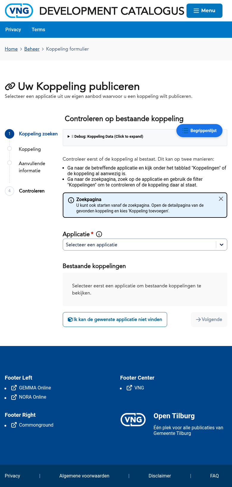

#### Stap 2 — Koppeling definiëren

Definieer de koppeling: selecteer de richting (A→B, B→A of bidirectioneel), de doelapplicatie of buitengemeentelijke voorziening (BGV), een naam, status en startdatum. U kunt via **Nieuwe koppeling toevoegen** meerdere koppelingen tegelijk registreren.

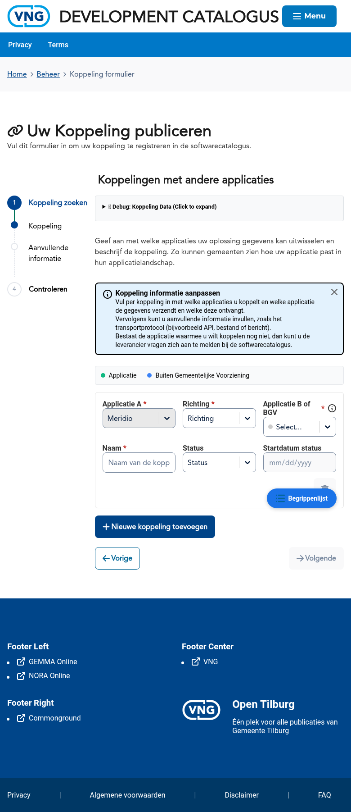

#### Stap 3 — Aanvullende informatie

Voeg per koppeling aanvullende informatie toe: beschrijving (kort en lang), standaardversies, transportprotocol en eventueel een intermediair.

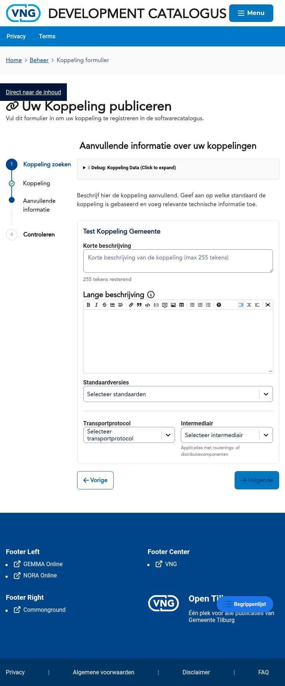

#### Stap 4 — Controleren

Controleer het overzicht met de koppeling(en) en hun richting voordat u opslaat.

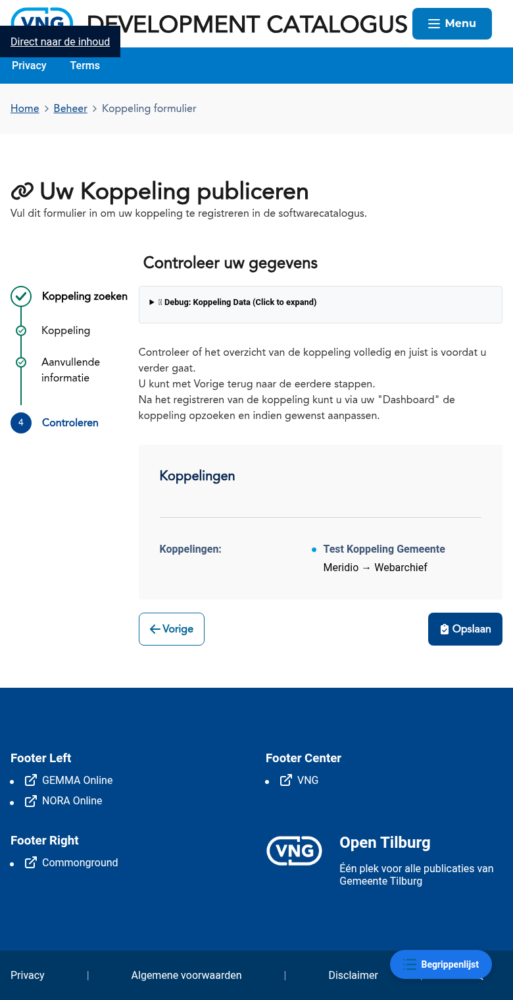

#### Resultaat

Na registratie verschijnt een succesbericht.

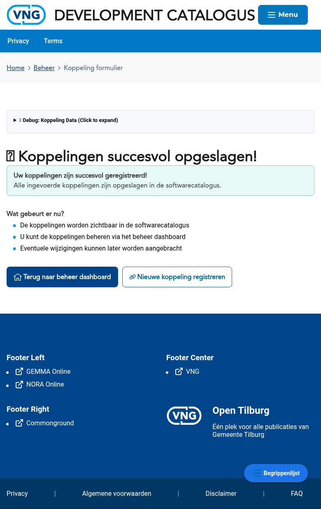

---

## Bekende aandachtspunten

- Een koppeling heeft altijd een **richting**: van een bronapplicatie naar een doelapplicatie of buitengemeentelijke voorziening
- Koppelingen die door de leverancier zijn geregistreerd beschrijven het **aanbod** (mogelijke integraties)
- Koppelingen die door een gemeente zijn geregistreerd beschrijven het **gebruik** (daadwerkelijk geimplementeerde integraties)

## Gerelateerde documentatie

- [K005 - Koppeling](/docs/Concepten/k005-koppeling) — Uitleg van het concept Koppeling
- [F008 - Externe Koppelingen](/docs/Functionaliteiten/f008-externe-koppelingen) — Functionele specificatie van koppelingen
- [Applicaties](./applicaties.md) — Handleiding voor applicatiebeheer
