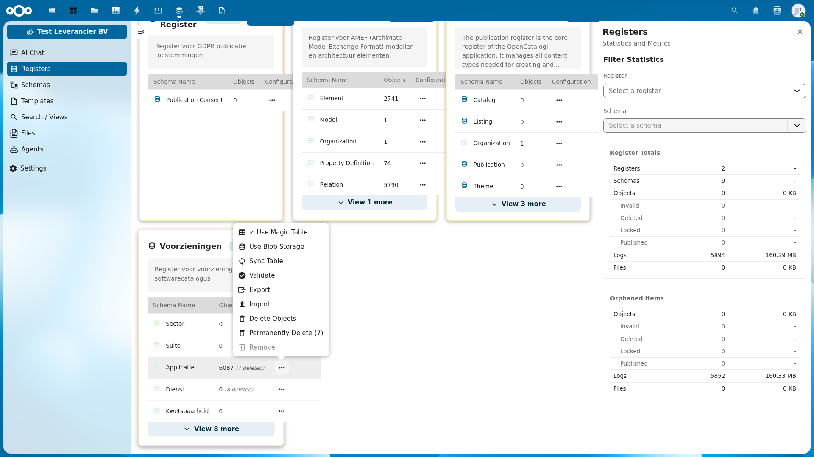
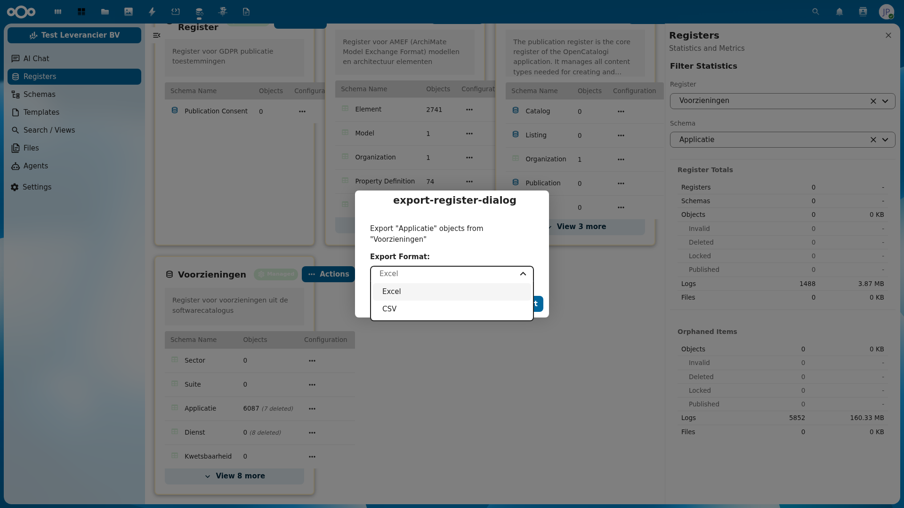
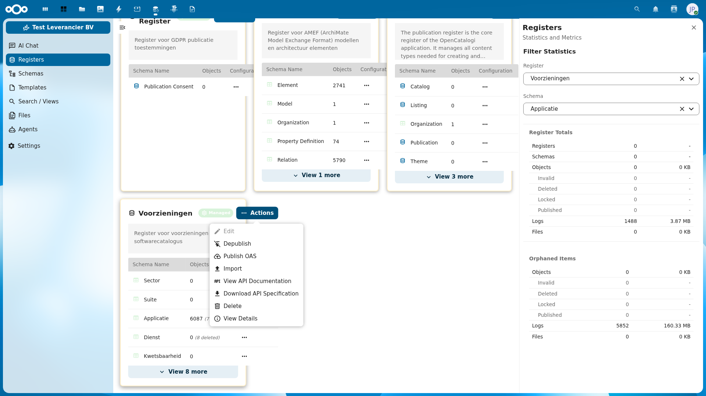
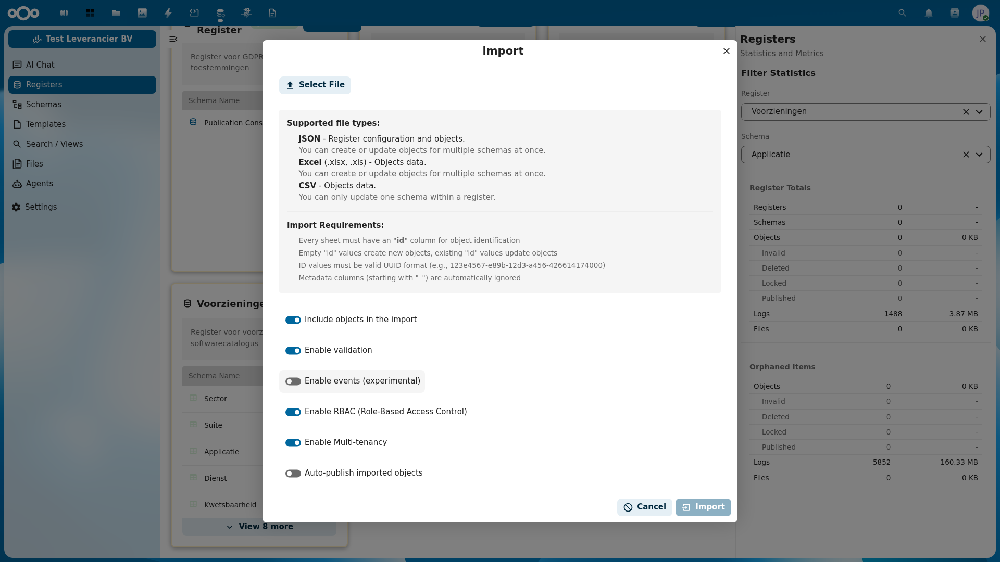

# Export & Import beheer

De Softwarecatalogus biedt uitgebreide mogelijkheden voor het exporteren en importeren van data. Dit is handig voor het maken van back-ups, het overbrengen van configuraties naar een andere omgeving, het bijwerken van data in bulk, of het delen van data met externe systemen.

Er zijn twee niveaus van export/import:

1. **Register-niveau** — Importeer configuraties en objecten, download API-specificaties
2. **Schema-niveau** — Exporteer objecten van een specifiek schema als Excel of CSV

## Navigeren naar de export/import-functie

1. Log in op het Nextcloud-backend als **admin**
2. Klik op **OpenRegister** in de linkermenubalk
3. Ga naar **Registers** in het linkermenu
4. U ziet nu een overzicht van alle registers met hun schema's

## Objecten exporteren (schema-niveau)

### Export starten vanuit een schema

1. Zoek het register dat het schema bevat (bijv. **Voorzieningen**)
2. Klik op het **drie-puntjes-menu** (acties) naast het schema dat u wilt exporteren (bijv. **Applicatie**)
3. Kies **Export** uit het menu

### Exportformaat kiezen

Na het kiezen van Export verschijnt het exportdialoogvenster:

1. Kies het **Export Format**:
   - **Excel** — exporteert alle objecten als .xlsx-bestand
   - **CSV** — exporteert alle objecten als .csv-bestand
2. Klik op **Export** om het bestand te downloaden

### Exportformaten vergelijken

| Formaat | Bestandstype | Meerdere schema's | Gebruik |
|---------|-------------|-------------------|---------|
| **Excel** | .xlsx | Ja (meerdere sheets) | Bulk data export, analyse in spreadsheet |
| **CSV** | .csv | Nee (1 schema per bestand) | Eenvoudige data export, integratie met externe systemen |

## Data importeren (register-niveau)

### Import starten vanuit een register

1. Klik op het **drie-puntjes-menu** (acties) naast de registernaam (bijv. **Voorzieningen**)
2. Kies **Import** uit het menu

### Het importdialoogvenster

Na het kiezen van Import verschijnt het importdialoogvenster:

#### Ondersteunde bestandstypen

| Formaat | Beschrijving | Meerdere schema's |
|---------|-------------|-------------------|
| **JSON** | Registerconfiguratie en objecten | Ja — meerdere schema's tegelijk |
| **Excel** (.xlsx, .xls) | Objectdata | Ja — meerdere schema's tegelijk (elke sheet = 1 schema) |
| **CSV** | Objectdata | Nee — slechts 1 schema per bestand |

#### Importvereisten

- Elk sheet/bestand moet een **"id"**-kolom bevatten voor objectidentificatie
- Lege id-waarden creëren **nieuwe objecten**
- Bestaande id-waarden **werken objecten bij** (update)
- ID-waarden moeten in geldig UUID-formaat zijn (bijv. `123e4567-e89b-12d3-a456-426614174000`)
- Metadatakolommen (beginnend met `_`) worden automatisch genegeerd

#### Importopties

| Optie | Standaard | Beschrijving |
|-------|-----------|-------------|
| **Include objects in the import** | Aan | Neem objectdata mee bij de import |
| **Enable validation** | Aan | Valideer objecten tegen het schema |
| **Enable events (experimental)** | Uit | Trigger events bij import (experimenteel) |
| **Enable RBAC** | Aan | Pas rolgebaseerde toegangscontrole toe |
| **Enable Multi-tenancy** | Aan | Pas multi-tenancy regels toe |
| **Auto-publish imported objects** | Uit | Publiceer geïmporteerde objecten automatisch |

### Importprocedure

1. Klik op **Select File** en kies het bestand (JSON, Excel of CSV)
2. Controleer de importopties (validatie, RBAC, etc.)
3. Klik op **Import** om de import te starten
4. Controleer na afloop het register om te verifiëren dat de data correct is geïmporteerd

## API-specificatie downloaden (register-niveau)

Naast object-export kunt u ook de volledige registerconfiguratie downloaden:

1. Klik op het **drie-puntjes-menu** (acties) naast de registernaam
2. Kies **Download API Specification**
3. Een JSON-bestand met de volledige registerconfiguratie wordt gedownload

Dit JSON-bestand bevat de register- en schemadefinities en kan worden gebruikt voor:
- Back-up van de registerconfiguratie
- Migratie naar een andere omgeving
- Versiebeheer van de configuratie

## Rond-trip workflow: exporteren, aanpassen en herimporteren

Een veelvoorkomend scenario is het exporteren van data, aanpassingen maken in een spreadsheet, en de aangepaste data terugimporteren. Volg deze stappen:

### Stap 1: Exporteer de huidige data

1. Ga naar het gewenste schema (bijv. **Applicatie** in **Voorzieningen**)
2. Klik op het drie-puntjes-menu → **Export**
3. Kies **Excel** als formaat en download het bestand

### Stap 2: Bewerk het exportbestand

1. Open het gedownloade Excel-bestand in een spreadsheetprogramma (bijv. Excel, LibreOffice Calc)
2. Pas de gewenste waarden aan in de cellen
3. **Verwijder de id-waarde niet** — deze is nodig om bestaande objecten bij te werken
4. Sla het bestand op (als .xlsx)

:::caution Belangrijk bij bewerken
- Wijzig **nooit** de id-kolom — dit bepaalt welke objecten worden bijgewerkt
- Kolommen die beginnen met `_` (zoals `_self`, `_schema`) zijn metadata en worden genegeerd bij import
- Voeg geen nieuwe kolommen toe die niet in het schema bestaan
:::

### Stap 3: Importeer het aangepaste bestand

1. Klik op het drie-puntjes-menu van het **register** (niet het schema) → **Import**
2. Klik op **Select File** en selecteer het bewerkte Excel-bestand
3. Zorg dat **Include objects in the import** en **Enable validation** aan staan
4. Klik op **Import**

### Stap 4: Verifieer de wijzigingen

1. Navigeer terug naar het schema en open een aangepast object
2. Controleer of de gewijzigde waarden correct zijn overgenomen
3. Controleer de audit trail voor de wijzigingen

:::tip Back-up voor bulkwijzigingen
Maak altijd eerst een export voordat u grote bulkwijzigingen doorvoert via import. Zo kunt u de oorspronkelijke staat herstellen indien nodig.
:::

## Bekende aandachtspunten

- Bij grote registers met veel objecten kan de export/import enige tijd duren
- De export/import-functies zijn alleen beschikbaar voor gebruikers met admin-rechten
- CSV-import ondersteunt slechts 1 schema per bestand; gebruik Excel voor meerdere schema's
- Bij het importeren van Excel worden sheetnamen gematcht aan schemanamen
- Zet **Enable validation** aan om fouten in de importdata vroegtijdig te detecteren
