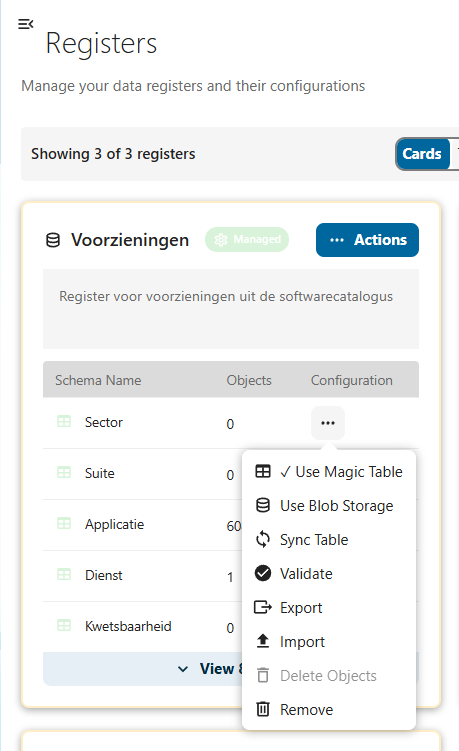
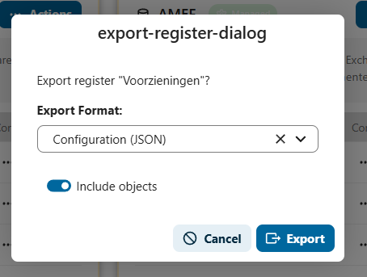

# Export beheer

De Softwarecatalogus biedt de mogelijkheid om registers en schema's te exporteren. Dit is handig voor het maken van back-ups, het overbrengen van configuraties naar een andere omgeving, of het delen van data met externe systemen.

## Navigeren naar de exportfunctie

1. Log in op het Nextcloud-backend als **admin**
2. Klik op **OpenRegister** in de linkermenubalk
3. Ga naar **Registers** in het linkermenu
4. U ziet nu een overzicht van alle registers met hun schema's

### Export starten vanuit een schema

1. Klik op het **drie-puntjes-menu** (acties) naast het schema dat u wilt exporteren
2. Kies **Export** uit het menu

### Exportinstellingen configureren

Na het kiezen van Export verschijnt het exportdialoogvenster:

1. Kies het **Export Format**:
   - **Configuration (JSON)** — exporteert de registerconfiguratie als JSON-bestand
2. Schakel **Include objects** in als u ook de data (objecten) wilt meenemen in de export
3. Klik op **Export** om het bestand te downloaden

:::tip Back-up voor samenvoegen
Maak altijd een export voordat u ingrijpende wijzigingen doorvoert, zoals het [samenvoegen van organisaties](./organisaties-samenvoegen.md). Zo kunt u de oorspronkelijke staat herstellen indien nodig.
:::

## Exportformaten

| Formaat | Beschrijving | Gebruik |
|---------|--------------|---------|
| **Configuration (JSON)** | Register- en schemaconfiguratie in JSON | Back-up, migratie naar andere omgeving |

## Bekende aandachtspunten

- Bij grote registers met veel objecten kan de export enige tijd duren
- De exportfunctie is alleen beschikbaar voor gebruikers met admin-rechten
- Geexporteerde bestanden kunnen worden geimporteerd via de **Import**-optie in hetzelfde actiemenu
