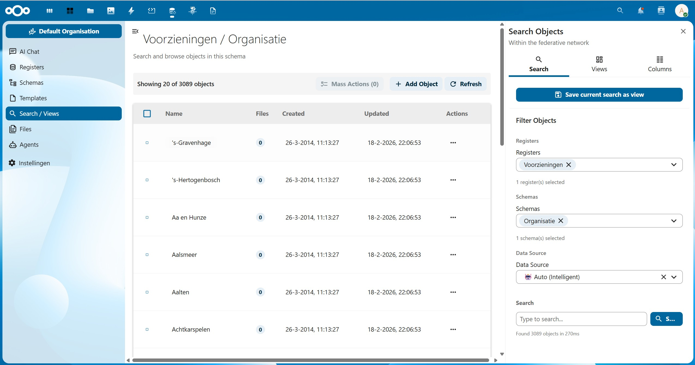
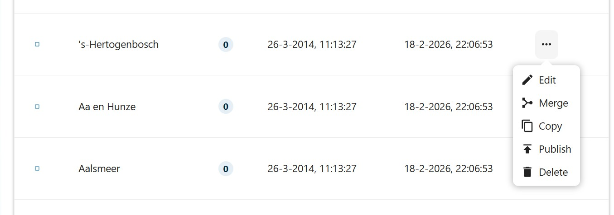
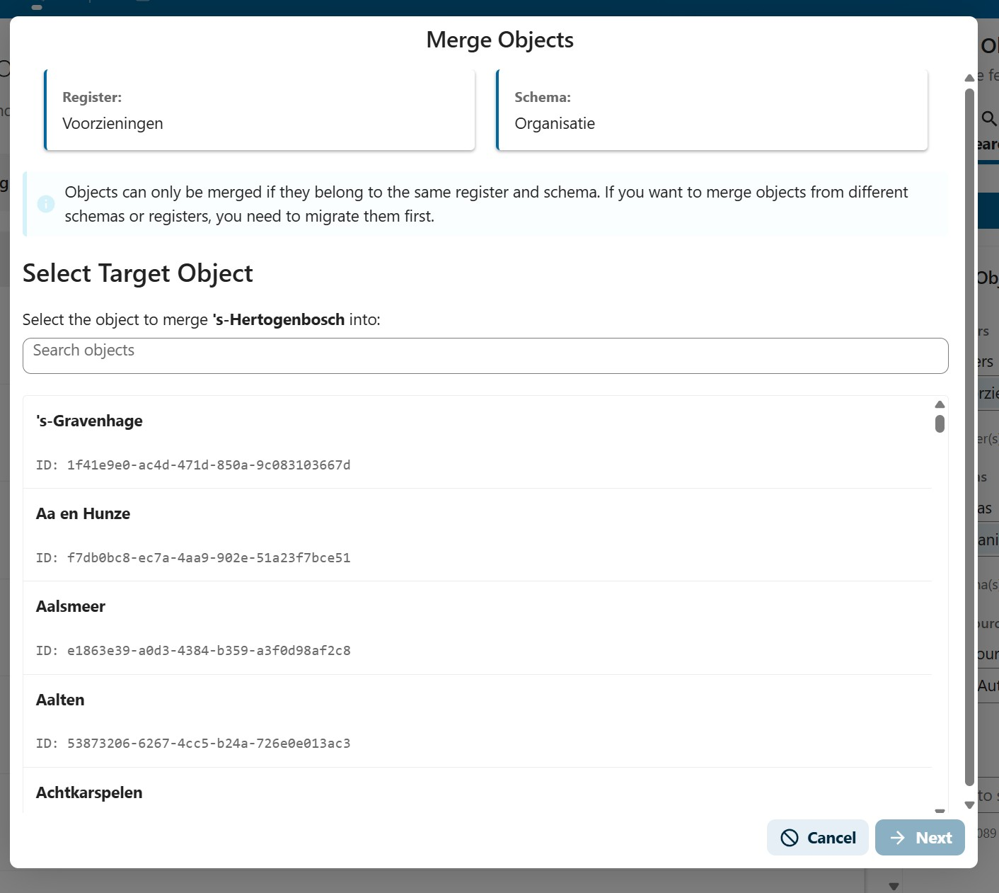
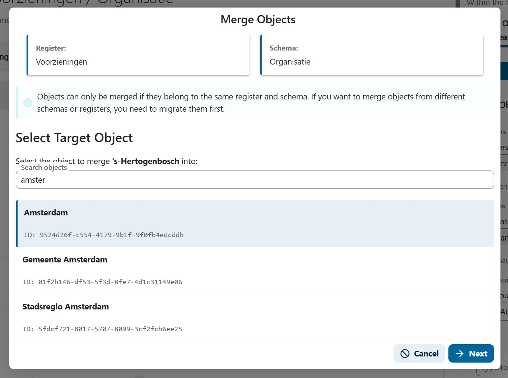
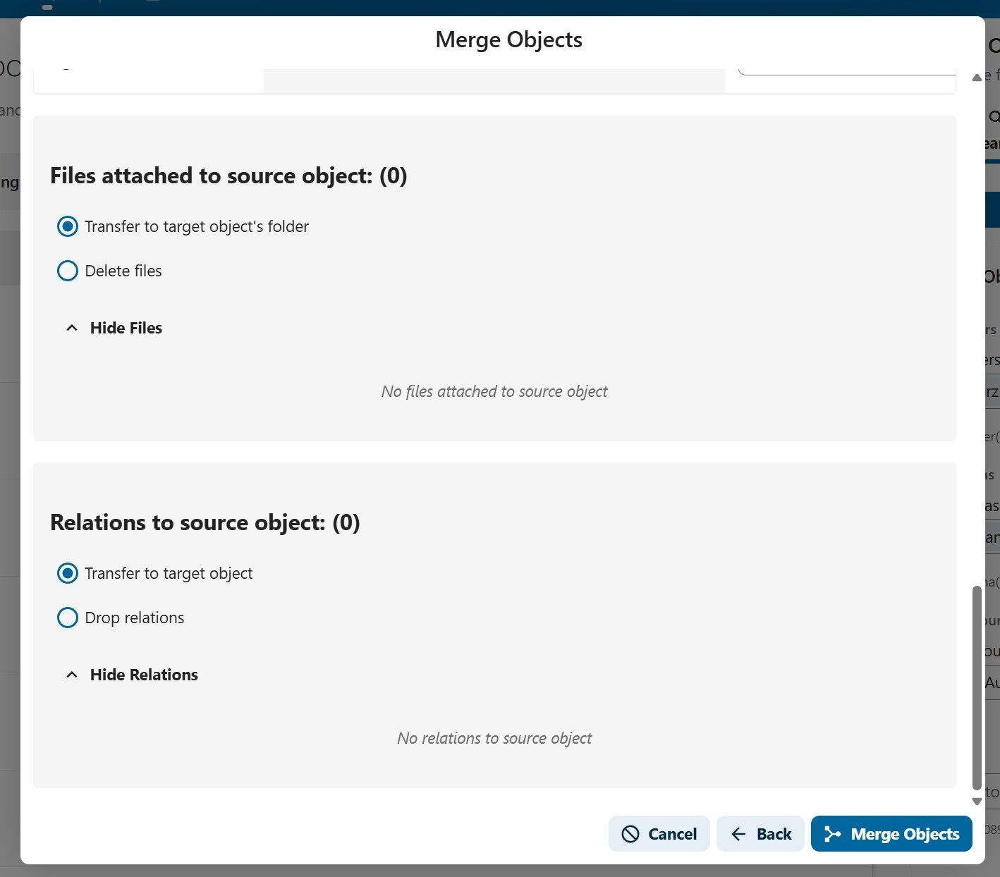
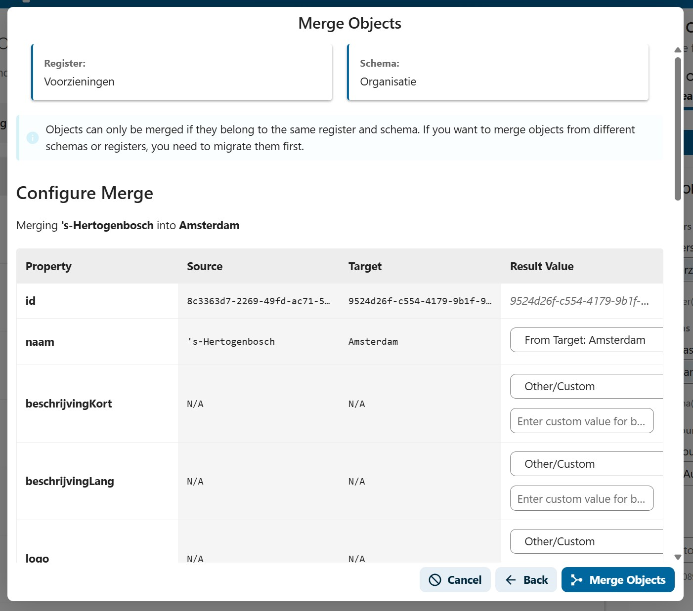
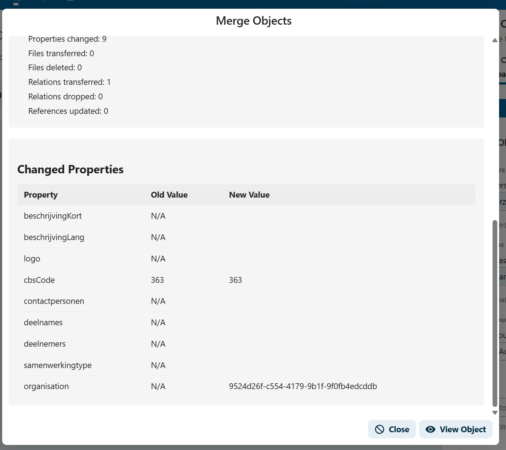

# Organisaties samenvoegen

:::caution Onderdeel van levering
Deze handleiding is onderdeel van de levering van 24-02-2026 en mag niet worden aangepast.
:::

Bij gemeentelijke herindelingen, fusies of overnames kan het nodig zijn om organisaties in de Softwarecatalogus samen te voegen. Dit zorgt ervoor dat het applicatielandschap, koppelingen en gebruiksgegevens correct worden overgedragen naar de nieuwe organisatie.

## Wanneer organisaties samenvoegen?

Typische scenario's voor het samenvoegen van organisaties:

| Scenario | Voorbeeld |
|----------|-----------|
| **Gemeentelijke herindeling** | Gemeente A en Gemeente B fuseren tot Gemeente C |
| **Overname** | Leverancier X neemt Leverancier Y over |
| **Naamswijziging** | Een organisatie wijzigt haar naam en er bestaan dubbele registraties |
| **Dataopschoning** | Dubbele organisatie-entries die samengevoegd moeten worden |

## Wat wordt samengevoegd?

Bij het samenvoegen worden de volgende gegevens van de bronorganisatie overgedragen naar de doelorganisatie:

- **Applicatielandschap** — alle geregistreerde applicaties en hun gebruik
- **Koppelingen** — verbindingen tussen applicaties
- **Diensten** — afgenomen en aangeboden diensten
- **Contactpersonen** — gekoppelde gebruikers
- **Gebruiksgegevens** — status, startdata, versie-informatie

## Vereisten

- U moet ingelogd zijn als **functioneel beheerder** of als **admin** op het Nextcloud-backend
- U heeft toegang nodig tot het **OpenRegister**-onderdeel in Nextcloud
- Beide organisaties (bron en doel) moeten bestaan in het systeem

## Stappen

### 1. Navigeren naar het samenvoeg-scherm

1. Log in op het Nextcloud-backend als admin
2. Klik op **OpenRegister** in de linkermenubalk
3. Ga naar **Search/Views** in het linkermenu
4. Filter op het **Voorzieningen**-register en het **Organisatie**-schema
5. Zoek de bronorganisatie (de organisatie die zal opgaan in de andere)

### 2. De samenvoeg-actie starten

1. Klik op het **drie-puntjes-menu** (acties) naast de bronorganisatie
2. Kies **Samenvoegen** (Merge)
3. Het samenvoeg-venster (MergeObject modal) opent

### 3. Doelorganisatie selecteren

1. In het samenvoeg-venster zoekt u de **doelorganisatie** (de organisatie die overblijft)

2. Selecteer de doelorganisatie uit de lijst

3. U krijgt een overzicht te zien van wat er samengevoegd zal worden

### 4. Controleren en bevestigen

1. Controleer het overzicht:
   - Welke gegevens worden overgedragen
   - Welke gegevens mogelijk conflicteren
   - Wat er gebeurt met de bronorganisatie na het samenvoegen

2. Klik op **Samenvoegen** om de actie te bevestigen

:::danger Waarschuwing
Het samenvoegen van organisaties is **niet omkeerbaar**. Controleer zorgvuldig of u de juiste bron- en doelorganisatie heeft geselecteerd voordat u bevestigt.
:::

### 5. Na het samenvoegen

Na het samenvoegen:

- Alle gegevens van de bronorganisatie zijn overgedragen naar de doelorganisatie
- De bronorganisatie kan worden gedeactiveerd of verwijderd
- Gebruikers van de bronorganisatie moeten mogelijk opnieuw worden gekoppeld aan de doelorganisatie
- Controleer of alle koppelingen en applicaties correct zijn overgenomen

## Aandachtspunten

- **Maak een back-up** voordat u organisaties samenvoegt. Gebruik eventueel de exportfunctie om de huidige staat vast te leggen.
- **Informeer betrokkenen** — contactpersonen van beide organisaties moeten weten dat hun gegevens worden samengevoegd.
- **Test eerst op acceptatie** — voer het samenvoegen eerst uit op de acceptatieomgeving voordat u dit op productie doet.
- Bij conflicterende gegevens (bijv. dezelfde applicatie met verschillende versie-informatie) wordt de gegevens van de doelorganisatie behouden.
- Na het samenvoegen kan het nodig zijn om de zoekindex te vernieuwen voordat alle wijzigingen zichtbaar zijn op de publieke website.

## Gerelateerde functionaliteiten

- [F002 - Organisatie Inrichten](../Functionaliteiten/F002-organisatie-inrichten.md) — Organisatiegegevens beheren
- [F014 - Data Migratie](../Functionaliteiten/F014-data-migratie.md) — Data-import en export
- [F003 - Gebruikersbeheer](../Functionaliteiten/F003-gebruikersbeheer.md) — Gebruikers beheren en koppelen
