# Paginabeheer (CMS)

:::caution Onderdeel van levering
Deze handleiding is onderdeel van de levering van 24-02-2026 en mag niet worden aangepast.
:::

De Softwarecatalogus bevat een ingebouwd CMS-systeem waarmee functioneel beheerders pagina's kunnen aanmaken en bewerken. Denk hierbij aan de privacyverklaring, algemene voorwaarden, FAQ en andere informatieve pagina's.

## Overzicht

Het CMS beheert de volgende soorten pagina's:

| Pagina | Slug | Beschrijving |
|--------|------|--------------|
| Home | `home` | De voorpagina van de Softwarecatalogus |
| About | `about` | Over de Softwarecatalogus |
| Website | `website` | Informatie over de website |
| Privacyverklaring | `privacyverklaring` | Privacybeleid |
| Disclaimer | `disclaimer` | Disclaimer |
| Algemene Voorwaarden | `algemene-voorwaarden` | Gebruiksvoorwaarden |
| FAQ | `faq` | Veelgestelde vragen |

## Navigeren naar paginabeheer

1. Log in op het Nextcloud-backend
2. Klik op **OpenCatalogi** in de linkermenubalk
3. Ga naar het onderdeel **Pages** in de linker sidebar (onder Settings)
4. U ziet nu een overzicht van alle pagina's in kaartvorm

Elke kaart toont:
- De **titel** van de pagina
- De **slug** (URL-pad, bijv. `/privacyverklaring`)
- Het aantal **content items**
- De **status** (Available/Draft)

## Een nieuwe pagina aanmaken

1. Klik op de knop **Add Page** rechtsboven in het pagina-overzicht
2. Vul de volgende velden in:
   - **Title**: De titel van de pagina (wordt getoond in de browser-titelbalk en als kop)
   - **Slug**: Het URL-pad (bijv. `mijn-pagina` wordt bereikbaar op `/mijn-pagina`)
   - **Summary**: Een korte samenvatting van de pagina-inhoud
   - **Description**: De volledige pagina-inhoud
3. Klik op **Opslaan**

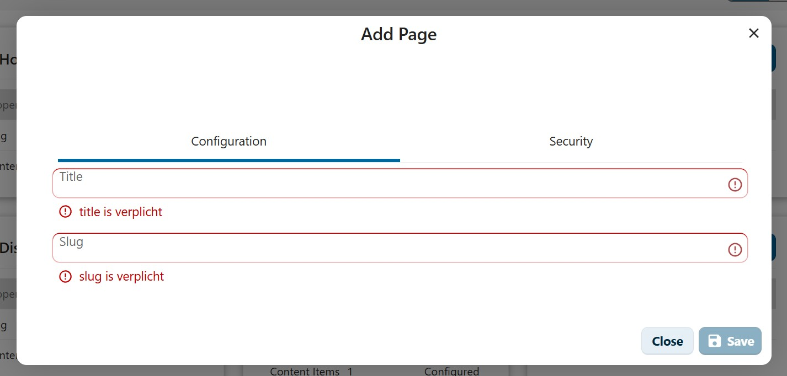

:::tip Slug-conventies
Gebruik voor de slug alleen kleine letters, cijfers en koppeltekens. Vermijd spaties en speciale tekens. Bijvoorbeeld: `veelgestelde-vragen` in plaats van `Veelgestelde Vragen`.
:::

## Een bestaande pagina bewerken

1. Zoek de pagina die u wilt bewerken in het pagina-overzicht
2. Klik op de **Acties**-knop (drie puntjes) op de paginakaart
3. Kies **Bewerken**
4. Pas de gewenste velden aan (titel, slug, samenvatting, beschrijving)
5. Klik op **Opslaan**

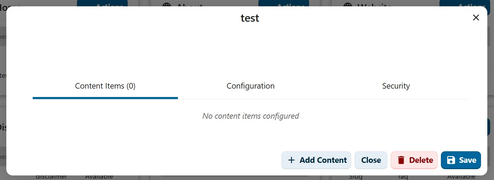

De wijzigingen zijn direct zichtbaar op de publieke website.

## Een pagina verwijderen

1. Zoek de pagina in het overzicht
2. Klik op de **Acties**-knop
3. Kies **Verwijderen**
4. Bevestig de verwijdering in het bevestigingsvenster

:::caution Let op
Verwijderde pagina's zijn niet te herstellen. Controleer of de pagina niet meer nodig is voordat u deze verwijdert. Links naar verwijderde pagina's zullen een 404-fout opleveren.
:::

## Content toevoegen aan een pagina

Een pagina kan meerdere content items bevatten. Elk content item heeft een **type** en een **volgorde** (order) die bepaalt waar het op de pagina verschijnt. U voegt content toe via de knop **+ Add Content** in het bewerkscherm van een pagina.

### Beschikbare content types

| Type | Beschrijving |
|------|--------------|
| **Text** | Onopgemaakte platte tekst |
| **RichText** | Opgemaakte tekst met een toolbar voor opmaak (vet, cursief, lijsten, tabellen, afbeeldingen, links, etc.) |
| **Faq** | Veelgestelde vragen met Vraag/Antwoord-paren |
| **Quote** | Een citaat- of highlight-sectie met een titel (vetgedrukt) en een ondertitel. Wordt als opvallend blok weergegeven op de pagina. |
| **ContentBlocks** | Een raster van maximaal 3 kaarten, elk met een icoon, titel, beschrijving en link. Geschikt voor snelkoppelingen of uitgelichte acties. |

### Text content

Kies content type **Text** om een blok onopgemaakte tekst toe te voegen. Voer de tekst in het tekstveld in en stel de volgorde in.

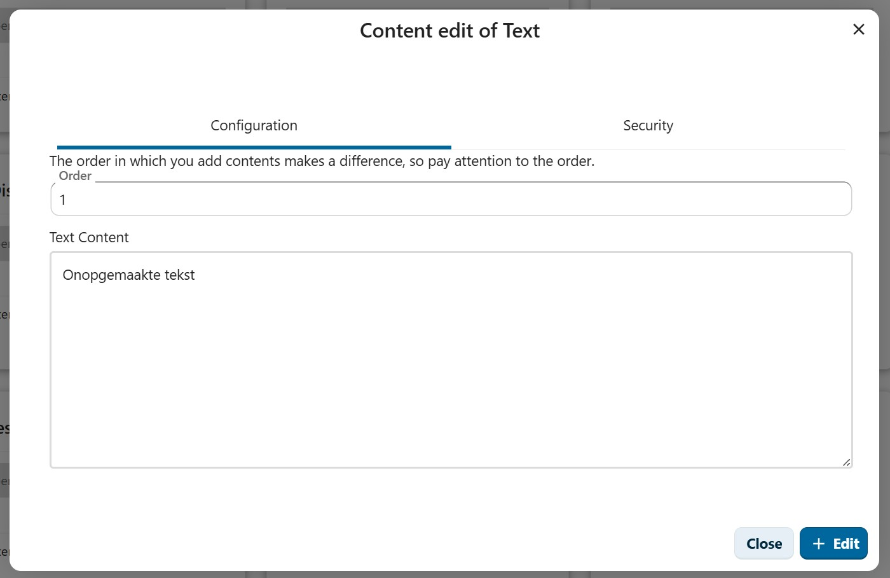

### RichText content

Kies content type **RichText** voor opgemaakte tekst. De editor biedt een toolbar met opties voor koppen, vet, cursief, lijsten, tabellen, afbeeldingen, links en codeblokken.

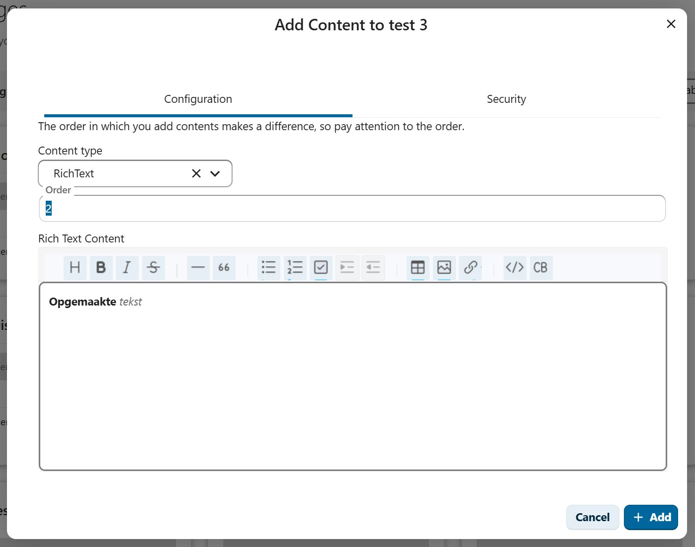

### FAQ content

Kies content type **Faq** om een lijst met veelgestelde vragen toe te voegen. Elke FAQ-entry bestaat uit een **Vraag** en een **Antwoord**. U kunt meerdere paren toevoegen.

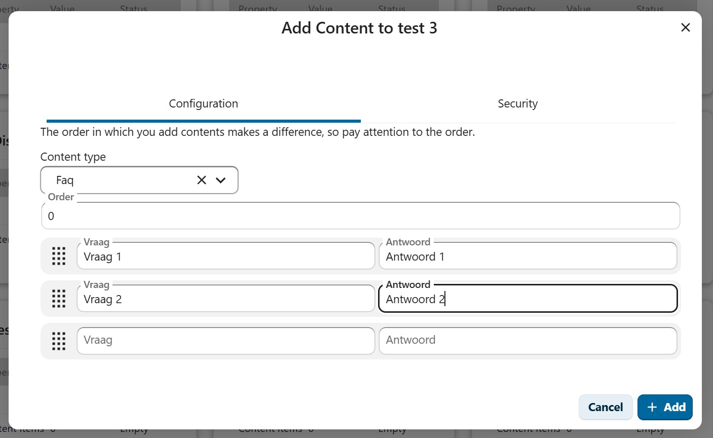

### Quote content

:::info Beschikbaar vanaf
Dit content type is beschikbaar vanaf OpenCatalogi versie **0.8.0**.
:::

Kies content type **Quote** om een opvallend citaat- of highlight-blok toe te voegen. Dit type is bijzonder geschikt voor de voorpagina om een kernboodschap of missie weer te geven.

De Quote heeft twee velden:
- **Title (bold text)**: De hoofdtekst van het citaat (wordt vetgedrukt weergegeven)
- **Subtitle**: Een aanvullende toelichting onder de titel

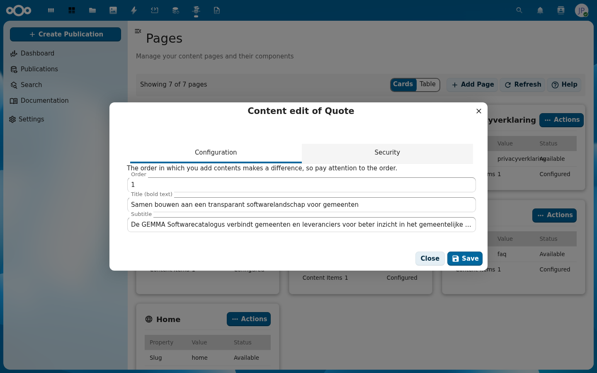

Op de publieke website wordt de Quote weergegeven als een opvallend blok met een lichtblauwe achtergrond en gecentreerde tekst.

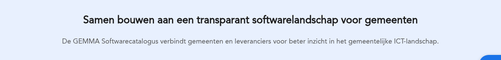

### ContentBlocks content

:::info Beschikbaar vanaf
Dit content type is beschikbaar vanaf OpenCatalogi versie **0.8.0**.
:::

Kies content type **ContentBlocks** om een raster van maximaal 3 kaarten met snelkoppelingen toe te voegen. Elk blok bevat:
- **Icon**: Kies een icoon uit de beschikbare set (search, cubes, cube, users, building, document, gear, link, world, truck, scroll, themes, house)
- **Title**: De titel van het blok
- **Description**: Een korte beschrijving
- **Link URL**: De URL waarnaar het blok verwijst (bijv. `/zoeken`)
- **Link text**: De tekst van de link (bijv. "Start met zoeken")

U kunt blokken toevoegen door de velden in te vullen — er verschijnt automatisch een nieuw leeg blok wanneer het vorige is ingevuld. Blokken zijn versleepbaar via het grid-icoon links.

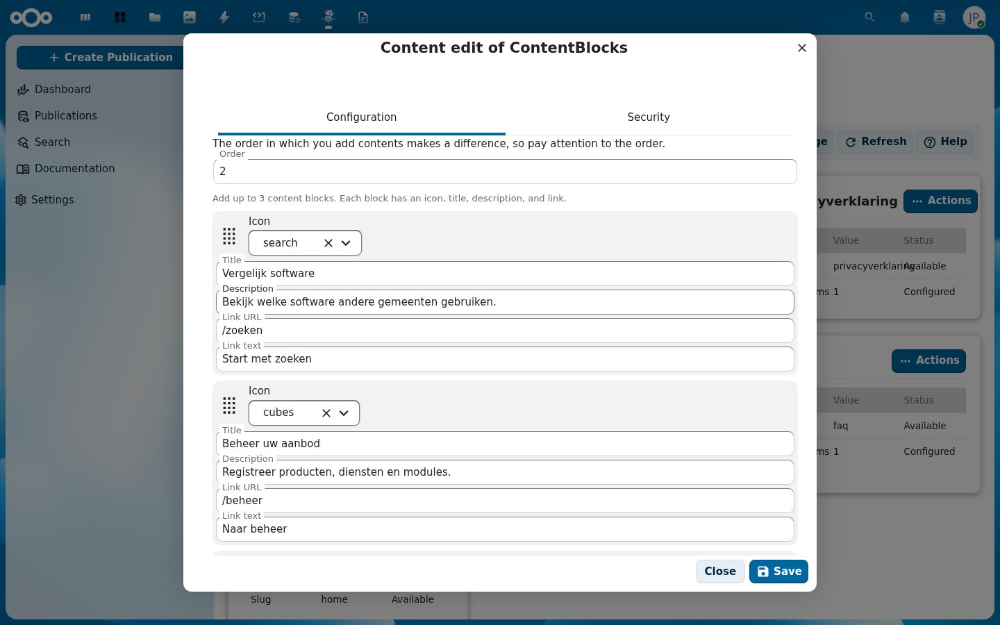

Op de publieke website worden de blokken weergegeven als drie kaarten naast elkaar, elk met een icoon, titel, beschrijving en een link-knop.

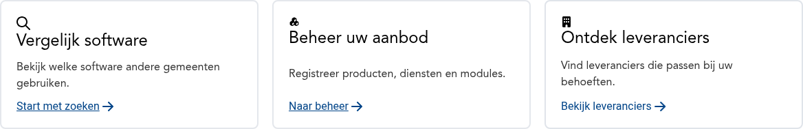

:::tip Volgorde
De volgorde (order) bepaalt de positie van het content item op de pagina. Lagere nummers verschijnen hoger op de pagina. Let op de volgorde wanneer u meerdere content items toevoegt.
:::

## Pagina's op de publieke website

CMS-pagina's zijn publiek toegankelijk via hun slug:

```
https://{frontend-url}/{slug}
```

Bijvoorbeeld:
- `https://softwarecatalogus.nl/privacyverklaring`
- `https://softwarecatalogus.nl/faq`
- `https://softwarecatalogus.nl/algemene-voorwaarden`

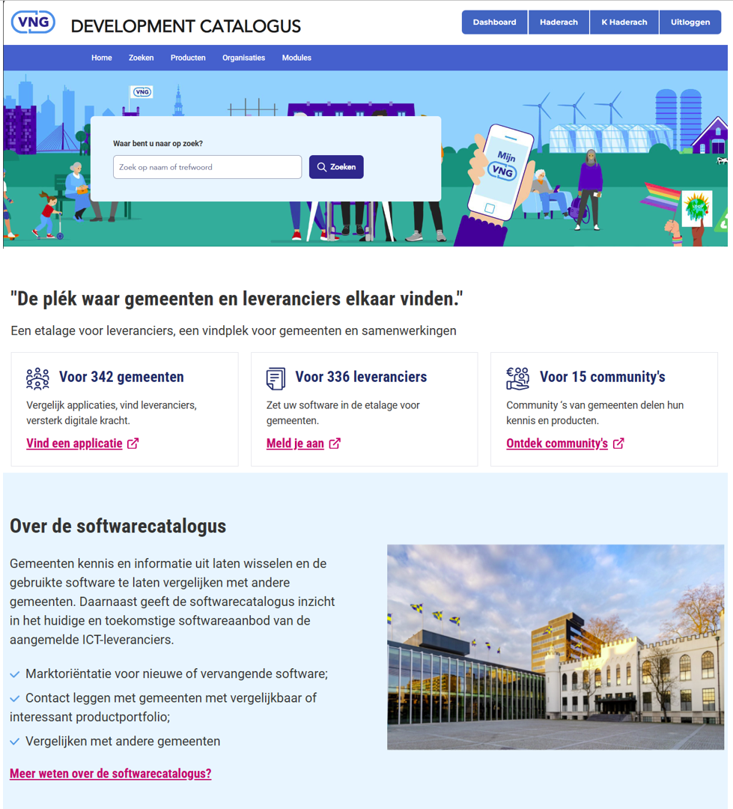

De footer van de publieke website bevat automatisch links naar de privacyverklaring, algemene voorwaarden, disclaimer en FAQ.

## Publieke API

Pagina-inhoud is ook beschikbaar via de API:

```
GET /index.php/apps/opencatalogi/api/pages/{slug}
```

Dit kan handig zijn voor integraties met andere systemen.

## De voorpagina (Home)

De voorpagina (slug: `home`) heeft een speciale opbouw. Naast de zoekbalk (die via het thema wordt geconfigureerd) zijn alle inhoudelijke secties bewerkbaar via het CMS. De standaard opbouw is:

| Content | Type | Order | Beschrijving |
|---------|------|-------|--------------|
| Content 1 | RichText | 0 | Hero-titel en zoekbalk-tekst |
| Content 2 | Quote | 1 | Citaat/highlight-sectie onder de hero |
| Content 3 | ContentBlocks | 2 | Drie kaarten met snelkoppelingen |
| Content 4 | RichText | 3 | Titel "Over de softwarecatalogus"-sectie |
| Content 5 | RichText | 4 | Beschrijving "Over"-sectie |
| Content 6 | RichText | 5 | Link "Over"-sectie |
| Content 7 | Image | 6 | Afbeelding "Over"-sectie |

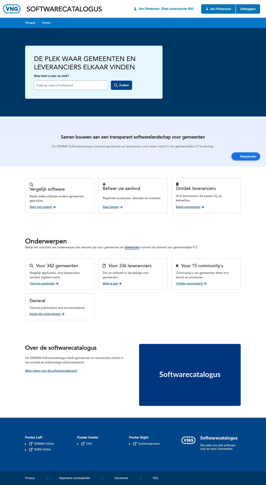

:::info Beschikbaar vanaf
De mogelijkheid om de Quote- en ContentBlocks-secties van de voorpagina via het CMS te beheren is beschikbaar vanaf OpenCatalogi versie **0.8.0**. In eerdere versies waren deze secties vast geconfigureerd via het thema.
:::

## Bekende aandachtspunten

- Zorg dat de **slug** uniek is — dubbele slugs veroorzaken conflicten.
- Na het opslaan kan het enkele seconden duren voordat de wijzigingen zichtbaar zijn op de publieke website (cache).
