# Schema-instellingen (eigenschappen beheren)

In OpenRegister worden de gegevensstructuren van de Softwarecatalogus vastgelegd in **schema's**. Elk schema (applicatie, dienst, koppeling, organisatie, etc.) bevat **eigenschappen** (properties) die bepalen welke velden beschikbaar zijn, hoe ze worden gevalideerd en hoe ze in de beheeromgeving worden getoond.

---

## Navigeren naar schema's

1. Log in op het Nextcloud-backend als **admin**
2. Klik op **OpenRegister** in de bovenste menubalk
3. Klik op **Schemas** in het linkermenu

U ziet nu het schema-overzicht met alle beschikbare schema's.

---

## Schema-overzicht

Het overzicht toont alle geregistreerde schema's. Rechtsboven kunt u schakelen tussen twee weergaven:

### Kaartweergave (Cards)

De standaard weergave toont elk schema als een kaart met de titel, beschrijving en een overzicht van de eerste vijf eigenschappen (naam en type). Elk kaart heeft een **Actions**-knop voor snelle acties.

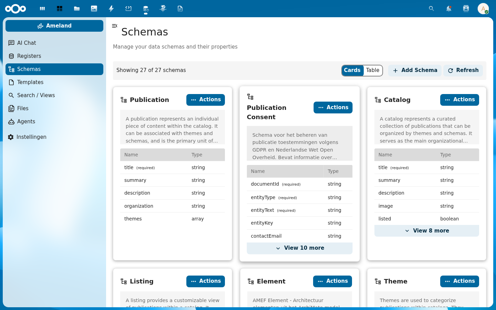

### Tabelweergave (Table)

De tabelweergave toont schema's in een compacte lijst met kolommen: checkbox, Title, Properties (aantal), Created en Updated. Dit is handig voor een snel overzicht van veel schema's.

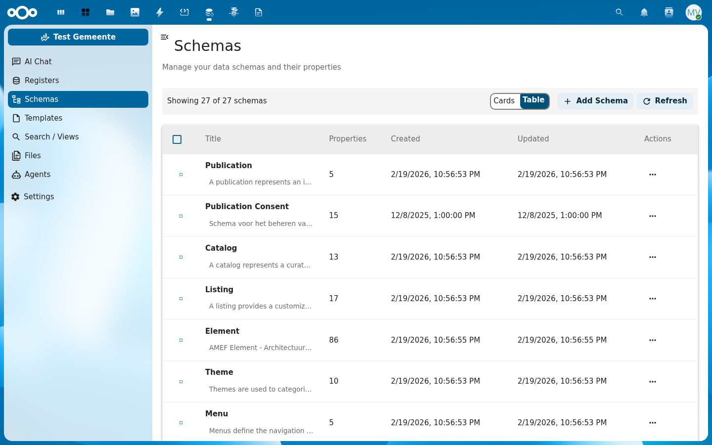

Bij meer dan 20 schema's wordt het overzicht over meerdere pagina's verdeeld.

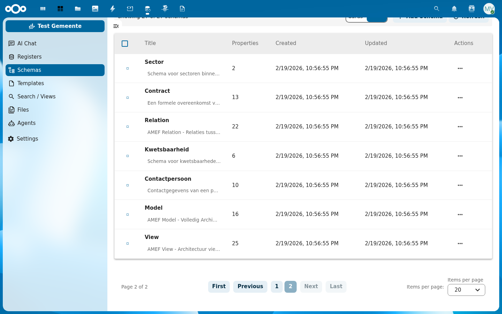

---

## Schema-acties

Klik op de **Actions**-knop bij een schema om het actiemenu te openen:

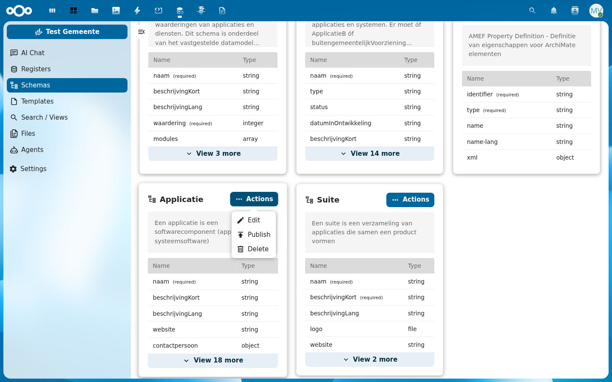

| Actie | Beschrijving |
|-------|--------------|
| **Edit** | Opent het bewerkingsdialoog voor het schema |
| **Publish** | Publiceert het schema (maakt het beschikbaar voor externe systemen) |
| **Delete** | Verwijdert het schema |

:::caution Let op
Het verwijderen van een schema kan gevolgen hebben voor objecten die op dit schema zijn gebaseerd. Verwijder alleen schema's die niet meer in gebruik zijn.
:::

---

## Schema bewerken

Klik op **Edit** in het actiemenu om het **Edit Schema**-dialoog te openen. Het dialoog bevat drie tabbladen: **Properties**, **Configuration** en **Security**.

### Basisvelden

Bovenaan het dialoog staan de basisvelden van het schema:

| Veld | Beschrijving |
|------|--------------|
| **ID / UUID** | Het unieke identificatienummer van het schema. Klik op **Copy** om het UUID te kopiëren. |
| **Title** | De weergavenaam van het schema (verplicht) |
| **Version** | Het versienummer van het schema (bijv. 0.2.4) |
| **Owner** | De eigenaar van het schema (optioneel) |
| **Created / Updated** | Aanmaak- en laatst-gewijzigd-datum |

### Tabblad: Properties

Het Properties-tabblad toont alle eigenschappen van het schema in een lijst. Elke eigenschap toont:

- **Name** — De technische naam van de eigenschap
- **Type** — Het gegevenstype (string, integer, boolean, array, object, file, etc.)
- **Badges** — Visuele labels die de configuratie samenvatten:
  - **Required** (rood) — Eigenschap is verplicht
  - **Table** (blauw) — Zichtbaar in tabelweergave
  - **Facetable** — Beschikbaar als zoekfilter
  - **Hidden in Form** — Verborgen in formulieren
  - **Hidden in view** — Verborgen in detailweergave
  - **Enumeration** — Beperkt tot vaste waarden

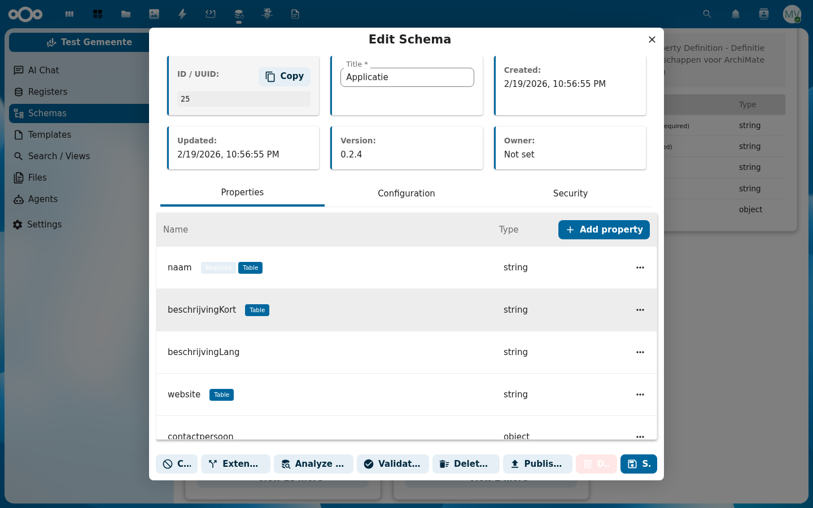

Klik op **+ Add property** om een nieuwe eigenschap toe te voegen.

### Tabblad: Configuration

Het Configuration-tabblad bevat de uitgebreide instellingen van het schema:

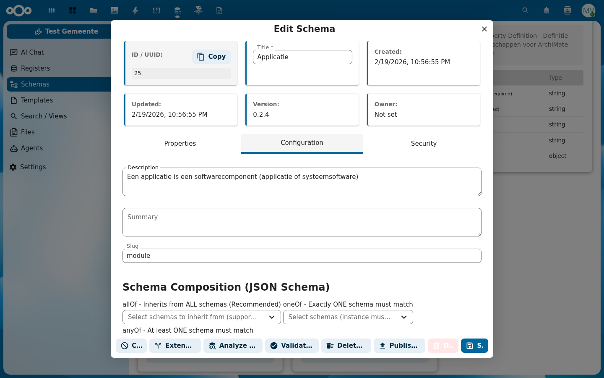

| Instelling | Beschrijving |
|------------|--------------|
| **Description** | Uitgebreide beschrijving van het schema |
| **Summary** | Korte samenvatting |
| **Slug** | URL-vriendelijke naam (bijv. `module`) |
| **Schema Composition** | JSON Schema compositiepatronen (zie hieronder) |
| **Object Name / Description / Image / Summary** | Koppeling van welke eigenschap dient als naam, beschrijving, afbeelding en samenvatting van objecten in dit schema |

#### Schema Composition (JSON Schema)

Schema's ondersteunen drie JSON Schema compositiepatronen voor hergebruik:

| Patroon | Beschrijving |
|---------|--------------|
| **allOf** | Erft van ALLE geselecteerde schema's (aanbevolen voor overerving) |
| **oneOf** | Het object moet aan precies EEN van de geselecteerde schema's voldoen |
| **anyOf** | Het object moet aan minimaal EEN van de geselecteerde schema's voldoen |

### Tabblad: Security

Het Security-tabblad biedt **Role-Based Access Control (RBAC)** — granulaire CRUD-permissies per gebruikersgroep.

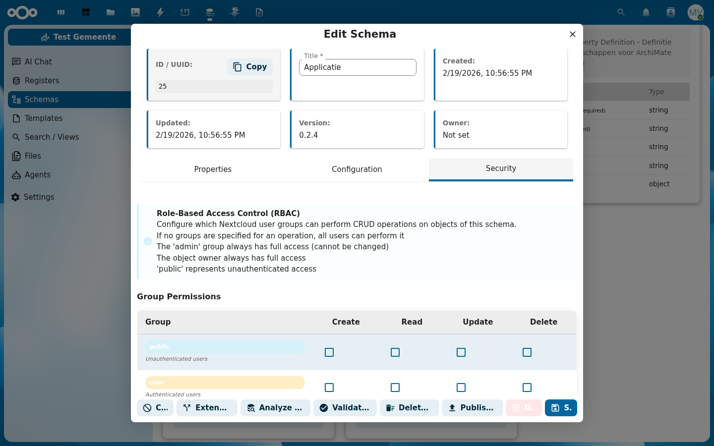

De permissietabel heeft de volgende regels:

- Als **geen groepen** zijn gespecificeerd voor een operatie, kunnen alle gebruikers deze uitvoeren
- De groep **admin** heeft altijd volledige toegang (kan niet worden gewijzigd)
- De **object-eigenaar** heeft altijd volledige toegang
- De groep **public** staat voor niet-geauthenticeerde gebruikers

| Groep | Beschrijving |
|-------|--------------|
| **public** | Niet-geauthenticeerde bezoekers |
| **user** | Geauthenticeerde gebruikers |
| **All Users** | Alle ingelogde gebruikers |
| **Editors** | Redactiegroep |
| **Managers** | Beheergroep |
| **Viewers** | Alleen-lezen groep |
| **admin** | Systeembeheerder (altijd volledige toegang) |

---

## Eigenschappen beheren

### Eigenschapsinstellingen

Klik op een eigenschap in de lijst om deze te bewerken. Klik op het **⋯** (drie puntjes) menu rechts van de eigenschap om het instellingenpaneel te openen.

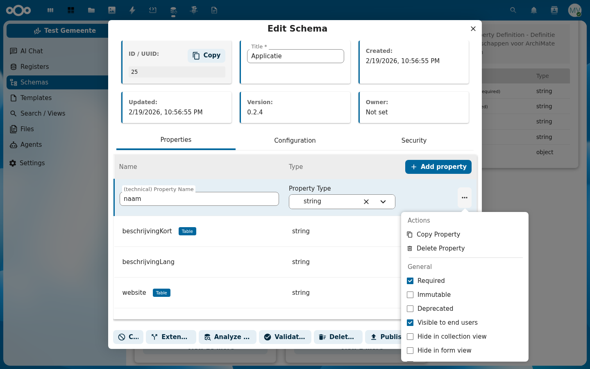

Het instellingenpaneel is verdeeld in de volgende secties:

#### Acties

| Actie | Beschrijving |
|-------|--------------|
| **Copy Property** | Maakt een kopie van deze eigenschap |
| **Delete Property** | Verwijdert de eigenschap uit het schema |

#### Algemene instellingen (toggles)

| Toggle | Beschrijving |
|--------|--------------|
| **Required** | Eigenschap is verplicht bij aanmaken/bewerken |
| **Immutable** | Eigenschap kan niet worden gewijzigd na aanmaken |
| **Deprecated** | Eigenschap is verouderd (wordt niet meer actief gebruikt) |
| **Visible to end users** | Eigenschap wordt getoond in de beheeromgeving voor eindgebruikers |
| **Hide in collection view** | Verberg in tabel- en kaartoverzichten |
| **Hide in form view** | Verberg in formulieren |
| **Facetable** | Maak beschikbaar als zoekfilter op de zoekpagina (zie [Facetbeheer](./facet-beheer.md)) |

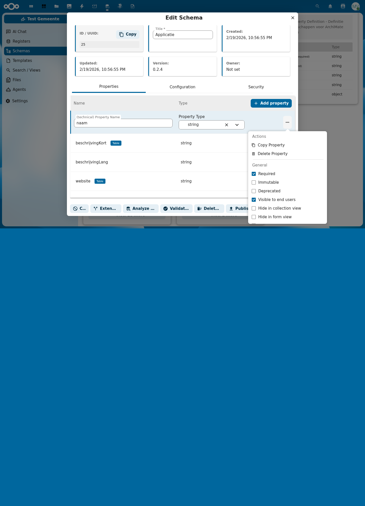

#### Velden (Properties)

| Veld | Beschrijving |
|------|--------------|
| **Title** | De weergavenaam van het veld (wordt getoond in formulieren en tabellen) |
| **Format** | Aanvullende opmaak (bijv. date, email, uri) |
| **Description** | Beschrijving van het veld (wordt getoond als hulptekst) |
| **Example** | Voorbeeldwaarde ter illustratie |
| **Order** | Numerieke positie die de volgorde bepaalt in lijsten en formulieren |

#### Waardebeperkingen (Value Constraints)

| Instelling | Beschrijving |
|------------|--------------|
| **Constant** | Vaste waarde — het veld heeft altijd deze waarde |
| **Enum Values** | Lijst van toegestane waarden (dropdown in formulieren) |

#### Standaardwaarde

| Instelling | Beschrijving |
|------------|--------------|
| **Default Value** | Waarde die wordt ingevuld als het veld leeg blijft |

#### Stringconfiguratie

| Instelling | Beschrijving |
|------------|--------------|
| **Min Length** | Minimale tekstlengte |
| **Max Length** | Maximale tekstlengte |
| **Pattern** | Reguliere expressie voor geavanceerde validatie |

#### Tabelinstellingen

| Instelling | Beschrijving |
|------------|--------------|
| **Table Default** | Standaard weergave-instellingen in de tabel |

#### Beveiliging (Property Security)

Per eigenschap kunnen aparte beveiligingsinstellingen worden geconfigureerd.

### Facetinstellingen

Wanneer een eigenschap als **Facetable** is gemarkeerd, worden extra velden beschikbaar:

| Instelling | Beschrijving |
|------------|--------------|
| **Facet Title** | Titel van het facet op de zoekpagina |
| **Facet Description** | Beschrijving van het facet |
| **Facet Order** | Volgorde van het facet ten opzichte van andere facetten |

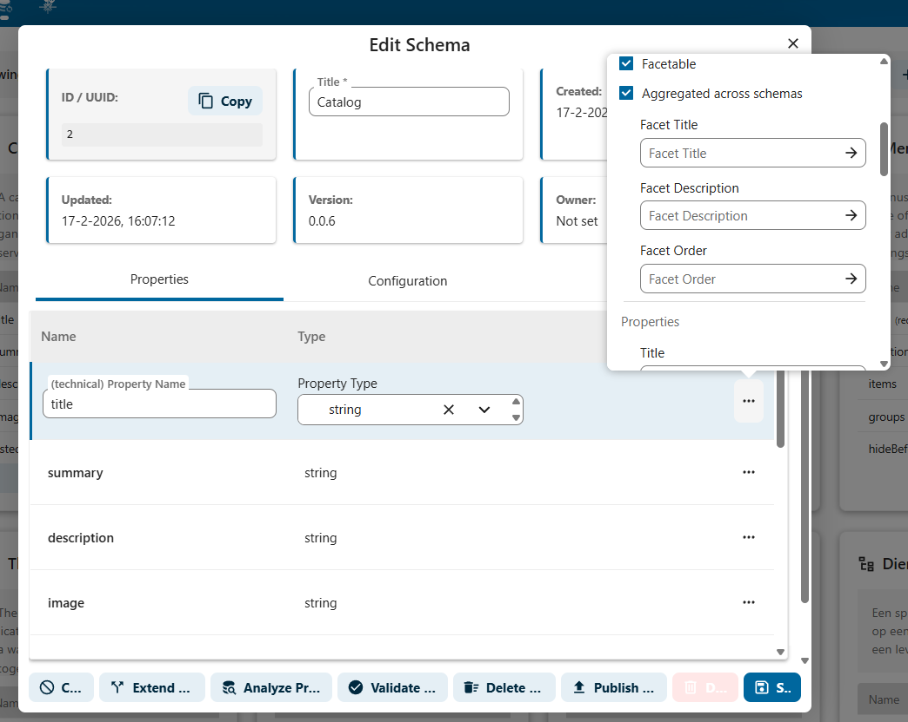

---

## In tabel te tonen kolommen

Via de schema-eigenschappen kunt u bepalen welke kolommen zichtbaar zijn in de overzichtstabellen van de beheeromgeving. Dit doet u door de toggle **"Visible to end users"** per eigenschap aan of uit te zetten.

Hiermee kunt u de tabelweergave afstemmen op de informatie die voor beheerders relevant is. Eigenschappen die niet zichtbaar zijn, worden niet als kolom getoond in het tabeloverzicht, maar zijn wel beschikbaar bij het bewerken van individuele objecten.

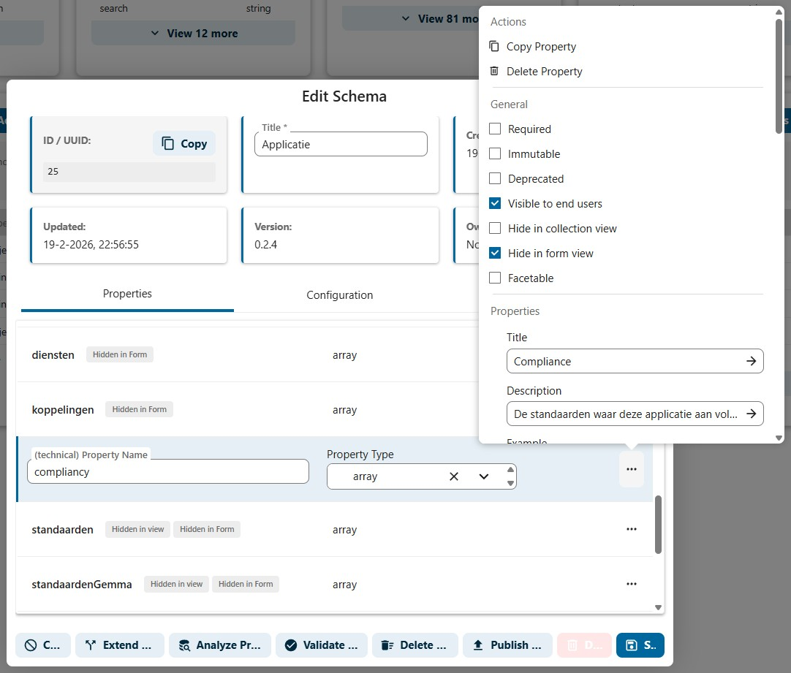
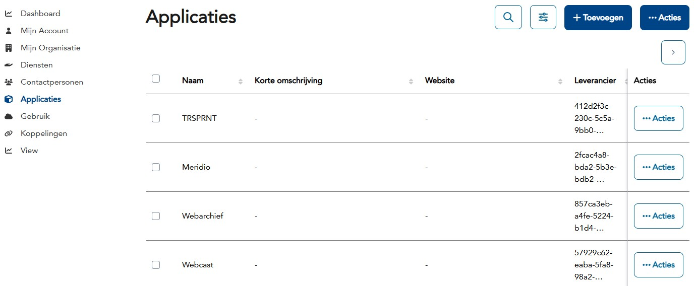

:::tip Overzichtelijke tabellen
Schakel alleen de kolommen in die beheerders daadwerkelijk nodig hebben in hun dagelijkse werkzaamheden. Te veel kolommen maken het tabeloverzicht onoverzichtelijk en vertragen het laden van de pagina.
:::

---

## Een nieuw schema aanmaken

1. Klik op **+ Add Schema** rechtsboven in het schema-overzicht
2. Het **Add Schema**-dialoog opent met dezelfde drie tabbladen als bij bewerken

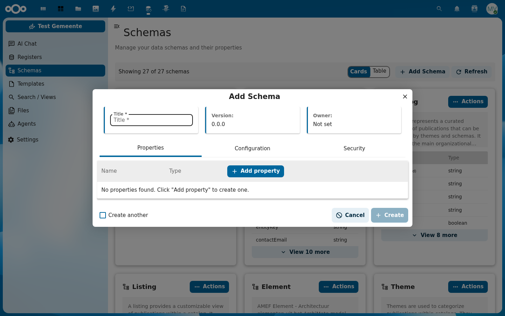

3. Vul minimaal de **Title** in (verplicht)
4. Voeg eventueel eigenschappen toe via **+ Add property**
5. Configureer de **Configuration** en **Security** tabbladen
6. Vink **"Create another"** aan als u meerdere schema's achter elkaar wilt aanmaken
7. Klik op **+ Create**

---

## Bekende aandachtspunten

- Na het wijzigen van schema-instellingen kan het nodig zijn de **cache te legen** voordat de wijzigingen zichtbaar zijn in de frontend
- Het wijzigen van de **title** van een eigenschap wijzigt ook het facetlabel als de eigenschap als facet is ingesteld
- Sommige eigenschappen bevatten verwijzingen naar andere objecten (bijv. leverancier verwijst naar een organisatie). Het type van deze eigenschappen mag niet worden gewijzigd
- De volgorde van eigenschappen in het schema bepaalt de kolomvolgorde in tabeloverzichten
- Schema compositie (**allOf/oneOf/anyOf**) is een krachtige functie voor hergebruik, maar wijzigingen in een bovenliggend schema beïnvloeden alle afgeleide schema's

:::caution Let op
Het wijzigen van het **type** of **format** van een eigenschap kan gevolgen hebben voor bestaande data. Controleer of bestaande objecten nog geldig zijn na de wijziging.
:::

---

## Gerelateerde handleidingen

- [Facetbeheer](./facet-beheer.md) — Zoekfacetten en filters configureren
- [Export beheer](./export-beheer.md) — Registers en schema's exporteren
