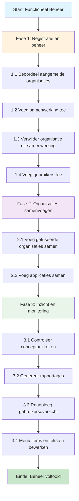

# 🧭 Klantreis functioneel beheer > GEMMA Softwarecatalogus

Dit document beschrijft de klantreis van functioneel beheer in de GEMMA Softwarecatalogus. Per stap kun je een GitHub issue koppelen (bijv. voor feedback, verbeteringen of bugs).

## Overzicht Klantreis

---

## 🔹 Fase 1: Registratie en beheer van organisaties en gebruikers

| Stapnr | Actie                              | Beschrijving                                                      | Gerelateerd issue |
|--------|------------------------------------|-------------------------------------------------------------------|-------------------|
| 1.1    | Beoordeel aangemelde organisaties  | Beoordeel nieuw aangemelde leveranciers                          | [#140](https://github.com/VNG-Realisatie/Softwarecatalogus/issues/140) |
| 1.2    | Voeg samenwerking of bijzondere organisatie toe | Voeg een samenwerking, aanbieder of bijzondere gemeente toe     | [#142](https://github.com/VNG-Realisatie/Softwarecatalogus/issues/142), [#143](https://github.com/VNG-Realisatie/Softwarecatalogus/issues/143) |
| 1.3    | Verwijder organisatie uit samenwerking | Verwijder de organisatie uit een bestaande samenwerking         | – |
| 1.4    | Voeg gebruikers toe                | Voeg gebruikers toe aan gemeenten, leveranciers of samenwerkingen | [#63](https://github.com/VNG-Realisatie/Softwarecatalogus/issues/63), [#64](https://github.com/VNG-Realisatie/Softwarecatalogus/issues/64) |

---

## 🔹 Fase 2: Organisaties samenvoegen

| Stapnr | Actie                              | Beschrijving                                                    | Gerelateerd issue |
|--------|------------------------------------|-----------------------------------------------------------------|-------------------|
| 2.1    | Voeg gefuseerde organisaties samen | Verwerk herindelingen of fusies van gemeenten of leveranciers   | [#141](https://github.com/VNG-Realisatie/Softwarecatalogus/issues/141) |
| 2.2    | Voeg applicaties samen | (Concept) applicaties samenvoegen   | [#141](https://github.com/VNG-Realisatie/Softwarecatalogus/issues/141) |

---

## 🔹 Fase 3: Inzicht en monitoring

| Stapnr | Actie                              | Beschrijving                                                      | Gerelateerd issue |
|--------|------------------------------------|-------------------------------------------------------------------|-------------------|
| 3.1    | Controleer conceptpakketten        | Controleer en valideer door gemeenten of samenwerkingen aangeleverde pakketten  | [#11](https://github.com/VNG-Realisatie/Softwarecatalogus/issues/11) |
| 3.2    | Genereer rapportages               | Maak rapportages over het gebruik en de datakwaliteit            | [#75](https://github.com/VNG-Realisatie/Softwarecatalogus/issues/75) |
| 3.3    | Raadpleeg gebruikersoverzicht      | Raadpleeg en beheer gebruikers per organisatie                   | [#62](https://github.com/VNG-Realisatie/Softwarecatalogus/issues/62) |
| 3.3    | Menu items en teksten bewerken    | Bewerken van menu's, pagina's en teksten  | [#28](https://github.com/VNG-Realisatie/Softwarecatalogus/issues/28) , [#29](https://github.com/VNG-Realisatie/Softwarecatalogus/issues/29) , [#30](https://github.com/VNG-Realisatie/Softwarecatalogus/issues/30) , [ |
