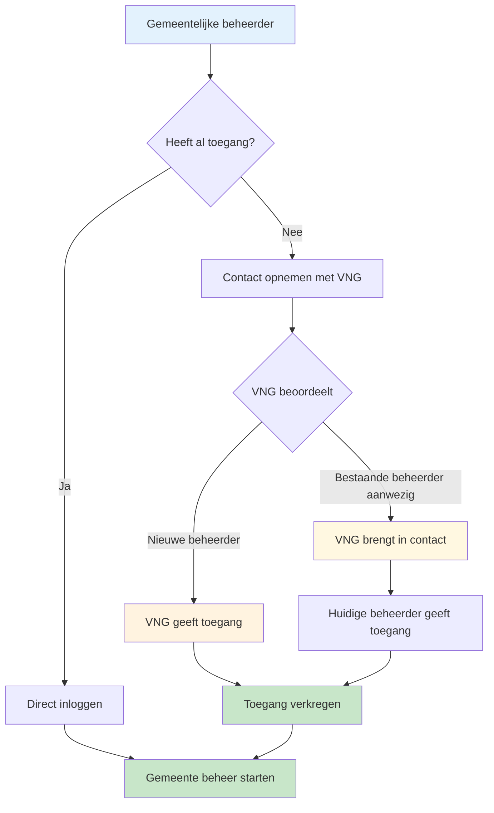

# 🧭 Klantreis gemeente > GEMMA Softwarecatalogus

Dit document beschrijft de klantreis van een gemeente in de GEMMA Softwarecatalogus. Per stap kun je een GitHub issue koppelen (bijv. voor feedback, verbeteringen of bugs).

:::info Gemeente Registratie & Toegang
- **Aanmaken**: Gemeenten worden aangemaakt door VNG Realisatie, niet door zelfregistratie
- **Toegang aanvragen**: Gemeentelijke beheerders zonder toegang kunnen contact opnemen met VNG
- **Toegang verlenen**: VNG geeft toegang of brengt in contact met huidige beheerder
- **Automatische toegang**: Alle Nederlandse gemeenten hebben in principe toegang (behalve bijzondere gemeenten Caribisch gebied)
:::

## Overzicht Klantreis

```mermaid
flowchart TD
    A[Start: Gemeente] --> B[Gemeente bestaat al in systeem?]
    B -->|Ja| C[Beheerder heeft toegang?]
    B -->|Nee| B1[VNG maakt gemeente aan]
    B1 --> C
    C -->|Ja| D[Fase 2: Organisatiebeheer]
    C -->|Nee| C1[Contact opnemen met VNG]
    C1 --> C2{VNG besluit}
    C2 -->|Toegang verlenen| C3[VNG geeft toegang]
    C2 -->|Contact huidige beheerder| C4[VNG brengt in contact met beheerder]
    C3 --> D
    C4 --> C5[Huidige beheerder geeft toegang]
    C5 --> D
    D --> D1[2.1 Organisatie-informatie opvoeren]
    C --> C1[2.1 Organisatie-informatie opvoeren]
    D1 --> D2[2.2 Organisatie toevoegen aan samenwerking]
    D2 --> D3[2.3 Organisatie verwijderen van samenwerking]
    D3 --> F[Fase 3: Gebruikersbeheer]
    F --> F1[3.1 Overzicht gebruikers openen]
    F1 --> F2[3.2 Nieuwe gebruiker toevoegen]
    F2 --> F3[3.3 E-mail met inloggegevens]
    F3 --> F4[3.4 Account activeren]
    F4 --> G[Fase 4: Applicatielandschap]
    G --> G1[4.1 Applicatie zoeken]
    G1 --> G2[4.2 Applicaties vergelijken]
    G2 --> G3[4.3 Applicatie toevoegen]
    G3 --> G4[4.4 Niet-geregistreerde applicatie opvoeren]
    G4 --> G5[4.5 Versie beheren]
    G5 --> G6[4.6 Koppeling maken]
    G6 --> G7[4.7 Koppeling verwijderen]
    G7 --> G8[4.8 Applicatie verwijderen]
    G8 --> H[Fase 5: Diensten beheren]
    H --> H1[5.1 Leveranciers zoeken]
    H1 --> H2[5.2 Dienst toevoegen]
    H2 --> H3[5.3 Dienstinformatie bewerken]
    H3 --> H4[5.4 Dienst verwijderen]
    H4 --> H5[5.5 Dienstverlener beoordelen]
    H5 --> I[Fase 6: Aanbevelingen]
    I --> I1[6.1 Meldingen bekijken]
    I1 --> I2[6.2 Wijzigingen bekijken]
    I2 --> I3[6.3 Gluren bij de buren]
    I3 --> I4[6.4 Statistieken bekijken]
    I4 --> I5[6.5 AI advisering]
    I5 --> I6[6.6 Informatiestromen inzien]
    I6 --> I7[6.7 Register van verwerkingen]
    I7 --> J[Fase 7: Exporteren]
    J --> J1[7.1 Applicatielandschap overzicht]
    J1 --> J2[7.2 Filter toepassen]
    J2 --> J3[7.3 Weergave selecteren]
    J3 --> J4[7.4 Exporteren als AMEFF]
    J4 --> J5[7.5 Exporteren als CSV/Excel]
    J5 --> J6[7.6 Koppelingen als AMEFF]
    J6 --> J7[7.7 Koppelingen als CSV/Excel]
    J7 --> K[Fase 8: Koppelen]
    K --> K1[8.1 Data bijwerken vanuit externe bronnen]
    K1 --> L[Einde: Gemeente volledig ingericht]
    
    style A fill:#e1f5fe
    style L fill:#c8e6c9
    style B1 fill:#ffecb3
    style C1 fill:#ffecb3
    style C3 fill:#c8e6c9
    style C4 fill:#fff3e0
    style D fill:#fff3e0
    style F fill:#f3e5f5
    style G fill:#e8f5e8
    style H fill:#fce4ec
    style I fill:#f1f8e9
    style J fill:#e3f2fd
    style K fill:#fff8e1
```

---

## 🔹 Fase 1: Toegang verkrijgen

| Stapnr | Actie | Beschrijving | Gerelateerd issue |
|--------|-------|--------------|-------------------|
| 1.1 | Gemeente bestaat controleren | VNG controleert of gemeente al in systeem bestaat | |
| 1.2 | Gemeente aanmaken (indien nodig) | VNG maakt gemeente aan in het systeem | |
| 1.3 | Toegang controleren | Controleren of beheerder al toegang heeft | |
| 1.4 | Contact opnemen met VNG | Beheerder zonder toegang neemt contact op met VNG | |
| 1.5 | VNG beoordeelt verzoek | VNG besluit over toegang verlenen of doorverwijzen | |
| 1.6 | Toegang verlenen | VNG geeft direct toegang aan nieuwe beheerder | |
| 1.7 | Contact met huidige beheerder | VNG brengt in contact met bestaande beheerder | |

:::note Automatische Toegang
Alle Nederlandse gemeenten hebben in principe toegang tot de softwarecatalogus, met uitzondering van de bijzondere gemeenten uit het Caribisch gebied die apart beoordeeld worden.
:::

### Toegangsproces voor Gemeentelijke Beheerders

---

## 🔹 Fase 2: Organisatiebeheer (beheerder)

| Stapnr | Actie | Beschrijving | Gerelateerd issue |
|--------|-------|--------------|-------------------|
| 2.1 | Organisatie-informatie opvoeren | Vul of wijzig organisatiegegevens | |
| 2.2 | Organisatie toevoegen aan samenwerking | Voeg de organisatie toe aan een samenwerking | |
| 2.3 | Organisatie verwijderen van samenwerking | Verwijder de organisatie uit een samenwerking | |

---

## ◆ Fase 3: Gebruikersbeheer (beheerder)

| Stapnr | Actie | Beschrijving | Gerelateerd issue |
|--------|-------|--------------|-------------------|
| 3.1 | Overzicht van gebruikers openen | Bekijk het overzicht van gebruikers binnen de organisatie | |
| 3.2 | Nieuwe gebruiker toevoegen voor de organisatie | Voeg een nieuwe gebruiker toe | [#60](https://github.com/VNG-Realisatie/Softwarecatalogus/issues/60) , [#63](https://github.com/VNG-Realisatie/Softwarecatalogus/issues/63) ,  [#65](https://github.com/VNG-Realisatie/Softwarecatalogus/issues/65)|
| 3.3 | Nieuwe gebruiker ontvangt e-mail met inloggegevens | Automatische e-mail met inloggegevens wordt verstuurd | |
| 3.4 | Eerste keer inloggen: account activeren, notificatievoorkeuren instellen en wachtwoord instellen | Activeer het account en stel wachtwoord in bij eerste inlog | |

---

## ◆ Fase 4: Applicatielandschap bewerken (beheerder)

| Stapnr | Actie | Beschrijving | Gerelateerd issue |
|--------|-------|--------------|-------------------|
| 4.1 | Applicatie zoeken | Vind applicaties in de catalogus |[#144](https://github.com/VNG-Realisatie/Softwarecatalogus/issues/144) , [#21](https://github.com/VNG-Realisatie/Softwarecatalogus/issues/21)|
| 4.2 | Applicaties vergelijken | Vergelijk eigenschappen en gebruik van applicaties | [#31](https://github.com/VNG-Realisatie/Softwarecatalogus/issues/31) |
| 4.3 | Applicatie toevoegen en informatie opvoeren | Voeg een nieuwe applicatie toe en vul informatie in (contactpersoon, documenten) | [#18](https://github.com/VNG-Realisatie/Softwarecatalogus/issues/18) , [#17](https://github.com/VNG-Realisatie/Softwarecatalogus/issues/17) , [#59](https://github.com/VNG-Realisatie/Softwarecatalogus/issues/59) , [#58](https://github.com/VNG-Realisatie/Softwarecatalogus/issues/58) , [#37](https://github.com/VNG-Realisatie/Softwarecatalogus/issues/37) , [#41](https://github.com/VNG-Realisatie/Softwarecatalogus/issues/41) , [#49](https://github.com/VNG-Realisatie/Softwarecatalogus/issues/49)|
| 4.4 | Een niet-geregistreerde applicatie opvoeren | Voeg een applicatie toe als concept voor een aanbieder | [#12](https://github.com/VNG-Realisatie/Softwarecatalogus/issues/12) , [#143](https://github.com/VNG-Realisatie/Softwarecatalogus/issues/143)
| 4.5 | Versie toevoegen, bewerken of verwijderen | Beheer versies van applicaties | |
| 4.6 | Koppeling maken tussen applicaties en/of landelijke voorzieningen | Leg koppelingen vast met andere applicaties of voorzieningen | [#56](https://github.com/VNG-Realisatie/Softwarecatalogus/issues/56) , [#55](https://github.com/VNG-Realisatie/Softwarecatalogus/issues/55) |
| 4.7 | Koppeling verwijderen | Verwijder bestaande koppelingen | |
| 4.8 | Applicatie verwijderen | Verwijder applicatie uit het applicatielandschap | |
| 4.9 | Applicatielandschap alleen zichtbaar voor gemeenten | Aanbieders zijn uitgesloten | [#105](https://github.com/VNG-Realisatie/Softwarecatalogus/issues/105) |

---

## ◆ Fase 5: Diensten beheren (beheerder)

| Stapnr | Actie | Beschrijving | Gerelateerd issue |
|--------|-------|--------------|-------------------|
| 5.1 | Leveranciers met diensten zoeken | Vind leveranciers die diensten aanbieden | [#144](https://github.com/VNG-Realisatie/Softwarecatalogus/issues/144) , [#74](https://github.com/VNG-Realisatie/Softwarecatalogus/issues/74) , [#105](https://github.com/VNG-Realisatie/Softwarecatalogus/issues/105) |
| 5.2 | Dienst toevoegen aan applicatie | Voeg een dienst toe aan een applicatie | [#35](https://github.com/VNG-Realisatie/Softwarecatalogus/issues/35)|
| 5.3 | Dienstinformatie bewerken | Pas informatie over een dienst aan | |
| 5.4 | Dienst verwijderen van applicatie | Verwijder een dienst van een applicatie | |
| 5.5 | Dienstverlener sterren geven | Kwaliteit van dienstverlening beoordelen | [#34](https://github.com/VNG-Realisatie/Softwarecatalogus/issues/34) |

---

## ◆ Fase 6: Aanbevelingen en overzichten

| Stapnr | Actie | Beschrijving | Gerelateerd issue |
|--------|-------|--------------|-------------------|
| 6.1 | Meldingen van leveranciers bekijken | Bekijk meldingen over wijzigingen van leveranciers | [#54](https://github.com/VNG-Realisatie/Softwarecatalogus/issues/54)|
| 6.2 | Wijzigingen van leveranciers op applicaties in je landschap bekijken | Bekijk wijzigingen zoals nieuwe versie, beëindiging ondersteuning, alternatieve hosting, etc. |[#54](https://github.com/VNG-Realisatie/Softwarecatalogus/issues/54) |
| 6.3 | Gluren bij de buren | Bekijk welke applicaties door andere gemeenten in gebruik zijn | [ #20](https://github.com/VNG-Realisatie/Softwarecatalogus/issues/20) , [#19](https://github.com/VNG-Realisatie/Softwarecatalogus/issues/19)  , [#74](https://github.com/VNG-Realisatie/Softwarecatalogus/issues/74)|
| 6.4 | Statistieken van de softwarecatalogus | Inzicht in gebruik van de softwarecatalogus | [#32](https://github.com/VNG-Realisatie/Softwarecatalogus/issues/32) |
| 6.5 | Advisering door AI | Nieuwe inzichten via AI | [#13](https://github.com/VNG-Realisatie/Softwarecatalogus/issues/13)  [#53](https://github.com/VNG-Realisatie/Softwarecatalogus/issues/53) |
| 6.6 | Inzicht in informatiestromen | Diagrammen van informatiestromen tussen applicaties | [#51](https://github.com/VNG-Realisatie/Softwarecatalogus/issues/51) |
| 6.7 | Register van verwerkingen | Genereren van een register van verwerkingen | [#82](https://github.com/VNG-Realisatie/Softwarecatalogus/issues/82) |

---

## ◆ Fase 7: Applicatielandschap exporteren

| Stapnr | Actie | Beschrijving | Gerelateerd issue |
|--------|-------|--------------|-------------------|
| 7.1 | Applicatielandschap overzicht | Overzichtelijke tabel weergave van het applicatielandschap | [#33](https://github.com/VNG-Realisatie/Softwarecatalogus/issues/33) |
| 7.2 | Filter toepassen in het applicatielandschap | Filter het landschap op relevante criteria |[#22](https://github.com/VNG-Realisatie/Softwarecatalogus/issues/22) |
| 7.3 | Weergave (view) selecteren en tonen | Selecteer een gewenste weergave (view) van het landschap | [#68](https://github.com/VNG-Realisatie/Softwarecatalogus/issues/68)|
| 7.4 | Applicatielandschap exporteren als AMEFF | Exporteer het landschap als AMEFF-bestand | [#16](https://github.com/VNG-Realisatie/Softwarecatalogus/issues/16) |
| 7.5 | Applicatielandschap exporteren als CSV of Excel | Exporteer het landschap als CSV of Excel | [#15](https://github.com/VNG-Realisatie/Softwarecatalogus/issues/15) |
| 7.6 | Koppelingen exporteren als AMEFF | Exporteer koppelingen als AMEFF-bestand | [#16](https://github.com/VNG-Realisatie/Softwarecatalogus/issues/16) |
| 7.7 | Koppelingen exporteren als CSV of Excel | Exporteer koppelingen als CSV of Excel | [#15](https://github.com/VNG-Realisatie/Softwarecatalogus/issues/15)|

---

# ◆ Fase 8: Applicatielandschappen koppelen

| Stapnr | Actie | Beschrijving | Gerelateerd issue |
|--------|-------|--------------|-------------------|
| 8.1 | Data bijwerken vanuit externe bronnen | API, csv of andere opties | [#52](https://github.com/VNG-Realisatie/Softwarecatalogus/issues/52) |

# VNG

## Fase 2

- [ ] *Samenwerkingen* moet mogelijk *deelnemingen* of *deelnames* zijn (even uitzoeken).
- [ ] `inversedBy` moet verwijzen naar *deelnemers*.
- [ ] Als organisatie verwacht ik een tabblad **Deelnemingen**.
- [ ] Als organisatie verwacht ik een knop **Deelneming toevoegen**.
- [ ] En een dialoog waarin ik een *samenwerking* of *community* (organisatietypes) kan selecteren om aan deel te nemen.
- [ ] Als organisatie verwacht ik *deelnemingen* te kunnen verwijderen.
- [ ] Bij zoeken verwacht ik bij *samenwerkingen* en *communities* de *deelnemers* te kunnen zien.
- [ ] Bij zoeken verwacht ik bij *organisaties* hun *deelnemingen* te kunnen zien.
- [ ] Als *samenwerking* of *community* verwacht ik in **beheer** een menu-item **Deelnemers** met daarop een tabel van organisaties die aan mij deelnemen (doorklikken naar organisatiepagina op zoeken).

## Fase 3

- [ ] Als gebruiker verwacht ik op de **Mijn pagina** notificatievoorkeuren te kunnen opgeven.

## Fase 4

- [ ] 4.2 is een wens.
- [ ] Bij het opvoeren van een applicatie wil ik ook kunnen opgeven: **"eigenaar onbekend"**. Hiervoor moet een *business flow* worden geschreven. Eerst bouwen, dan refinen.
  - Radio: **Mijn organisatie**
  - Radio: **Andere organisatie** → Zoeklijst organisatie. Applicatie aanmaken in concept + *business flow*.
  - Radio: **Voor nog niet in softwarecatalogus bekende organisatie**. Applicatie aanmaken in concept + *business flow*.
- [ ] Bij gebruik ook een koppeling toevoegen; object bestaat al.
  - Koppeling maak je aan vanuit **gebruik**.
  - Zowel de *van* als *naar* is OF een ander gebruik in de organisatie, of een landelijke voorziening → gebruik.  
    (*Vraag: waar vinden we de landelijke voorzieningenlijst?*)  
    *Gebruik naar gebruik* kunnen we al bouwen.
- [ ] Applicatie verwijderen via gebruik.

## Fase 5

- Neem aan dat dit over gebruik gaat. In dat geval geen nog af te ronden functionaliteiten.

## Fase 6

- [ ] Dienstverleners sterren geven (stickertje achter je naam) gebeurt aan de hand van het *review object*.  
      (*Wat is hier de business logic?*)
- [ ] Wat is een melding van een wijziging van leverancier?
- [ ] Gaat dit om het inzien van *changes*?  
      Wil je dan ook zien welke *changes*?  
      Een wijzigingspagina voelt als *scope creep* (wel een coole feature).
- [ ] Welke statistieken willen we exact?  
      Wat we nog voor de frontend moeten doen, is een *tracking pixel* toevoegen.

## Fase 7

- Geen nog af te ronden functionaliteiten.

## Fase 8

- 8.1 is niet **P.v.E.**?

