# 🧭 [Klantreis leverancier](https://github.com/orgs/VNG-Realisatie/projects/17/views/3?filterQuery=label%3A%22Organisatie+en+configuratie%22+label%3A%22PvE+eis%22+&pane=issue&itemId=97109869&issue=VNG-Realisatie%7CSoftwarecatalogus%7C63) – GEMMA Softwarecatalogus

Dit document beschrijft de klantreis van een leverancier in de GEMMA Softwarecatalogus. Per stap kun je een GitHub issue koppelen (bijv. voor feedback, verbeteringen of bugs).

## 📖 Het Verhaal van een Leverancier

*"Ik ben directeur van een ICT-bedrijf dat al jaren software maakt voor gemeenten. We hebben een geweldige applicatie voor vergunningverlening, maar we merken dat gemeenten ons niet altijd kunnen vinden. Dan horen we over de GEMMA Softwarecatalogus - één plek waar alle gemeenten kijken naar software. Dit is onze kans!"*

**De reis van een ambitieuze leverancier die zichtbaar wil worden voor gemeenten...**

## Overzicht Klantreis

```mermaid
flowchart TD
    A[Start: Leverancier] --> B[Fase 1: Registratie]
    B --> B1[1.1 Organisatie aanmelden]
    B1 --> B2[1.2 Registratie bevestigen via e-mail]
    B2 --> B3[1.3 Eerste account aanmaken]
    B3 --> C[Fase 2: Organisatie-inrichting]
    C --> C1[2.1 Collega's aanmaken]
    C1 --> C2[2.2 Organisatie-informatie opvoeren]
    C2 --> D[Fase 3: Applicaties opvoeren]
    D --> D1[3.1 Applicatie aanmaken]
    D1 --> D2[3.2 Koppelen aan GEMMA]
    D2 --> D3[3.3 Versie aanmaken]
    D3 --> D4[3.4 Hostingtype specificeren]
    D4 --> D5[3.5 Licentietype kiezen]
    D5 --> D6[3.6 Diensten koppelen]
    D6 --> D7[3.7 Documenten uploaden]
    D7 --> E[Fase 4: Diensten bij andere applicaties]
    E --> E1[4.1 Applicatie zoeken]
    E1 --> E2[4.2 Applicatie selecteren]
    E2 --> E3[4.3 Diensten toevoegen/hergebruiken]
    E3 --> F[Fase 5: Gemeente informeren]
    F --> F1[5.1 Overzicht afnemende organisaties]
    F1 --> F2[5.2 Applicatie/dienst promoten]
    F2 --> G[Fase 6: Data en inzichten]
    G --> G1[6.1 Applicatielandschap exporteren]
    G1 --> G2[6.2 Landschap importeren]
    G2 --> H[Einde: Leverancier volledig actief]
    
    style A fill:#e1f5fe
    style H fill:#c8e6c9
    style B fill:#fff3e0
    style C fill:#f3e5f5
    style D fill:#e8f5e8
    style E fill:#fce4ec
    style F fill:#f1f8e9
    style G fill:#e3f2fd
```

---

## 🔹 Fase 1: Registratie

*"Ik ga naar de website en zie een aanmeldformulier. Spannend! Ik vul alles in: onze bedrijfsgegevens, wat we doen, welke software we maken. Dan druk ik op 'verzenden' en... wachten maar. Worden we geaccepteerd?"*

| Stapnr | Actie                                 | Beschrijving                                                       | Gerelateerd issue |
|--------|----------------------------------------|--------------------------------------------------------------------|-------------------|
| 1.1    | Organisatie aanmelden                  | Startpunt voor leveranciers om toegang aan te vragen               | [#139](https://github.com/VNG-Realisatie/Softwarecatalogus/issues/139)              |
| 1.2    | Registratie bevestigen (via e-mail)    | Leverancier bevestigt aanmelding via link in e-mail                | [#63](https://github.com/VNG-Realisatie/Softwarecatalogus/issues/63)                 |
| 1.3    | Eerste account aanmaken (beheerder)    | De eerste gebruiker wordt door de functioneel aangemaakt           | [#63](https://github.com/VNG-Realisatie/Softwarecatalogus/issues/63)                 |

*"Yes! Een e-mail: 'Gefeliciteerd, u bent geaccepteerd!' Ik krijg inloggegevens en kan voor het eerst inloggen. Het voelt als de eerste dag op een nieuwe school - alles is nieuw en opwindend."*

---

## 🔹 Fase 2: Organisatie-inrichting

*"Nu ik binnen ben, moet ik ons bedrijf goed neerzetten. Ik nodig mijn collega's uit - onze sales manager moet ook toegang hebben, en onze technisch directeur. We vullen ons profiel aan: logo, certificeringen, contactgegevens. Het is net als LinkedIn, maar dan voor gemeentelijke software!"*

| Stapnr | Actie                                  | Beschrijving                                                       | Gerelateerd issue |
|--------|-----------------------------------------|--------------------------------------------------------------------|-------------------|
| 2.1    | Collega's aanmaken                      | Andere gebruikers uitnodigen voor toegang tot de organisatie       | [#73](https://github.com/VNG-Realisatie/Softwarecatalogus/issues/73)                 |
| 2.2    | Organisatie-informatie opvoeren         | Naam, contactgegevens, certificeringen, et cetera invullen         | [#66](https://github.com/VNG-Realisatie/Softwarecatalogus/issues/66)                 |

---

## 🔹 Fase 3: Applicaties opvoeren

*"Dit is het moment waar ik naar heb uitgekeken! Ik ga onze vergunningapplicatie toevoegen. Ik vul alles in: wat het doet, welke GEMMA componenten het ondersteunt, of het SaaS of on-premise is. Het is alsof ik een etalage inricht - alles moet perfect zijn want gemeenten gaan dit zien!"*

| Stapnr | Actie                                  | Beschrijving                                                       | Gerelateerd issue |
|--------|-----------------------------------------|--------------------------------------------------------------------|-------------------|
| 3.1    | Applicatie aanmaken                     | Nieuwe applicatie toevoegen aan het overzicht                      | [#5](https://github.com/VNG-Realisatie/Softwarecatalogus/issues/5) , [#24](https://github.com/VNG-Realisatie/Softwarecatalogus/issues/24) , [#42](https://github.com/VNG-Realisatie/Softwarecatalogus/issues/42) , [#47](https://github.com/VNG-Realisatie/Softwarecatalogus/issues/47) , [#147](https://github.com/VNG-Realisatie/Softwarecatalogus/issues/147)                |
| 3.2    | Koppelen aan GEMMA                      | Applicatie relateren aan GEMMA referentiecomponenten               | [#4](https://github.com/VNG-Realisatie/Softwarecatalogus/issues/4) , [#6](https://github.com/VNG-Realisatie/Softwarecatalogus/issues/6)                |
| 3.3    | Versie(s) aanmaken                      | Versie aanmaken voor on premise                                    | #                 |
| 3.4    | Hostingtype specificeren                | SaaS, lokaal, hybride etc. + jurisdictie                           | [#9](https://github.com/VNG-Realisatie/Softwarecatalogus/issues/9) , [#37](https://github.com/VNG-Realisatie/Softwarecatalogus/issues/37) , [#38](https://github.com/VNG-Realisatie/Softwarecatalogus/issues/38)                |
| 3.5    | Licentietype kiezen                     | Open source, commercieel, etc.                                     | [#7](https://github.com/VNG-Realisatie/Softwarecatalogus/issues/7)                 |
| 3.7    | Documenten uploaden                    | Verwerkersovereenkomsten, TPM-verklaringen, et cetera                          | [#43](https://github.com/VNG-Realisatie/Softwarecatalogus/issues/43)                 |
| 3.6    | Dienst(en) koppelen                     | Direct de eigen diensten kunnen toevoegen                          | [#36](https://github.com/VNG-Realisatie/Softwarecatalogus/issues/36)                 |

*"Klaar! Onze applicatie staat online. Nu kunnen gemeenten ons vinden en zien wat we te bieden hebben. Het voelt als het openen van een nieuwe winkel!"*

---

## 🔹 Fase 4: Dienst(en) toevoegen bij een andere applicatie

| Stapnr | Actie                                  | Beschrijving                                                       | Gerelateerd issue |
|--------|-----------------------------------------|--------------------------------------------------------------------|-------------------|
| 4.1    | Applicatie zoeken                       | Zoek een bestaande applicatie binnen de organisatie                | [#3](https://github.com/VNG-Realisatie/Softwarecatalogus/issues/3) , , [#14](https://github.com/VNG-Realisatie/Softwarecatalogus/issues/14) ,  [#144](https://github.com/VNG-Realisatie/Softwarecatalogus/issues/144)              |
| 4.2    | Applicatie selecteren                   | Selecteer de juiste applicatie                                     | #                 |
| 4.3    | Dienst(en) toevoegen of hergebruiken    | Voeg de mogelijke diensten toe                                     | [#36](https://github.com/VNG-Realisatie/Softwarecatalogus/issues/36)                 |

---

## 🔹 Fase 5: Gemeente informeren / promotie

| Stapnr | Actie                                  | Beschrijving                                                       | Gerelateerd issue |
|--------|-----------------------------------------|--------------------------------------------------------------------|-------------------|
| 5.1    | Overzicht van afenemende organisaties   | Inzicht wie mijn applicaties hebben opgevoerd         | [#8](https://github.com/VNG-Realisatie/Softwarecatalogus/issues/8)                 |
| 5.2   | Applicatie of dienst promoten           | Een dienst of applicatie delen met gemeenten via catalogus         | [#10](https://github.com/VNG-Realisatie/Softwarecatalogus/issues/10)                 |

---

## 🔹 Fase 6: Data en inzichten

| Stapnr | Actie                                  | Beschrijving                                                       | Gerelateerd issue |
|--------|-----------------------------------------|--------------------------------------------------------------------|-------------------|
| 6.1    | Applicatie Landschap exporteren   | Overzicht van de opgevoerde applicaties         | [#15](https://github.com/VNG-Realisatie/Softwarecatalogus/issues/15) , [#33](https://github.com/VNG-Realisatie/Softwarecatalogus/issues/33)                |
| 6.2   |Landschap importeren     | Overzicht van applicaties kunnen importeren     | [#16](https://github.com/VNG-Realisatie/Softwarecatalogus/issues/16)                 |

---

## Bevindingen aan de hand van review

### 📋 Registratieformulier https://conduction.atlassian.net/browse/VSC-342
- [ ] Overal “aanmelden” gebruiken in plaats van “registreren”
- [ ] Organisatietype vooraf laten invullen op basis van een link
- [ ] Korte beschrijving: gebruik Markdown + toon het resterende aantal tekens duidelijk
- [ ] Tooltip (i’tje) bij korte beschrijving toevoegen
- [ ] Logo optioneel maken
- [ ] Website verplaatsen naar organisatiegegevens en verplicht maken
- [ ] Bij contactpersoon vermelden: waarvoor is deze persoon contactpersoon?
- [ ] Bij contactpersoon uitlegtekst opnemen (wordt aangeleverd door Peter)
- [ ] Bij versturen: “U gaat akkoord met de volgende richtlijnen” (inhoud wordt aangeleverd door Peter)
- [ ] Akkoord laten gaan met opslag van persoonsgegevens (inhoud wordt aangeleverd door Peter)
- [ ] Bij “gemeente” geen formulier tonen, maar informatieve tekst: “Neem contact op met Peter”
- [ ] Logo: toon een leeg plaatje, vervang dit bij upload door een file selector

### 🏢 Organisatie-inrichting https://conduction.atlassian.net/browse/VSC-343
- [ ] Bij organisatiegegevens: logo upload in plaats van URL
- [ ] Contactpersonen en samenwerkingen tonen als tabbladen
- [ ] Lange beschrijving kan erg lang zijn – overwegen dit in een apart formulier op te nemen
- [ ] Korte én lange beschrijving onder organisatienaam tonen
- [ ] Organisaties hebben geen links, maar wel verklaringen (die extern zinvol zijn)
- [ ] Labels worden bepaald door Peter; richtlijn bevat: geen commerciële richtlijnen
- [ ] Kolom “status” moet hernoemd worden
- [ ] “Types” en “grootte” weglaten
- [ ] Bestandsnaam linken aan bestand, met optie publiceren / depubliceren
- [ ] Lange beschrijving in een apart formulier opnemen
- [ ] Per veld instelbaar maken of het doorzoekbaar is
- [ ] Formulier afhankelijk maken van gekozen organisatietype
- [ ] Verklaring kunnen toevoegen en verwijderen
- [ ] Deelnemingen kunnen toevoegen
- [ ] Knoppen staan nu soms links, soms rechts → harmoniseren
- [ ] In het bewerkformulier van organisaties nadenken over logische blokindeling
- [ ] Rol wordt verwijderd uit organisaties
- [ ] Sector staat nu als “doelgroep” bij applicatie → verplaatsen/hernoemen

### 👥 Gebruikers beheren https://conduction.atlassian.net/browse/VSC-345
- [ ] Gebruikers hebben geen bestanden
- [ ] Rollen moeten overeenkomen met de VNG functiematrix
- [ ] Formulier tonen in kolommen
- [ ] Ingelogde gebruiker kan geen organisatie selecteren (tenzij admin)
- [ ] Formulier maken voor uitnodigen van gebruikers voor eigen organisatie
- [ ] Taal altijd op Nederlands
- [ ] Thema altijd op “light”
- [ ] Vinkje “aanspreekpunt” = gepubliceerd (to do)
- [ ] In formulier aangeven welke gegevens worden gepubliceerd
- [ ] Contactgegevens horen bij organisatie, maar scheiding accounts/contactgegevens parkeren
- [ ] Peter onderzoekt hoeveel accounts aan meerdere organisaties hangen
- [ ] Als je aanspreekpunt bent → overige contactgegevens verplicht maken (bv. telefoonnummer)

### 👤 Gebruiker personaliseren (via “My” URL)](https://conduction.atlassian.net/browse/VSC-346)
- [ ] Thema en taal kunnen kiezen

### 🧩 Applicaties toevoegen https://conduction.atlassian.net/browse/VSC-347
- [ ] Waar komt applicatietype vandaan? (vermoedelijk uit datamodel bij voorziening: applicatie, technologie, hosting)
- [ ] Welke waardes missen nog? Zie PowerPoint
- [ ] Bij selecteren van referentiecomponent worden standaarden gesuggereerd → keuze uit lijst of zelf toevoegen
- [ ] Categorie kan vervallen
- [ ] Functionaliteiten kunnen vervallen
- [ ] Doelgroepen vervallen
- [ ] Referentiecomponenten kunnen aan elkaar gekoppeld worden
- [ ] Bij standaarden aangeven of je compliant bent (eventueel met testrapport)
- [ ] Standaarden zijn koppelobjecten in apart tabblad
- [ ] Mogelijk als apart formulier uitwerken
- [ ] Domein toevoegen aan formulier
- [ ] Beschrijving van wat een component doet toevoegen- Klantreis van maken
- [ ] Sorteer alfabetisch + hover voor beschrijving
- [ ] Bug: “sticky contactpersoon”
- [ ] Versies als tabblad tonen
- [ ] Hostingopties toevoegen, incl. “on-premise”
- [ ] Licentietype: open source of closed source.
- [ ] Bij open source → licentie selecteren
- [ ] Bij closed source → geen keuze
- [ ] Link naar repository (optioneel)
- [ ] Knop “Bekijken in catalogus”

### 🌀 Versies toevoegen https://conduction.atlassian.net/browse/VSC-348
- [ ] Productlevenscyclus: met in-/uitdatum per status (bv. “in gebruik”)
- [ ] Systeemvereisten vervallen
- [ ] Kwetsbaarheden ook voor nu schrappen
- [ ] Bij SaaS-applicaties automatisch een default versie aanmaken
- [ ] Voor nu geen bestanden

### 📑 Dienst https://conduction.atlassian.net/browse/VSC-349
- [ ] Tabblad “Diensten” met alleen de diensten van de betreffende organisatie
- [ ] Welk rekencentrum wordt gebruikt voor de dienst?
- [ ] Voorziening wordt hernoemd naar “applicatie”
- [ ] Mark past informatiemodel aan, aanbiedersrol vervalt
- [ ] Geen ondersteunde standaarden meer tonen
- [ ] Certificeringen vervallen – worden “verklaringen”
- [ ] Prijsmodel kan eruit
- [ ] Licentie vervalt
- [ ] Hostingopties vervallen
- [ ] Laag verwijst naar applicatie

### 📊 Gebruik https://conduction.atlassian.net/browse/VSC-350
- [ ] Elke status heeft een startdatum
- [ ] Geen einddatum → dat is de startdatum van de volgende status
- [ ] Peter onderzoekt of BBN en IBP scores velden moeten worden → voorlopig weglaten
- [ ] Opmerkingen zijn niet-publieke interne tekst
