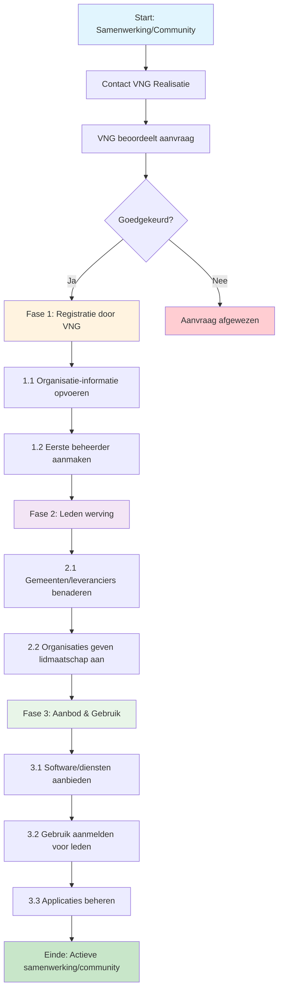
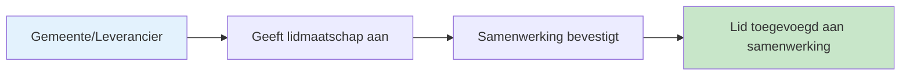

# 🧭 Klantreis Samenwerkingen & Communities > GEMMA Softwarecatalogus

Dit document beschrijft de klantreis voor **samenwerkingen** en **communities** in de GEMMA Softwarecatalogus. Per stap kun je een GitHub issue koppelen (bijv. voor feedback, verbeteringen of bugs).

## 📖 Het Verhaal van een Samenwerking

Stel je voor: een groep gemeenten in een regio merkt dat ze allemaal vergelijkbare uitdagingen hebben met hun ICT-landschap. Ze besluiten samen te werken om kosten te besparen en kennis te delen. Maar hoe krijgen ze toegang tot de GEMMA Softwarecatalogus als samenwerking?

**De reis begint met een telefoontje naar VNG Realisatie...**

*"Hallo, wij zijn de Samenwerking Digitale Regio Noord. We willen graag als samenwerking toegang tot de softwarecatalogus om voor onze aangesloten gemeenten software te kunnen beheren en aanbieden. Kunnen jullie ons helpen?"*

Vanaf dat moment start een unieke reis waarin de samenwerking niet alleen software gaat gebruiken, maar ook zelf diensten gaat aanbieden aan hun leden.

:::info Belangrijke kenmerken van Samenwerkingen & Communities
- **Registratie**: Samenwerkingen en communities kunnen zich **niet zelf registreren**. Ze moeten contact opnemen met VNG Realisatie om te worden toegelaten.
- **Lidmaatschap**: Ze kunnen niet zelf leden toevoegen, maar beheerders van gemeenten én leveranciers kunnen wel aangeven dat hun organisatie lid is van een samenwerking.
- **Unieke positie**: Samenwerkingen zijn uniek omdat ze zowel software, modules en diensten kunnen **aanbieden** als **gebruik kunnen aanmelden** voor hun leden.
:::

## Overzicht Klantreis

---

## 🔹 Fase 0: Toelating (VNG Realisatie)

*"Na ons telefoontje met VNG Realisatie krijgen we een uitnodiging voor een gesprek. Ze willen graag weten wie we zijn, wat onze doelen zijn, en hoe we de softwarecatalogus willen gebruiken. Het is spannend - worden we toegelaten?"*

| Stapnr | Actie | Beschrijving | Gerelateerd issue |
|--------|-------|--------------|-------------------|
| 0.1 | Contact opnemen met VNG | Samenwerking/community neemt contact op voor toelating | |
| 0.2 | Beoordeling door VNG | VNG Realisatie beoordeelt de aanvraag | |
| 0.3 | Besluit toelating | Goedkeuring of afwijzing van de aanvraag | |

**Het moment van de waarheid:** *"Gefeliciteerd! Jullie aanvraag is goedgekeurd. We gaan jullie organisatie aanmaken in het systeem en jullie eerste beheerder toegang geven."*

---

## 🔹 Fase 1: Registratie (door VNG)

*"Een week later krijgen we een e-mail: 'Jullie organisatie staat nu in het systeem!' We loggen voor het eerst in en zien ons eigen dashboard. Het voelt als de sleutel krijgen van een nieuw huis - alles is mogelijk, maar we moeten nog leren hoe alles werkt."*

| Stapnr | Actie | Beschrijving | Gerelateerd issue |
|--------|-------|--------------|-------------------|
| 1.1 | Organisatie-informatie opvoeren | VNG voert organisatiegegevens in het systeem in | |
| 1.2 | Eerste beheerder aanmaken | VNG maakt het eerste beheerdersaccount aan | |
| 1.3 | Toegang verlenen | Beheerder krijgt toegang tot het platform | |

---

## 🔹 Fase 2: Leden werving

*"Nu begint het echte werk. We bellen onze aangesloten gemeenten: 'Hé, we staan nu in de softwarecatalogus! Kunnen jullie aangeven dat jullie lid zijn van onze samenwerking?' Het is een beetje als het organiseren van een reünie - iedereen moet zich aanmelden voordat het feest kan beginnen."*

| Stapnr | Actie | Beschrijving | Gerelateerd issue |
|--------|-------|--------------|-------------------|
| 2.1 | Potentiële leden benaderen | Samenwerking benadert gemeenten en leveranciers | |
| 2.2 | Lidmaatschap aangeven | Gemeenten/leveranciers geven via hun beheerders aan lid te zijn | |
| 2.3 | Lidmaatschap bevestigen | Samenwerking bevestigt het lidmaatschap | |

*"Geweldig! Alle gemeenten hebben zich aangemeld. Nu kunnen we echt aan de slag als samenwerking."*

---

## 🔹 Fase 3: Aanbod & Gebruik beheren

*"Dit is waar het interessant wordt! We hebben onze eigen software ontwikkeld voor burgerzaken die perfect werkt. Die gaan we aanbieden aan andere gemeenten. Maar tegelijkertijd zien we dat gemeente A een geweldige financiële applicatie gebruikt - die gaan we aanmelden voor al onze leden. We zijn tegelijk winkelier én klant!"*

| Stapnr | Actie | Beschrijving | Gerelateerd issue |
|--------|-------|--------------|-------------------|
| 3.1 | Software/diensten aanbieden | Samenwerking biedt eigen software, modules en diensten aan | [#57](https://github.com/VNG-Realisatie/Softwarecatalogus/issues/57) |
| 3.2 | Gebruik aanmelden voor leden | Samenwerking meldt gebruik aan namens hun leden | |
| 3.3 | Applicatielandschap beheren | Beheer van applicaties voor de gehele samenwerking | |
| 3.4 | Koppelingen maken | Koppelingen tussen applicaties van verschillende leden | |

*"Het mooie is dat we nu een compleet overzicht hebben van wat al onze leden gebruiken. We kunnen gezamenlijk inkopen, kennis delen, en ervoor zorgen dat iedereen de beste software heeft."*

---

## 🔹 Fase 4: Onderhoud & Groei

*"Een jaar later zijn we uitgegroeid tot een echte speler in de regio. Nieuwe gemeenten kloppen aan de deur: 'Kunnen wij ook meedoen?' En soms moeten we helaas afscheid nemen van een lid dat een andere richting opgaat. Maar dat hoort erbij - we blijven groeien en leren."*

| Stapnr | Actie | Beschrijving | Gerelateerd issue |
|--------|-------|--------------|-------------------|
| 4.1 | Nieuwe leden toevoegen | Proces voor uitbreiding van de samenwerking | |
| 4.2 | Leden verwijderen | Proces voor het beëindigen van lidmaatschappen | |
| 4.3 | Rapportage aan leden | Overzichten en statistieken delen met leden | |
| 4.4 | Samenwerking evalueren | Periodieke evaluatie van de samenwerking | |

*"Wat begon als een simpel telefoontje naar VNG Realisatie, is uitgegroeid tot een bloeiende samenwerking die waarde toevoegt voor alle betrokkenen. We zijn trots op wat we hebben bereikt!"*

---

## 🔍 Unieke Aspecten van Samenwerkingen & Communities

### Dubbele Rol: Aanbieder Én Afnemer
Samenwerkingen hebben een unieke positie in de softwarecatalogus:

**Als Aanbieder:**
- Kunnen eigen software ontwikkelen en aanbieden
- Kunnen modules en diensten leveren aan gemeenten
- Kunnen hosting en ondersteuning bieden

**Als Afnemer:**
- Kunnen namens hun leden gebruik aanmelden
- Kunnen applicatielandschappen beheren voor meerdere organisaties
- Kunnen gezamenlijke inkoop en implementatie coördineren

### Lidmaatschap Proces

### Verschil tussen Samenwerkingen en Communities

| Aspect | Samenwerking | Community |
|--------|--------------|----------|
| **Doel** | Gezamenlijke dienstverlening | Kennisdeling en samenwerking |
| **Leden** | Voornamelijk gemeenten | Gemeenten, leveranciers, experts |
| **Activiteiten** | Software ontwikkeling, hosting | Best practices, standaarden |
| **Governance** | Formele structuur | Meer informele samenwerking |
