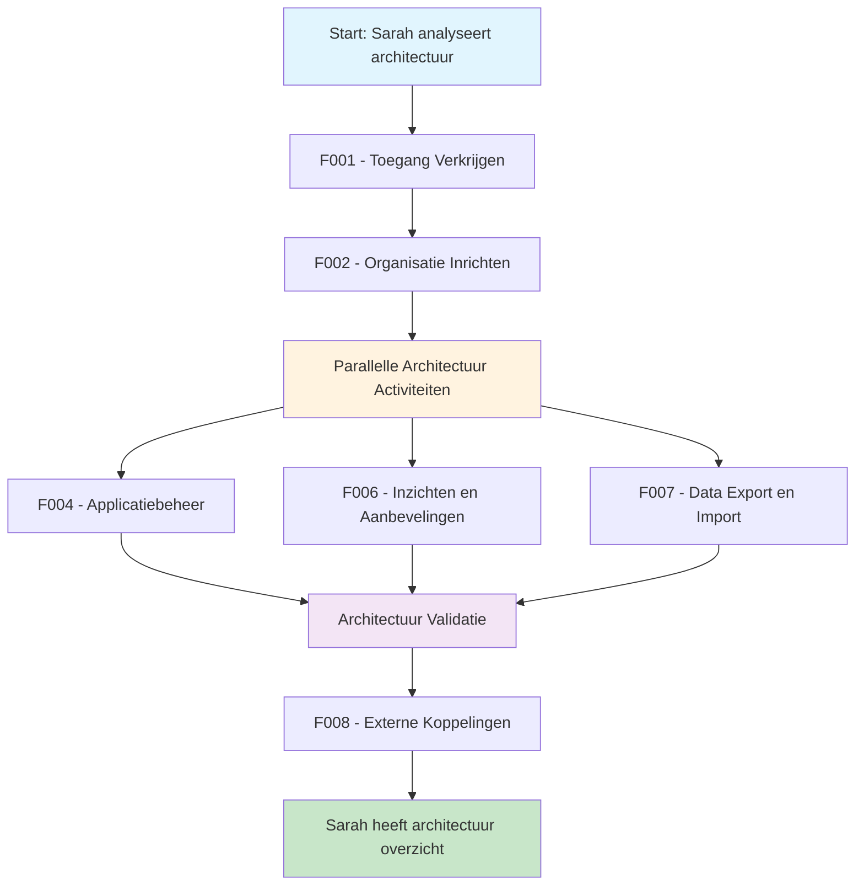

# 🧭 Klantreis Architectuur Expert > GEMMA Softwarecatalogus

Dit document beschrijft de klantreis van een architectuur expert die werkt met de GEMMA Softwarecatalogus.

## 👤 Persona: De Architectuur Expert

**Naam**: Dr. Sarah de Vries  
**Functie**: Senior Enterprise Architect bij VNG  
**Ervaring**: 12 jaar enterprise architectuur, 8 jaar GEMMA  
**Motivatie**: "Ik wil ervoor zorgen dat alle gemeentelijke software goed aansluit op de GEMMA architectuur en dat we een consistent beeld hebben van het Nederlandse gemeentelijke ICT-landschap."

### Achtergrond
Sarah is verantwoordelijk voor het bewaken van de GEMMA architectuur principes. Ze werkt nauw samen met gemeenten en leveranciers om ervoor te zorgen dat software goed aansluit op de referentiearchitectuur. Ze gebruikt ArchiMate modellen en heeft diepgaande kennis van gemeentelijke processen.

### Doelen
- GEMMA architectuur principes bewaken
- Kwaliteit van ArchiMate implementaties valideren
- Architectuur beslissingen ondersteunen
- Consistentie in het gemeentelijke ICT-landschap bevorderen

## Overzicht Klantreis

---

## 🎯 Functionaliteiten voor Architectuur Experts

### [F001 - Toegang Verkrijgen](../Functionaliteiten/F001-toegang-verkrijgen.md)
*"Als VNG medewerker heb ik directe toegang tot de catalogus, maar ik moet wel mijn rol en verantwoordelijkheden instellen."*

Sarah heeft als VNG medewerker automatisch toegang, maar moet haar specifieke rol als architectuur expert configureren.

### [F002 - Organisatie Inrichten](../Functionaliteiten/F002-organisatie-inrichten.md)
*"Ik moet ervoor zorgen dat mijn profiel duidelijk maakt dat ik beschikbaar ben voor architectuur advies en validatie."*

Sarah richt haar profiel in met focus op architectuur expertise en beschikbaarheid voor advies.

### [F004 - Applicatiebeheer](../Functionaliteiten/F004-applicatiebeheer.md)
*"Mijn hoofdtaak is het valideren of applicaties correct gekoppeld zijn aan GEMMA componenten en of de architectuur klopt."*

Sarah gebruikt deze functionaliteit om:
- GEMMA koppelingen te valideren
- Architectuur consistentie te controleren
- Aanbevelingen te doen voor betere koppelingen
- Conceptpakketten te beoordelen op architectuur kwaliteit

### [F006 - Inzichten en Aanbevelingen](../Functionaliteiten/F006-inzichten-en-aanbevelingen.md)
*"Ik genereer rapportages over architectuur compliance en identificeer patronen in het gemeentelijke ICT-landschap."*

Sarah gebruikt de inzichten om:
- Architectuur compliance te monitoren
- Trends in gemeentelijke ICT te identificeren
- Aanbevelingen te doen voor architectuur verbeteringen
- Rapportages te maken voor VNG management

### [F007 - Data Export en Import](../Functionaliteiten/F007-data-export-import.md)
*"Ik exporteer data naar ArchiMate tools om diepgaande architectuur analyses te doen en modellen bij te werken."*

Sarah gebruikt vooral:
- AMEFF export voor ArchiMate tools
- Architectuur overzichten voor presentaties
- Data voor architectuur governance

### [F008 - Externe Koppelingen](../Functionaliteiten/F008-externe-koppelingen.md)
*"Ik koppel de catalogus aan onze architectuur repositories en governance tools."*

Sarah zorgt voor koppelingen met:
- ArchiMate repositories
- Architectuur governance tools
- GEMMA model databases

---

## 🎯 Specifieke Architectuur Activiteiten

### Architectuur Validatie
- **GEMMA Compliance**: Controleren of applicaties correct gekoppeld zijn
- **Referentie Architectuur**: Valideren tegen GEMMA principes
- **Interoperabiliteit**: Beoordelen van koppelingen tussen systemen

### Architectuur Advies
- **Leverancier Ondersteuning**: Helpen leveranciers bij GEMMA implementatie
- **Gemeente Advies**: Adviseren over architectuur keuzes
- **Standaardisatie**: Bevorderen van architectuur standaarden

### Architectuur Governance
- **Compliance Monitoring**: Bewaken van architectuur naleving
- **Trend Analyse**: Identificeren van architectuur trends
- **Beleid Ontwikkeling**: Bijdragen aan architectuur beleid

---

## 🎉 Resultaat

Na het doorlopen van deze reis heeft Sarah:
- ✅ Volledig overzicht van GEMMA compliance in Nederland
- ✅ Tools om architectuur kwaliteit te monitoren
- ✅ Directe lijn met leveranciers en gemeenten
- ✅ Data voor architectuur governance
- ✅ Mogelijkheid om proactief advies te geven

*"De softwarecatalogus geeft me eindelijk het overzicht dat ik nodig heb om GEMMA architectuur effectief te bewaken. Ik kan nu zien waar we staan, waar problemen zitten, en hoe we als sector kunnen verbeteren."*
