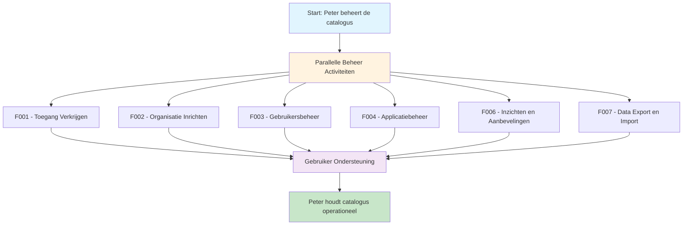

# 🧭 Klantreis functioneel beheer > GEMMA Softwarecatalogus

Dit document beschrijft de klantreis van functioneel beheer in de GEMMA Softwarecatalogus.

## 👤 Persona: De Functioneel Beheerder

**Naam**: Peter van Dijk  
**Functie**: Functioneel Beheerder GEMMA Softwarecatalogus bij VNG  
**Ervaring**: 6 jaar GEMMA, 10 jaar gemeentelijke ICT  
**Motivatie**: "Ik wil ervoor zorgen dat de softwarecatalogus goed functioneert voor alle gebruikers en dat de data kwaliteit hoog blijft."

### Achtergrond
Peter beheert het GEMMA ArchiMate model, valideert imports en exports, en onderhoudt contact met gemeenten. Hij is het eerste aanspreekpunt voor gebruikers die problemen hebben of vragen stellen over de catalogus.

### Doelen
- GEMMA ArchiMate model onderhouden
- Data kwaliteit bewaken
- Gebruikers ondersteunen
- Organisaties beheren en goedkeuren

## Overzicht Klantreis

---

## 🎯 Functionaliteiten voor Functioneel Beheer

### [F001 - Toegang Verkrijgen](../Functionaliteiten/F001-toegang-verkrijgen.md)
*"Ik help organisaties bij het verkrijgen van toegang en los toegangsproblemen op."*

Peter beheert het toegangsproces voor:
- Nieuwe leveranciers goedkeuren
- Samenwerkingen toelaten
- Gemeenten helpen met toegangsproblemen
- Eerste accounts aanmaken

### [F002 - Organisatie Inrichten](../Functionaliteiten/F002-organisatie-inrichten.md)
*"Ik beoordeel nieuwe organisaties, help bij het samenvoegen van organisaties, en zorg dat alle organisatiegegevens kloppen."*

Peter beheert organisaties door:
- Aangemelde leveranciers te beoordelen
- Samenwerkingen toe te voegen
- Organisaties samen te voegen bij fusies
- Organisatiegegevens te valideren

### [F003 - Gebruikersbeheer](../Functionaliteiten/F003-gebruikersbeheer.md)
*"Ik help gebruikers met account problemen, reset wachtwoorden, en beheer toegangsrechten."*

Peter ondersteunt gebruikers bij:
- Account activatie problemen
- Wachtwoord resets
- Toegangsrechten wijzigen
- Gebruikersoverzichten genereren

### [F004 - Applicatiebeheer](../Functionaliteiten/F004-applicatiebeheer.md)
*"Ik controleer conceptpakketten die door gemeenten worden aangeleverd en zorg dat de GEMMA koppelingen correct zijn."*

Peter valideert:
- Conceptpakketten van gemeenten
- GEMMA koppelingen van leveranciers
- Applicatie samenvoegingen
- Data kwaliteit van applicatie-informatie

### [F006 - Inzichten en Aanbevelingen](../Functionaliteiten/F006-inzichten-en-aanbevelingen.md)
*"Ik genereer rapportages over het gebruik van de catalogus en identificeer verbeterpunten."*

Peter gebruikt inzichten voor:
- Gebruiksstatistieken genereren
- Data kwaliteit monitoren
- Gebruiker tevredenheid meten
- Systeem prestaties bewaken

### [F007 - Data Export en Import](../Functionaliteiten/F007-data-export-import.md)
*"Ik help organisaties bij het exporteren en importeren van data, en verwerk organisatie samenvoegingen."*

Peter ondersteunt:
- Complexe data exports
- Import van externe data
- Organisatie fusies verwerken
- Data migraties begeleiden

---

## 🛠️ Dagelijkse Beheer Activiteiten

### Gebruiker Ondersteuning
- **Helpdesk**: Eerste lijn ondersteuning voor alle gebruikers
- **Training**: Nieuwe gebruikers begeleiden
- **Documentatie**: Handleidingen bijwerken
- **Feedback**: Gebruiker feedback verzamelen en verwerken

### Data Kwaliteit
- **Validatie**: Ingevoerde data controleren
- **Correcties**: Fouten herstellen
- **Standaardisatie**: Consistentie bewaken
- **Monitoring**: Automatische kwaliteitscontroles

### Systeem Beheer
- **Configuratie**: Systeem instellingen beheren
- **Updates**: Nieuwe functionaliteiten uitrollen
- **Monitoring**: Systeem prestaties bewaken
- **Backup**: Data veiligheid waarborgen

---

## 📊 Rapportage en Monitoring

### Gebruiksstatistieken
- **Actieve Gebruikers**: Aantal actieve gebruikers per organisatietype
- **Populaire Functionaliteiten**: Meest gebruikte onderdelen
- **Groei Trends**: Ontwikkeling van het gebruik over tijd

### Data Kwaliteit Metrics
- **Volledigheid**: Percentage complete profielen
- **Accuraatheid**: Aantal gecorrigeerde fouten
- **Consistentie**: Standaardisatie naleving

### Systeem Prestaties
- **Response Tijden**: Snelheid van het systeem
- **Beschikbaarheid**: Uptime percentages
- **Foutmeldingen**: Aantal en type errors

---

## 🎉 Resultaat

Na het doorlopen van deze reis heeft Peter:
- ✅ Goed functionerende catalogus voor alle gebruikers
- ✅ Hoge data kwaliteit en consistentie
- ✅ Tevreden gebruikers die goed ondersteund worden
- ✅ Inzicht in gebruik en prestaties van de catalogus
- ✅ Proactieve identificatie van verbeterpunten

*"Als functioneel beheerder ben ik de spil in het web. Ik zorg ervoor dat iedereen de catalogus optimaal kan gebruiken en dat de data betrouwbaar blijft. Het is een uitdagende maar zeer bevredigende rol."*