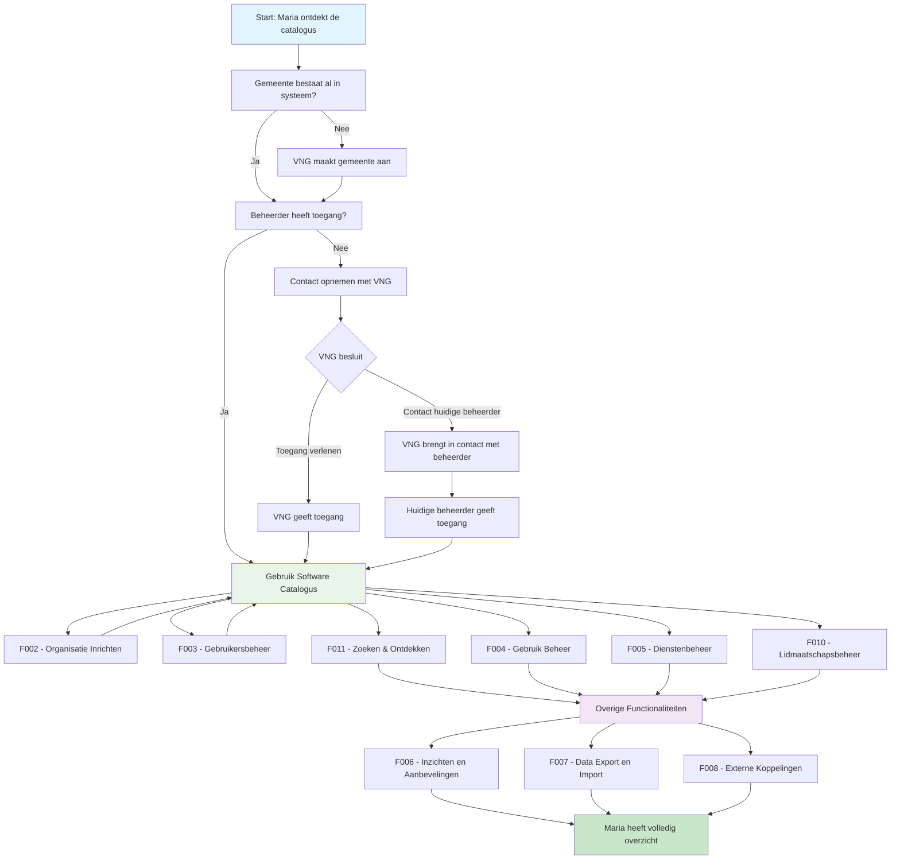

# 🧭 Klantreis gemeente > GEMMA Softwarecatalogus

Dit document beschrijft de klantreis van een gemeente in de GEMMA Softwarecatalogus.

## 👤 Persona: De Gemeentelijke ICT-beheerder

**Naam**: Maria van der Berg  
**Functie**: ICT-coördinator Gemeente Voorbeeldstad  
**Ervaring**: 8 jaar gemeentelijke ICT  
**Motivatie**: "Ik wil overzicht en controle over ons applicatielandschap, zodat we betere beslissingen kunnen nemen over onze ICT-investeringen."

### Achtergrond
Maria werkt al jaren bij de gemeente en heeft gezien hoe het applicatielandschap is gegroeid. Ze heeft moeite om bij te houden welke software er allemaal gebruikt wordt, welke leveranciers er zijn, en hoe alles met elkaar samenhangt. Ze hoort van collega's bij andere gemeenten over interessante oplossingen, maar weet niet altijd hoe ze die kan vinden of vergelijken.

### Doelen
- Compleet overzicht van het applicatielandschap
- Betere samenwerking met andere gemeenten
- Efficiëntere inkoop en beheer van software
- Inzicht in koppelingen en afhankelijkheden

:::info Gemeente Registratie & Toegang
- **Aanmaken**: Gemeenten worden aangemaakt door VNG Realisatie, niet door zelfregistratie
- **Toegang aanvragen**: Gemeentelijke beheerders zonder toegang kunnen contact opnemen met VNG
- **Toegang verlenen**: VNG geeft toegang of brengt in contact met huidige beheerder
- **Automatische toegang**: Alle Nederlandse gemeenten hebben in principe toegang (behalve bijzondere gemeenten Caribisch gebied)
:::

## Overzicht Klantreis

---

## 🎯 Functionaliteiten voor Gemeenten

### [F001 - Toegang Verkrijgen](../Functionaliteiten/F001-toegang-verkrijgen.md)
*"Ik hoor van collega's over de softwarecatalogus. Hoe krijg ik toegang?"*

Maria ontdekt de GEMMA Softwarecatalogus via collega's of VNG communicatie. Als gemeentelijke beheerder kan ze contact opnemen met VNG voor toegang, of mogelijk heeft haar gemeente al toegang en kan ze direct inloggen.

### [F002 - Organisatie Inrichten](../Functionaliteiten/F002-organisatie-inrichten.md)
*"Nu ik toegang heb, moet ik onze gemeente goed neerzetten in het systeem."*

Maria vult de organisatiegegevens aan, zorgt dat contactinformatie klopt, en bekijkt of haar gemeente deel uitmaakt van samenwerkingen.

### [F003 - Gebruikersbeheer](../Functionaliteiten/F003-gebruikersbeheer.md)
*"Mijn collega's moeten ook toegang krijgen. De ICT-manager wil meekijken, en onze inkoper moet leveranciers kunnen beoordelen."*

Maria nodigt relevante collega's uit: de ICT-manager, inkoper, en mogelijk afdelingshoofden die veel met specifieke software werken.

### [F011 - Zoeken & Ontdekken](../Functionaliteiten/F011-zoeken-en-ontdekken.md)
*"Voordat ik ons eigen landschap ga invoeren, wil ik eerst eens kijken wat er allemaal beschikbaar is. Misschien gebruiken andere gemeenten software die wij ook zouden kunnen gebruiken, of hebben ze betere alternatieven voor wat wij nu hebben."*

Maria verkent de catalogus:
- **Software zoeken**: Zoeken naar applicaties die andere gemeenten gebruiken
- **Leveranciers ontdekken**: Nieuwe leveranciers vinden die interessante oplossingen hebben
- **Vergelijken**: Verschillende oplossingen voor hetzelfde probleem vergelijken
- **Inspiratie opdoen**: Zien hoe andere gemeenten hun ICT hebben ingericht
- **Filters gebruiken**: Zoeken op gemeente-type, inwoneraantal, of specifieke domeinen

### [F004 - Gebruik Beheer](../Functionaliteiten/F004-applicatiebeheer.md)
*"Nu ga ik ons eigen applicatielandschap in kaart brengen. Dit gaat over het gebruik van applicaties - welke software gebruiken we, hoe zijn ze gekoppeld, en hoe tevreden zijn we erover."*

Maria beheert het gebruik van applicaties:
- **Gebruik registreren**: Applicaties toevoegen die de gemeente gebruikt
- **Koppelingen documenteren**: Hoe applicaties met elkaar verbonden zijn
- **Tevredenheid bijhouden**: Beoordelen hoe goed software werkt voor de gemeente
- **Contracten koppelen**: Licenties en leveranciersinformatie bijhouden
- **Alternatieven verkennen**: Zoeken naar betere oplossingen voor huidige software

### [F005 - Dienstenbeheer](../Functionaliteiten/F005-dienstenbeheer.md)
*"We hebben niet alleen software nodig, maar ook goede leveranciers voor hosting, support en implementatie."*

Maria zoekt leveranciers, voegt diensten toe aan applicaties, en beoordeelt de kwaliteit van dienstverlening.

### [F010 - Lidmaatschapsbeheer](../Functionaliteiten/F010-lidmaatschapsbeheer.md)
*"Ik zie dat er interessante samenwerkingen zijn waar wij ook bij zouden kunnen aansluiten. En misschien zijn er communities die zich bezighouden met onderwerpen die voor ons relevant zijn."*

Maria beheert lidmaatschappen:
- **Samenwerkingen verkennen**: Zoeken naar relevante samenwerkingen om bij aan te sluiten
- **Lidmaatschap aangeven**: Aangeven dat de gemeente lid wil worden van een samenwerking
- **Communities ontdekken**: Vinden van communities die interessante software ontwikkelen
- **Voordelen benutten**: Profiteren van gezamenlijke inkoop en kennisdeling

## 🔧 Overige Functionaliteiten
*"Nu ik de basis op orde heb, kan ik gebruik maken van de meer geavanceerde functies voor analyse, export en integratie."*

### [F006 - Inzichten en Aanbevelingen](../Functionaliteiten/F006-inzichten-en-aanbevelingen.md)
*"Dit is waar het interessant wordt - wat kunnen we leren van andere gemeenten?"*

Maria gebruikt de benchmarking functie om te zien wat andere gemeenten gebruiken, krijgt AI-aanbevelingen voor optimalisaties, en genereert rapporten voor het management.

### [F007 - Data Export en Import](../Functionaliteiten/F007-data-export-import.md)
*"Ik moet dit overzicht kunnen delen met onze architecten en het college."*

Maria exporteert het applicatielandschap in verschillende formaten voor presentaties, architectuurtools, en rapportages.

### [F008 - Externe Koppelingen](../Functionaliteiten/F008-externe-koppelingen.md)
*"Ideaal zou zijn als dit automatisch bijgewerkt wordt vanuit onze eigen systemen."*

Maria onderzoekt mogelijkheden om de catalogus te koppelen aan hun eigen CMDB of andere inventarisatiesystemen.

---

## 🎉 Resultaat

Na het doorlopen van deze reis heeft Maria:
- ✅ Volledig overzicht van het gemeentelijke applicatielandschap
- ✅ Inzicht in wat andere gemeenten gebruiken
- ✅ Betere relaties met leveranciers
- ✅ Gestructureerde data voor besluitvorming
- ✅ Een team dat meewerkt aan ICT-beheer

*"De softwarecatalogus heeft ons geholpen om van een chaotisch applicatielandschap naar een gestructureerd overzicht te gaan. Nu kunnen we eindelijk strategische beslissingen nemen over onze ICT."*