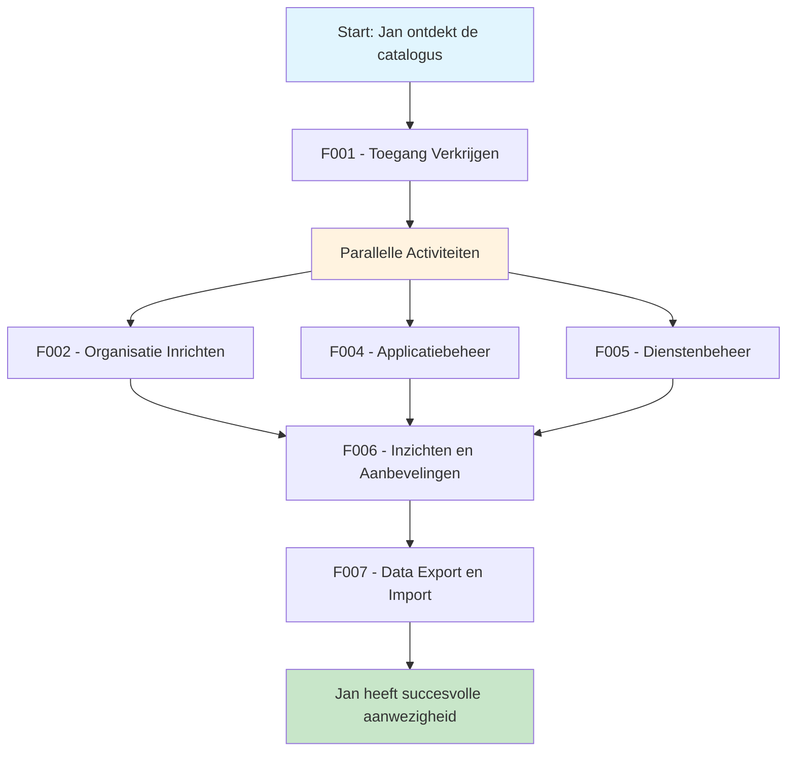

# 🧭 Klantreis leverancier > GEMMA Softwarecatalogus

Dit document beschrijft de klantreis van een leverancier in de GEMMA Softwarecatalogus.

## 👤 Persona: De Ambitieuze Leverancier

**Naam**: Jan Pietersen  
**Functie**: Directeur ICT Solutions BV  
**Ervaring**: 15 jaar gemeentelijke software  
**Motivatie**: "Ik wil dat gemeenten ons gemakkelijk kunnen vinden en zien wat we te bieden hebben. We maken goede software, maar marketing is niet onze sterkste kant."

### Achtergrond
Jan runt een middelgroot ICT-bedrijf dat gespecialiseerd is in software voor gemeenten. Ze hebben een uitstekende vergunningapplicatie ontwikkeld, maar merken dat gemeenten hen niet altijd weten te vinden. Ze horen van klanten over andere leveranciers en realiseren zich dat ze meer zichtbaar moeten zijn in de markt.

### Doelen
- Zichtbaarheid vergroten bij gemeenten
- Nieuwe klanten werven
- Bestaande klanten beter bedienen
- Samenwerken met andere leveranciers

## 📖 Het Verhaal van Jan

*"We maken al jaren software voor gemeenten. Onze vergunningapplicatie draait bij 15 gemeenten en ze zijn er heel tevreden over. Maar we merken dat nieuwe gemeenten ons niet vinden. Dan horen we over de GEMMA Softwarecatalogus - één plek waar alle gemeenten kijken naar software. Dit is onze kans om echt zichtbaar te worden!"*

## Overzicht Klantreis

---

## 🎯 Functionaliteiten voor Leveranciers

### [F001 - Toegang Verkrijgen](../Functionaliteiten/F001-toegang-verkrijgen.md)
*"Ik ga naar de website en zie een aanmeldformulier. Spannend! Ik vul alles in: onze bedrijfsgegevens, wat we doen, welke software we maken. Dan druk ik op 'verzenden' en... wachten maar. Worden we geaccepteerd?"*

Jan meldt zijn bedrijf aan via het registratieformulier, bevestigt zijn e-mail, en wacht op goedkeuring van VNG.

*"Yes! Een e-mail: 'Gefeliciteerd, u bent geaccepteerd!' Ik krijg inloggegevens en kan voor het eerst inloggen. Het voelt als de eerste dag op een nieuwe school - alles is nieuw en opwindend."*

## ◆ Parallelle Activiteiten na Registratie

### [F002 - Organisatie Inrichten](../Functionaliteiten/F002-organisatie-inrichten.md)
*"Nu ik binnen ben, moet ik ons bedrijf goed neerzetten. Ik nodig mijn collega's uit - onze sales manager moet ook toegang hebben, en onze technisch directeur. We vullen ons profiel aan: logo, certificeringen, contactgegevens. Het is net als LinkedIn, maar dan voor gemeentelijke software!"*

Jan richt het bedrijfsprofiel in, nodigt zijn team uit, en zorgt dat alle certificeringen en kwaliteitskeurmerken zichtbaar zijn.

### [F004 - Applicatiebeheer](../Functionaliteiten/F004-applicatiebeheer.md)
*"Dit is het moment waar ik naar heb uitgekeken! Ik ga onze vergunningapplicatie toevoegen. Ik vul alles in: wat het doet, welke GEMMA componenten het ondersteunt, of het SaaS of on-premise is. Het is alsof ik een etalage inricht - alles moet perfect zijn want gemeenten gaan dit zien!"*

Jan voegt hun applicaties toe, koppelt ze aan GEMMA componenten, specificeert hosting opties, en uploadt alle relevante documenten.

*"Klaar! Onze applicatie staat online. Nu kunnen gemeenten ons vinden en zien wat we te bieden hebben. Het voelt als het openen van een nieuwe winkel!"*

### [F005 - Dienstenbeheer](../Functionaliteiten/F005-dienstenbeheer.md)
*"Interessant! Ik zie dat er al applicaties van andere leveranciers staan waar wij diensten voor kunnen leveren. We bieden bijvoorbeeld hosting aan, dus ik ga onze hostingdiensten toevoegen bij relevante applicaties."*

Jan ontdekt dat ze niet alleen hun eigen software kunnen promoten, maar ook diensten kunnen aanbieden bij software van anderen.

---

### [F006 - Inzichten en Aanbevelingen](../Functionaliteiten/F006-inzichten-en-aanbevelingen.md)
*"Een paar weken later krijg ik een melding: 'Gemeente Voorbeeld heeft interesse getoond in uw applicatie!' Dit is fantastisch - de catalogus werkt! Ik kan zien welke gemeenten naar onze software kijken en kan ze direct benaderen. Het is alsof ik een dashboard heb van potentiële klanten."*

Jan gebruikt de promotie functionaliteiten om zijn software onder de aandacht te brengen en krijgt inzicht in welke gemeenten interesse tonen.

### [F007 - Data Export en Import](../Functionaliteiten/F007-data-export-import.md)
*"Nu we actief zijn in de catalogus, willen we ook data kunnen uitwisselen. We kunnen ons applicatielandschap exporteren om te delen met partners, en we kunnen landschappen importeren van gemeenten die met ons willen samenwerken."*

Jan gebruikt de export functionaliteiten om data te delen met partners en klanten.

---

## 🎉 Resultaat

Na het doorlopen van deze reis heeft Jan:
- ✅ Zichtbaarheid bij alle Nederlandse gemeenten
- ✅ Gestructureerde manier om nieuwe klanten te werven
- ✅ Inzicht in de markt en concurrentie
- ✅ Mogelijkheden voor samenwerking met andere leveranciers
- ✅ Professionele uitstraling richting gemeenten

*"De softwarecatalogus heeft ons bedrijf echt op de kaart gezet. We krijgen nu regelmatig aanvragen van gemeenten die ons gevonden hebben via de catalogus. Het is de beste marketing investering die we ooit hebben gedaan - en het kost ons niets!"*

## 🎯 Voordelen van Parallelle Aanpak

Het parallelle model voor leveranciers biedt verschillende voordelen:

### ⚡ **Efficiëntie**
- Teams kunnen gelijktijdig werken aan verschillende aspecten
- Snellere time-to-market voor nieuwe applicaties
- Optimaal gebruik van beschikbare resources

### 🎯 **Flexibiliteit**
- Prioriteiten kunnen worden aangepast zonder andere stromen te blokkeren
- Verschillende teamleden kunnen zich focussen op hun expertise
- Iteratieve verbetering van verschillende onderdelen

### 📈 **Schaalbaarheid**
- Nieuwe applicaties kunnen worden toegevoegd zonder bestaande te verstoren
- Organisatie-informatie kan worden bijgewerkt onafhankelijk van productlanceringen
- Diensten kunnen worden uitgebreid naar meerdere applicaties tegelijk