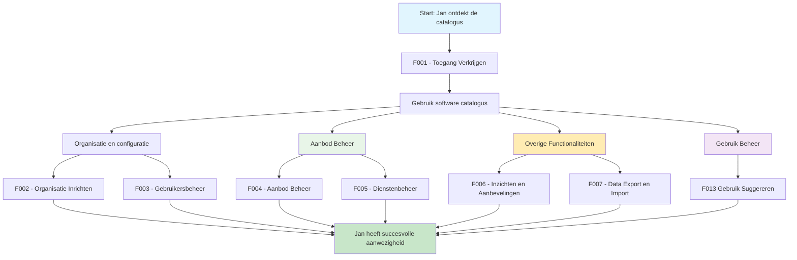

# 🧭 Klantreis leverancier > GEMMA Softwarecatalogus

Dit document beschrijft de klantreis van een leverancier in de GEMMA Softwarecatalogus.

## 👤 Persona: De Ambitieuze Leverancier

**Naam**: Jan Pietersen  
**Functie**: Directeur ICT Solutions BV  
**Ervaring**: 15 jaar gemeentelijke software  
**Motivatie**: "Als kleine speler is het onmogelijk om alle 342 gemeenten te bereiken. De GEMMA Softwarecatalogus is onze kans om in één keer zichtbaar te zijn voor de hele gemeentelijke markt - dat is goud waard!"

### Achtergrond
Jan runt een klein ICT-bedrijf (8 medewerkers) dat gespecialiseerd is in software voor gemeenten. Ze hebben een uitstekende vergunningapplicatie ontwikkeld die bij 15 gemeenten draait, maar als kleine speler hebben ze geen budget voor grote marketing campagnes. Ze kunnen niet alle gemeenten individueel benaderen - dat zou jaren kosten. Ze zoeken naar een manier om hun software onder de aandacht te brengen van alle gemeenten tegelijk.

### Doelen
- **Etalage functie**: Software zichtbaar maken voor alle 342+ gemeenten
- **Directe markttoegång**: In één keer bereik krijgen tot de hele gemeentelijke markt
- **Gelijke kansen**: Als kleine speler concurreren met grote leveranciers
- **Efficiënte klantwerving**: Gemeenten laten ons vinden in plaats van andersom

## 📖 Het Verhaal van Jan

*"We maken al jaren uitstekende software voor gemeenten. Onze vergunningapplicatie draait bij 15 gemeenten en ze zijn er heel tevreden over. Maar als klein bedrijf kunnen we niet alle 342 gemeenten individueel benaderen - dat zou onbetaalbaar zijn. Dan horen we over de GEMMA Softwarecatalogus: dé digitale etalage waar alle gemeenten naar software zoeken. Dit is onze gouden kans! In plaats van dat wij alle gemeenten moeten vinden, kunnen zij ons nu vinden. Het is alsof we een winkelpand krijgen op de drukste winkelstraat van Nederland - maar dan voor gemeentelijke software!"*

## Overzicht Klantreis

---

## 🎯 Functionaliteiten voor Leveranciers

### [F001 - Toegang Verkrijgen](../Functionaliteiten/F001-toegang-verkrijgen.md)
*"Ik ga naar de website en zie een aanmeldformulier. Spannend! Ik vul alles in: onze bedrijfsgegevens, wat we doen, welke software we maken. Dan druk ik op 'verzenden' en... wachten maar. Worden we geaccepteerd?"*

Jan meldt zijn bedrijf aan via het registratieformulier, bevestigt zijn e-mail, en wacht op goedkeuring van VNG.

*"Yes! Een e-mail: 'Gefeliciteerd, u bent geaccepteerd!' Ik krijg inloggegevens en kan voor het eerst inloggen. Het voelt als de eerste dag op een nieuwe school - alles is nieuw en opwindend."*

### [F003 - Gebruikersbeheer](../Functionaliteiten/F003-gebruikersbeheer.md)
*"Ik ben niet de enige die met de catalogus gaat werken. Onze sales manager moet klanten kunnen vinden en benaderen, onze technisch directeur moet applicaties kunnen toevoegen, en onze support medewerkers moeten kunnen zien welke klanten welke software gebruiken."*

Jan nodigt zijn team uit en geeft iedereen de juiste rechten voor hun rol.

## 🎯 Aanbod Beheer

### [F002 - Organisatie Inrichten](../Functionaliteiten/F002-organisatie-inrichten.md)
*"Nu ik binnen ben, moet ik ons bedrijf goed neerzetten. Ik nodig mijn collega's uit - onze sales manager moet ook toegang hebben, en onze technisch directeur. We vullen ons profiel aan: logo, certificeringen, contactgegevens. Het is net als LinkedIn, maar dan voor gemeentelijke software!"*

Jan richt het bedrijfsprofiel in, nodigt zijn team uit, en zorgt dat alle certificeringen en kwaliteitskeurmerken zichtbaar zijn.

### [F004 - Aanbod Beheer](../Functionaliteiten/F004-applicatiebeheer.md)
*"Dit is het moment waar ik naar heb uitgekeken! Ik ga onze digitale etalage inrichten. Elke gemeente in Nederland kan straks onze software vinden - dat is de kracht van deze catalogus. Als kleine speler krijg ik dezelfde zichtbaarheid als de grote jongens!"*

Jan richt zijn digitale etalage in:
- **🏪 Etalage inrichten**: Software aantrekkelijk presenteren voor alle gemeenten
- **📱 Applicaties showcasen**: Onze vergunningapplicatie prominent neerzetten
- **🧩 Modules uitstallen**: Uitbreidingen en add-ons zichtbaar maken
- **🔗 GEMMA koppeling**: Aantonen welke GEMMA componenten we ondersteunen
- **☁️ Hosting opties**: Duidelijk maken: SaaS, on-premise, of hybrid
- **📚 Verkoopmateriaal**: Screenshots, demo's, case studies uploaden

*"Het is net als een fysieke winkel - de etalage moet perfect zijn! Maar dan wel een etalage die door alle 342+ gemeenten bekeken wordt. Elke gemeente die op zoek is naar vergunningssoftware zal ons nu vinden. Dat is onbetaalbare exposure voor een klein bedrijf zoals wij!"*

**De kracht van de catalogus voor kleine leveranciers:**
- 🎯 **Directe toegang** tot alle gemeenten zonder dure marketing
- ⚖️ **Gelijke kansen** - kleine en grote leveranciers krijgen dezelfde zichtbaarheid  
- 🔍 **Vindbaar zijn** in plaats van zelf zoeken naar klanten
- 💰 **Kosteneffectief** - geen dure sales teams of marketing campagnes nodig

### [F005 - Dienstenbeheer](../Functionaliteiten/F005-dienstenbeheer.md)
*"Interessant! Ik zie dat er al applicaties van andere leveranciers staan waar wij diensten voor kunnen leveren. We bieden bijvoorbeeld hosting aan, dus ik ga onze hostingdiensten toevoegen bij relevante applicaties."*

Jan ontdekt dat ze niet alleen hun eigen software kunnen promoten, maar ook diensten kunnen aanbieden bij software van anderen.

## 👥 Klant Beheer
*"Nu ik mijn aanbod op orde heb, wil ik actief klanten gaan werven en bestaande klanten beter bedienen. De catalogus biedt interessante mogelijkheden om klanten te vinden en te ondersteunen."*

### Gebruik Suggereren voor Klanten
*"Ik zie dat gemeente Voorbeeldstad onze vergunningapplicatie nog niet gebruikt, maar wel een vergelijkbare oplossing heeft. Misschien kan ik hen benaderen? En voor onze bestaande klanten kan ik gebruik registreren zodat andere gemeenten zien dat onze software echt wordt gebruikt."*

Jan beheert klantrelaties:
- **Potentiële klanten identificeren**: Gemeenten vinden die baat zouden hebben bij hun software
- **Gebruik suggereren**: Voor bestaande klanten gebruik registreren in de catalogus
- **Referenties tonen**: Laten zien welke gemeenten hun software succesvol gebruiken
- **Klanten ondersteunen**: Bestaande klanten helpen bij optimaal gebruik

### [F010 - Lidmaatschapsbeheer](../Functionaliteiten/F010-lidmaatschapsbeheer.md)
*"Ik zie interessante communities die zich bezighouden met onderwerpen waar wij expertise in hebben. Als we lid worden, kunnen we kennis delen en misschien nieuwe samenwerkingen aangaan."*

Jan verkent lidmaatschappen:
- **Communities verkennen**: Zoeken naar relevante ontwikkelcommunities
- **Lidmaatschap aangeven**: Aangeven dat het bedrijf lid wil worden
- **Kennis delen**: Bijdragen aan community projecten en discussies
- **Netwerk uitbreiden**: Samenwerken met andere leveranciers en gemeenten

## 🔧 Overige Functionaliteiten
*"Nu ik de basis op orde heb en actief klanten bedien, kan ik gebruik maken van de meer geavanceerde functies voor analyse, promotie en data-uitwisseling."*

### [F006 - Inzichten en Aanbevelingen](../Functionaliteiten/F006-inzichten-en-aanbevelingen.md)
*"Dit is waar de magie gebeurt! Een paar weken later krijg ik meldingen: 'Gemeente Almere heeft interesse getoond in uw applicatie!', 'Gemeente Zwolle heeft uw product bekeken', 'Gemeente Enschede heeft contact opgenomen'. Dit is ongelooflijk - gemeenten vinden ons nu! Als kleine leverancier hadden we deze gemeenten nooit kunnen bereiken met traditionele marketing."*

Jan ervaart de kracht van de etalage functie:
- **📊 Interesse tracking**: Zien welke gemeenten naar onze software kijken
- **🎯 Gerichte benadering**: Direct contact opnemen met geïnteresseerde gemeenten  
- **📈 Markt inzichten**: Begrijpen wat gemeenten zoeken
- **🏆 Concurrentie analyse**: Zien hoe we presteren ten opzichte van anderen
- **💡 AI aanbevelingen**: Suggesties voor betere zichtbaarheid

*"Het is alsof ik een dashboard heb van de hele gemeentelijke markt! Ik zie precies welke gemeenten op zoek zijn naar vergunningssoftware, welke alternatieven ze bekijken, en kan ze direct benaderen. Voor een klein bedrijf is dit goud waard - we hebben nu dezelfde marktinformatie als de grote spelers!"*

### [F007 - Data Export en Import](../Functionaliteiten/F007-data-export-import.md)
*"Nu we actief zijn in de catalogus, willen we ook data kunnen uitwisselen. We kunnen ons applicatielandschap exporteren om te delen met partners, en we kunnen landschappen importeren van gemeenten die met ons willen samenwerken."*

Jan gebruikt de export functionaliteiten om data te delen met partners en klanten.

---

## 🎉 Resultaat

Na het doorlopen van deze reis heeft Jan:
- ✅ Zichtbaarheid bij alle Nederlandse gemeenten
- ✅ Gestructureerde manier om nieuwe klanten te werven
- ✅ Inzicht in de markt en concurrentie
- ✅ Mogelijkheden voor samenwerking met andere leveranciers
- ✅ Professionele uitstraling richting gemeenten

*"De softwarecatalogus heeft ons bedrijf echt op de kaart gezet. We krijgen nu regelmatig aanvragen van gemeenten die ons gevonden hebben via de catalogus. Het is de beste marketing investering die we ooit hebben gedaan - en het kost ons niets!"*