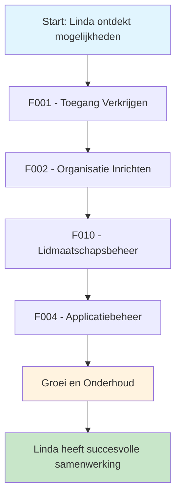
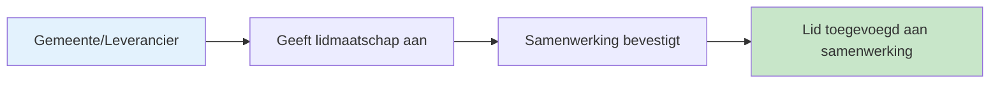

# 🧭 Klantreis Samenwerkingen & Communities > GEMMA Softwarecatalogus

Dit document beschrijft de klantreis voor **samenwerkingen** en **communities** in de GEMMA Softwarecatalogus.

## 🔍 Onderscheid Samenwerkingen vs Communities

### 🤝 Samenwerkingen
- **Juridisch kader**: Vast juridisch kader met B&W besluit
- **Inkoopmacht**: Mogen namens leden inkopen
- **Gebruik aanmaken**: Kunnen gebruik registreren voor hun leden
- **Leden**: Voornamelijk gemeenten
- **Doel**: Gezamenlijk inkopen en beheren van software

### 👥 Communities  
- **Juridisch kader**: Geen vast juridisch kader
- **Ontwikkeling**: Gericht op ontwikkelen van software (niet inkopen)
- **Samenstelling**: Kunnen bestaan uit leveranciers, gemeenten of gemengd
- **Gebruik**: Mogen **geen** gebruik aanmaken voor leden
- **Doel**: Kennisdeling en gezamenlijke softwareontwikkeling

## 👤 Persona: De Samenwerking Coördinator

**Naam**: Linda Bakker  
**Functie**: Coördinator ICT Samenwerking Digitale Regio Noord  
**Ervaring**: 12 jaar intergemeentelijke samenwerking  
**Motivatie**: "Ik wil voor onze 8 aangesloten gemeenten de beste ICT-oplossingen vinden en aanbieden, zodat we samen sterker staan dan alleen."

### Achtergrond
Linda coördineert een samenwerking van 8 gemeenten in Noord-Nederland. Ze merkt dat alle gemeenten vergelijkbare ICT-uitdagingen hebben en dat ze door samenwerking kosten kunnen besparen en kennis kunnen delen. Ze heeft gehoord over de GEMMA Softwarecatalogus en wil deze gebruiken om zowel software aan te bieden als gebruik aan te melden voor hun leden.

### Doelen
- Kostenbesparingen realiseren door gezamenlijke inkoop
- Kennis delen tussen aangesloten gemeenten
- Eigen software ontwikkelen en aanbieden
- Zichtbaarheid vergroten van de samenwerking

## 📖 Het Verhaal van Linda

*"Onze 8 gemeenten hebben allemaal vergelijkbare problemen: te kleine ICT-afdelingen, hoge kosten, en moeite om goede leveranciers te vinden. We hebben besloten om samen te werken. Nu horen we over de GEMMA Softwarecatalogus - één plek waar we zowel software kunnen aanbieden als gebruik kunnen aanmelden voor onze leden. Dit is precies wat we nodig hebben!"*

**De reis begint met een telefoontje naar VNG Realisatie...**

*"Hallo, wij zijn de Samenwerking Digitale Regio Noord. We willen graag als samenwerking toegang tot de softwarecatalogus om voor onze aangesloten gemeenten software te kunnen beheren en aanbieden. Kunnen jullie ons helpen?"*

:::info Belangrijke kenmerken van Samenwerkingen & Communities
- **Registratie**: Samenwerkingen en communities kunnen zich **niet zelf registreren**. Ze moeten contact opnemen met VNG Realisatie om te worden toegelaten.
- **Lidmaatschap**: Ze kunnen niet zelf leden toevoegen, maar beheerders van gemeenten én leveranciers kunnen wel aangeven dat hun organisatie lid is van een samenwerking/community.
- **Lidmaatschap aansporen**: Het is aan de samenwerkingen/communities zelf om hun leden aan te sporen het lidmaatschap op de softwarecatalogus aan te geven.
- **Geen bevestiging**: Organisaties geven zelf aan waar ze lid van zijn, er vindt geen bevestigingsproces plaats.
- **Uitstappen**: Organisaties kunnen zelf ook uit een lidmaatschap stappen.
- **Unieke posities**: 
  - **Samenwerkingen** zijn uniek omdat ze zowel software kunnen **aanbieden** als **gebruik kunnen aanmelden** voor hun leden (dankzij juridisch kader)
  - **Communities** richten zich op ontwikkeling en mogen **geen gebruik** voor leden aanmelden
:::

## Overzicht Klantreis

---

## 🎯 Functionaliteiten voor Samenwerkingen

### [F001 - Toegang Verkrijgen](../Functionaliteiten/F001-toegang-verkrijgen.md)
*"Na ons telefoontje met VNG Realisatie krijgen we een uitnodiging voor een gesprek. Ze willen graag weten wie we zijn, wat onze doelen zijn, en hoe we de softwarecatalogus willen gebruiken. Het is spannend - worden we toegelaten?"*

Linda doorloopt het toelatingsprces:
1. Contact opnemen met VNG Realisatie
2. Beoordeling door VNG
3. Goedkeuring en toegang verkrijgen

*"Gefeliciteerd! Jullie aanvraag is goedgekeurd. We gaan jullie organisatie aanmaken in het systeem en jullie eerste beheerder toegang geven."*

### [F002 - Organisatie Inrichten](../Functionaliteiten/F002-organisatie-inrichten.md)
*"Een week later krijgen we een e-mail: 'Jullie organisatie staat nu in het s
ysteem!' We loggen voor het eerst in en zien ons eigen dashboard. Het voelt als de sleutel krijgen van een nieuw huis - alles is mogelijk, maar we moeten nog leren hoe alles werkt."*

Linda richt de samenwerking in:
- Organisatieprofiel completeren
- Leden werven (gemeenten laten aangeven dat ze lid zijn)
- Contactpersonen instellen

*"Nu begint het echte werk. We bellen onze aangesloten gemeenten: 'Hé, we staan nu in de softwarecatalogus! Kunnen jullie aangeven dat jullie lid zijn van onze samenwerking?' Het is een beetje als het organiseren van een reünie - iedereen moet zich aanmelden voordat het feest kan beginnen."*

### [F010 - Lidmaatschapsbeheer](../Functionaliteiten/F010-lidmaatschapsbeheer.md)
*"Dit is cruciaal voor ons als samenwerking. We moeten onze leden actief aansporen om hun lidmaatschap aan te geven in de catalogus. Alleen dan kunnen we namens hen gebruik aanmelden en echt waarde toevoegen. We starten een campagne: bellen, mailen, en zelfs persoonlijke bezoeken om ervoor te zorgen dat alle 8 gemeenten hun lidmaatschap registreren."*

Linda beheert het lidmaatschap:
- **Leden werven**: Actief benaderen van de 8 aangesloten gemeenten
- **Lidmaatschap aansporen**: Gemeenten helpen bij het aangeven van lidmaatschap
- **Ledenlijst bekijken**: Zien welke gemeenten zich als lid hebben aangegeven
- **Nieuwe leden**: Uitbreiden naar andere gemeenten in de regio

*"Het is geweldig om te zien hoe één voor één onze gemeenten hun lidmaatschap aangeven. Ze hoeven niet te wachten op onze goedkeuring - zodra ze aangeven dat ze lid zijn, is het direct zichtbaar. Elke aanmelding betekent dat we een stap dichter bij ons doel komen: samen sterker staan dan alleen. En het mooie is, als een gemeente later besluit om uit te stappen, kunnen ze dat zelf doen - we dwingen niemand."*

### [F004 - Applicatiebeheer](../Functionaliteiten/F004-applicatiebeheer.md)
*"Dit is waar het interessant wordt! We hebben onze eigen software ontwikkeld voor burgerzaken die perfect werkt. Die gaan we aanbieden aan andere gemeenten. Maar tegelijkertijd zien we dat gemeente A een geweldige financiële applicatie gebruikt - die gaan we aanmelden voor al onze leden. We zijn tegelijk winkelier én klant!"*

Linda gebruikt de dubbele rol van de samenwerking:
- **Als Aanbieder**: Eigen software aanbieden aan andere gemeenten
- **Als Afnemer**: Gebruik aanmelden namens hun leden
- Applicatielandschap beheren voor de hele samenwerking
- Koppelingen maken tussen applicaties van verschillende leden

*"Het mooie is dat we nu een compleet overzicht hebben van wat al onze leden gebruiken. We kunnen gezamenlijk inkopen, kennis delen, en ervoor zorgen dat iedereen de beste software heeft."*

---

## 🔄 Unieke Aspecten van Samenwerkingen

### Dubbele Rol: Aanbieder én Afnemer
Samenwerkingen hebben een unieke positie in de softwarecatalogus:

**Als Aanbieder:**
- Kunnen eigen software ontwikkelen en aanbieden
- Kunnen modules en diensten leveren aan gemeenten
- Kunnen hosting en ondersteuning bieden

**Als Afnemer:**
- Kunnen namens hun leden gebruik aanmelden
- Kunnen applicatielandschappen beheren voor meerdere organisaties
- Kunnen gezamenlijke inkoop en implementatie coördineren

### Lidmaatschap Proces

### Verschil tussen Samenwerkingen en Communities

| Aspect | Samenwerking | Community |
|--------|--------------|------------|
| **Doel** | Gezamenlijke dienstverlening | Kennisdeling en samenwerking |
| **Leden** | Voornamelijk gemeenten | Gemeenten, leveranciers, experts |
| **Activiteiten** | Software ontwikkeling, hosting | Best practices, standaarden |
| **Governance** | Formele structuur | Meer informele samenwerking |

---

## 🌱 Groei en Onderhoud

*"Een jaar later zijn we uitgegroeid tot een echte speler in de regio. Nieuwe gemeenten kloppen aan de deur: 'Kunnen wij ook meedoen?' En soms moeten we helaas afscheid nemen van een lid dat een andere richting opgaat. Maar dat hoort erbij - we blijven groeien en leren."*

### Groei Activiteiten
- Nieuwe leden toevoegen
- Leden verwijderen bij uittreding
- Rapportage aan leden over voortgang
- Evaluatie van de samenwerking

---

## 🎉 Resultaat

Na het doorlopen van deze reis heeft Linda:
- ✅ Erkende samenwerking in de GEMMA Softwarecatalogus
- ✅ Alle 8 gemeenten als actieve leden
- ✅ Eigen software die door andere gemeenten wordt gebruikt
- ✅ Gezamenlijke inkoop van software voor alle leden
- ✅ Sterke positie als regionale ICT-speler

*"Wat begon als een simpel telefoontje naar VNG Realisatie, is uitgegroeid tot een bloeiende samenwerking die waarde toevoegt voor alle betrokkenen. We zijn trots op wat we hebben bereikt en kijken uit naar verdere groei!"*