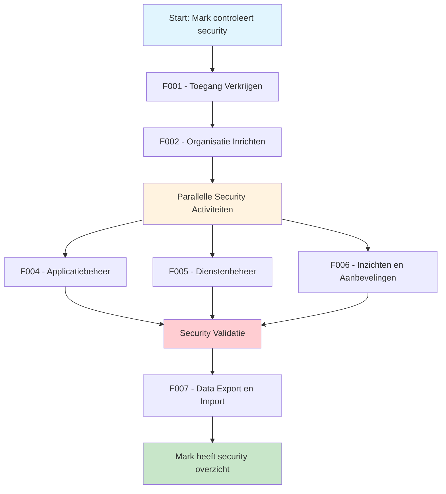

# 🧭 Klantreis Security Officer > GEMMA Softwarecatalogus

Dit document beschrijft de klantreis van een security officer die werkt met de GEMMA Softwarecatalogus.

## 👤 Persona: De Security Officer

**Naam**: Mark Jansen  
**Functie**: Information Security Officer  
**Ervaring**: 10 jaar cybersecurity, 5 jaar gemeentelijke ICT  
**Motivatie**: "Ik wil ervoor zorgen dat alle software in de catalogus voldoet aan security requirements en dat gemeenten veilige keuzes kunnen maken."

### Achtergrond
Mark is verantwoordelijk voor het bewaken van security requirements in de softwarecatalogus. Hij reviewt security implementaties, monitort security scanning, en zorgt ervoor dat gemeenten toegang hebben tot betrouwbare security informatie over software en leveranciers.

### Doelen
- Security requirements bewaken
- Security implementaties reviewen
- Security scanning monitoren
- Gemeenten helpen bij veilige software keuzes

## Overzicht Klantreis

---

## 🎯 Functionaliteiten voor Security Officers

### [F001 - Toegang Verkrijgen](../Functionaliteiten/F001-toegang-verkrijgen.md)
*"Als security officer heb ik speciale toegangsrechten nodig om security gevoelige informatie te kunnen inzien en beheren."*

Mark krijgt uitgebreide toegangsrechten om security aspecten van alle applicaties en leveranciers te kunnen controleren.

### [F002 - Organisatie Inrichten](../Functionaliteiten/F002-organisatie-inrichten.md)
*"Ik moet mijn rol duidelijk maken zodat leveranciers en gemeenten weten dat ze bij mij terecht kunnen voor security vragen."*

Mark richt zijn profiel in met focus op security expertise en beschikbaarheid voor security advies.

### [F004 - Applicatiebeheer](../Functionaliteiten/F004-applicatiebeheer.md)
*"Ik controleer of alle applicaties de juiste security documentatie hebben en voldoen aan onze security requirements."*

Mark gebruikt deze functionaliteit om:
- Security documentatie te valideren
- Penetratietesten te controleren
- Compliance certificaten te verifiëren
- Kwetsbaarheden te monitoren

### [F005 - Dienstenbeheer](../Functionaliteiten/F005-dienstenbeheer.md)
*"Ik beoordeel leveranciers op hun security posture en help gemeenten bij het maken van veilige keuzes."*

Mark beoordeelt:
- Leverancier security certificeringen
- Security incident history
- Security support kwaliteit
- Compliance met security standaarden

### [F006 - Inzichten en Aanbevelingen](../Functionaliteiten/F006-inzichten-en-aanbevelingen.md)
*"Ik genereer security rapportages en identificeer security trends en risico's in het gemeentelijke ICT-landschap."*

Mark gebruikt inzichten voor:
- Security compliance monitoring
- Kwetsbaarheid trend analyse
- Security incident rapportage
- Risk assessment ondersteuning

### [F007 - Data Export en Import](../Functionaliteiten/F007-data-export-import.md)
*"Ik exporteer security data naar onze security tools voor diepgaande analyse en monitoring."*

Mark exporteert data naar:
- Security Information and Event Management (SIEM) systemen
- Vulnerability management tools
- Compliance rapportage tools
- Risk assessment platforms

---

## 🔒 Specifieke Security Activiteiten

### Security Validatie
- **Documentatie Controle**: Verificeren van security documentatie
- **Certificering Validatie**: Controleren van security certificeringen
- **Penetratietest Review**: Beoordelen van penetratietest resultaten
- **Kwetsbaarheid Assessment**: Monitoren van bekende kwetsbaarheden

### Security Advies
- **Gemeente Ondersteuning**: Helpen gemeenten bij security keuzes
- **Leverancier Guidance**: Adviseren leveranciers over security requirements
- **Best Practices**: Delen van security best practices

### Security Monitoring
- **Incident Tracking**: Volgen van security incidenten
- **Compliance Monitoring**: Bewaken van security compliance
- **Trend Analyse**: Identificeren van security trends en risico's

---

## 🛡️ Security Focus Areas

### Applicatie Security
- **Code Quality**: Beoordeling van code kwaliteit en security
- **Vulnerability Management**: Beheer van kwetsbaarheden
- **Security Testing**: Validatie van security testen

### Infrastructure Security
- **Hosting Security**: Beoordeling van hosting omgevingen
- **Network Security**: Controle van netwerk beveiliging
- **Data Protection**: Validatie van data bescherming

### Compliance & Governance
- **Regulatory Compliance**: Naleving van wet- en regelgeving
- **Security Standards**: Implementatie van security standaarden
- **Audit Support**: Ondersteuning bij security audits

---

## 🎉 Resultaat

Na het doorlopen van deze reis heeft Mark:
- ✅ Volledig overzicht van security posture van alle software
- ✅ Tools om security compliance te monitoren
- ✅ Directe lijn met leveranciers voor security issues
- ✅ Data voor security risk assessments
- ✅ Mogelijkheid om proactief security advies te geven

*"De softwarecatalogus geeft me de security visibility die ik nodig heb om gemeenten te helpen veilige keuzes te maken. Ik kan nu security risico's proactief identificeren en aanpakken voordat ze problemen worden."*
